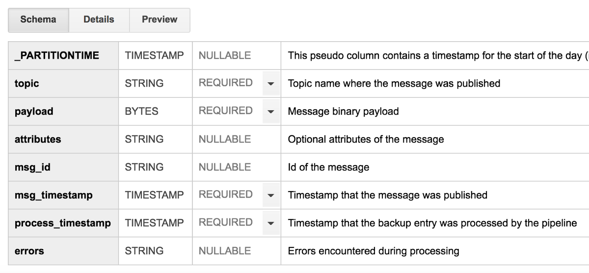

Infinite backup for Cloud Pub/Sub – Google Cloud Platform — Community – Medium

# Infinite backup for Cloud Pub/Sub

I love using [Cloud Pub/Sub](https://cloud.google.com/pubsub/), especially it’s worry free operation. Every time after talking to people running a Kafka cluster and their complaints about the high operational cost of keeping it up and running, I love it even more. But Kafka does have one feature that Cloud Pub/Sub doesn’t have: the ability to store your streaming data forever. Well… lets do something about that and let us implement a infinite backup system with the lowest operational cost possible.

https://unsplash.com/photos/waAAaeC9hns

#### BigQuery storage

The first thing we need is unlimited storage. The obvious choice is Cloud Storage because it’s the cheapest. But it has the limitation that it’s not so ideal for steaming data into it. The other service that has kinda unlimited storage is BigQuery. Surprisingly it has exactly the same price tag as Cloud Storage and it has a streaming insert API. It even automaticly drops the [price by 50%](https://cloud.google.com/bigquery/pricing#long-term-storage) per partition if you don’t ingest data in that partition for 90 days.

If you look at all the characteristics I think we’ve found our ideal storage engine. It even comes with the added value that you have a nice web interface to give you debugging power and some insight on your streaming data.

Designing a schema seems straight forward. Just store everything in the Pub/Sub message. Luckily BigQuery has a **binary datatype** so we can store any type of message. I also prefer to store both the message- and the processing timestamp so you at least know when the message was backed up. Ideally they should be very close to the message **timestamp**. I stream different topics into one table so I’ll add the topic to the schema as well (your requirement could be different and maybe justify a table per topic). Also don’t forget to backup the potential **attributes** that could be attached to your messages.

#### Cloud Dataflow backup pipeline

Now that we have our storage system we need something to take the actual backup. Cloud Dataflow seems like the ideal candidate, it uses the [Apache Beam](https://beam.apache.org/) model that has the same semantics for streaming and batch. This means you can reuse the same code later when you want to read your data back from backup in batch mode.

[Cloud Dataflow](https://cloud.google.com/dataflow/) is also a managed service, this helps bring down the operational cost. So throwing all ingredients in the mix ( Cloud Pub/Sub, BigQuery and Cloud Dataflow) we now have to think about the code.

This is surprisingly easy. Read the **Pub/Sub subscription** of the topic you want to backup is a no brainer. Note that each subscription *has a retention of 7 days* giving you enough time to update your pipeline. Next up, **transform the message** into a TableRow for ingestion into BigQuery and then **flatten** all your subscriptions out so you only have **one output table**. The only tricky thing is that you want to have a partition per day, but I’ve already touched upon the [auto BigQuery partitioning in an Apache Beam pipeline in a previous article](https://medium.com/google-cloud/bigquery-partitioning-with-beam-streams-97ec232a1fcc) so that’s solved as well.

#### Conclusion

Thats all there is to it. One of the simplest beam pipelines you can build and it’s able to handle dozen of Pub/Sub topic at the same time and streaming backup into BigQuery. Running your pipeline you’ve got the following benefits:

- •Cheapest storage for your message backup
- •Automatic 50% discount after 90 days of storage
- •7 day Pub/Sub subscription buffer
- •Only one Cloud Dataflow running

Maybe it’s not as powerful as the Kafka storage API it comes pretty close and without the worries about running a Kafka cluster.

* * *

*...*

You can checkout a complete working example at my GitHub page, make sure to create backup subscriptions and adapt the config file like the example above:

[**alexvanboxel/pubsub-backup** *Contribute to pubsub-backup development by creating an account on GitHub.*github.com](https://github.com/alexvanboxel/pubsub-backup)[(L)](https://github.com/alexvanboxel/pubsub-backup)

Now you can sleep on both ears knowing that all your published messages are backed up.

* * *

*...*

*Side-note*: I was quite surprised how few people use this simple technique. I’ve been using this technique with success for over a year in production (although with the old BigQuery partitioning). I was quite happy when Spotify published it’s technique for it’s backups in it’s article “[Reliable export of Cloud Pub/Sub streams to Cloud Storage](https://labs.spotify.com/2017/04/26/reliable-export-of-cloud-pubsub-streams-to-cloud-storage/)” but I was quite surprised about the complexity of the solution. I think my technique is as reliable, but far easier to write and operate. Maybe it breaks apart when you work at the scale of Spotify, but I’ll see then when I reach that point.