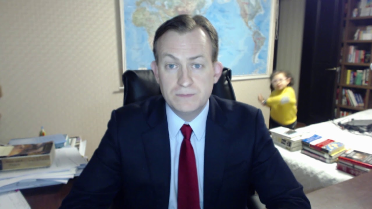
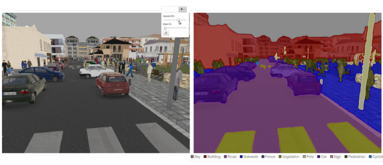

Inside Microsoft Teams' Background Blur: A Technical Explanation - PingWest

Ever felt embarrassed when doing a conference call on your computer at home? At least this guy did, when his kids marched in during a live interview with BBC.

For most of the times, we got the kids part under control, but problems still remain. On other occasions, probably we did not have time to tidy up our bedrooms so all messy stuffs in the rooms are shown to interviewers, making your conference scene looks unprofessional.

Last year Microsoft introduced a background blur feature into its work collaboration software called Microsoft Teams. With a click of a button, the software is able to automatically identify the main person in the feed and blur out basically all the rest.

A few other major players are in the team collaboration business, including Google's G Suite, Facebook's Workplace and Slack. Most of them were in the game far earlier than Teams, but none of them has come up with feature similar to Microsoft's background blur.

Background blur protects people’s privacy and prevents embarrassing and unforeseen situations from happening. PingWest recently sat down with researchers and engineers from Microsoft Research Asia (MSRA), the company’s most well-known research department, to learn about how this feature came about.

**Overview of the Mechanism of Background Blur**

Overall, the background blurring technology can be described as a process that - first utilizing a - Convolutional Neural Network (CNN) which learns labeled portrait pixels through deep learning, followed by doing semantic segmentation of portrait and shoulders of people shown in video chat and blurring background. In layman’s term, it is able to decide with high certainty if a pixel in a given frame belongs to human, or the background.

**Semantic Segmentation**

Semantic segmentation is an essential and widely-used approach for image analysis in computer vision. According to Mathwork’s definition, “semantic segmentation describes the process of associating each pixel of an image with a class label,” such as person, cat, car, desk, road, bridge, or sky. Semantic segmentation takes an image with an arbitrary size as input and generates a segmentation output with a mask covered on each instance in the image with exactly the same size. In short, each different color in this picture below represents an object or a group/type of objects.

Semantic Segmentation (Source: https://sthalles.github.io/deep_segmentation_network/)

Being different from general semantic segmentation, which is supposed to identify lots of different types of objects, the background blur feature is mainly used in video conferencing，so it only needs to focus on portrait segmentation. That being said, CNN learns facial information in tremendous images with label on them, telling CNN which part a nose, an eye, hair and a face belong to. That being said, there are still a tremendous amount of images used in the training of this algorithm.

**Convolutional Neural Network (CNN)**

A Convolutional Neural Network, also known as a CNN, is an artificial neural network which tries to mimic the way in which human brain detects patterns, make sense of, and understand scenes. It is a deep learning algorithm that has been mostly popularly used in image recognition, video analysis, drug discovery and more. What makes Alpha Go work is the CNN in it to understand go and bested the world’s top go players Lee Sedol and Ke Jie.

To train a neural network to do semantic segmentation or basically any job, the researchers would need vast amount of images that are suitable to the end usage as training material. For example, to train a network to identify faces, clear images of faces would be better material than random ones. In the case of background blur, databases with large amount of images of a person’s portrait with sufficient background would be needed, but there aren’t a lot of them in the world.

To cope with the situation, researchers from MSRA leveraged a technique called data augmentation to increase the number of images that can be trained to CNN. They used methods such as changing backgrounds or rotating objects. With more training material, they achieved a better result than what could have been using limited material.

The researchers have also adopted other innovative techniques in order to improve the efficiency of semantic segmentation jobs. These techniques include “masking filters” in CNNs for added precision and stability, and “student networks” to allow algorithm to run on low-powered devices such as phones, but still retain the optimal result achieved by the trained teacher networks.

Previously, the background blur feature only worked for scheduled meeting as Microsoft Teams launched the feature in July 2018 along with a free version, according to[Office 365 IT Support](https://office365itpros.com/2018/09/25/background-blur-teams-meetings/). Starting from March 2019, Microsoft Teams enhanced the blurring feature to allow customized backgrounds, according to[Microsoft News](https://news.microsoft.com/europe/2019/03/19/homeworkers-rejoice-microsoft-teams-new-customized-background-feature-hides-distractions-at-the-press-of-a-button/). Additionally, starting from February 7,2019, Skype also added the same feature to its video calls.

(Cover Image Credit: Navva.org)