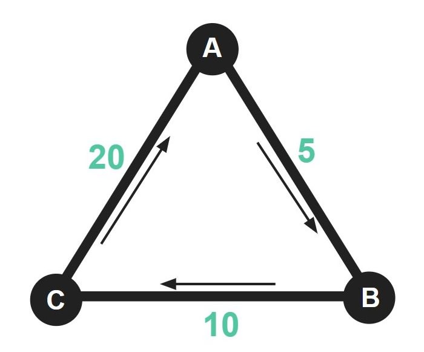
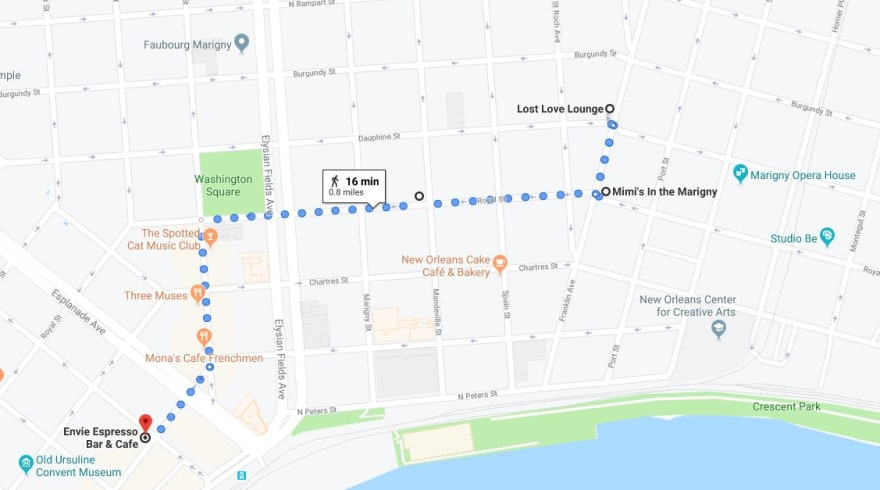
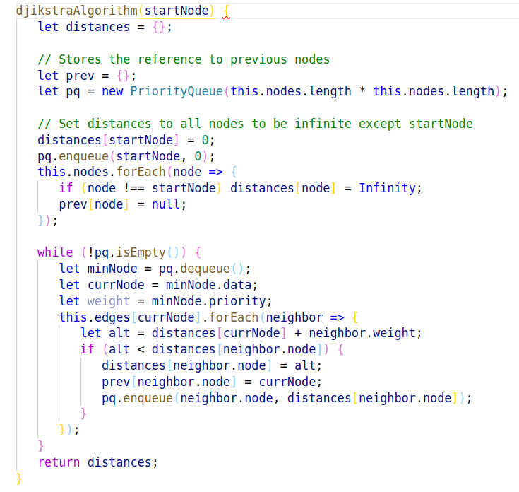

Intro to Graph Data Structures

#  Intro to Graph Data Structures

###     [  [c4b8b1d1-247d-45aa-aeed-34788d904a17.webp](../_resources/5de519a40bf340f195cc6888f5f8e1f8.webp)  AmberJ](https://dev.to/amberjones)    [![](data:image/svg+xml,%3csvg xmlns='http://www.w3.org/2000/svg' width='438.549' height='438.549' viewBox='0 0 438.549 438.549' role='img' aria-labelledby='acghe6rpvklqsdcy5p006axrytfbnvh7' class='icon-img js-evernote-checked' data-evernote-id='364'%3e%3ctitle id='acghe6rpvklqsdcy5p006axrytfbnvh7'%3egithub logo%3c/title%3e%3cpath d='M409.132 114.573c-19.608-33.596-46.205-60.194-79.798-79.8C295.736 15.166 259.057 5.365 219.27 5.365c-39.78 0-76.47 9.804-110.062 29.408-33.596 19.605-60.192 46.204-79.8 79.8C9.803 148.168 0 184.853 0 224.63c0 47.78 13.94 90.745 41.827 128.906 27.884 38.164 63.906 64.572 108.063 79.227 5.14.954 8.945.283 11.42-1.996 2.474-2.282 3.71-5.14 3.71-8.562 0-.57-.05-5.708-.144-15.417-.098-9.71-.144-18.18-.144-25.406l-6.567 1.136c-4.187.767-9.47 1.092-15.846 1-6.375-.09-12.992-.757-19.843-2-6.854-1.23-13.23-4.085-19.13-8.558-5.898-4.473-10.085-10.328-12.56-17.556l-2.855-6.57c-1.903-4.374-4.9-9.233-8.992-14.56-4.093-5.33-8.232-8.944-12.42-10.847l-1.998-1.43c-1.332-.952-2.568-2.1-3.71-3.43-1.143-1.33-1.998-2.663-2.57-3.997-.57-1.335-.097-2.43 1.428-3.29 1.525-.858 4.28-1.275 8.28-1.275l5.708.853c3.807.763 8.516 3.042 14.133 6.85 5.615 3.807 10.23 8.755 13.847 14.843 4.38 7.807 9.657 13.755 15.846 17.848 6.184 4.093 12.42 6.136 18.7 6.136 6.28 0 11.703-.476 16.273-1.423 4.565-.95 8.848-2.382 12.847-4.284 1.713-12.758 6.377-22.56 13.988-29.41-10.847-1.14-20.6-2.857-29.263-5.14-8.658-2.286-17.605-5.996-26.835-11.14-9.235-5.137-16.896-11.516-22.985-19.126-6.09-7.614-11.088-17.61-14.987-29.98-3.9-12.373-5.852-26.647-5.852-42.825 0-23.035 7.52-42.637 22.557-58.817-7.044-17.318-6.38-36.732 1.997-58.24 5.52-1.715 13.706-.428 24.554 3.853 10.85 4.284 18.794 7.953 23.84 10.995 5.046 3.04 9.09 5.618 12.135 7.708 17.706-4.947 35.977-7.42 54.82-7.42s37.116 2.473 54.822 7.42l10.85-6.85c7.418-4.57 16.18-8.757 26.26-12.564 10.09-3.806 17.803-4.854 23.135-3.14 8.562 21.51 9.325 40.923 2.28 58.24 15.035 16.18 22.558 35.788 22.558 58.818 0 16.178-1.958 30.497-5.853 42.966-3.9 12.47-8.94 22.457-15.125 29.98-6.19 7.52-13.9 13.85-23.13 18.985-9.233 5.14-18.183 8.85-26.84 11.135-8.663 2.286-18.416 4.004-29.264 5.146 9.894 8.563 14.842 22.078 14.842 40.54v60.237c0 3.422 1.19 6.28 3.572 8.562 2.38 2.278 6.136 2.95 11.276 1.994 44.163-14.653 80.185-41.062 108.068-79.226 27.88-38.16 41.826-81.126 41.826-128.906-.01-39.77-9.818-76.454-29.414-110.05z'%3e%3c/path%3e%3c/svg%3e)](http://github.com/amber-jones)  Sep 29  *Updated on Oct 01, 2019*  ・3 min read

 [#javascript](https://dev.to/t/javascript)  [#beginners](https://dev.to/t/beginners)

Data structures are just ways we organize data.

The one I'm sure you're familiar with is the **list** or **array**, a **linear** ordered sequence of values. This is your shopping list, your to-do, your reading, whatever.

Lets explore the way more exciting realm of **non-linear** graphs!

####   [(L)](https://dev.to/amberjones/intro-to-graph-data-structures-abk#but-first-some-basics) But first, some basics:

A graph is comprised of objects connected by lines.

In JavaScript (and computer science at large), we refer to those objects and lines as **vertices and edges**.

The benefit of a graph structure is that not only can you represent nodes of data but also their *relationship* to each other through properties assigned to their edges.

Two common properties of edges are **weights** and **direction**.

If a graph has weights, it is considered **weighted** and if it has direction, it is considered **directed**. Direction can go one way or both ways.

Susan can have a crush on Sally, but that doesn't mean Sally has a crush on Susan.

Now, imagine yourself, just floating in space all by your lonesome. You have a lot of knowledge, and no one to share it with.

Another space traveler appears, "Hey friend! Lets keep in contact". You give them your number, and suddenly, you have meaning and cease to be a singular speck of dust in space. You have become a node and you have created a connecting **edge**.

But it costs you.

Each time you call your space friend, you're billed by your telephone company $12393900.00. This is the **weight** of your connecting edge.

####   [(L)](https://dev.to/amberjones/intro-to-graph-data-structures-abk#lets-come-back-from-space-and-look-at-irl-graph-data-structures) Lets come back from space and look at IRL graph data structures

Classic example is Google Maps. Its just one big graph!
Streets intersecting are vertices, and the streets themselves are edges.

They are **weighted** by distance in length and time. The streets also have a **directionality** property...some streets only go one way.

Traversing a Graph refers to finding a path between two nodes, finding the shortest path from one node to another and finding the shortest path that visits all nodes [1].

On of many methods to traverse a graph is using **Dijkstra's algorithm** (or Dijkstra's Shortest Path First algorithm, SPF algorithm). This is the one Google used (or a variant of) to implement their map application. This algorithm was originally conceived by Dijkstra in 1958 in 20 minutes at a cafe in Paris [2].

Here's what it looks like in Javascript:

####   [(L)](https://dev.to/amberjones/intro-to-graph-data-structures-abk#a-note-on-tree-graphs) A note on Tree Graphs...

That family tree you had to make in Kindergarten? Yup, a Tree Graph.

Here's the thing, **Tree Graphs** are a highly specialized form of a Graph, with a root node that all other nodes are decedents of.

Its important to make the distinction between a Tree Graph and a Graph, because they have some overlapping qualities like , but their rules on structuring data are completely different.

So in JavaScript, they are considered entirely different data structures.

For an in-depth and entertaining read on Trees, check out [this article](https://dev.to/jillianntish/a-brief-descent-into-javascript-trees-48lm) by fellow DEV community member Jill.

Graphs are a non-hierarchical structures of how data relates, connecting our entire world!

Title Image: Social Network Analysis Visualization [Grandjean, M. (2016)]

[1] https://www.jenniferbland.com/the-difference-between-a-tree-and-a-graph-data-structure/

[2]https://www.vice.com/en_us/article/4x3pp9/the-simple-elegant-algorithm-that-makes-google-maps-possible

 
 **Sore eyes?**

Go to the "misc" section of **[your settings](https://dev.to/enter)** and select **night theme** ❤️