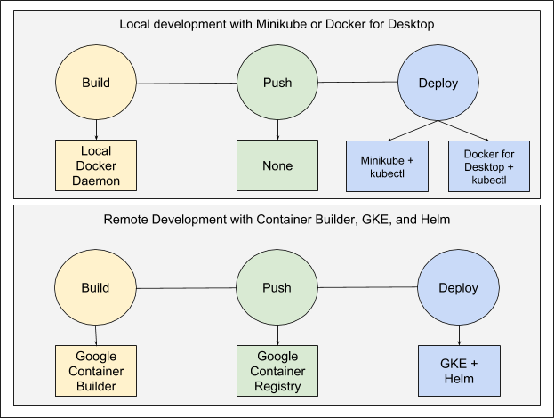

Introducing Skaffold: Easy and repeatable Kubernetes development

# Introducing Skaffold: Easy and repeatable Kubernetes development

By Vic Iglesias, Solutions Architect

As companies on-board to Kubernetes, one of their goals is to provide developers with an iteration and deployment experience that closely mirrors production. To help companies achieve this goal, we recently announced [Skaffold](https://github.com/GoogleCloudPlatform/skaffold), a command line tool that facilitates continuous development for Kubernetes applications. With Skaffold, developers can iterate on application source code locally while having it continually updated and ready for validation or testing in their local or remote Kubernetes clusters. Having the development workflow automated saves time in development and increases the quality of the application through its journey to production.

Kubernetes provides operators with APIs and methodologies that increase their agility and facilitates reliable deployment of their software. Kubernetes takes bespoke deployment methodologies and provides programmatic ways to achieve similar if not more robust procedures. Kubernetes’ functionality helps operations teams apply common best practices like infrastructure as code, unified logging, immutable infrastructure and safer API-driven deployment strategies like canary and blue/green. Operators can now focus on the parts of infrastructure management that are most critical to their organizations, supporting high release velocity with a minimum of risk to their services.

But in some cases, developers are the last people in an organization to be introduced to Kubernetes, even as operations teams are well versed in the benefits of its deployment methodologies. Developers may have already taken steps to create reproducible packaging for their applications with Linux containers, like Docker. Docker allows them to produce repeatable runtime environments where they can define the dependencies and configuration of their applications in a simple and repeatable way. This allows developers to stay in sync with their development runtimes across the team, however, it doesn’t introduce a common deployment and validation methodology. For that, developers will want to use the Kubernetes APIs and methodologies that are used in production to create a similar integration and manual testing environment.

Once developers have figured out how Kubernetes works, they need to actuate Kubernetes APIs to accomplish their tasks. In this process they'll need to:

1. Find or deploy a Kubernetes cluster

2. Build and upload their Docker images to a registry that's enabled in their cluster

3. Use the reference documentation and examples to create their first Kubernetes manifest definitions

4. Use the kubectl CLI or Kubernetes Dashboard to deploy their application definitions

5. Repeat steps 2-4 until their feature, bug fix or changeset is complete
6. Check in their changes and run them through a CI process that includes:

    - Unit testing
    - Integration testing
    - Deployment to a test or staging environment

Steps 2 through 5 require developers to use many tools via multiple interfaces to update their applications. Most of these steps are undifferentiated for developers and can be automated, or at the very least guided by a set of tools that are tailored to a developer’s experience.

Enter Skaffold, which automates the workflow for building, pushing and deploying applications. Developers can start Skaffold in the background while they're developing their code, and have it continually update their application without any input or additional commands. It can also be used in an automated context such as a CI/CD pipeline to leverage the same workflow and tooling when moving applications to production.

### Skaffold features

Skaffold is an early phase open-source project that includes the following design considerations and capabilities:

- No server-side components mean no overhead to your cluster.
- Allows you to detect changes in your source code and automatically build/push/deploy.
- Image tag management. Stop worrying about updating the image tags in Kubernetes manifests to push out changes during development.
- Supports existing tooling and workflows. Build and deploy APIs make each implementation composable to support many different workflows.
- Support for multiple application components. Build and deploy only the pieces of your stack that have changed.
- Deploy regularly when saving files or run one off deployments using the same configuration.

### Pluggability

Skaffold has a pluggable architecture that allows you to choose the tools in the developer workflow that work best for you.

Get started with Skaffold on Kubernetes Engine by following the [Getting Started guide](https://github.com/GoogleCloudPlatform/skaffold/blob/master/docs/quickstart-gke.md) or use Minikube by following [the instructions in the README](https://github.com/GoogleCloudPlatform/skaffold#getting-started-with-local-tooling). For discussion and feedback [join the mailing list](https://groups.google.com/forum/#!forum/skaffold-users) or [open an issue on](https://github.com/GoogleCloudPlatform/skaffold/issues) GitHub.

If you haven’t tried GCP and Kubernetes Engine before, you can quickly get started with our [$300 free credits](https://cloud.google.com/free/).

### Demo