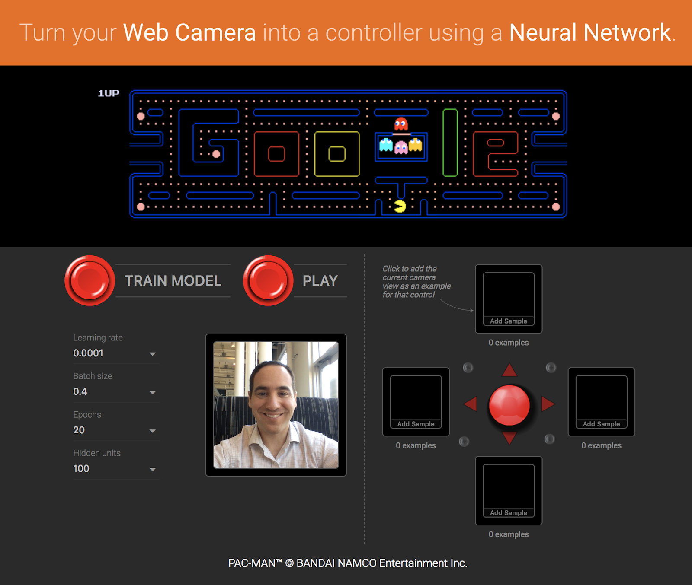

Introducing TensorFlow.js: Machine Learning in Javascript

# Introducing TensorFlow.js: Machine Learning in Javascript

*Posted by *[*Josh Gordon*](http://twitter.com/random_forests)* and *[*Sara Robinson*](http://twitter.com/srobTweets)*, Developer Advocates*

We’re excited to introduce [TensorFlow.js](https://js.tensorflow.org/), an open-source library you can use to define, train, and run machine learning models entirely in the browser, using Javascript and a high-level layers API. If you’re a Javascript developer who’s new to ML, TensorFlow.js is a great way to begin learning. Or, if you’re a ML developer who’s new to Javascript, read on to learn more about new opportunities for in-browser ML. In this post, we’ll give you a quick overview of TensorFlow.js, and getting started resources you can use to try it out.

### In-Browser ML

Running machine learning programs entirely client-side in the browser unlocks new opportunities, like interactive ML! If you’re watching the [livestream](https://www.youtube.com/tensorflow) for the [TensorFlow Developer Summit](https://www.tensorflow.org/dev-summit/), during the TensorFlow.js talk you’ll find a demo where [@dsmilkov](http://twitter.com/dsmilkov) and [@nsthorat](http://twitter.com/nsthorat) train a model to control a PAC-MAN game using computer vision and a webcam, entirely in the browser. You can try it out yourself, too, with the link below — and find the source in the [examples](https://github.com/tensorflow/tfjs-examples) folder.

*Turn your webcam into a controller for PAC-MAN *[*using a Neural Network*](https://storage.googleapis.com/tfjs-examples/webcam-transfer-learning/dist/index.html)*.*

If you’d like to try another game, give the [Emoji Scavenger Hunt](https://emojiscavengerhunt.withgoogle.com/) a whirl — this time, from a browser on your mobile phone.

*The *[*Emoji Scavenger Hunt*](https://emojiscavengerhunt.withgoogle.com/)* is another fun example of an application built using TensorFlow.js. Try it using your phone, and find the source *[*here*](https://github.com/google/emoji-scavenger-hunt)*.*

ML running in the browser means that from a user’s perspective, there’s no need to install any libraries or drivers. Just open a webpage, and your program is ready to run. In addition, it’s ready to run with GPU acceleration. TensorFlow.js automatically supports WebGL, and will accelerate your code behind the scenes when a GPU is available. Users may also open your webpage from a mobile device, in which case your model can take advantage of sensor data, say from a gyroscope or accelerometer. Finally, all data stays on the client, making TensorFlow.js useful for low-latency inference, as well as for privacy preserving applications.

### What can you do with TensorFlow.js?

If you’re developing with TensorFlow.js, here are three workflows you can consider.

- •**You can import an existing, pre-trained model for inference. **If you have an existing TensorFlow or [Keras](http://keras.io/) model you’ve previously trained offline, you can convert into TensorFlow.js format, and load it into the browser for inference.
- •**You can re-train an imported model. **As in the Pac-Man demo above, you can use transfer learning to augment an existing model trained offline using a small amount of data collected in the browser using a technique called Image Retraining. This is one way to train an accurate model quickly, using only a small amount of data.
- •**Author models directly in browser. **You can also use TensorFlow.js to define, train, and run models entirely in the browser using Javascript and a high-level layers API. If you’re familiar with [Keras](http://keras.io/), the high-level layers API should feel familiar.

### Let’s see some code

If you like, you can head directly to the [samples](https://github.com/tensorflow/tfjs-examples) or [tutorials](http://js.tensorflow.org/) to get started. These show how-to export a model defined in Python for inference in the browser, as well as how to define and train models entirely in Javascript. As a quick preview, here’s a snippet of code that defines a neural network to classify flowers, much like on the getting started [guide](https://www.tensorflow.org/get_started/) on TensorFlow.org. Here, we’ll define a model using a stack of layers.

The layers API we’re using here supports all of the Keras layers found in the examples [directory](https://github.com/keras-team/keras/tree/master/examples) (including Dense, CNN, LSTM, and so on). We can then train our model using the same Keras-compatible API with a method call:

The model is now ready to use to make predictions:

TensorFlow.js also includes a low-level API (previously [deeplearn.js](https://deeplearnjs.org/)) and support for [Eager execution](https://github.com/tensorflow/tensorflow/tree/r1.7/tensorflow/contrib/eager). You can learn more about these by watching the talk at the TensorFlow Developer Summit.

*An overview of TensorFlow.js APIs. TensorFlow.js is powered by WebGL and provides a high-level layers API for defining models, and a low-level API for linear algebra and automatic differentiation. TensorFlow.js supports importing TensorFlow SavedModels and Keras models.*

### How does TensorFlow.js relate to deeplearn.js?

Good question! TensorFlow.js, an ecosystem of JavaScript tools for machine learning, is the successor to deeplearn.js which is now called TensorFlow.js Core. TensorFlow.js also includes a Layers API, which is a higher level library for building machine learning models that uses Core, as well as tools for automatically porting TensorFlow SavedModels and Keras hdf5 models. For answers to more questions like this, check out the [FAQ](https://js.tensorflow.org/faq/).

### Where’s the best place to learn more?

To learn more about TensorFlow.js, visit the project [homepage](https://js.tensorflow.org/), check out the [tutorials](https://js.tensorflow.org/tutorials/), and try the [examples](https://github.com/tensorflow/tfjs-examples). You can also watch the talk from the 2018 TensorFlow Developer Summit, and follow TensorFlow on [Twitter](http://twitter.com/tensorflow).

Live from Mountain View, CA! Join the TensorFlow team as they host the second annual TensorFlow Dev Summit. All the sessions will be recorded and uploaded to the channel today.

Thanks for reading, and we’re excited to see what you’ll create with TensorFlow.js! If you like, you can follow [@dsmilkov](http://twitter.com/dsmilkov), [@nsthorat](http://twitter.com/nsthorat), and [@sqcai](http://twitter.com/sqcai) from the TensorFlow.js team on Twitter for updates.