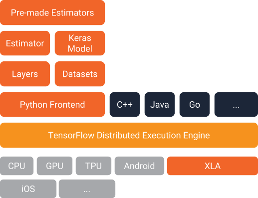
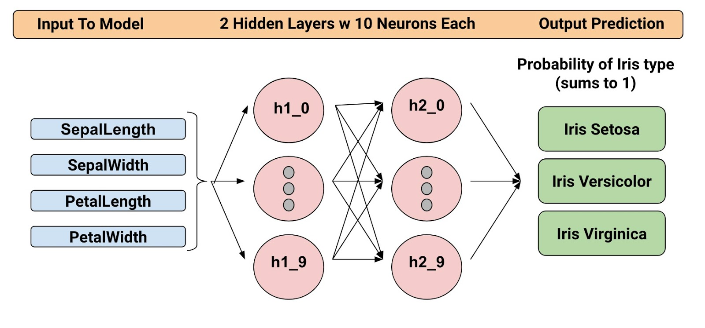
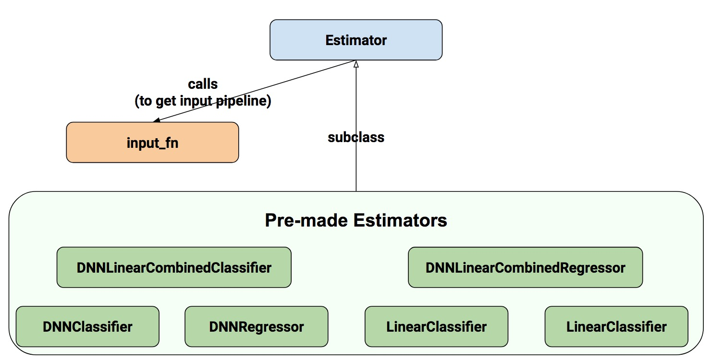
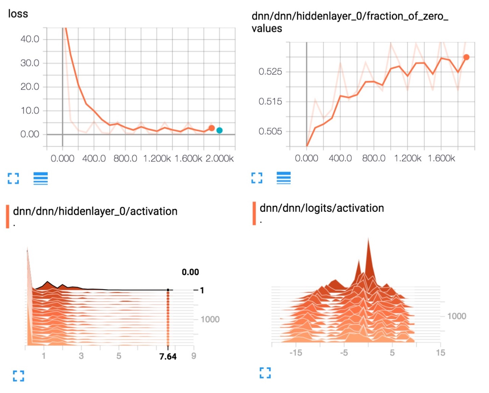

Introduction to TensorFlow Datasets and Estimators

# Introduction to TensorFlow Datasets and Estimators

 *Posted by The TensorFlow Team*
Datasets and Estimators are two key TensorFlow features you should use:

- Datasets: The best practice way of creating input pipelines (that is, reading data into your program).
- Estimators: A high-level way to create TensorFlow models. Estimators include pre-made models for common machine learning tasks, but you can also use them to create your own custom models.

Below you can see how they fit in the TensorFlow architecture. Combined, they offer an easy way to create TensorFlow models and to feed data to them:

### Our Example Model

To explore these features we're going to build a model and show you relevant code snippets. The complete code is available [here](https://github.com/tensorflow/models/blob/master/samples/outreach/blogs/blog_estimators_dataset.py), including instructions for getting the training and test files. Note that the code was written to demonstrate how Datasets and Estimators work functionally, and was not optimized for maximum performance.

The trained model categorizes Iris flowers based on four botanical features ([sepal](https://en.wikipedia.org/wiki/Sepal) length, sepal width, [petal](https://en.wikipedia.org/wiki/Petal) length, and petal width). So, during inference, you can provide values for those four features and the model will predict that the flower is one of the following three beautiful variants:

From left to right: [Iris setosa](https://commons.wikimedia.org/w/index.php?curid=170298)(by [Radomil](https://commons.wikimedia.org/wiki/User:Radomil), CC BY-SA 3.0), [Iris versicolor](https://commons.wikimedia.org/w/index.php?curid=248095) (by [Dlanglois](https://commons.wikimedia.org/wiki/User:Dlanglois), CC BY-SA 3.0), and [Iris virginica](https://www.flickr.com/photos/33397993@N05/3352169862)(by [Frank Mayfield](https://www.flickr.com/photos/33397993@N05), CC BY-SA 2.0).

We're going to train a Deep Neural Network Classifier with the below structure. All input and output values will be `float32`, and the sum of the output values will be 1 (as we are predicting the probability for each individual Iris type):

For example, an output result might be 0.05 for Iris Setosa, 0.9 for Iris Versicolor, and 0.05 for Iris Virginica, which indicates a 90% probability that this is an Iris Versicolor.

Alright! Now that we have defined the model, let's look at how we can use Datasets and Estimators to train it and make predictions.

### Introducing The Datasets

Since release 1.4, Datasets is a new way to create input pipelines to TensorFlow models. This API is much more performant than using feed_dict or the queue-based pipelines, and it's cleaner and easier to use.

At a high-level, the Datasets consists of the following classes:

Where:

- Dataset: Base class containing methods to create and transform datasets. Also allows you initialize a dataset from data in memory, or from a Python generator.
- TextLineDataset: Reads lines from text files.
- TFRecordDataset: Reads records from TFRecord files.
- FixedLengthRecordDataset: Reads fixed size records from binary files.
- Iterator: Provides a way to access one dataset element at a time.

### Our dataset

To get started, let's first look at the dataset we will use to feed our model. We'll read data from a CSV file, where each row will contain five values-the four input values, plus the label:

The label will be:

- 0 for Iris Setosa
- 1 for Versicolor
- 2 for Virginica.

### Representing our dataset

To describe our dataset, we first create a list of our features:
feature_names =['SepalLength','SepalWidth','PetalLength','PetalWidth']

When we train our model, we'll need a function that reads the input file and returns the feature and label data. Estimators requires that you create a function of the following format:

def input_fn():...<code>...return({'SepalLength':[values],..<etc>..,'PetalWidth':[values]},[IrisFlowerType])

The return value must be a two-element tuple organized as follows: :

- The first element must be a dict in which each input feature is a key, and then a list of values for the training batch.
- The second element is a list of labels for the training batch.

Since we are returning a batch of input features and training labels, it means that all lists in the return statement will have equal lengths. Technically speaking, whenever we referred to "list" here, we actually mean a 1-d TensorFlow tensor.

To allow simple reuse of the `input_fn` we're going to add some arguments to it. This allows us to build input functions with different settings. The arguments are pretty straightforward:

- `file_path`: The data file to read.
- `perform_shuffle`: Whether the record order should be randomized.
- `repeat_count`: The number of times to iterate over the records in the dataset. For example, if we specify 1, then each record is read once. If we specify None, iteration will continue forever.

Here's how we can implement this function using the Dataset API. We will wrap this in an "input function" that is suitable when feeding our Estimator model later on:

def my_input_fn(file_path, perform_shuffle=False, repeat_count=1):def decode_csv(line):

parsed_line = tf.decode_csv(line,[[0.],[0.],[0.],[0.],[0]])

label = parsed_line[-1:]# Last element is the labeldel parsed_line[-1]# Delete last element

features = parsed_line # Everything (but last element) are the features
d = dict(zip(feature_names, features)), label
return d

dataset =(tf.data.TextLineDataset(file_path)# Read text file.skip(1)# Skip header row.map(decode_csv))# Transform each elem by applying decode_csv fnif perform_shuffle:# Randomizes input using a window of 256 elements (read into memory)

dataset = dataset.shuffle(buffer_size=256)
dataset = dataset.repeat(repeat_count)# Repeats dataset this # times
dataset = dataset.batch(32)# Batch size to use
iterator = dataset.make_one_shot_iterator()

batch_features, batch_labels = iterator.get_next()return batch_features, batch_labels

Note the following: :

- `TextLineDataset`: The Dataset API will do a lot of memory management for you when you're using its file-based datasets. You can, for example, read in dataset files much larger than memory or read in multiple files by specifying a list as argument.
- `shuffle`: Reads buffer_size records, then shuffles (randomizes) their order.
- `map`: Calls the `decode_csv` function with each element in the dataset as an argument (since we are using TextLineDataset, each element will be a line of CSV text). Then we apply `decode_csv `to each of the lines.
- `decode_csv`: Splits each line into fields, providing the default values if necessary. Then returns a dict with the field keys and field values. The map function updates each elem (line) in the dataset with the dict.

That's an introduction to Datasets! Just for fun, we can now use this function to print the first batch:

next_batch = my_input_fn(FILE,True)# Will return 32 random elements# Now let's try it out, retrieving and printing one batch of data.# Although this code looks strange, you don't need to understand# the details.with tf.Session()as sess:

first_batch = sess.run(next_batch)print(first_batch)# Output({'SepalLength': array([5.4000001,...<repeat to 32 elems>], dtype=float32),'PetalWidth': array([0.40000001,...<repeat to 32 elems>], dtype=float32),...},[array([[2],...<repeat to 32 elems>], dtype=int32)# Labels)

That's actually all we need from the Dataset API to implement our model. Datasets have a lot more capabilities though; please see the end of this post where we have collected more resources.

### Introducing Estimators

Estimators is a high-level API that reduces much of the boilerplate code you previously needed to write when training a TensorFlow model. Estimators are also very flexible, allowing you to override the default behavior if you have specific requirements for your model.

There are two possible ways you can build your model using Estimators:

- Pre-made Estimator - These are predefined estimators, created to generate a specific type of model. In this blog post, we will use the DNNClassifier pre-made estimator.
- Estimator (base class) - Gives you complete control of how your model should be created by using a model_fn function. We will cover how to do this in a separate blog post.

Here is the class diagram for Estimators:

We hope to add more pre-made Estimators in future releases.

As you can see, all estimators make use of `input_fn` that provides the estimator with input data. In our case, we will reuse `my_input_fn`, which we defined for this purpose.

The following code instantiates the estimator that predicts the Iris flower type:

# Create the feature_columns, which specifies the input to our model.# All our input features are numeric, so use numeric_column for each one.

feature_columns =[tf.feature_column.numeric_column(k)for k in feature_names]# Create a deep neural network regression classifier.# Use the DNNClassifier pre-made estimator

classifier = tf.estimator.DNNClassifier(
feature_columns=feature_columns,# The input features to our model
hidden_units=[10,10],# Two layers, each with 10 neurons
n_classes=3,
model_dir=PATH)# Path to where checkpoints etc are stored
We now have a estimator that we can start to train.

### Training the model

Training is performed using a single line of TensorFlow code:

# Train our model, use the previously function my_input_fn# Input to training is a file with training example# Stop training after 8 iterations of train data (epochs)

classifier.train(
input_fn=lambda: my_input_fn(FILE_TRAIN,True,8))

But wait a minute... what is this "**`lambda: my_input_fn(FILE_TRAIN, True, 8)`**" stuff? That is where we hook up Datasets with the Estimators! Estimators needs data to perform training, evaluation, and prediction, and it uses the `input_fn` to fetch the data. Estimators require an `input_fn` with no arguments, so we create a function with no arguments using `lambda`, which calls our input_fn with the desired arguments: the `file_path, shuffle setting,` and `repeat_count`. In our case, we use our`my_input_fn,` passing it:

- `FILE_TRAIN`, which is the training data file.
- `True`, which tells the Estimator to shuffle the data.
- `8`, which tells the Estimator to and repeat the dataset 8 times.

### Evaluating Our Trained Model

Ok, so now we have a trained model. How can we evaluate how well it's performing? Fortunately, every Estimator contains an `evaluate`method:

# Evaluate our model using the examples contained in FILE_TEST# Return value will contain evaluation_metrics such as: loss & average_loss

evaluate_result = estimator.evaluate(

input_fn=lambda: my_input_fn(FILE_TEST,False,4)print("Evaluation results")for key in evaluate_result:print(" {}, was: {}".format(key, evaluate_result[key]))

In our case, we reach an accuracy of about ~93%. There are various ways of improving this accuracy, of course. One way is to simply run the program over and over. Since the state of the model is persisted (in`model_dir=PATH` above), the model will improve the more iterations you train it, until it settles. Another way would be to adjust the number of hidden layers or the number of nodes in each hidden layer. Feel free to experiment with this; please note, however, that when you make a change, you need to remove the directory specified in `model_dir=PATH`, since you are changing the structure of the `DNNClassifier`.

### Making Predictions Using Our Trained Model

And that's it! We now have a trained model, and if we are happy with the evaluation results, we can use it to predict an Iris flower based on some input. As with training, and evaluation, we make predictions using a single function call:

# Predict the type of some Iris flowers.# Let's predict the examples in FILE_TEST, repeat only once.

predict_results = classifier.predict(

input_fn=lambda: my_input_fn(FILE_TEST,False,1))print("Predictions on test file")for prediction in predict_results:# Will print the predicted class, i.e: 0, 1, or 2 if the prediction# is Iris Sentosa, Vericolor, Virginica, respectively.print prediction["class_ids"][0]

## Making Predictions on Data in Memory

The preceding code specified `FILE_TEST` to make predictions on data stored in a file, but how could we make predictions on data residing in other sources, for example, in memory? As you may guess, this does not actually require a change to our `predict` call. Instead, we configure the Dataset API to use a memory structure as follows:

# Let create a memory dataset for prediction.# We've taken the first 3 examples in FILE_TEST.

prediction_input =[[5.9,3.0,4.2,1.5],# -> 1, Iris Versicolor[6.9,3.1,5.4,2.1],# -> 2, Iris Virginica[5.1,3.3,1.7,0.5]]# -> 0, Iris Sentosadef new_input_fn():def decode(x):

x = tf.split(x,4)# Need to split into our 4 features# When predicting, we don't need (or have) any labelsreturn dict(zip(feature_names, x))# Then build a dict from them# The from_tensor_slices function will use a memory structure as input

dataset = tf.data.Dataset.from_tensor_slices(prediction_input)
dataset = dataset.map(decode)
iterator = dataset.make_one_shot_iterator()

next_feature_batch = iterator.get_next()return next_feature_batch,None# In prediction, we have no labels# Predict all our prediction_input

predict_results = classifier.predict(input_fn=new_input_fn)# Print resultsprint("Predictions on memory data")for idx, prediction in enumerate(predict_results):

type = prediction["class_ids"][0]# Get the predicted class (index)if type ==0:print("I think: {}, is Iris Sentosa".format(prediction_input[idx]))elif type ==1:print("I think: {}, is Iris Versicolor".format(prediction_input[idx]))else:print("I think: {}, is Iris Virginica".format(prediction_input[idx])

`Dataset.from_tensor_slides()` is designed for small datasets that fit in memory. When using `TextLineDataset` as we did for training and evaluation, you can have arbitrarily large files, as long as your memory can manage the shuffle buffer and batch sizes.

### Freebies

Using a pre-made Estimator like DNNClassifier provides a lot of value. In addition to being easy to use, pre-made Estimators also provide built-in evaluation metrics, and create summaries you can see in TensorBoard. To see this reporting, start TensorBoard from your command-line as follows:

# Replace PATH with the actual path passed as model_dir argument when the# DNNRegressor estimator was created.

tensorboard --logdir=PATH
The following diagrams show some of the data that TensorBoard will provide:

### Summary

In this this blogpost, we explored Datasets and Estimators. These are important APIs for defining input data streams and creating models, so investing time to learn them is definitely worthwhile!

For more details, be sure to check out

- The complete source code used in this blogpost is available [here](https://github.com/tensorflow/models/blob/master/samples/outreach/blogs/blog_estimators_dataset.py).
- [Josh Gordon's excellent Jupyter notebook on the matter](https://github.com/tensorflow/workshops/blob/master/notebooks/07_structured_data.ipynb). Using that notebook, you will learn how to run a more extensive example that has many different types of features (inputs). As you recall from our model, we just used numeric features.
- For Datasets, see a new chapter in the [Programmer's guide](https://www.tensorflow.org/programmers_guide/datasets) and [reference documentation](https://www.tensorflow.org/api_docs/python/tf/contrib/data).
- For Estimators, see a new chapter in the [Programmer's guide](https://www.tensorflow.org/programmers_guide/estimators) and [reference documentation](https://www.tensorflow.org/versions/master/api_docs/python/tf/estimator).

But it doesn't stop here. We will shortly publish more posts that describe how these APIs work, so stay tuned for that!

Until then, Happy TensorFlow coding!