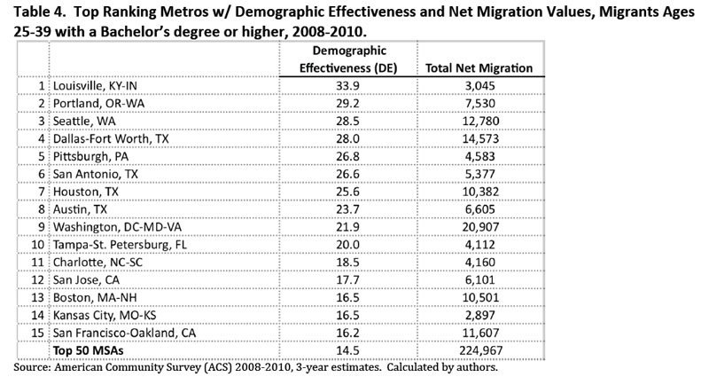
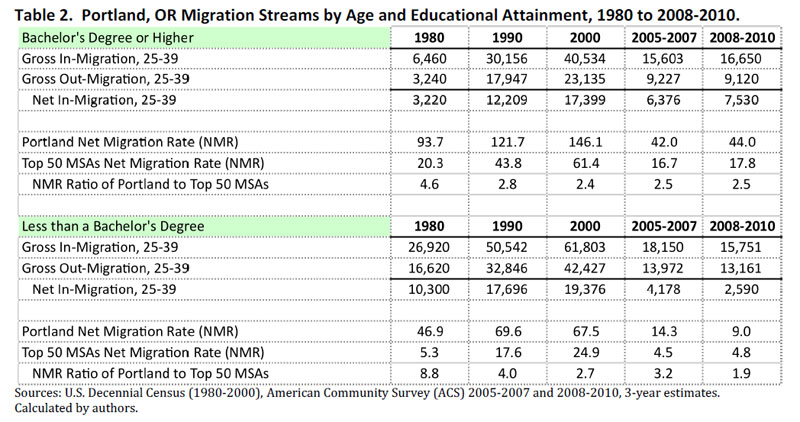

Is Portland Really Where Young People Go to Retire? - CityLab

   
 Josemaria Toscano / Shutterstock.com

# Is Portland Really Where Young People Go to Retire?

1. [Richard Florida](https://www.citylab.com/authors/richard-florida/)

 September 25, 2012

## According to a new study, the city attracts the young and college-educated at some of the highest rates in the country.

- [  Share](https://www.citylab.com/life/2012/09/portland-really-where-young-people-go-retire/3316/#)
- [  Tweet](https://www.citylab.com/life/2012/09/portland-really-where-young-people-go-retire/3316/#)

- 

After visiting Portland, Oregon, this past summer, [*Slate *correspondent Matthew Yglesias](http://www.slate.com/authors.matthew_yglesias.html) wrote that [he heard a joke about the city's economy](http://www.slate.com/articles/business/moneybox/2012/08/portland_is_where_young_people_go_to_retire_economic_renaissance_in_portland.html) repeated several times:

> "Portland," they said, "is where young people go to retire." Fun city, in other words, but a bleak labor market. The joke turns out to be borrowed from the IFC show > [*> Portlandia*](http://www.amazon.com/gp/product/B005OZIV20/ref=as_li_ss_tl?ie=UTF8&camp=1789&creative=390957&creativeASIN=B005OZIV20&linkCode=as2&tag=slatmaga-20)> . The city is described as reminiscent of a time when "people were unambitious; they’d sleep till 11 and just hang out with their friends." Or a time when there were "no occupations whatsoever, maybe working a couple of hours at the coffee shop."

Inspired by this same joke, a study released last week ([PDF](http://mkn.research.pdx.edu/wp-content/uploads/2012/09/JurjevichSchrockMigrationReport1.pdf)) by Portland State University's [Jason Jurjevich](http://pdx.edu/usp/profile/meet-assistant-professor-jason-jurjevich) and [Greg Schrock](http://pdx.edu/cupa/profile/meet-assistant-professor-greg-schrock) examines Portland's ability to attract young, college-educated people, which the authors dub "YCEs." The study tracks these trends over the past three decades, paying special attention to 2000 to 2010. Among their findings:

- The Portland region attracts YCE's at some of the highest levels of any metro in the United States. And they keep those YCE's at high rates too.
- The number of YCE's migrating to the Portland metro consistently exceeds expectations given the region's labor market conditions.
- Portland also attracts empty-nester and retirement-age boomers (age 40 and above) at higher levels than its metro peers.
- Between 2008 and 2010, almost 1 in 7 YCE migrants to Portland were immigrants. The region's foreign-born population also has education attainment levels "that rival the region's native-born population."

The study further notes that:

> Of the largest 50 U.S. metro areas, only Portland and Seattle ranked in the top 15 metros for each period analyzed, 1980 to 2010, with the highest rate of attracting and retaining YCE migrants. This statistic not only underscores the Portland metro’s competitiveness in attracting and retaining college­‐educated talent, but also showcases the consistency of Portland’s YCE migration patterns. Other metro areas, including Austin, Denver, and Phoenix, also demonstrated an impressive ability to attract and retain YCE migrants during this period, but also experienced ‘bust’ periods where YCE migration flows ebbed.

> In the end, our findings suggest that most Portland college­-educated migrants appear to place greater relative value on amenity values compared to economic opportunity. Moving to and remaining in Portland despite less-­than-­stellar economic opportunities is truly ‘voting with your feet’ for the region’s quality of life. What’s more, given Portland’s ability to not only attract, but also retain YCEs, amenities will likely remain important for keeping college‐educated individuals as residents of Portland. In addition to YCE migrants, our results suggest that Portland’s urban and natural amenities are also strong pull factors for empty-­nester and retired (age 40 and above) college‐educated migrants.

The study relies upon a measure called "demographic effectiveness" to gauge the ability of metros to attract and retain talented young people. The table below, from the study, shows how America's 50 largest metros stack up on this metric since the start of the Great Recession. Portland ranks second, behind only Louisville over this period.

*Table courtesy of the study, "Is Portland Really the Place Where Young People Go To Retire?" ([PDF](http://mkn.research.pdx.edu/wp-content/uploads/2012/09/JurjevichSchrockMigrationReport1.pdf))*

In an email to me, [Joe Cortright](http://www.impresaconsulting.com/?q=node/23), a leading demographer of young people based in Portland, pointed out that: "the striking thing is that net migration of well-educated young adults actually accelerated as the U.S. economy weakened."

The study also looked closely at in-migration and out-migration of young people aged 25-39 by level of education (see the table below).

*Table courtesy of the study, "Is Portland Really the Place Where Young People Go To Retire?" ([PDF](http://mkn.research.pdx.edu/wp-content/uploads/2012/09/JurjevichSchrockMigrationReport1.pdf))*

The number of young people moving in was consistently larger than those moving out over the past three decades. But as the table shows, the ability of Portland to attract highly-educated young people (those with a college degree or higher) only recently surpassed its ability to attract young people without a degree. The study distinguishes between "making" and "buying" talent.

> ...[P]laces have two potential routes to building their stock of human capital – by investing in its creation (i.e., “making” it), or by attempting to attract educated individuals from other places (i.e., “buying” it); both are not mutually exclusive. Metro areas, like San Francisco and Washington, DC for example, have a significant higher education infrastructure that allow them to produce human capital locally, but also have relied on YCE migration streams to support their demand for human capital. Equally important, given that most jobs in both regions require some degree of formal education and/or skilled job training, since 1980 the total volume of net in­-migration among YCE individuals exceeded the net in-­migration of young, less­ educated individuals.

> Although Portland still trails Boston and San Francisco in the race for high educational attainment levels, the ability of the Portland metro to outpace other U.S. metro areas in attracting YCE migrants, in large part, explains the region’s recent increases in educational attainment.

Portland has long been a talent magnet. In another [*Slate *article](http://www.slate.com/articles/arts/music_box/2007/09/the_indie_city.html) from 2007, Portland-based writer [Taylor Clark](http://www.slate.com/authors.taylor_clark.html) pointed out that Portland had become an "indie rock Mecca" — it was home to members of the Shins, the Decemberists, Death Cab for Cutie, and Spoon, to name just a few — but not by producing bands from a local scene:

> Portland has neither a distinctive "sound" nor a "scene" to speak of. Sonically, there's not a whole lot that the twisty pop of the Shins has in common with the "hyper-literate prog-rock" (to borrow a phrase from Stephen Colbert) of the Decemberists. And virtually none of these groups can be considered "Portland bands" since, with very few exceptions, they all moved to town *> after*>  gaining some level of fame. (Generally speaking, it's rare to meet a young, creative Portlander who's *> from*>  Portland.)

But rather by attracting music talent with its affordability, openness, and quality of life:

> It's easy to live here. In the words of a friend of mine who used to be the music editor at the local alt-weekly, Portland is like a resort community for indie rockers who spend half the year working themselves ragged on tour. You can venture into public dressed like a convicted sex offender or a homeless person, and no one looks at you askew.

More than a decade ago, I concluded that Portland was a special case — able to attract and retain young, educated talent while lacking a great university or well-developed high-tech knowledge economy. It ranked very highly on the "Brain Drain Gain Index," a metric developed by my long-time collaborator [Kevin Stolarick](http://martinprosperity.org/people/kevin-stolarick/) to compare the percentage of college grads residing in a region to the percentage enrolled in college.

Portland also scores very highly on a metric that adds together the value of quality of life and that of productivity across American metros ([PDF](http://www-personal.umich.edu/~albouy/Cityvalue/cityvalue.pdf)), developed by University of Michigan economist [David Albouy](http://www-personal.umich.edu/~albouy/). Portland ranks 19th, just ahead of Washington, D.C. The interesting thing is that Portland ranks slightly higher in productivity value (30th) than in quality of life value (37th), which suggests that the talent attracted to Portland, rather than retiring, is contributing to its economy.

## Cities are changing fast. Keep up with the **CityLab Daily** newsletter.

The best way to follow issues you care about.

 [Subscribe](http://link.mail.bloombergbusiness.com/join/4wm/citylab-daily&hash=b9b2681361bede0e1069ca238efb1ec2)

In his email, Cortright also points to the high and growing level of entrepreneurship among young, talented Portlanders: "the number of 25-39 college educated [people] running their own businesses is about 50 percent higher than the average for large metros," adding that "this high degree of entrepreneurship is a positive for the regional economy. It also shows a strong DIY culture: if the economy doesn't provide you a job, make your own."

Jurjevich and Schrock conclude:

> These findings more broadly, also lend support to the interrelated hypotheses of ‘consumption-oriented migration’ advanced by Wilbur Zelinsky, and the ‘consumer city’ idea championed by Harvard economist Ed Glaeser. With high amenity cities recently experiencing higher levels of economic growth, scholars have argued that the short and long-term success of cities largely rests in their ability to serve as ‘centers of consumption’ by attracting human capital through amenity-based migration. The relevance to Portland has to do with what we term, ‘the amenity paradox’—the notion that the attractiveness and amenity value of a city draws more people to the region and additional growth pressures have the potential to erode the quality of life that makes the region attractive in the first place. While the Portland region has invested in policies (i.e. the urban growth boundary) to proactively address growth-related issues, our results underscore the importance of maintaining the region’s quality of life as a critical ingredient to the sustainability of economic development in the Portland region.

*Top image: [Josemaria Toscano](http://www.shutterstock.com/gallery-478081p1.html) / [Shutterstock.com](http://www.shutterstock.com/)*

#### About the Author

##### [Richard Florida](https://www.citylab.com/authors/richard-florida/)

-  @[Richard_Florida](https://twitter.com/Richard_Florida)

-   [Feed](https://www.citylab.com/feeds/author/richard-florida/)

[(L)](https://www.citylab.com/authors/richard-florida/)[Richard Florida](https://www.citylab.com/authors/richard-florida/) is a co-founder and editor at large of CityLab and a senior editor at *The Atlantic. *He is a university professor in the University of Toronto’s School of Cities and Rotman School of Management, and a distinguished fellow at New York University’s Schack Institute of Real Estate and visiting fellow at Florida International University.