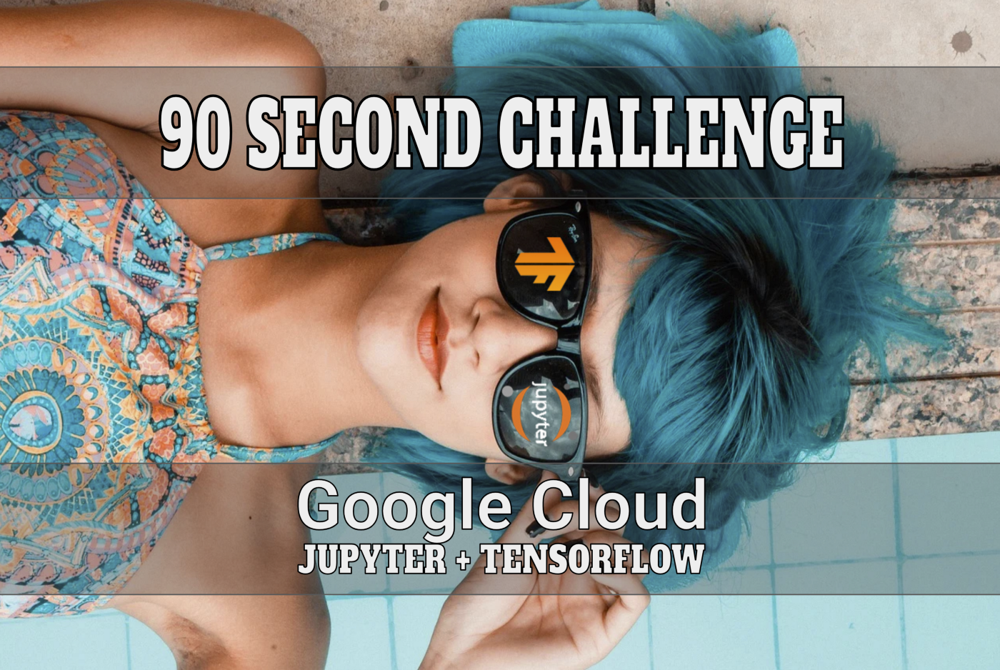
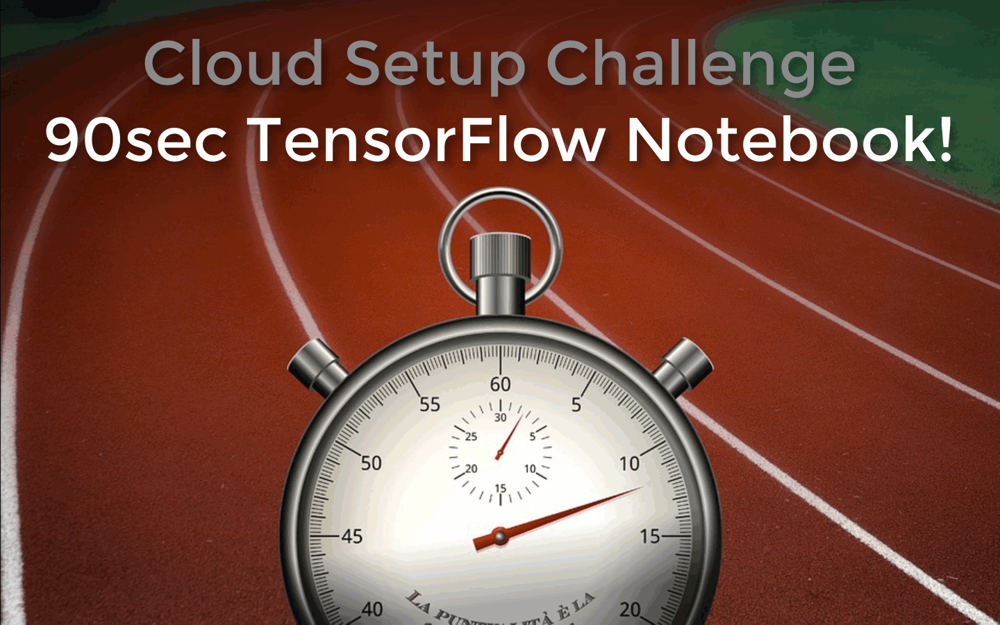
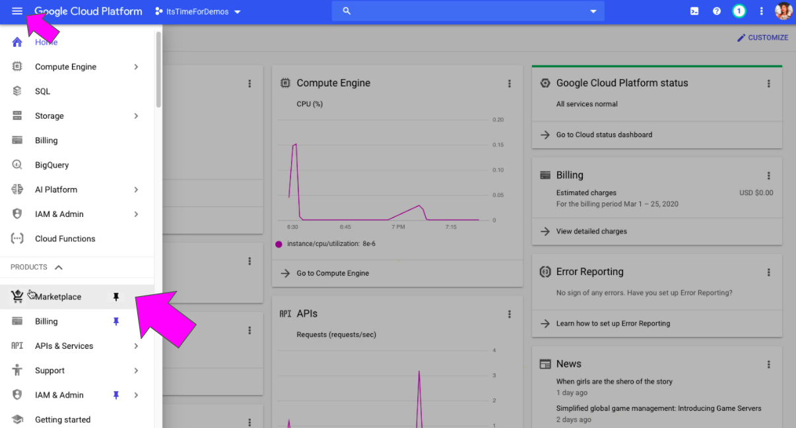
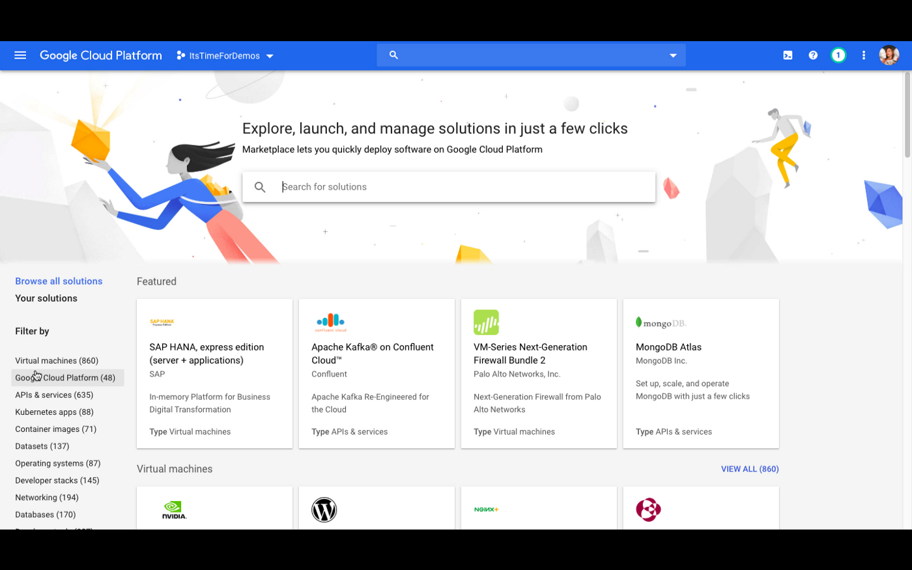
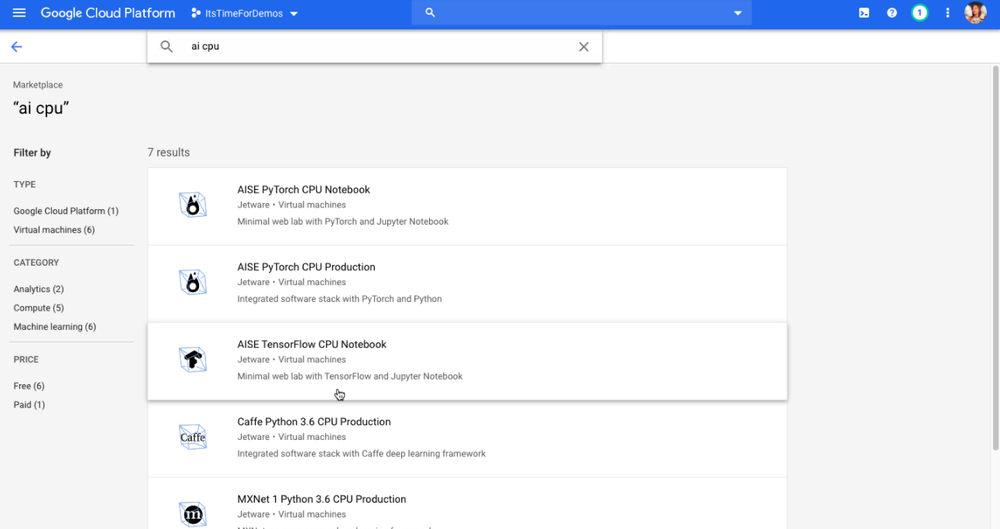
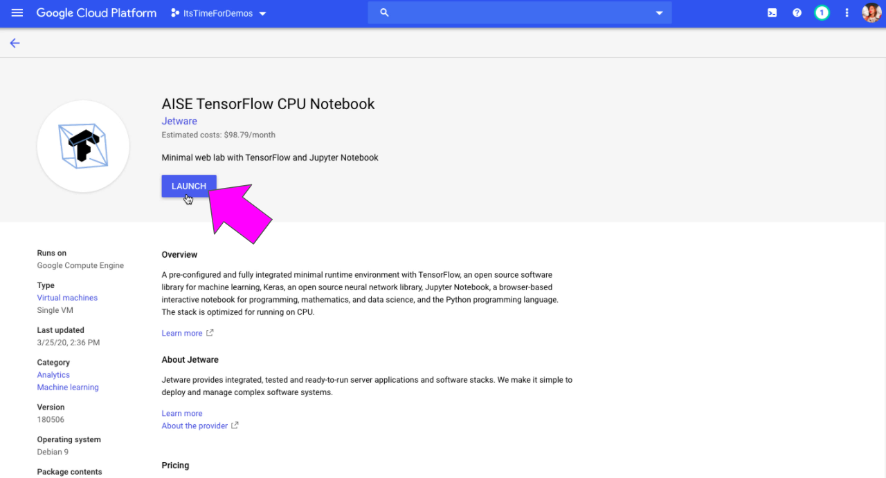
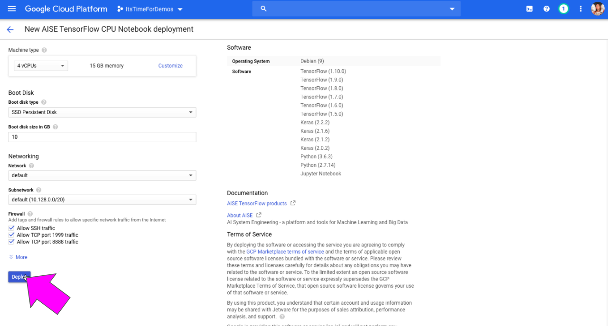
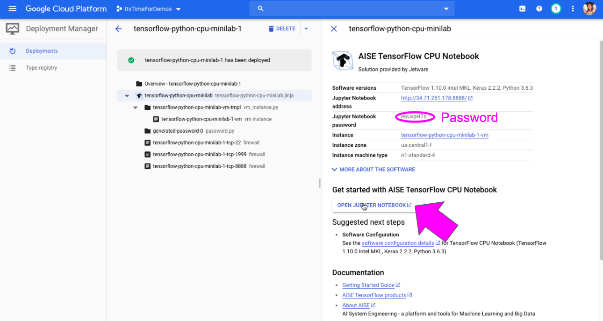

Jupyter + TensorFlow with Google Cloud… in 90 seconds!

# Jupyter + TensorFlow with Google Cloud… in 90 seconds!

## Is it possible for data science beginners to get up and running in under 2 minutes?

[Cassie Kozyrkov](https://towardsdatascience.com/@kozyrkov?source=post_page-----93038bcac996----------------------)

[Apr 29](https://towardsdatascience.com/90-second-setup-challenge-jupyter-tensorflow-in-google-cloud-93038bcac996?source=post_page-----93038bcac996----------------------) · 5 min read

Data science enthusiasts, how fast can you go from zero to Google Cloud Jupyter notebook? Let’s find out!

Image: [SOURCE](https://pixabay.com/photos/blue-sunglasses-woman-swimming-pool-2705642/).

# To customize or not to customize?

If you’re in the mood to ultra-customize your setup, [Google Cloud](http://bit.ly/gcp-hello) gives you dizzying granularity. That’s a fabulous thing for teams starting an enterprise-scale project, which scales up the consequences of every corner you cut.

> Do beginners have to trudge through a forest of options to get started?

But what if you’re a beginner who just wants to play around with a [data science](http://bit.ly/quaesita_datascim) notebook? Do you have to trudge through that forest of options to get started? Great news: you don’t. You can get up and running in under 90 seconds! (Feel free to skip to the walk-through below.)

> You can get up and running in under 2 minutes! (Walk-through below.)

If this is your first time, I bet you’re probably especially keen to get to `hello world` as quickly as possible. You’ll want to skip the control panel and use someone else’s setup solution. If so, you’ll love the Google Cloud [Marketplace](https://bit.ly/gcpmarketplace)!

# What is the Marketplace?

Welcome to a collection of prebaked [machine images](http://bit.ly/quaesita_mimag) that you can use as a springboard for your own work. And yes, you can customize these third party templates later if you need to (learn more [here](http://bit.ly/quaesita_mimag)).

> A collection of prebaked templates.

# The 90 second challenge

Enough preamble! Let’s see if it is possible to go from zero to hero in under 2 minutes. I’ll break down the steps below — this is just the proof that it can be done. Here’s we go:

This recording of my screen shows you that it’s possible to get going under 90 sec, but your sore eyes might prefer the step-by-step screenshot guide below.

# What did we just watch?

First, what *didn’t* we watch? Steps 0.1–0.3.

## Step 0.1: Create Google account

You’ll need a [Google account](https://bit.ly/myaccountgoogl) to use Google Cloud. I’ve had mine for a while, so that’s not shown.

## Step 0.2: Open Google Cloud Console

My video starts on the Google Cloud Dashboard screen, which you’ll get to by clicking [console.cloud.google.com](https://bit.ly/consolecloudgoogle). First-time users will be prompted through a few housekeeping items.

## Step 0.3: Create a new project

I’m using a project I made called *ItsTimeForDemos*. To make a new project, I clicked on this part of the dashboard:

Now that we’re ready, let’s examine what we saw on my screen.

## Step 1: Head to the Marketplace!

To skip reinventing your own wheel, you’ll head to Google Cloud [Marketplace](https://bit.ly/gcpmarketplace).

## Step 2: Search for the solution you need

In the search bar, I’ll enter the keywords “*ai cpu.*”

*Why *[*AI*](http://bit.ly/quaesita_ai)*? *I felt like doing this demo with an AI-geared notebook. If you’re looking for something else, simply ask the search bar. There are almost 2000 solutions here.

*Why CPU? *It’s the vanilla option. More powerful hardware — like GPUs — is more powerful… which usually also means it’s more expensive and will burn through your [$300 free credits](https://bit.ly/free300gcp) faster. Unless you already know why you need the beast option, it’s probably a good idea to start with its lightweight cousin.

## Step 3: Choose your winner

Among the solutions, I picked the TensorFlow Jupyter notebook. You pick whatever you like.

*Why notebook? *[Data scientists](http://bit.ly/quaesita_universe) like notebooks because they combine the best of interactive data analysis with pretty report-making.

*Why *[*Jupyter*](http://bit.ly/jupyter_try)*? *It’s the notebook solution you’re most likely to have heard of.

*Why *[*TensorFlow*](http://bit.ly/quaesita_tf)*? *It’s a powerful [deep-learning](http://bit.ly/quaesita_emperor) framework; get more info [here](http://bit.ly/quaesita_tf2).

## Step 4: Launch and deploy

Hit the big blue button. Repeat.

## Step 5: Copy the provided password and open the notebook

A randomly-generated password will be created for you. Copy its text while you wait patiently for a few seconds, then open the Jupyter notebook when that option becomes available.

## Step 6: Hello world!

Paste in your copied password to open Jupyter, then create a new notebook.

Once you’re in, you’ll see that TensorFlow is installed and you’re ready to start exploring.

Getting up and running took less than 90 seconds!

# Game on!

Is this the best data science environment you can have? No, because creating the *perfect* solution for you means [customizing](http://bit.ly/quaesita_mimag) everything to *your* personal needs. One day, that’s probably what you’ll choose to do. But in the meantime, this was the shortest path to getting up and running that I’ve found. My goal with this blog post was simply to show you that there are super-quick options out there.

> Can you do it faster than me?

Can you do it faster than me? Maybe! Consider it a challenge and [let me know](https://twitter.com/quaesita/status/1255625073924472833) how many seconds it takes you.

# Don’t forget

To avoid charges, don’t forget to turn out the lights when you’re done; use the search bar to find the *Deployment Manager* page where you can delete/stop whatever you don’t need anymore.

# Disclaimer

*This blog post was written in April 2020, so if you’re from The Future, things might look different in your world.*