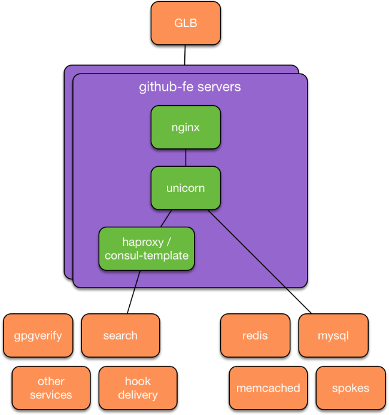
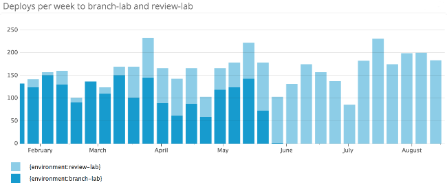
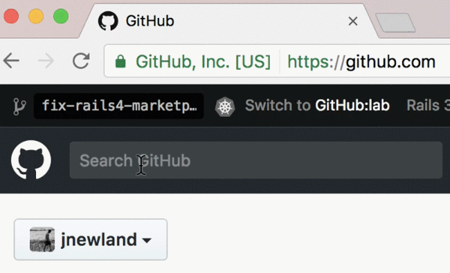
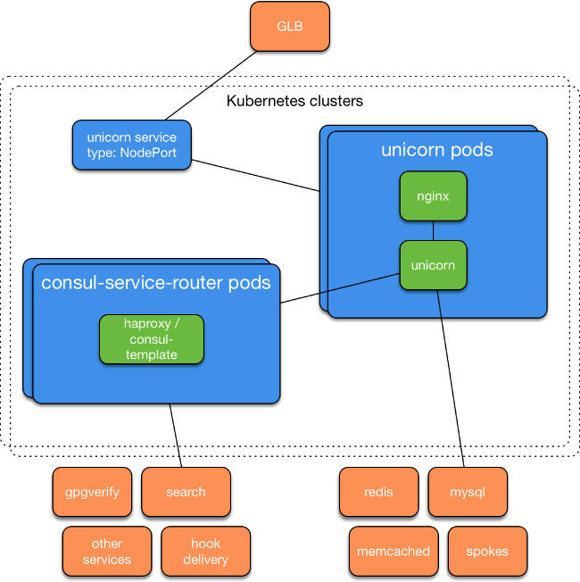

Kubernetes at GitHub

Over the last year, GitHub has gradually evolved the infrastructure that runs the Ruby on Rails application responsible for ` github.com ` and ` api.github.com `. We reached a big milestone recently: all web and API requests are served by containers running in [Kubernetes](https://github.com/kubernetes/kubernetes/) clusters deployed on our [metal cloud](https://githubengineering.com/githubs-metal-cloud/). Moving a critical application to Kubernetes was a fun challenge, and we’re excited to share some of what we’ve learned with you today.

## Why change?[](https://githubengineering.com/kubernetes-at-github/#why-change)

Before this move, our main Ruby on Rails application (we call it ` github/github `) was configured a lot like it was eight years ago: [Unicorn](https://github.com/blog/517-unicorn) processes managed by a Ruby process manager called [God](http://godrb.com/) running on Puppet-managed servers. Similarly, our [chatops deployment](https://githubengineering.com/deploying-branches-to-github-com/) worked a lot like it did when it was first introduced: Capistrano established SSH connections to each frontend server, then [updated the code in place](https://github.com/blog/470-deployment-script-spring-cleaning) and restarted application processes. When peak request load exceeded available frontend CPU capacity, GitHub Site Reliability Engineers would [provision additional capacity](https://githubengineering.com/githubs-metal-cloud/) and add it to the pool of active frontend servers.

While our basic production approach didn’t change much in those years, GitHub itself changed a lot: new features, larger software communities, more GitHubbers on staff, and way more requests per second. As we grew, this approach began to exhibit new problems. Many teams wanted to extract the functionality they were responsible for from this large application into a smaller service that could run and be deployed independently. As the number of services we ran increased, the SRE team began supporting similar configurations for dozens of other applications, increasing the percentage of our time we spent on server maintenance, provisioning, and other work not directly related to improving the overall GitHub experience. New services took days, weeks, or months to deploy depending on their complexity and the SRE team’s availability. Over time, it became clear that this approach did not provide our engineers the flexibility they needed to continue building a world-class service. Our engineers needed a self-service platform they could use to experiment, deploy, and scale new services. We also needed that same platform to fit the needs of our core Ruby on Rails application so that engineers and/or robots could respond to changes in demand by allocating additional compute resources in seconds instead of hours, days, or longer.

In response to those needs, the SRE, Platform, and Developer Experience teams began a joint project that led us from an initial evaluation of container orchestration platforms to where we are today: deploying the code that powers ` github.com ` and ` api.github.com ` to Kubernetes clusters dozens of times per day. This post aims to provide a high-level overview of the work involved in that journey.

## Why Kubernetes?[](https://githubengineering.com/kubernetes-at-github/#why-kubernetes)

As a part of evaluating the existing landscape of “platform as a service” tools, we took a closer look at Kubernetes, a project from Google that described itself at the time as *an open-source system for automating deployment, scaling, and management of containerized applications*. Several qualities of Kubernetes stood out from the other platforms we evaluated: the vibrant open source community supporting the project, the first run experience (which allowed us to deploy a small cluster and an application in the first few hours of our initial experiment), and a wealth of information available about the [experience](http://queue.acm.org/detail.cfm?id=2898444) that motivated its design.

These experiments quickly grew in scope: a small project was assembled to build a Kubernetes cluster and deployment tooling in support of an upcoming hack week to gain some practical experience with the platform. Our experience with this project as well as the feedback from engineers who used it was overwhelmingly positive. It was time to expand our experiments, so we started planning a larger rollout.

## Why start with ` github/github `?[](https://githubengineering.com/kubernetes-at-github/#why-start-with-githubgithub)

At the earliest stages of this project, we made a deliberate decision to target the migration of a critical workload: ` github/github `. Many factors contributed to this decision, but a few stood out:

- We knew that the deep knowledge of this application throughout GitHub would be useful during the process of migration.

- We needed self-service capacity expansion tooling to handle continued growth.

- We wanted to make sure the habits and patterns we developed were suitable for large applications as well as smaller services.

- We wanted to better insulate the app from differences between development, staging, production, enterprise, and other environments.

- We knew that migrating a critical, high-visibility workload would encourage further Kubernetes adoption at GitHub.

Given the critical nature of the workload we chose to migrate, we needed to build a high level of operational confidence before serving any production traffic.

## Rapid iteration and confidence building with a review lab[](https://githubengineering.com/kubernetes-at-github/#rapid-iteration-and-confidence-building-with-a-review-lab)

As a part of this migration, we designed, prototyped, and validated a replacement for the service currently provided by our frontend servers using Kubernetes primitives like Pods, Deployments, and Services. Some validation of this new design could be performed by running ` github/github `’s existing test suites in a container rather than on a server configured similarly to frontend servers, but we also needed to observe how this container behaved as a part of a larger set of Kubernetes resources. It quickly became clear that an environment that supported exploratory testing of the combination of Kubernetes and the services we intended to run would be necessary during the validation phase.

Around the same time, we observed that our existing patterns for exploratory testing of ` github/github ` pull requests had begun to show signs of growing pains. As the rate of deploys increased along with the number of engineers working on the project, so did the utilization of the several [additional deploy environments](https://githubengineering.com/deploying-branches-to-github-com/#deploy-environments) used as a part of the process of validating a pull request to ` github/github `. The small number of fully-featured deploy environments were usually booked solid during peak working hours, which slowed the process of deploying a pull request. Engineers frequently requested the ability to test more of the various production subsystems on “branch lab.” While branch lab allowed concurrent deployment from many engineers, it only started a single Unicorn process for each, which meant it was only useful when testing API and UI changes. These needs overlapped substantially enough for us to combine the projects and start work on a new Kubernetes-powered deployment environment for ` github/github ` called “review lab.”

In the process of building review lab, we shipped a handful of sub-projects, each of which could likely be covered in their own blog post. Along the way, we shipped:

- A Kubernetes cluster running in an AWS VPC managed using a combination of [Terraform](https://github.com/hashicorp/terraform) and [kops](https://github.com/kubernetes/kops).

- A set of Bash integration tests that exercise ephemeral Kubernetes clusters, used heavily in the beginning of the project to gain confidence in Kubernetes.

- A Dockerfile for ` github/github `.

- Enhancements to our internal CI platform to support building and publishing containers to a container registry.

- YAML representations of 50+ Kubernetes resources, checked into ` github/github `.

- Enhancements to our internal deployment application to support deploying Kubernetes resources from a repository into a Kubernetes namespace, as well as the creation of Kubernetes secrets from our internal secret store.

- A service that combines haproxy and consul-template to route traffic from Unicorn pods to the existing services that publish service information there.

- A service that reads Kubernetes events and sends abnormal ones to our internal error tracking system.

- A [chatops-rpc](https://github.com/bhuga/hubot-chatops-rpc)-compatible service called ` kube-me ` that exposes a limited set of ` kubectl ` commands to users via chat.

The end result is a chat-based interface for creating an isolated deployment of GitHub for any pull request. Once a pull request passed all required CI jobs, a user can deploy their pull request to review lab like so:

   **jnewland**
.deploy https://github.com/github/github/pull/4815162342 to review-lab

   **Hubot**

 [@jnewland](https://github.com/jnewland)'s review-lab deployment of github/add-pre-stop-hook (00cafefe) is done! (12 ConfigMaps, 17 Deployments, 1 Ingress, 1 Namespace, 6 Secrets, and 23 Services)(77.62s) your lab is available at https://jnewland.review-lab.github.com

Like branch lab before it, labs are cleaned up one day after their last deploy. As each lab is created in its own Kubernetes namespace, cleanup is as simple as deleting the namespace, which our deployment system performs automatically when necessary.

Review lab was a successful project with a number of positive outcomes. Before making this environment generally available to engineers, it served as an essential proving ground and prototyping environment for our Kubernetes cluster design as well as the design and configuration of the Kubernetes resources that now describe the ` github/github ` Unicorn workload. After release, it exposed a large number of engineers to a new style of deployment, helping us build confidence via feedback from interested engineers as well as continued use from engineers who didn’t notice any change. And just recently, we observed some engineers on our High Availability team use review lab to experiment with the interaction between Unicorn and the behavior of a new experimental subsystem by deploying it to a shared lab. We’re extremely pleased with the way that this environment empowers engineers to experiment and solve problems in a self-service manner.

## Kubernetes on Metal[](https://githubengineering.com/kubernetes-at-github/#kubernetes-on-metal)

With review lab shipped, our attention shifted to ` github.com `. To satisfy the performance and reliability requirements of our flagship service - which depends on low-latency access to other data services - we needed to build out Kubernetes infrastructure that supported the [metal cloud](https://githubengineering.com/githubs-metal-cloud/) we run in our physical data centers and POPs. Again, nearly a dozen subprojects were involved in this effort:

- A timely and thorough post about [container networking](https://jvns.ca/blog/2016/12/22/container-networking/) helped us select the [Calico](https://www.projectcalico.org/) network provider, which provided the out-of-the box functionality we needed to ship a cluster quickly in ` ipip ` mode while giving us the flexibility to explore peering with our network infrastructure later.

- Following no less than a dozen reads of [@kelseyhightower](https://github.com/kelseyhightower)’s indispensable [Kubernetes the hard way](https://github.com/kelseyhightower/kubernetes-the-hard-way), we assembled a handful of manually provisioned servers into a temporary Kubernetes cluster that passed the same set of integration tests we used to exercise our AWS clusters.

- We built a small tool to generate the CA and configuration necessary for each cluster in a format that could be consumed by our internal Puppet and secret systems.

- We Puppetized the configuration of two instance roles - Kubernetes nodes and Kubernetes apiservers - in a fashion that allows a user to provide the name of an already-configured cluster to join at provision time.

- We built a small Go service to consume container logs, append metadata in key/value format to each line, and send them to the hosts’ local syslog endpoint.

- We enhanced [GLB](https://githubengineering.com/introducing-glb/), our internal load balancing service, to support Kubernetes NodePort Services.

The combination of all of this hard work resulted in a cluster that passed our internal acceptance tests. Given that, we were fairly confident that the same set of inputs (the Kubernetes resources in use by review lab), the same set of data (the network services review lab connected to over a VPN), and same tools would create a similar result. In less than a week’s time - much of which was spent on internal communication and sequencing in the event the migration had significant impact - we were able to migrate this entire workload from a Kubernetes cluster running on AWS to one running inside one of our data centers.

## Raising the confidence bar[](https://githubengineering.com/kubernetes-at-github/#raising-the-confidence-bar)

With a successful and repeatable pattern for assembling Kubernetes clusters on our metal cloud, it was time to build confidence in the ability of our Unicorn deployment to replace the pool of current frontend servers. At GitHub, it is common practice for engineers and their teams to validate new functionality by creating a [Flipper](https://github.com/jnunemaker/flipper) feature and then opting into it as soon as it is viable to do so. After enhancing our deployment system to deploy a new set of Kubernetes resources to a ` github-production ` namespace in parallel with our existing production servers and enhancing GLB to support routing staff requests to a different backend based on a Flipper-influenced cookie, we allowed staff to opt-in to the experimental Kubernetes backend with a button in our [mission control bar](https://github.com/blog/1252-how-we-keep-github-fast):

The load from internal users helped us find problems, fix bugs, and start getting comfortable with Kubernetes in production. During this period, we worked to increase our confidence by simulating procedures we anticipated performing in the future, writing runbooks, and performing failure tests. We also routed small amounts of production traffic to this cluster to confirm our assumptions about performance and reliability under load, starting with 100 requests per second and expanding later to 10% of the requests to ` github.com ` and ` api.github.com `. With several of these simulations under our belt, we paused briefly to re-evaluate the risk of a full migration.

## Cluster Groups[](https://githubengineering.com/kubernetes-at-github/#cluster-groups)

Several of our failure tests produced results we didn’t expect. Particularly, a test that simulated the failure of a single apiserver node disrupted the cluster in a way that negatively impacted the availability of running workloads. Investigations into the results of these tests did not produce conclusive results, but helped us identify that the disruption was likely related to an interaction between the various clients that connect to the Kubernetes apiserver (like ` calico-agent `, ` kubelet `, ` kube-proxy `, and ` kube-controller-manager `) and our internal load balancer’s behavior during an apiserver node failure. Given that we had observed a Kubernetes cluster degrade in a way that might disrupt service, we started looking at running our flagship application on multiple clusters in each site and automating the process of diverting requests away from a unhealthy cluster to the other healthy ones.

Similar work was already on our roadmap to support deploying this application into multiple independently-operated sites, and other positive trade-offs of this approach - including presenting a viable story for low-disruption cluster upgrades and associating clusters with existing failure domains like shared network and power devices - influenced us to go down this route. We eventually settled on a design that uses our deployment system’s support for deploying to multiple “partitions” and enhanced it to support cluster-specific configuration via a custom Kubernetes resource annotation, forgoing the existing federation solutions for an approach that allowed us to use the business logic already present in our deployment system.

## From 10% to 100%[](https://githubengineering.com/kubernetes-at-github/#from-10-to-100)

With Cluster Groups in place, we gradually converted frontend servers into Kubernetes nodes and increased the percentage of traffic routed to Kubernetes. Alongside a number of other responsible engineering groups, we completed the frontend transition in just over a month while keeping performance and error rates within our targets.

During this migration, we encountered an issue that persists to this day: during times of high load and/or high rates of container churn, some of our Kubernetes nodes will kernel panic and reboot. While we’re not satisfied with this situation and are continuing to investigate it with high priority, we’re happy that Kubernetes is able to route around these failures automatically and continue serving traffic within our target error bounds. We’ve performed a handful of failure tests that simulated kernel panics with ` echo c > /proc/sysrq-trigger ` and have found this to be a useful addition to our failure testing patterns.

## What’s next?[](https://githubengineering.com/kubernetes-at-github/#whats-next)

We’re inspired by our experience migrating this application to Kubernetes, and are looking forward to migrating more soon. While scope of our first migration was intentionally limited to stateless workloads, we’re excited about experimenting with patterns for running stateful services on Kubernetes.

During the last phase of this project, we also shipped a workflow for deploying new applications and services into a similar group of Kubernetes clusters. Over the last several months, engineers have already deployed dozens of applications to this cluster. Each of these applications would have previously required configuration management and provisioning support from SREs. With a self-service application provisioning workflow in place, SRE can devote more of our time to delivering infrastructure products to the rest of the engineering organization in support of our best practices, building toward a faster and more resilient GitHub experience for everyone.

## Thanks[](https://githubengineering.com/kubernetes-at-github/#thanks)

We’d like to extend our deep thanks to the entire Kubernetes team for their software, words, and guidance along the way. I’d also like to thank the following GitHubbers for their incredible work on this project: [@samlambert](https://github.com/samlambert), [@jssjr](https://github.com/jssjr), [@keithduncan](https://github.com/keithduncan), [@jbarnette](https://github.com/jbarnette), [@sophaskins](https://github.com/sophaskins), [@aaronbbrown](https://github.com/aaronbbrown), [@rhettg](https://github.com/rhettg), [@bbasata](https://github.com/bbasata), and [@gamefiend](https://github.com/gamefiend).

## Come work with us

Want to help the GitHub SRE team solve interesting problems like this? We’d love for you to join us. Apply [here](https://boards.greenhouse.io/github/jobs/788701)!