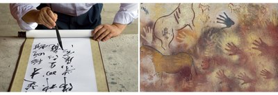
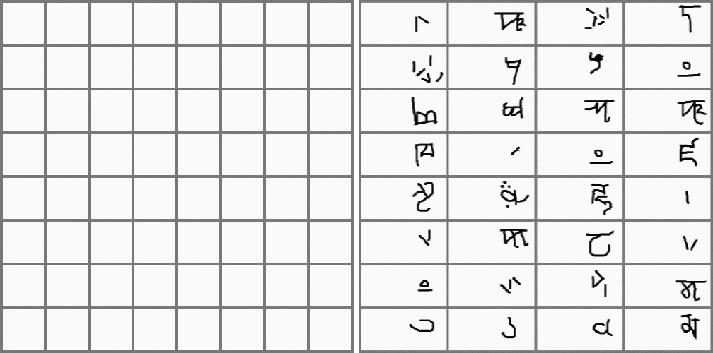
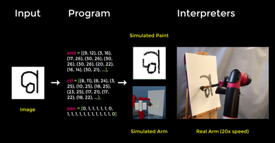

Learning to write programs that generate images | DeepMind

# Learning to write programs that generate images

**Through a human’s eyes, the world is much more than just the images reflected in our corneas. For example, when we look at a building and admire the intricacies of its design, we can appreciate the craftsmanship it requires. This ability to interpret objects through the tools that created them gives us a richer understanding of the world and is an important aspect of our intelligence.**

**We would like our systems to create similarly rich representations of the world. For example, when observing an image of a painting we would like them to understand the brush strokes used to create it and not just the pixels that represent it on a screen.**

[In this work](https://deepmind.com/documents/183/SPIRAL.pdf), we equipped artificial agents with the same tools that we use to generate images and demonstrate that they can reason about how digits, characters and portraits are constructed. Crucially, they learn to do this by themselves and without the need for human-labelled datasets. This contrasts with [recent research](https://arxiv.org/pdf/1704.03477.pdf) which has so far relied on learning from human demonstrations, which can be a time-intensive process.

Credit: Shutterstock

We designed a deep reinforcement learning *agent *that interacts with a computer [paint program](http://mypaint.org/), placing strokes on a digital canvas and changing the brush size, pressure and colour. The untrained agent starts by drawing random strokes with no visible intent or structure. To overcome this, we had to create a way to reward the agent that encourages it to produce meaningful drawings.

To this end, we trained a second neural network, called the *discriminator*, whose sole purpose is to predict whether a particular drawing was produced by the agent, or if it was sampled from a dataset of real photographs. The painting agent is rewarded by how much it manages to “fool” the discriminator into thinking its drawings are real. In other words, the agent’s reward signal is itself learned. While this is similar to the approach used in Generative Adversarial Networks (GANs), it differs because the generator in GAN setups is typically a neural network that directly outputs pixels. In contrast, our agent produces images by writing graphics programs to interact with a paint environment.

In the first set of experiments, the agent was trained to generate images resembling [MNIST](http://yann.lecun.com/exdb/mnist/) digits: it was shown what the digits look like, but not how they are drawn. By attempting to generate images that fool the discriminator, the agent learns to control the brush and to manoeuvre it to fit the style of different digits, a technique known as visual [program synthesis](https://en.wikipedia.org/wiki/Program_synthesis).

We also trained it to reproduce specific images. Here, the discriminator’s aim is to determine if the reproduced image is a copy of the target image, or if it has been produced by the agent. The more difficult this distinction becomes for the discriminator, the more the agent is rewarded.

Crucially, this framework is also interpretable because it produces a sequence of motions that control a simulated brush. This means that the model can apply what it has learnt on the simulated paint program to re-create characters in other similar environments, for instance on a simulated or real robot arm. A video of this can be seen [here](https://youtu.be/XXM3PdIdLJQ).

There is also potential to scale this framework to real datasets. When trained to paint [celebrity faces](http://mmlab.ie.cuhk.edu.hk/projects/CelebA.html), the agent is capable of capturing the main traits of the face, such as shape, tone and hair style, much like a street artist would when painting a portrait with a limited number of brush strokes:

Recovering structured representations from raw sensations is an ability that humans readily possess and frequently use. In this work we show it is possible to guide artificial agents to  produce similar representations by giving them access to the same tools that we use to recreate the world around us. In doing so they learn to produce visual programs that succinctly express the causal relationships that give rise to their observations.

Although our work only represents a small step towards flexible program synthesis, we anticipate that similar techniques may be necessary to enable artificial agents with human-like cognitive, generalisation and communication abilities.

* * *

**Watch the video [here](https://www.youtube.com/watch?v=iSyvwAwa7vk&feature=youtu.be), read more about the method in the [paper](https://deepmind.com/documents/183/SPIRAL.pdf).**

**This work was done by Yaroslav Ganin, Tejas Kulkarni, Igor Babuschkin, S. M. Ali Eslami and Oriol Vinyals, with thanks to Oleg Sushkov, David Barker, Matej Vecerik and Jon Scholz for their help with the robot.**

Authors
  Tuesday, 27 March 2018

- Yaroslav Ganin