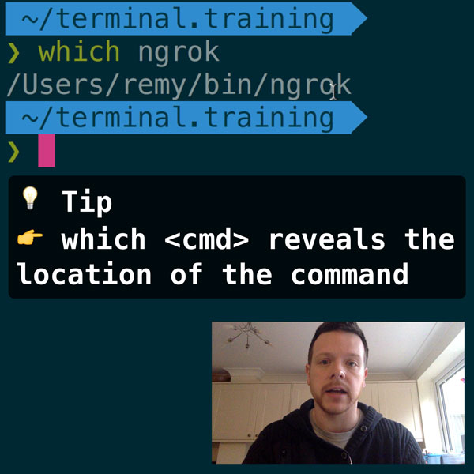

Listing your most used commands

# [Listing your most used commands](https://remysharp.com/2019/10/08/listing-your-most-used-commands)

A fun little command line task is to retrospectively look back at all the commands you run to which you use all the time.

You'll find similar solutions to this on sites like StackOverflow, but they're not quite right. Since quite often commands are piped together the solutions generally ignore the piped commands. So here's how to get it properly.

[      READER DISCOUNT**Save $50 on terminal.training**    I've published 38 videos for new developers, designers, UX, UI, product owners and anyone who needs to conquer the command line today.    **$49 - only from this link**](https://training.leftlogic.com/buy/terminal/cli2?coupon=BLOG&utm_source=blog&utm_medium=banner&utm_campaign=remysharp-discount)

## The command[(L)](https://remysharp.com/2019/10/08/listing-your-most-used-commands#the-command)

It's quite a long chain, and parts will be consistent with other examples on the web, but it's my `awk` commands that gets the finer detail:

	$ history |
	  awk 'BEGIN {FS="\\|"; OFS="\n"} { $1=$1; gsub(/^[0-9* ]+/, ""); print $0 }' |
	  awk '{ $1=$1 } /^[a-z]/ { print $1 }' |
	  sort |
	  uniq -c |
	  sort -n

## In plain text[(L)](https://remysharp.com/2019/10/08/listing-your-most-used-commands#in-plain-text)

Take all the history and split each line by the `|` pipe character.

Then print each record on a new line (from the split line) and strip leading numbers.

Then trim the result, take the first word on each line, throw away results that contain symbols (for instance, a command won't lead with a `*`), then sort by the unique count.

## Command breakdown[(L)](https://remysharp.com/2019/10/08/listing-your-most-used-commands#command-breakdown)

The commands can be broken down into three groups: history, text manipulation, counting.

The real work is happening in the text manipulation under the `awk`. Let's look at the first `awk` command:

	# program setup
	BEGIN {
	  # Field Separator: split lines on the | (the double \\ escaping |)
	  FS="\\|";

	  # Output Field Separator: join the fields by new lines
	  OFS="\n"
	}

	{
	  # this is weirdness of awk, but it recalcs $0 to contain all fields
	  $1=$1;

	  # strip leading numbers from history input and trailing * character
	  gsub(/^[0-9* ]+/, "")

	  # print output (joined by OFS - "\n")
	  print $0
	}

This generates a new output that contains lines with the commands used either at the start of the command or directly after the pipe operator. But the output still includes all the command line arguments, so *now* we want to pluck the first token in the line.

However, before printing the line, we need to remove leading spaces and the only print lines that start with a letter (since there might be some stray arguments included in our list):

	# strip leading and trailing white space "magic"!
	{ $1=$1 }

	# filter results so that only lines starting a letter match
	/^[a-z]/

	# print the first token (awk space separates by default)
	{ print $1 }

Now our output is a long list of single word commands and we're ready to get the count:

	$ sort |  # for uniq to work, results must be sorted
	uniq -c | # count and print unique results
	sort -n # sort numerically (by the first column)

## My most used commands[(L)](https://remysharp.com/2019/10/08/listing-your-most-used-commands#my-most-used-commands)

My history is configured as such:

	$ # timestamps for later analysis. www.debian-administration.org/users/rossen/weblog/1
	export HISTTIMEFORMAT='%F %T '

	# keep history up to date, across sessions, in realtime
	#  http://unix.stackexchange.com/a/48113
	#   - ignorespace = don't save lines that begin with a space
	#   - ignoredups  = don't save duplicate lines
	#   - erasedups   = erase across sessions
	export HISTCONTROL=ignorespace:ignoredups:erasedups
	export HISTSIZE=100000                          # big big history (default is 500)
	export HISTFILESIZE=$HISTSIZE                   # big big history
	which shopt > /dev/null && shopt -s histappend  # append to history, don't overwrite it

Which means I've got 100,000 records in my history (synced across all my sessions).

So my most used command line programs, in the last 100,000 commands are:

	 127 wm      # my webmention tool: https://webmention.app
	 131 code    # vs code
	 139 nodemon # https://github.com/remy/nodemon
	 153 ssh     # connecting or running remote commands
	 162 ack     # alternative to grep https://beyondgrep.com/documentation/
	 163 mkdir
	 171 mv
	 198 z       # zsh alias to jump to directory
	 199 fd      # alternative to find https://github.com/sharkdp/fd
	 217 rm
	 219 now     # deployment with zeit.co
	 225 history
	 235 node
	 247 npx     # running node_modules/.bin programs
	 319 cat     # actually aliased to bat https://github.com/sharkdp/bat
	 371 ls
	 664 cd
	 787 curl    # usually testing APIs
	 819 npm     # install, start, dev and test
	1654 git     # most of my git is done on the cli

*What about you?*

Published 8-Oct 2019 under #code. [Edit this post](https://github.com/remy/remysharp.com/blob/master/public/blog/listing-your-most-used-commands.md)

##   Comments

Login

[**M ↓**   Markdown]()

[Commento](https://commento.io/)