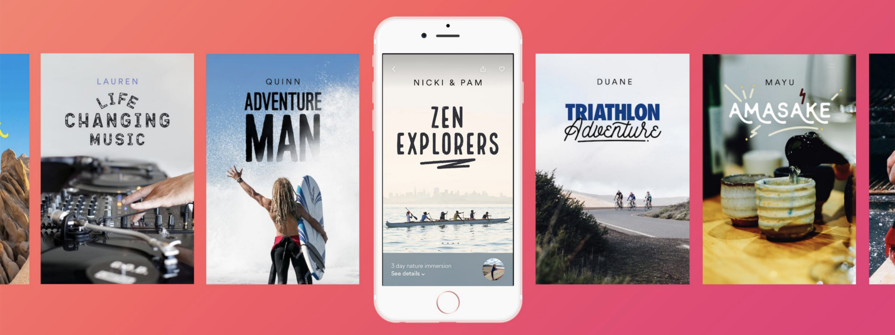
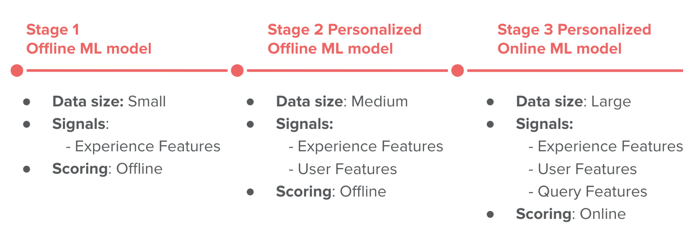
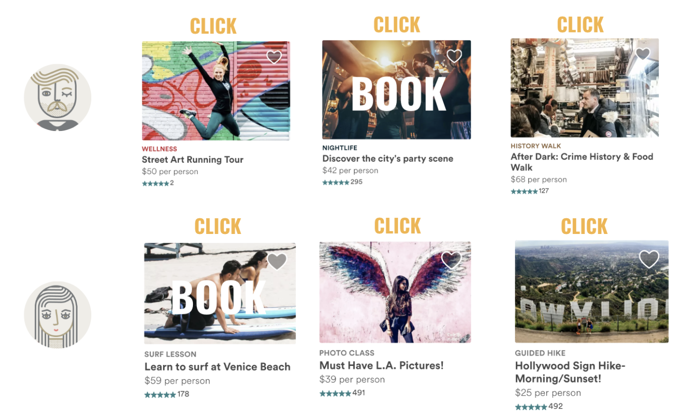
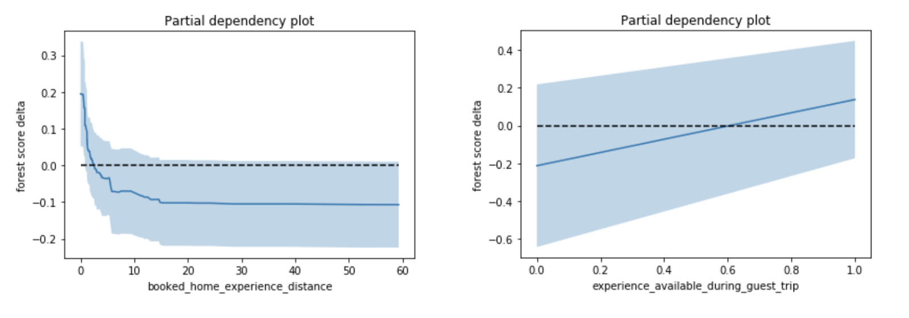
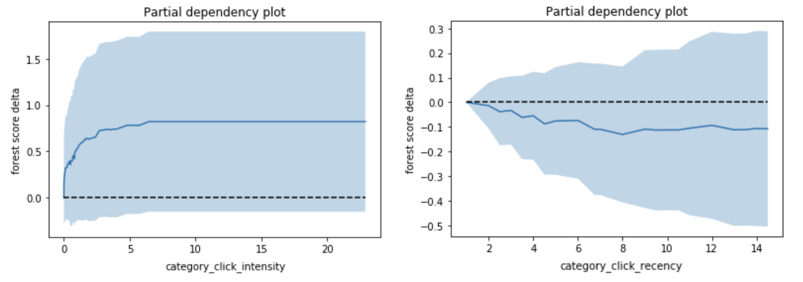
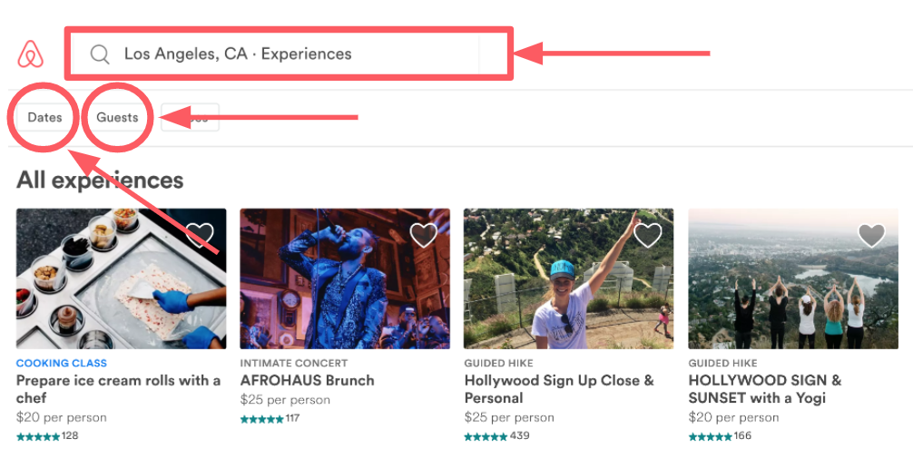
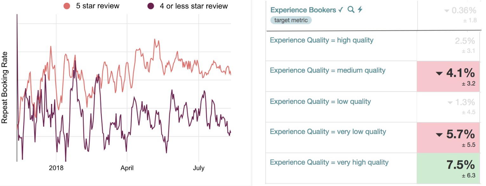
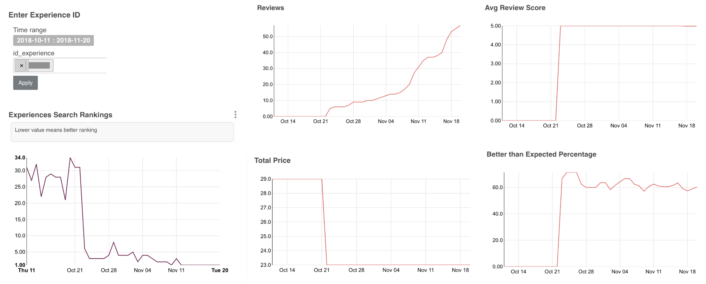
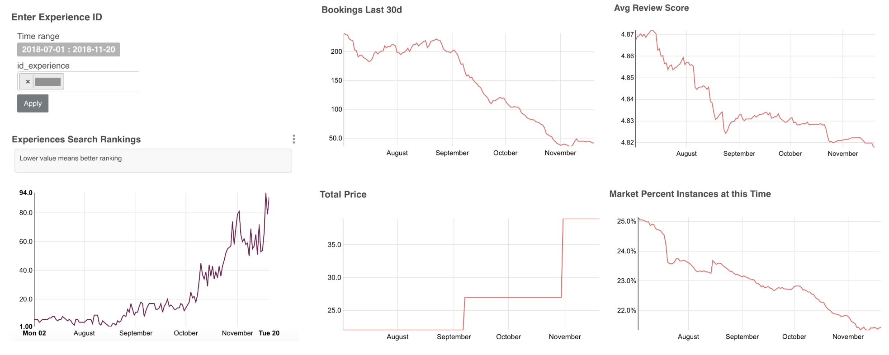
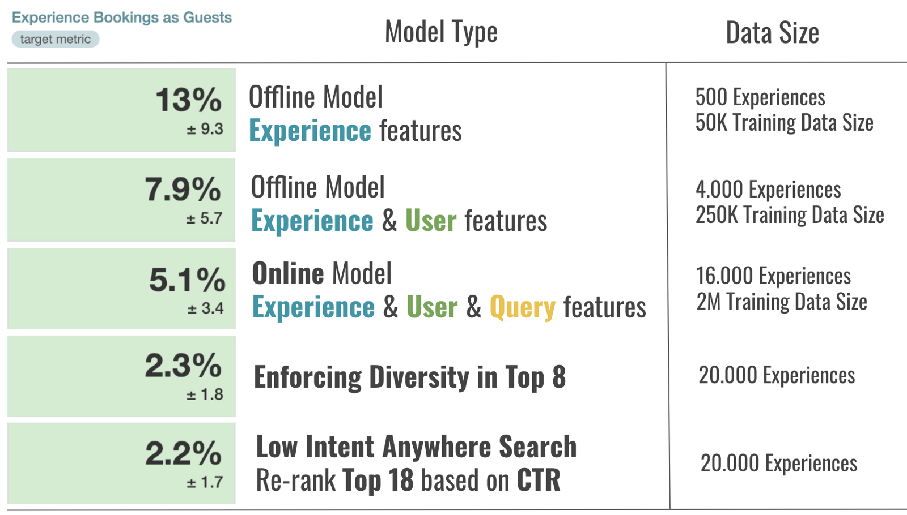

Machine Learning-Powered Search Ranking of Airbnb Experiences

# Machine Learning-Powered Search Ranking of Airbnb Experiences

## How we built and iterated on a machine learning Search Ranking platform for a new two-sided marketplace and how we helped it grow.

[Mihajlo Grbovic](https://medium.com/@mihajlo.grbovic)
Feb 5·20 min read
Mihajlo Grbovic, Eric Wu, Pai Liu, Chun How Tan, Liang Wu, Bo Yu, Alex Tian

Airbnb Experiences are handcrafted activities designed and led by expert hosts that offer a unique taste of local scene and culture. Each experience is vetted for quality by a team of editors before it makes its way onto the platform.

We launched Airbnb Experiences in November 2016 with 500 Experiences in 12 cities worldwide. During 2017, we grew the business to 5,000 Experiences in 60 cities. In 2018, the rapid growth continued, and we managed to bring Experiences to more than 1,000 destinations, including unique places like Easter Island, Tasmania, and Iceland. We finished the year strong with more than 20,000 active Experiences.

As the number of Experiences grew, Search & Discoverability as well as Personalization have become very important factors for the growth and success of the marketplace.

In this blog post, we describe the stages of our Experience Ranking development using machine learning at different growth phases of the marketplace, from small to mid-size and large.

The first three stages of our Search Ranking Machine Learning model

The main take-away is that machine learning-based Search Ranking works at every stage, given that we pick the model and infrastructure with the right level of complexity for the amount of data available and the size of the inventory that needs to be ranked. Very complex models will not work well when trained with small amounts of data, and simple baselines are sub-optimal when large amounts of training data are available.

### Stage 1: Build a Strong Baseline

When Airbnb Experiences launched, the amount of Experiences that needed to be ranked in Search was small, and we just started collecting data on user interactions with Experiences (impressions, clicks, and bookings). At that moment, the best choice was to just randomly re-rank Experiences daily, until a small dataset is collected for development of the Stage 1 ML model.

**Collecting training data:** To train our first machine learning model for ranking Experiences, we collected search logs (i.e. clicks) of users who ended up making bookings.

**Training Data Collection: **Search session clicks from users who eventually made bookings

**Labeling training data: **When labeling training data, we were mainly interested in two labels: *experiences that were booked* (which we treated as positive labels) and *experiences that were clicked but not booked* (which we treated as negative labels). In this manner, we collected a training dataset of **50,000 examples**.

**Building signals based on which we will rank**: In Stage 1 of our ML model, we decided to rank solely based on *Experience Features. *In total we built 25 features, some of which were:

- •**Experience duration **(e.g. 1h, 2h, 3h, etc.)
- •**Price **and **Price-per-hour**
- •**Category **(e.g. cooking class, music, surfing, etc.)
- •**Reviews** (rating, number of reviews)
- •**Number of bookings **(last 7 days, last 30 days)
- •**Occupancy of past and future instances **(e.g. 60%)
- •**Maximum number of seats **(e.g. max 5 people can attend)
- •**Click-through rate**

**Training the ranking model: **Given the training data, labels, and features, we used the [**Gradient Boosted Decision Tree**](https://github.com/yarny/gbdt) (GBDT) model. At this point we treated the problem as *binary classification* with *log-loss loss function*.

When using GBDT, one does not need to worry much about scaling the feature values, or missing values (they can be left as is). However, one important factor to take into account is that, unlike in a linear model, using raw counts as features in a tree-based model to make tree traversal decisions may be problematic when those counts are prone to change rapidly in a fast growing marketplace. In that case, it is better to use ratios of fractions. For example, instead of using booking counts in the last 7 days (e.g. 10 bookings), it is better to use fractions of bookings, e.g. relative to the number of eyeballs (e.g. 12 bookings per 1000 viewers).

**Testing the ranking model: **To perform offline hyper-parameter tuning and comparison to random re-ranking in production, we used hold-out data which was not used in training. Our choice of metrics were [AUC](https://en.wikipedia.org/wiki/Receiver_operating_characteristic#Area_under_the_curve) and [NDCG](https://en.wikipedia.org/wiki/Discounted_cumulative_gain), which are standard ranking metrics. Specifically, we re-ranked the Experiences based on model scores (probabilities of booking) and tested where the booked Experience would rank among all Experiences the user clicked (the higher the better).

In addition, to get a sense of what a trained model learned, we plotted partial dependency plots for several most important Experience features. These plots showed what would happen to specific Experience ranking scores if we fix values of all but a single feature (the one we are examining). As it can be observed in the plots below, the model learned to utilize the features in the following manner:

- •Experiences with more bookings per 1k viewers will rank higher
- •Experiences with higher average review rating will rank higher
- •Experiences with lower prices will rank higher

Since offline testing often has too many assumptions, e.g. in our case it was limited to re-ranking what users clicked and not the entire inventory, we conducted an online experiment, i.e. A/B test, as our next step. We compared the Stage 1 ML model to the rule-based random ranking in terms of number of bookings. The results were very encouraging as we were able to **improve bookings by +13% **with the Stage 1 ML ranking model.

**Implementation details:** In this stage, our ML model was limited to using only *Experience Features, *and as a result, the ranking of Experiences was the same for all users. In addition, all query parameters (number of guests, dates, location, etc.) served only as filters for retrieval (e.g. fetch Paris Experiences available next week for 2 guests), and ranking of Experiences did not change based on those inputs.

Given such a simple setup, the entire ranking pipeline, including training and scoring, was implemented offline and ran daily in [Airflow](https://airflow.apache.org/). The output was just a complete ordering of all Experiences, i.e. an ordered list, which was uploaded to production machines and used every time a search was conducted to rank a subset of Experiences that satisfied the search criteria.

### Stage 2: Personalize

The next step in our Search Ranking development was to add the *Personalization* capability to our ML ranking model.

From the beginning, we knew that Personalization was going to play a big role in the ranking of Experiences because of the diversity of both the inventory and the guest interest.

Unlike our Home business, where two *Private Rooms* in the same city at a similar price point are very similar, two randomly chosen Experiences are likely to be very different, e.g. a *Cooking Class* vs. a *Surf Lesson*. At the same time, guests may have different interests and ideas of what they want to do on their trip, and it is our goal to capture that interest fast and serve the right content higher in search results.

We introduced two different types of personalization, mostly by doing feature engineering given collected data about users.

#### 1. Personalize based on booked Airbnb Homes

A large portion of Experience bookings (more than 50%) come from guests who already booked an Airbnb Home. Therefore, we have quite a bit of information we can use to build features for personalization:

- •**Booked Home location**
- •**Trip dates**
- •**Trip length**
- •**Number of guests**
- •**Trip price **(Below/Above Market)
- •**Type of trip: **Family, Business
- •**First trip or returning to location**
- •**Domestic / International trip**
- •**Lead days**

To give examples of features that can be built to guide ranking, we demonstrate two important ones:

- •*Distance between Booked Home and Experience. *Knowing Booked Home location (latitude and longitude) as well as Experience meeting location, we can compute their distance in miles. Data shows that users like convenience, i.e. large fraction of booked Airbnb Experiences are near booked Airbnb Home.
- •*Experience available during Booked Trip. *Given Home check-in and check-out dates, we have an idea on which dates the guest is looking to book Experiences and can mark Experiences as *available* or *not *during those dates.

These two features (in addition to others) were used when training the new ML ranking model. Below we show their partial dependency plots.

The plots confirmed that features behavior matches what we intuitively expected the model will learn, i.e. Experiences that are closer to Booked Home will rank higher (have higher scores), and Experiences that are available for Booked Trip dates will rank higher (which is very convenient because even in dateless search we can leverage trip dates).

#### 2. Personalize based on the user’s clicks

Given the user’s short-term search history, we can infer useful information that can help us personalize future searches:

- •**Infer user interest in certain categories: **For example, if the user is mostly clicking on *Music* Experiences we can infer that the user’s interest is in *Music*
- •**Infer the user’s time-of-day availability: **For example, if the user is mostly clicking on *Evening* Experiences we can infer that the user is available at that time of day

At the time they are published to the platform, each Experience is manually tagged with a category (e.g. hiking, skiing, horseback riding, etc.). This structured data gives us the ability to differentiate between types of Experiences. It also gives us the ability to create user interest profiles in each category by aggregating their clicks on different categories.

For this purpose, we compute two features derived from user clicks and categories of clicked Experiences:

**Category Intensity:** Weighted sum of user clicks on Experiences that have that particular category,

where the sum is over the last 15 days (d_0 to d_now) and *A* is the number of actions (in this case clicks) on certain category on day *d.*

**Category Recency: **Number of days that passed since the user last clicked on an Experience in that category.

Note that the user may have clicked on many different categories with different intensities and recencies, but when the feature is computed for a particular Experience that needs to be ranked, we use the intensity and recency of that Experience category.

To illustrate what our model learned for these two features, we show the partial dependency plots below. As it can be observed on the left side, Experiences in categories for which the user had high intensities will rank **higher. **At the same time, having the recency feature (on the right) allows the model to forget history as time goes by, and Experiences in categories that the user last clicked a long time ago will rank **lower.**

We built the same types of features (intensity & recency) for several different user actions, including wishlisting and booking a certain category.

**Time of Day Personalization: **Different Experiences are held at different times of day (e.g. early morning, evening, etc.). Similar to how we track clicks on different categories, we can also track clicks on different times of day and compute *Time of Day Fit *between the user’s time-of-day percentages and the Experience’s time of day, as described below.

As it can be observed, the model learned to use this feature in a way that ranks Experiences held at time of day that the user prefers higher.

**Training the ranking model:** To train the model with *Personalization *features, we first generated training data that contains those features by reconstructing the past based on search logs. By that time we already had a bigger inventory (4000 experiences) and were able to collect more training data (250K labeled examples) with close to 50 ranking features.

When creating personalization features it is *very important* not to “*leak the label,”* i.e. expose some information that happened after the event used for creating the label. Therefore, we only used user clicks that happened before bookings. In addition, to reduce leakage further, when creating training data we computed the personalization features only if the user interacted with more than one Experience and category (to avoid cases where the user clicked only one Experience / category, e.g. *Surfing*, and ended up booking that category).

Another important aspect to think about was that our search traffic contains searches by both *logged-in* and *logged-out* users. Considering this, we found it more appropriate to train **two models**, one with personalization features for *logged-in* users and one without personalization features that will serve *log-out* traffic. The main reason was that the *logged-in* model trained with personalization features relies too much on the presence of those features, and as such is not appropriate for usage on *logged-out* traffic.

**Testing the ranking model: **We conducted an A/B test to compare the new setup with 2 models with Personalization features to the model from Stage 1. The results showed that Personalization matters as we were able to **improve bookings by +7.9% **compared to the Stage 1 model.

**Implementation details:** To implement serving of the Stage 2 model in production, we chose a simple solution that required the least time to implement. We created a look-up table keyed off of user id that contained personalized ranking of all Experiences for that user, and use key 0 for ranking for logged-out users.

This required daily offline computation of all these rankings in [Airflow](https://airflow.apache.org/) by computing the latest features and scoring the two models to produce rankings. Because of the high cost involved with pre-computing personalized rankings for all users (*O*(*NM*), where *N* is the number of users and *M* is the number of Experiences), we limited *N* to only 1 million most active users.

The personalization features at this point were computed only daily, which means that we have up to one day latency (also a factor that can be greatly improved with more investment in infrastructure).

Stage 2 implementation was a temporary solution used to validate personalization gains before we invest more resources in building an ***Online Scoring Infrastructure*** in Stage 3, which was needed as both *N* and *M* are expected to grow much more.

### Stage 3: Move to Online Scoring

After we demonstrated significant booking gains from iterating on our ML ranking model and after inventory and training data grew to the extent where training a more complex model is possible, we were ready to invest more engineering resources to build an *Online Scoring Infrastructure* and target more booking gains.

Moving to *Online Scoring* also unlocks a whole new set of features that can be used: *Query Features *(highlighted in image below).

This means that we would be able to use the entered *location*, *number of guests*, and *dates* to engineer more features.

For example, we can use the entered *location*, such as city, neighborhood, or place of interest, to compute *Distance between Experience and Entered Location*. This feature helps us rank those Experiences closer to entered location higher.

In addition, we can use the entered *number of guests* (singles, couple, large group) to calculate how it relates to the number of guests in an average booking of Experience that needs to be ranked. This feature helps us rank better fit Experiences higher.

In the online setting, we are also able to leverage the user’s *browser language *setting to do language personalization on the fly. Some Experiences are offered and translated in multiple languages. If the browser setting language translation is available, that one is displayed. With ranking in the online world we can take it a step further and rank language-matching Experiences higher by engineering a feature that determines if the *Experience is offered in Browser Language*. In the image below we show an example of Stage 3 ML model ranking Experiences offered in Russian higher when browser language is Russian.

Finally, in the online setting we also know the Country which the user is searching from. We can use the country information to personalize the Experience ranking based on Categories preferred by users from those countries. For example, historical data tells us that when visiting Paris users from Japan prefer experiences involving *French Cuisine* as well as *Perfume Making*. We used this information to engineer several personalization features at the Origin — Destination level.

**Training the ranking model: **To train the model with *Query Features* we first added them to our historical training data. The inventory at that moment was 16,000 Experiences and we had more than 2 million labeled examples to be used in training with a total of 90 ranking features. As mentioned before, we trained two GBDT models:

- •**Model for logged-in users***, *which*  *uses *Experience Features*, *Query Features, *and *User (Personalization) Features*
- •**Model for logged-out traffic**, which*  *uses* Experience & Query Features, *trained using data (clicks & bookings) of logged-in users but not considering *Personalization Features*

The advantage of having an online scoring infrastructure is that we can use *logged-in* model for **far more** uses than before, because there is no need to pre-compute personalized rankings as we did in Stage 2. We used the *logged-in *model whenever personalization signals were available for a particular user id, else we fall back to using *logged-out *model.

**Testing the ranking model: **We conducted an A/B test to compare the Stage 3 models to Stage 2 models. Once again, we were able to **grow the bookings, this time by +5.1%**.

**Implementation details: **To implement online scoring of thousands of listings in real time, we have built our own ML infra in the context of our search service. There are mainly three parts of the infrastructure, 1) getting model input from various places in real time, 2) model deployment to production, and 3) model scoring.

The model requires three types of signals to conduct scoring: *Experience Features*, *Query Features, *and *User Features*. Different signals were stored differently depending on their size, update frequency, etc. Specifically, due to their large size (hundreds of millions of user keys), the *User Features *were stored in an *online key-value store *and*  *search server boxes can look them up when a user does the search. The *Experience Features* are on the other hand not that large (tens of thousands of Experiences), and as such can be stored in memory of the search server boxes and read directly from there. Finally, the *Query Features *are not stored at all, and they are just read as they come in from the front end.

*Experience and User Features *are both updated daily as the Airflow pipeline feature generation job finishes. We are working on transitioning some of the features to the online world, by using a key-value store that has both read and write capabilities which would allow us to update the features instantly as more data comes in (e.g. new experience reviews, new user clicks, etc.).

In the model deployment process, we transform the GBDT model file, which originally came from our training pipeline in JSON format, to an internal Java GBDT structure, and load it within the search service application when it starts.

During the scoring stage, we first pull in all the features (*User, Experience, and Query Features*) from their respective locations and concatenate them in a vector used as input to the model. Next, depending on if *User Features* are empty or not we decide which model to use, i.e. *logged-out* or *logged-in* model, respectively. Finally, we return the model scores for all Experiences and rank them on the page in descending order of the scores.

### Stage 4: Handle Business Rules

Up to this point our ranking model’s objective was to grow bookings. However, a marketplace such as Airbnb Experiences may have several other secondary objectives, as we call them *Business Rules, *that we can help achieve through machine learning*.*

One such important Business Rule is to **Promote*  *Quality**. From the beginning we believed that if guests have a really good experience they will come back and book Experiences again in the near future. For that reason, we started collecting feedback from users in terms of 1) star ratings, ranging from 1 to 5, and 2) additional structured multiple-response feedback on whether the Experience was *unique, better than expected, engaging, etc.*

As more and more data became available to support our rebooking hypothesis, the trend became more clear. As it can be observed on the left in the figure below, guests who have had a great experience (leave a 5-star rating) are 1.5x more likely to rebook another Experience in the next 90 days compared to guests who have had a less good time (leave 4 star rating or lower).

This motivated us to experiment with our objective function, where we changed our binary classification (+1 = booked, -1 = click & not booked) to introduce weights in training data for different quality tiers (e.g. highest for very high quality bookings, lowest for very low quality bookings). The quality tiers were defined by our Quality Team via data analysis. For example:

- •*very high quality* Experience is one with >50 reviews, >4.95 review rating and >55% guests saying the Experience was *unique* and *better than expected.*
- •*very low quality *Experience*  *is one with*  *>10 reviews, <4.7 review rating.

When testing the model trained in such a way the A/B test results (on the right in the figure above) showed that we can leverage machine learning ranking to get more of v*ery high quality *bookings and less of v*ery low quality bookings*, while keeping the overall bookings neutral.

In a similar way, we successfully tackled several other secondary objectives:

- •**Discovering and promoting potential *new*  *hits *early** using cold-start signals and promoting them in ranking (this led to **+14% booking gain for *new hits****  *and*  *neutral overall bookings)
- •**Enforcing diversity** in the **top 8 results **such that we can show the diverse set of categories, which is especially important for low-intent traffic (this led to **+2.3% overall booking gain**).
- •**Optimize Search without Location for Clickability **For *Low Intent* users that land on our webpage but do not search with specified location we think a different objective should be used. Our first attempt was to choose the *Top 18* from *all locations* based on our ranking model scores and then **re-rank** based on **Click-through-rate** (this led to **+2.2% overall booking gain **compared to scenario where we do not re-rank based on CTR).

### Monitoring and Explaining Rankings

For any two-sided marketplace it is very important to be able to explain why certain items rank the way they do.

In our case it is valuable because we can:

- •Give hosts concrete feedback on what factors lead to improvement in the ranking and what factors lead to decline.
- •Keep track of the general trends that the ranking algorithm is enforcing to make sure it is the behavior we want to have in our marketplace.

To build out this capability we used [Apache Superset](https://superset.incubator.apache.org/) and [Airflow](https://airflow.apache.org/) to create two dashboards:

- •Dashboard that tracks rankings of specific Experiences in their market over time, as well as values of feature used by the ML model.
- •Dashboard that shows overall ranking trends for different groups of Experiences (e.g. how 5-star Experiences rank in their market).

To give an idea of why these types of dashboards can be useful we give several examples in the figures that follow.

In the figure below we show an example of an Experience whose ranking (left panel) **improved **from position 30 to position 1 (top ranked). To explain why, we can look at the plots that track various statistics of that Experience (right panel), which are either directly used as features in the ML model or used to derive features.

Example explaining why the ranking of a particular Experience improved over time

It can clearly be observed that the ranking improved because number of reviews grew from 0 to 60, while maintaining a 5.0 review rating and >60% users said the Experience was better than expected. In addition, the host lowered the price, which may also have lead to the improvement of ranking.

In the next figure we show an example of an Experience whose ranking **degraded **from position 4 to position 94. Once more, the signals which the ranking model uses as input can tell the story.

Example explaining why the ranking of a particular Experience degraded over time

The Experience started getting bad reviews (avg. rating reduced from 4.87 to 4.82), host increased the price by $20, and overall booking numbers decreased. In addition, in that market the time of day that Experience is held at (early morning) became less and less popular (slight seasonality effect). All these factors combined lead to the ranking decline.

The dashboard was particularly useful for our Market Managers who are in frequent contact with hosts.

In addition, to be able to track what kind of ranking behavior we are enforcing it was useful for us to look at how certain groups of Experiences rank in their markets. In the figure below we show a snapshot of our dashboard where we can track average ranking (lower is better) of different dimensions.

For example, the left plot shows that Experiences with >50 reviews rank much better than experiences with 10–30 reviews. Looking at the other two plots we can see that on average Experiences with review rating of >4.9 rank the best (much better than ones with lower average rating) and that Experiences for which >55% users say their experience was unique rank much better than non-unique Experiences.

This type of dashboard is useful for making business decisions and modifications to the ranking algorithm to enforce better behaviors. For example, based on the figure that shows ranking trends of different price range groups (shown below) we noticed that very low price Experiences have too big of an advantage in ranking. We decided to try to reduce that advantage by removing price as one of the signals used by the ranking model.

The result of removing the price and retraining the model was that the difference in ranking reduced (after July 1st), without hurting overall bookings. This demonstrates the usefulness of reporting and how ranking can be manipulated using machine learning to achieve desired ranking behavior.

### Ongoing and Future Work

In our ongoing and future work, we are iterating on

- •**Training data construction** (by logging the feature values at the time of scoring instead of reconstructing them based on best guess for that day)
- •**Loss function** (e.g. by using pairwise loss, where we compare booked Experience with Experience that was ranked higher but not booked, a setup that is far more appropriate for ranking)
- •**Training labels** (e.g. by using utilities instead of binary labels, i.e. assigning different values to different user actions, such as: 0 for impression, 0.1 for click, 0.2 for click with selected date & time, 1.0 for booking, 1.2 for high quality booking)
- •**Adding more real-time signals** (e.g. being able to personalize based on immediate user activities, i.e. clicks that happened 10 minutes ago instead of 1 day ago)
- •**Explicitly asking users about types of activities they wish to do on their trip **(so we can personalize based on declared interest in addition to inferred ones)
- •**Tackling position bias** that is present in the data we use in training
- •**Optimizing for additional secondary objectives**, such as helping hosts who host less often than others (e.g. 1–2 a month) and hosts who go on vacation and come back
- •**Testing different models **beyond GBDT
- •**Finding more types of supply that work well in certain markets **by leveraging predictions of the ranking model.
- •**Explore/Exploit framework**
- •**Test human-in-the-loop approach **(e.g. Staff picks)

We will update the readers on what worked and what did not as we continue to push the limits of Experience Ranking towards growing our marketplace.

### Summary of Business Impact so far

We leave you with the summary of the booking impact our team made thus far with the experiments that were discussed in the blog post.

The main take-away is: “*Don’t wait until you have big data, you can do quite a bit with small data to help grow and improve your business.*”