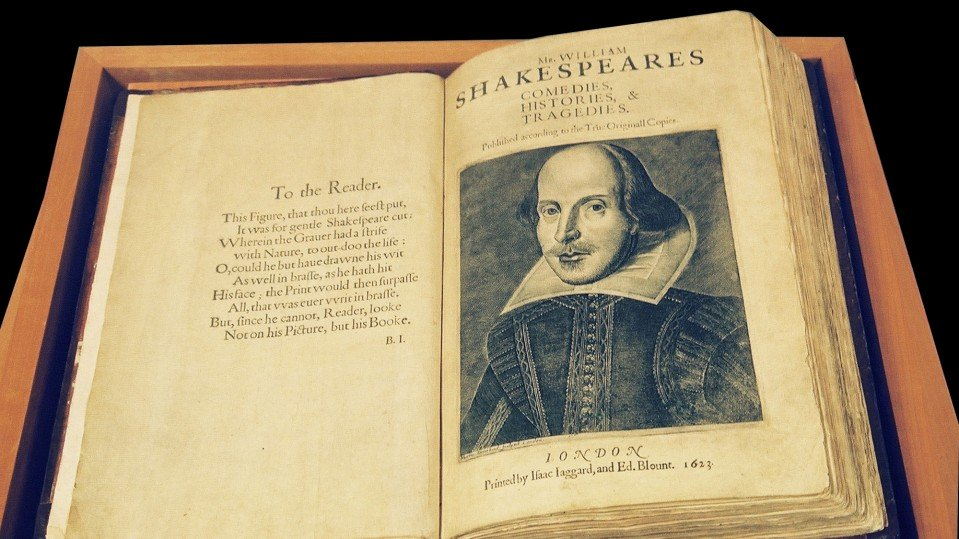
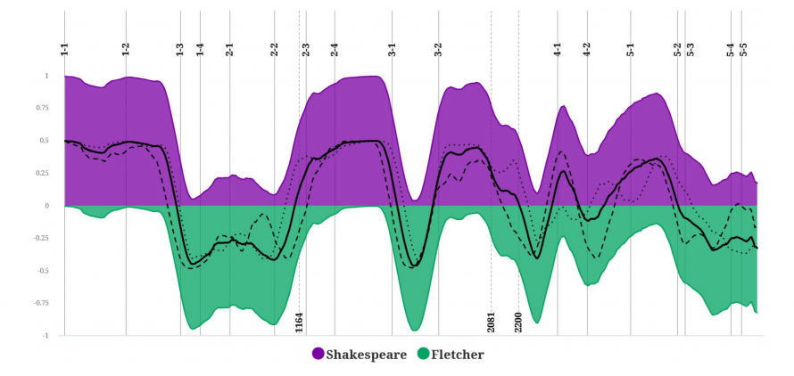

Machine learning has revealed exactly how much of a Shakespeare play was written by someone else - MIT Technology Review

### [Humans and Technology](https://www.technologyreview.com/humans-and-technology/)

# Machine learning has revealed exactly how much of a Shakespeare play was written by someone else

## Literary analysts have long noticed the hand of another author in Shakespeare’s *Henry VIII*. Now a neural network has identified the specific scenes in question—and who actually wrote them.

by [Emerging Technology from the arXiv](https://www.technologyreview.com/profile/emerging-technology-from-the-arxiv/)

Nov 22, 2019

AP

![](data:image/svg+xml,%3csvg xmlns='http://www.w3.org/2000/svg' viewBox='0 0 58 60.1' class='jsx-3449101280 js-evernote-checked' data-evernote-id='531'%3e%3cg class='jsx-3449101280 js-evernote-checked' data-evernote-id='532'%3e%3cg class='jsx-3449101280 js-evernote-checked' data-evernote-id='533'%3e%3cg class='jsx-3449101280 js-evernote-checked' data-evernote-id='534'%3e%3cg class='jsx-3449101280 js-evernote-checked' data-evernote-id='535'%3e%3cg class='jsx-3449101280 js-evernote-checked' data-evernote-id='536'%3e%3cpolyline points='42.6%2c18.5 55.9%2c58.6 43.3%2c58.6 39.7%2c49.6 18.9%2c49.6 15.4%2c58.6 2.1%2c58.6 6.7%2c46.2' class='jsx-3449101280 st0 js-evernote-checked' data-evernote-id='537'%3e%3c/polyline%3e%3cg class='jsx-3449101280 js-evernote-checked' data-evernote-id='538'%3e%3cpath d='M38.9%2c19.9c-0.7-2.1%2c0.4-4.3%2c2.5-5c2.1-0.7%2c4.3%2c0.4%2c5%2c2.5c0.7%2c2.1-0.4%2c4.3-2.5%2c5 C41.8%2c23.1%2c39.6%2c22%2c38.9%2c19.9z' class='jsx-3449101280 st1 js-evernote-checked' data-evernote-id='539'%3e%3c/path%3e%3c/g%3e%3cg class='jsx-3449101280 js-evernote-checked' data-evernote-id='540'%3e%3cpath d='M10.3%2c47.7c0.7-2-0.3-4.3-2.4-5.1c-2-0.7-4.3%2c0.3-5.1%2c2.4c-0.7%2c2%2c0.3%2c4.3%2c2.4%2c5.1 C7.3%2c50.8%2c9.6%2c49.8%2c10.3%2c47.7z' class='jsx-3449101280 st1 js-evernote-checked' data-evernote-id='541'%3e%3c/path%3e%3c/g%3e%3c/g%3e%3c/g%3e%3c/g%3e%3cg class='jsx-3449101280 js-evernote-checked' data-evernote-id='542'%3e%3cg class='jsx-3449101280 js-evernote-checked' data-evernote-id='543'%3e%3cpolyline points='37.4%2c39.6 29.9%2c12.5 29.7%2c12.5 22.3%2c38.4 29%2c38.4' class='jsx-3449101280 st0 js-evernote-checked' data-evernote-id='544'%3e%3c/polyline%3e%3cg class='jsx-3449101280 js-evernote-checked' data-evernote-id='545'%3e%3cpath d='M41.1%2c38.3c0.6%2c2.1-0.7%2c4.3-2.8%2c4.9s-4.3-0.7-4.9-2.8c-0.6-2.1%2c0.7-4.3%2c2.8-4.9 C38.4%2c35%2c40.5%2c36.2%2c41.1%2c38.3z' class='jsx-3449101280 st1 js-evernote-checked' data-evernote-id='546'%3e%3c/path%3e%3c/g%3e%3c/g%3e%3c/g%3e%3cg class='jsx-3449101280 js-evernote-checked' data-evernote-id='547'%3e%3cg class='jsx-3449101280 js-evernote-checked' data-evernote-id='548'%3e%3cpolyline points='10.8%2c34.3 22.6%2c1.5 36.2%2c1.5 38.4%2c7.5' class='jsx-3449101280 st0 js-evernote-checked' data-evernote-id='549'%3e%3c/polyline%3e%3cg class='jsx-3449101280 js-evernote-checked' data-evernote-id='550'%3e%3cpath d='M14.5%2c35.5c-0.7%2c2.1-3%2c3.1-5.1%2c2.4c-2.1-0.7-3.1-3-2.4-5.1c0.7-2.1%2c3-3.1%2c5.1-2.4 C14.2%2c31.2%2c15.3%2c33.4%2c14.5%2c35.5z' class='jsx-3449101280 st1 js-evernote-checked' data-evernote-id='551'%3e%3c/path%3e%3c/g%3e%3cg class='jsx-3449101280 js-evernote-checked' data-evernote-id='552'%3e%3cpath d='M34.6%2c8.6c0.7%2c2.1%2c3%2c3.1%2c5.1%2c2.4c2.1-0.7%2c3.1-3%2c2.4-5.1c-0.7-2.1-3-3.1-5.1-2.4 C34.9%2c4.3%2c33.9%2c6.6%2c34.6%2c8.6z' class='jsx-3449101280 st1 js-evernote-checked' data-evernote-id='553'%3e%3c/path%3e%3c/g%3e%3c/g%3e%3c/g%3e%3c/g%3e%3c/g%3e%3c/svg%3e)

#### Sign up for **The Algorithm** — artificial intelligence, demystified

Also stay updated on MIT Technology Review initiatives and events?
YesNo

For much of his life, William Shakespeare was the house playwright for an acting company called the King’s Men that performed his plays on the banks of the River Thames in London. When Shakespeare died in 1616, the company needed a replacement and turned to one of the most prolific and famous playwrights of the time, a man named John Fletcher.

Fletcher’s fame has since quelled. But in 1850, a literary analyst named James Spedding noticed a remarkable similarity between Fletcher’s plays and passages in Shakespeare’s *Henry VIII*. Spedding concluded that Fletcher and Shakespeare must have collaborated on the play.

The evidence comes from studies of each author’s linguistic idiosyncrasies and how they crop up in *Henry VIII*. For example, Fletcher often writes *ye* instead of *you,* and *’em* instead of *them.* He also tended to add the word *sir* or *still* or *next* to a standard pentameter line to create an extra sixth syllable.

These characteristics allowed Spedding and other analysts to suggest that Fletcher must have been involved. But exactly how the play was divided is highly disputed. And other critics have suggested that another English dramatist, Philip Massinger, was actually Shakespeare’s coauthor.

Which is why analysts and historians would dearly love to determine, once and for all, who wrote which parts of *Henry VIII*.

Enter Petr Plecháč at the Czech Academy of Sciences in Prague, who says he has solved the problem using machine learning to identify the authorship of more or less every line of the play. “Our results highly support the canonical division of the play between William Shakespeare and John Fletcher proposed by James Spedding,” says Plecháč.

The new approach is straightforward in principle. Machine-learning algorithms have been used for some years to identify distinctive patterns in the way authors write.

The technique uses a body of the author’s work to train the algorithm and a different, smaller body of work to test it on. However, because an author’s literary style can change throughout his or her lifetime, it is important to ensure that all works have the same style.

Once the algorithm has learned the style in terms of the most commonly used words and rhythmic patterns, it is able to recognize it in texts it has never seen.

Plecháč follows exactly this technique. He first trains the algorithm to recognize Shakespeare’s style using other plays written at the same time as *Henry VIII. *These plays are *The Tragedy of Coriolanus*, *The Tragedy of Cymbeline*, *The Winter’s Tale*, and *The Tempest*.

He then trains the algorithm to recognize the work of John Fletcher using plays he wrote at this time—*Valentinian*, *Monsieur Thomas*, *The Woman’s Prize*, and *Bonduca*.

Finally, he lets the algorithm loose on *Henry VIII* and asks it to determine the author of the text, using a rolling window technique to scroll through the play.

The results are interesting. They tend to agree with Spedding’s analysis that Fletcher wrote scenes amounting to almost half the play. However, the algorithm allows a more fine-grained approach that reveals how the authorship sometimes changes not just for new scenes, but also towards the end of previous ones. For example, in Act 3, Scene 2, the model suggests a mixed authorship after line 2081 and finds that Shakespeare takes over completely at line 2200, before the start of Act 4, Scene 1.

Plecháč also trained his model to recognize the work of Philip Massinger but finds little evidence of his involvement. “The participation of Philip Massinger is rather unlikely,” he concludes.

That’s interesting work that shows how linguists and literary analysts are using machine learning to better understand our literary past.

However, there is much work ahead. For example, when machine vision algorithms were trained to recognize artistic style, computer scientists quickly worked out how to extract a style and apply it to other images, using a technique known as neural style transfer. [Overnight, it became possible to give an ordinary photograph the style of a Van Gogh or a Monet.](https://www.technologyreview.com/s/601424/algorithm-clones-van-goghs-artistic-style-and-pastes-it-onto-other-images-movies/)

That raises the question of whether a similar technique is possible for text. Might it be possible to transform an essay, or indeed an article for MIT Technology Review, into the style of Shakespeare or John Fletcher, for example?

Sadly, not yet, other than in the trivial way of replacing word like *them* with *’em *and so on. This is largely because the underlying structure of communication is not well enough understood by linguists or their algorithmic charges.

Ref: [arxiv.org/abs/1911.05652](http://arxiv.org/abs/1911.05652) : Relative contributions of Shakespeare and Fletcher in Henry VIII: An Analysis Based on Most Frequent Words and Most Frequent Rhythmic Patterns' class='jsx-671803276 js-evernote-checked' data-evernote-id='637'%3e%3c/path%3e%3c/svg%3e)

Share

[**](https://www.facebook.com/dialog/share?app_id=140586622674265&display=popup&title=Machine%20learning%20has%20revealed%20exactly%20how%20much%20of%20a%20Shakespeare%20play%20was%20written%20by%20someone%20else&description=Literary%20analysts%20have%20long%20noticed%20the%20hand%20of%20another%20author%20in%20Shakespeare%E2%80%99s%20Henry%20VIII.%20Now%20a%20neural%20network%20has%20identified%20the%20specific%20scenes%20in%20question%E2%80%94and%20who%20actually%20wrote%20them.&href=https%3A%2F%2Fwww.technologyreview.com%2Fs%2F614742%2Fmachine-learning-has-revealed-exactly-how-much-of-a-shakespeare-play-was-written-by-someone%2F%3Futm_campaign%3Dsite_visitor.unpaid.engagement%26utm_source%3Dfacebook%26utm_medium%3Dsocial_share%26utm_content%3D2019-12-06)

[**](https://twitter.com/intent/tweet?text=Machine%20learning%20has%20revealed%20exactly%20how%20much%20of%20a%20Shakespeare%20play%20was%20written%20by%20someone%20else%20-%20via%20%40techreview&url=https%3A%2F%2Fwww.technologyreview.com%2Fs%2F614742%2Fmachine-learning-has-revealed-exactly-how-much-of-a-shakespeare-play-was-written-by-someone%2F%3Futm_campaign%3Dsite_visitor.unpaid.engagement%26utm_source%3Dtwitter%26utm_medium%3Dsocial_share%26utm_content%3D2019-12-06)

[**](https://reddit.com/submit?text=Machine%20learning%20has%20revealed%20exactly%20how%20much%20of%20a%20Shakespeare%20play%20was%20written%20by%20someone%20else&url=https%3A%2F%2Fwww.technologyreview.com%2Fs%2F614742%2Fmachine-learning-has-revealed-exactly-how-much-of-a-shakespeare-play-was-written-by-someone%2F%3Futm_campaign%3Dsite_visitor.unpaid.engagement%26utm_source%3Dreddit%26utm_medium%3Dsocial_share%26utm_content%3D2019-12-06)

[**](https://linkedin.com/shareArticle?text=Machine%20learning%20has%20revealed%20exactly%20how%20much%20of%20a%20Shakespeare%20play%20was%20written%20by%20someone%20else&url=https%3A%2F%2Fwww.technologyreview.com%2Fs%2F614742%2Fmachine-learning-has-revealed-exactly-how-much-of-a-shakespeare-play-was-written-by-someone%2F%3Futm_campaign%3Dsite_visitor.unpaid.engagement%26utm_source%3Dlinkedin%26utm_medium%3Dsocial_share%26utm_content%3D2019-12-06&summary=Literary%20analysts%20have%20long%20noticed%20the%20hand%20of%20another%20author%20in%20Shakespeare%E2%80%99s%20Henry%20VIII.%20Now%20a%20neural%20network%20has%20identified%20the%20specific%20scenes%20in%20question%E2%80%94and%20who%20actually%20wrote%20them.)

[**](https://api.whatsapp.com/send?text=Machine%20learning%20has%20revealed%20exactly%20how%20much%20of%20a%20Shakespeare%20play%20was%20written%20by%20someone%20else%20https%3A%2F%2Fwww.technologyreview.com%2Fs%2F614742%2Fmachine-learning-has-revealed-exactly-how-much-of-a-shakespeare-play-was-written-by-someone%2F%3Futm_campaign%3Dsite_visitor.unpaid.engagement%26utm_source%3Dwhatsapp%26utm_medium%3Dsocial_share%26utm_content%3D2019-12-06)

[**](https://www.technologyreview.com/s/614742/machine-learning-has-revealed-exactly-how-much-of-a-shakespeare-play-was-written-by-someone/mailto:?subject=Machine%20learning%20has%20revealed%20exactly%20how%20much%20of%20a%20Shakespeare%20play%20was%20written%20by%20someone%20else&body=From%20MIT%20Technology%20Review%3A%0A%0AMachine%20learning%20has%20revealed%20exactly%20how%20much%20of%20a%20Shakespeare%20play%20was%20written%20by%20someone%20else%0ALiterary%20analysts%20have%20long%20noticed%20the%20hand%20of%20another%20author%20in%20Shakespeare%E2%80%99s%20Henry%20VIII.%20Now%20a%20neural%20network%20has%20identified%20the%20specific%20scenes%20in%20question%E2%80%94and%20who%20actually%20wrote%20them.%0A%0Ahttps%3A%2F%2Fwww.technologyreview.com%2Fs%2F614742%2Fmachine-learning-has-revealed-exactly-how-much-of-a-shakespeare-play-was-written-by-someone%2F%3Futm_campaign%3Dsite_visitor.unpaid.engagement%26utm_source%3Demail%26utm_medium%3Dsocial_share%26utm_content%3D2019-12-06)

Link

Author

[Emerging Technology from the arXiv](https://www.technologyreview.com/profile/emerging-technology-from-the-arxiv/)

Popular

- 01.

[A new way to make quadratic equations easy](https://www.technologyreview.com/s/614775/a-new-way-to-make-quadratic-equations-easy/)

- 02.

[Why kids don’t trust Alexa](https://www.technologyreview.com/s/614863/why-kids-dont-trust-alexa/)

- 03.

[Why the rise of the app has put thousands of people in the hospital](https://www.technologyreview.com/f/614861/why-the-rise-of-the-iphone-app-has-put-thousands-of-people-in-hospital/)