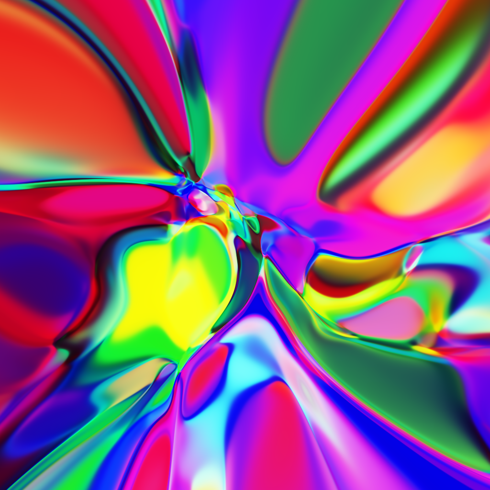
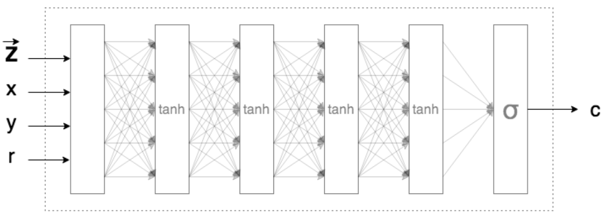
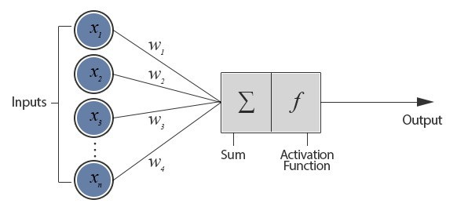
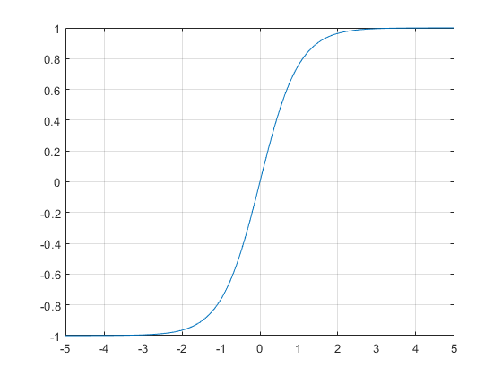
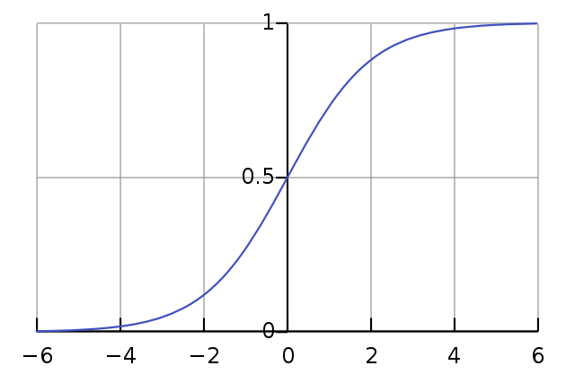
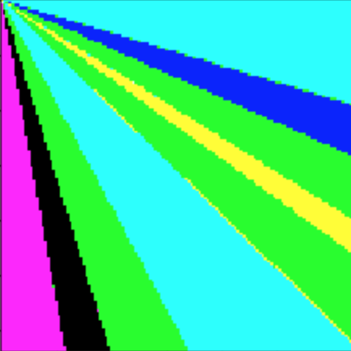
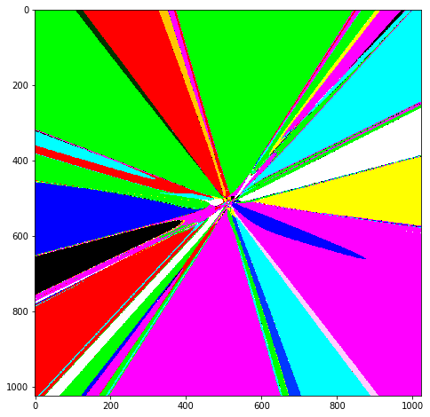
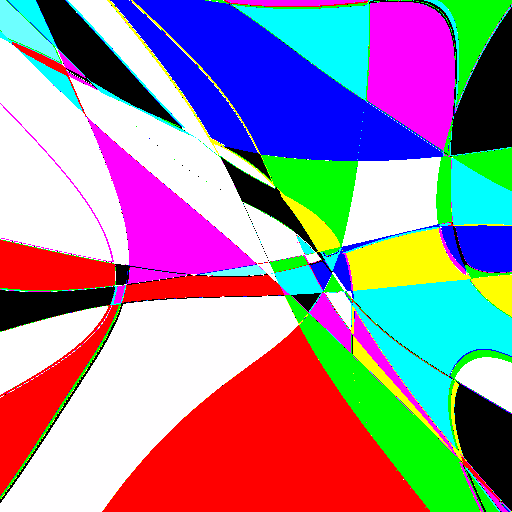
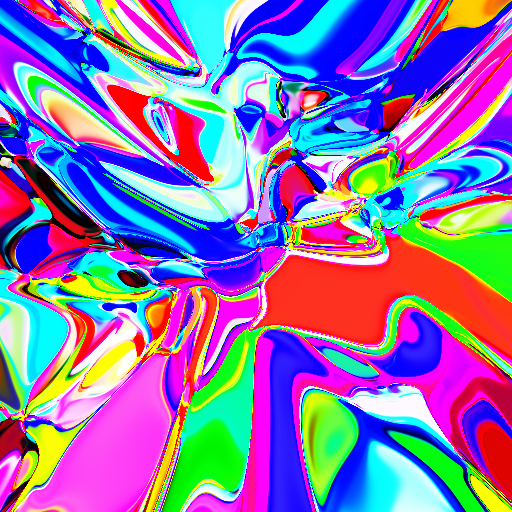

Making deep neural networks paint to understand how they work

# Making deep neural networks paint to understand how they work

[Paras Chopra](https://towardsdatascience.com/@paraschopra)
Feb 4·10 min read

It’s a mystery that deep learning works so well. Even though there are [several hints](https://www.youtube.com/watch?v=Y-WgVcWQYs4) about [why deep neural networks are so effective](https://www.reddit.com/r/MachineLearning/comments/abj1mc/d_notes_on_why_deep_neural_networks_are_able_to/), the truth is that nobody is entirely sure and theoretical understanding of deep learning is very much an active area of research.

In this tutorial, we’ll scratch a tiny aspect of the problem in an unusual manner. We will make neural networks paint abstract images for us, and then we will interpret those images to develop a better intuition on what might be happening under the hood. Also, as a bonus, by the end of the tutorial, you’ll be able to generate images such as the following (everything is less than 100 lines of PyTorch code. Check out the [accompanying Jupyter notebook here](https://github.com/paraschopra/abstract-art-neural-network)):

My neural network wants to be a painter when it grows up.

#### How was this image generated?

This image was generated by a simple architecture called [Compositional Pattern Producing Networks](https://en.wikipedia.org/wiki/Compositional_pattern-producing_network) (CPPN) which I got introduced to via [this blog post](http://blog.otoro.net/2015/06/19/neural-network-generative-art/). In that blog post, the author generates abstract images via neural networks written in JavaScript. [My code](https://github.com/paraschopra/abstract-art-neural-network) implements them in PyTorch.

One way to generate images via neural networks is to have them output the full image in one go, say something like the following where the neural network called “Generator” takes random noise as inputs and produces the entire image in the output layer (with the size of width*height).

Image via [A Short Introduction to Generative Adversarial Networks](https://sthalles.github.io/intro-to-gans/)

In contrast to outputting the entire image, CPPNs (the architecture we’re going to explore) output the color of the pixel at a given position (that’s fed into it as an input).

Image via [Generating Abstract Patterns with TensorFlow](http://blog.otoro.net/2016/03/25/generating-abstract-patterns-with-tensorflow/)

Ignore z and r in the image above and notice that the network is taking in **x**, **y** coordinates of the pixel and outputting what color (represented by **c**) should that pixel be. The PyTorch model for such a network would look like this:

|     |     |
| --- | --- |
| 1   | class  NN(nn.Module): |
| 2   |     |
| 3   |  def  __init__(self): |
| 4   |  super(NN, self).__init__() |
| 5   |  self.layers = nn.Sequential(nn.Linear(2, 16, bias=True), |
| 6   | nn.Tanh(), |
| 7   | nn.Linear(16, 16, bias=False), |
| 8   | nn.Tanh(), |
| 9   | nn.Linear(16, 16, bias=False), |
| 10  | nn.Tanh(), |
| 11  | nn.Linear(16, 16, bias=False), |
| 12  | nn.Tanh(), |
| 13  | nn.Linear(16, 16, bias=False), |
| 14  | nn.Tanh(), |
| 15  | nn.Linear(16, 16, bias=False), |
| 16  | nn.Tanh(), |
| 17  | nn.Linear(16, 16, bias=False), |
| 18  | nn.Tanh(), |
| 19  | nn.Linear(16, 16, bias=False), |
| 20  | nn.Tanh(), |
| 21  | nn.Linear(16, 16, bias=False), |
| 22  | nn.Tanh(), |
| 23  | nn.Linear(16, 3, bias=False), |
| 24  | nn.Sigmoid()) |
| 25  |     |
| 26  |  def  forward(self, x): |
| 27  |  return  self.layers(x) |

 [view raw](https://gist.github.com/paraschopra/67063e81d73ca83208169ec4837325ec/raw/fa24bb160f7f812b6cac306e9c98bedf3fb8df0b/cppn-abstract-art-model.py)  [cppn-abstract-art-model.py](https://gist.github.com/paraschopra/67063e81d73ca83208169ec4837325ec#file-cppn-abstract-art-model-py) hosted with ❤ by [GitHub](https://github.com/)

Notice that it takes 2 inputs, and has 3 outputs (RGB values for the pixel). The way you generate an entire image is to feed all x,y positions of the desired image (of a specific size) and keep setting the color of those x,y positions as what the network outputs.

### Experiments with the neural network

The first time I tried running the neural network you see above, I ended up generating these images.

If I had buyers for this art, I’d sell it in a jiffy.

I spent many hours scratching my head wondering why was the network outputting gray irrespective of what x,y positions I was providing as inputs. Ideally, this shouldn’t be happening because for such a deep network. Changing input values *should* change output values. I also knew that each time the neural network is initialized, it has the potential to generate a completely new image because of random initialization of its parameters (weights and biases). But clearly, even after several attempts, all I was getting from my neural networks was this grey goo. Why?

My suspicions zoned in on the specific activation function used: *tanh*. Perhaps multiple sequences of *tanh* in subsequent layers were squeezing all input numbers to being close to 0.5. in the output layer (which represents the grey color). However, the blog post which I was following also used *tanh. *All I was doing was converting the blog’s neural networks written in JavaScript to PyTorch *without* any changes.

I finally figured out the culprit. It was how PyTorch initialized weights when a new neural network is initialized. [According to their user forum](https://discuss.pytorch.org/t/how-are-layer-weights-and-biases-initialized-by-default/13073), they initialize weights with a number drawn randomly from the range -1/sqrt(N) to +1/sqrt(N) where N is the number of incoming connections in a layer. So, if N=16 for hidden layers, weights will be initialized from -1/4 to +1/4. My hypothesis of why this was leading to a grey goo was because weights came from a small range and didn’t vary a lot.

If all weights in the network were between -1/4 to +1/4, when multiplied by any input and added together, perhaps an effect like [central limit theorem](https://en.wikipedia.org/wiki/Central_limit_theorem) may be happening.

> The central limit theorem (CLT) establishes that, in some situations independent random variables are added, their properly normalized sum tends toward a normal distribution (informally a “bell curve”) even if the original variables themselves are not normally distributed

Recall how values on subsequent layers are calculated.

Image via [For Dummies — The Introduction to Neural Networks we all need !](https://medium.com/technologymadeeasy/for-dummies-the-introduction-to-neural-networks-we-all-need-c50f6012d5eb)

In our case, the first input layer has 2 values (x,y) and the second hidden layer has 16 neurons. So, each neuron on the second layer gets 2 values multiplied by weights drawn from -1/4 to +1/4. These are summed and then after it goes from activation function *tanh*, become new values to be passed to the third layer.

Now, from the second layer, there are 16 inputs to be passed to *each* of the 16 neurons in the third layer. Imagine that each of those values is represented by **z. **Then the value going to each of the neurons in the third layer is:

Here’s where we make another guess. Because the variance of the weights is less (-1/4 to +1/4), the values of z (which is inputs x,y multiplied by weights and then passed through *tanh* function) are also not going to vary a lot (and hence are going to similar). So the equation can be seen as:

And the most likely value of the sum of 16 weights drawn from -0.25 to +0.25 for each neuron was coming to be zero. Even if in first layer, the sum wasn’t close to zero, the eight layers of the network gave the above equation enough chances to ultimately produce a value close to zero. Hence irrespective of the input value (x, y), the **total value (sum of weights * inputs) going to activation function was always approaching the zero value**, which tanh maps to zero (and so, the value in all subsequent layers remains zero).

X-axis is inputs to TanH, and Y-axis is output. Note that 0 is mapped to 0.

What’s the reason for grey color? It’s because the sigmoid (the last layer’s activation function), takes this incoming value of zero and maps to 0.5 (which represents grey, 0 being black and 1 being white).

Note how Sigmoid maps 0 input value to 0.5

#### How to fix the grey goo?

Since the culprit was the small variance of weights, my immediate next step was to increase it. I changed the default initialization function to allocate weights from -100 to +100 (instead of -1/4 to +1/4). Running the neural network now, here’s what I got:

Voila! Grey goo is now some blobs of color.
Now, that’s some progress. My hypothesis was correct.
But the image generated still doesn’t have much structure. It’s simplistic.

What this neural network is doing under the hood is multiplying inputs with weights, pushing them through *tanh* and finally outputting color via sigmoid. Since I fixed weights, could I fix inputs to make the output image more interesting? Hmm.

Note that the image above was generated when I was inputting X,Y as raw pixel coordinates starting from 0,0 and ending at 128, 128 (which is the size of the image). This meant my network never saw a negative number as an input, and also since these numbers were large (say X,Y could be 100, 100), *tanh* was either getting a really big number (which it squished to +1) or a really small number (which it squished to -1). That’s why I was seeing simple combinations of primary colors (e.g. the R,G,B output of 0,1,1 represent cyan that you see in the image above).

#### How to make the image more interesting?

Like in the original blog post (which I was following), I decided to normalize X and Y. So instead of inputting X, I would input (X/image_size)-0.5. This implied that the values of X and Y would range from -0.5 to +0.5 (irrespective of image size). Doing this I got the following image:

Some more progress!

It’s interesting to note that in the previous image, lines were growing to the bottom right (because X, Y values were increasing). Here, since X, Y values are normalized and include negative numbers now, the lines are growing outwards uniformly.

However, the image is still not pretty enough.

#### How to make the image EVEN MORE interesting?

If you notice carefully, you’ll see that in the middle of the image, there seems to be more structure than at the edges. It’s a hint given by the mathematical gods that we should zoom in there to find beauty.

There are three ways of zooming in towards the center of the image:

- •Produce a large image. Since pixel coordinates are normalized, we can simply run the neural network to produce a larger image. And after that, we can zoom in the middle via an image editing tool and see what we find.
- •Multiply X and Y inputs by a small amount (the zoom factor), which effectively will achieve the same thing (and save us from running wasteful computation on rest of the uninteresting areas) as the previous method
- •Since the output is determined by input * weights, instead of reducing input values, we could also zoom by reducing weight values from -100, +100 to something else like +3,-3 (while remembering not to reduce it too much. Remember the grey goo that comes if weights are in the range -0.25 to +0.25?)

When I took the second approach and multiplied X and Y by 0.01, here’s what I got:

I call it the Neural-Mondrian!

When I took the third approach and initialize weights to be between -3 and +3, here’s the image I got.

Is your mind blown yet?

#### More experiments

I changed the weight initialization to a normal distribution (mean of 0 and standard deviation of 1) and generated multiple images (from random initializations).