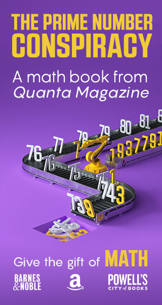
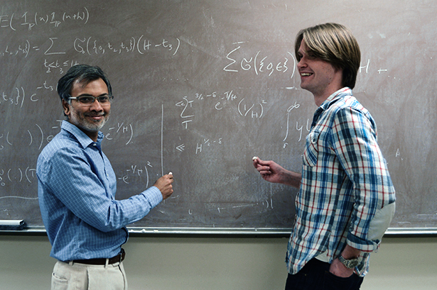

Mathematicians Discover Prime Conspiracy | Quanta Magazine

###### [number theory](https://www.quantamagazine.org/tag/number-theory/)

# Mathematicians Discover Prime Conspiracy

A previously unnoticed property of prime numbers seems to violate a long-standing assumption about how they behave.

[ 106](https://www.quantamagazine.org/mathematicians-discover-prime-conspiracy-20160313/#comments)

###### Read Later

[Zim + Teemo](http://www.zimteemo.com/illustrationhome) for Quanta Magazine

[     ### Erica Klarreich  *Contributing Correspondent*](https://www.quantamagazine.org/authors/erica-klarreich/)

* * *

*March 13, 2016*

* * *

[View PDF/Print Mode](https://www.quantamagazine.org/mathematicians-discover-prime-conspiracy-20160313/#)

[mathematics](https://www.quantamagazine.org/tag/mathematics/)[number theory](https://www.quantamagazine.org/tag/number-theory/)[podcast](https://www.quantamagazine.org/tag/podcast/)[prime numbers](https://www.quantamagazine.org/tag/prime-numbers/)[random numbers](https://www.quantamagazine.org/tag/random-numbers/)[twin primes conjecture](https://www.quantamagazine.org/tag/twin-primes-conjecture/)

Two mathematicians have uncovered a simple, previously unnoticed property of prime numbers — those numbers that are divisible only by 1 and themselves. Prime numbers, it seems, have decided preferences about the final digits of the primes that immediately follow them.

Among the first billion prime numbers, for instance, a prime ending in 9 is almost 65 percent more likely to be followed by a prime ending in 1 than another prime ending in 9. In a [paper posted online today](http://arxiv.org/abs/1603.03720), [Kannan Soundararajan](http://math.stanford.edu/~ksound/) and [Robert Lemke Oliver](http://web.stanford.edu/~rjlo/) of Stanford University present both numerical and theoretical evidence that prime numbers repel other would-be primes that end in the same digit, and have varied predilections for being followed by primes ending in the other possible final digits.

00:00/26:02

“We’ve been studying primes for a long time, and no one spotted this before,” said [Andrew Granville](http://www.dms.umontreal.ca/~andrew/), a number theorist at the University of Montreal and University College London. “It’s crazy.”

The discovery is the exact opposite of what most mathematicians would have predicted, said [Ken Ono](http://www.mathcs.emory.edu/~ono/), a number theorist at Emory University in Atlanta.  When he first heard the news, he said, “I was floored. I thought, ‘For sure, your program’s not working.’”

This conspiracy among prime numbers seems, at first glance, to violate a longstanding assumption in number theory: that prime numbers behave much like random numbers. Most mathematicians would have assumed, Granville and Ono agreed, that a prime should have an equal chance of being followed by a prime ending in 1, 3, 7 or 9 (the four possible endings for all prime numbers except 2 and 5).

“I can’t believe anyone in the world would have guessed this,” Granville said. Even after having seen Lemke Oliver and Soundararajan’s analysis of their phenomenon, he said, “it still seems like a strange thing.”

Yet the pair’s work doesn’t upend the notion that primes behave randomly so much as point to how subtle their particular mix of randomness and order is. “Can we redefine what ‘random’ means in this context so that once again, [this phenomenon] looks like it might be random?” Soundararajan said. “That’s what we think we’ve done.”

## Prime Preferences

Soundararajan was drawn to study consecutive primes after hearing a lecture at Stanford by the mathematician [Tadashi Tokieda](https://www.dpmms.cam.ac.uk/~tokieda/), of the University of Cambridge, in which he mentioned a counterintuitive property of coin-tossing: If Alice tosses a coin until she sees a head followed by a tail, and Bob tosses a coin until he sees two heads in a row, then on average, Alice will require four tosses while Bob will require six tosses (try this at home!), even though head-tail and head-head have an equal chance of appearing after two coin tosses.

Kannan Soundararajan, left, and Robert Lemke Oliver of Stanford University in February.

Waheeda Khalfan

Soundararajan wondered if similarly strange phenomena appear in other contexts. Since he has studied the primes for decades, he turned to them — and found something even stranger than he had bargained for. Looking at prime numbers written in base 3 — in which roughly half the primes end in 1 and half end in 2 — he found that among primes smaller than 1,000, a prime ending in 1 is more than twice as likely to be followed by a prime ending in 2 than by another prime ending in 1. Likewise, a prime ending in 2 prefers to be followed a prime ending in 1.

Soundararajan showed his findings to postdoctoral researcher Lemke Oliver, who was shocked. He immediately wrote a program that searched much farther out along the number line — through the first 400 billion primes. Lemke Oliver again found that primes seem to avoid being followed by another prime with the same final digit. The primes “really hate to repeat themselves,” Lemke Oliver said.

Lemke Oliver and Soundararajan discovered that this sort of bias in the final digits of consecutive primes holds not just in base 3, but also in base 10 and several other bases; they conjecture that it’s true in every base. The biases that they found appear to even out, little by little, as you go farther along the number line — but they do so at a snail’s pace. “It’s the rate at which they even out which is surprising to me,” said [James Maynard](http://www.magd.ox.ac.uk/member-of-staff/james-maynard/), a number theorist at the University of Oxford. When Soundararajan first told Maynard what the pair had discovered, “I only half believed him,” Maynard said. “As soon as I went back to my office, I ran a numerical experiment to check this myself.”

Lemke Oliver and Soundararajan’s first guess for why this bias occurs was a simple one: Maybe a prime ending in 3, say, is more likely to be followed by a prime ending in 7, 9 or 1 merely because it encounters numbers with those endings before it reaches another number ending in 3. For example, 43 is followed by 47, 49 and 51 before it hits 53, and one of those numbers, 47, is prime.

But the pair of mathematicians soon realized that this potential explanation couldn’t account for the magnitude of the biases they found. Nor could it explain why, as the pair found, primes ending in 3 seem to like being followed by primes ending in 9 more than 1 or 7. To explain these and other preferences, Lemke Oliver and Soundararajan had to delve into the deepest model mathematicians have for random behavior in the primes.

## Random Primes

Prime numbers, of course, are not really random at all — they are completely determined. Yet in many respects, they seem to behave like a list of random numbers, governed by just one overarching rule: The approximate density of primes near any number is inversely proportional to how many digits the number has.

In 1936, Swedish mathematician Harald Cramér [explored this idea](http://matwbn.icm.edu.pl/ksiazki/aa/aa2/aa212.pdf) using an elementary model for generating random prime-like numbers: At every whole number, flip a weighted coin — weighted by the prime density near that number — to decide whether to include that number in your list of random “primes.” Cramér showed that this coin-tossing model does an excellent job of predicting certain features of the real primes, such as how many to expect between two consecutive perfect squares.

Despite its predictive power, Cramér’s model is a vast oversimplification. For instance, even numbers have as good a chance of being chosen as odd numbers, whereas real primes are never even, apart from the number 2. Over the years, mathematicians have developed refinements of Cramér’s model that, for instance, bar even numbers and numbers divisible by 3, 5, and other small primes.

These simple coin-tossing models tend to be very useful rules of thumb about how prime numbers behave. They accurately predict, among other things, that prime numbers shouldn’t care what their final digit is — and indeed, primes ending in 1, 3, 7 and 9 occur with roughly equal frequency.

Yet similar logic seems to suggest that primes shouldn’t care what digit the prime after them ends in. It was probably mathematicians’ overreliance on the simple coin-tossing heuristics that made them miss the biases in consecutive primes for so long, Granville said. “It’s easy to take too much for granted — to assume that your first guess is true.”

The primes’ preferences about the final digits of the primes that follow them can be explained, Soundararajan and Lemke Oliver found, using a much more refined model of randomness in primes, something called the prime k-tuples conjecture. [Originally stated](http://link.springer.com/article/10.1007%2FBF02403921#page-1) by mathematicians G. H. Hardy and J. E. Littlewood in 1923, the conjecture provides precise estimates of how often every possible constellation of primes with a given spacing pattern will appear. A wealth of numerical evidence supports the conjecture, but so far a proof has eluded mathematicians.

The prime k-tuples conjecture subsumes many of the most central open problems in prime numbers, such as the [twin primes conjecture](https://www.quantamagazine.org/tag/twin-primes-conjecture/), which posits that there are infinitely many pairs of primes — such as 17 and 19 — that are only two apart. Most mathematicians believe the twin primes conjecture not so much because they keep finding more twin primes, Maynard said, but because the number of twin primes they’ve found fits so neatly with what the prime k-tuples conjecture predicts.

In a similar way, Soundararajan and Lemke Oliver have found that the biases they uncovered in consecutive primes come very close to what the prime k-tuples conjecture predicts. In other words, the most sophisticated conjecture mathematicians have about randomness in primes forces the primes to display strong biases. “I have to rethink how I teach my class in analytic number theory now,” Ono said.

At this early stage, mathematicians say, it’s hard to know whether these biases are isolated peculiarities, or whether they have deep connections to other mathematical structures in the primes or elsewhere. Ono predicts, however, that mathematicians will immediately start looking for similar biases in related contexts, such as prime polynomials — fundamental objects in number theory that can’t be factored into simpler polynomials.

And the finding will make mathematicians look at the primes themselves with fresh eyes, Granville said. “You could wonder, what else have we missed about the primes?”

*This article was reprinted on [Wired.com](http://www.wired.com/2016/03/mathematicians-discovered-prime-conspiracy/).*

### Share this article

[ ![](data:image/svg+xml,%3csvg xmlns='http://www.w3.org/2000/svg' class='absolute fit-x mxa c-1a1a1a js-evernote-checked' x='0px' y='0px' viewBox='0 0 50 50' enable-background='new 0 0 50 50' xml:space='preserve' data-reactid='327' data-evernote-id='208'%3e%3cg data-reactid='328' data-evernote-id='687' class='js-evernote-checked'%3e%3c!-- react-text: 329 --%3e %3c!-- /react-text --%3e%3cpath fill='currentColor' d='M20.6%2c38.5c-0.8%2c0-1.6%2c0.3-2.2%2c0.8L16%2c41.9c-1.1%2c1-2.4%2c1.6-3.9%2c1.6c-1.5%2c0-2.8-0.5-3.9-1.6c-0.5-0.5-0.9-1.1-1.2-1.8 c-0.3-0.7-0.4-1.4-0.4-2.1c0-0.7%2c0.1-1.4%2c0.4-2.1c0.3-0.7%2c0.7-1.2%2c1.2-1.8l9.1-9c1-0.9%2c2.2-1.8%2c3.8-2.7s3-0.7%2c4.3%2c0.7 c0.6%2c0.6%2c1.3%2c0.8%2c2.2%2c0.8s1.5-0.3%2c2.1-0.9c0.6-0.6%2c0.9-1.3%2c0.9-2.2s-0.3-1.6-0.9-2.2c-2.2-2.2-4.8-3.1-7.8-2.7 c-3%2c0.4-5.9%2c2-8.8%2c4.8l-9.2%2c9c-1.1%2c1.1-1.9%2c2.4-2.5%2c3.8C0.7%2c35%2c0.4%2c36.5%2c0.4%2c38c0%2c1.6%2c0.3%2c3%2c0.9%2c4.4c0.6%2c1.4%2c1.4%2c2.7%2c2.5%2c3.8 c1.1%2c1.1%2c2.4%2c2%2c3.8%2c2.5c1.4%2c0.6%2c2.9%2c0.8%2c4.4%2c0.8s2.9-0.3%2c4.3-0.8c1.4-0.6%2c2.7-1.4%2c3.8-2.5l2.5-2.5c0.6-0.6%2c0.9-1.3%2c0.9-2.1 s-0.3-1.6-0.9-2.2C22.1%2c38.8%2c21.4%2c38.5%2c20.6%2c38.5z' data-reactid='330' data-evernote-id='688' class='js-evernote-checked'%3e%3c/path%3e%3c!-- react-text: 331 --%3e %3c!-- /react-text --%3e%3cpath fill='currentColor' d='M48.7%2c7.9c-0.6-1.4-1.4-2.7-2.5-3.8c-2.4-2.4-5.1-3.6-8-3.7c-3-0.1-5.5%2c0.9-7.7%2c3.1l-3.1%2c3.1c-0.6%2c0.6-0.9%2c1.3-0.9%2c2.1 s0.3%2c1.6%2c0.9%2c2.2s1.3%2c0.9%2c2.2%2c0.9s1.6-0.3%2c2.2-0.8l3.1-3.1c1.2-1.1%2c2.4-1.5%2c3.7-1.3c1.3%2c0.3%2c2.5%2c0.9%2c3.4%2c1.9 c0.5%2c0.5%2c0.9%2c1.1%2c1.2%2c1.8c0.3%2c0.7%2c0.4%2c1.4%2c0.4%2c2.1c0%2c0.7-0.1%2c1.4-0.4%2c2.1c-0.3%2c0.7-0.7%2c1.2-1.2%2c1.8l-9.7%2c9.6 c-2.2%2c2.2-3.9%2c3.1-5.1%2c2.7s-2-0.8-2.4-1.3c-0.6-0.6-1.3-0.8-2.2-0.8s-1.5%2c0.3-2.1%2c0.9c-0.6%2c0.6-0.9%2c1.3-0.9%2c2.2s0.3%2c1.5%2c0.9%2c2.1 c1%2c1%2c2.1%2c1.8%2c3.2%2c2.3s2.4%2c0.7%2c3.6%2c0.7c1.5%2c0%2c3-0.4%2c4.6-1.1c1.6-0.7%2c3.1-1.9%2c4.6-3.4l9.8-9.6c1.1-1.1%2c1.9-2.4%2c2.5-3.8 c0.6-1.4%2c0.9-2.9%2c0.9-4.4C49.6%2c10.8%2c49.3%2c9.3%2c48.7%2c7.9z' data-reactid='332' data-evernote-id='689' class='js-evernote-checked'%3e%3c/path%3e%3c!-- react-text: 333 --%3e %3c!-- /react-text --%3e%3c/g%3e%3c/svg%3e)](https://www.quantamagazine.org/mathematicians-discover-prime-conspiracy-20160313/#0)

###### Copied!

[ ![](data:image/svg+xml,%3csvg xmlns='http://www.w3.org/2000/svg' class='absolute fit-x mxa c-1a1a1a js-evernote-checked' viewBox='4 0 33 33' enable-background='new 0 0 30 30' data-reactid='354' data-evernote-id='211'%3e%3cpath fill='currentColor' d='M39.58%2c19.65A4.72%2c4.72%2c0%2c0%2c0%2c31.91%2c16a22.4%2c22.4%2c0%2c0%2c0-10.42-3.09l2-6.38%2c5.6%2c1.31a3.91%2c3.91%2c0%2c1%2c0%2c.43-2.08L23.05%2c4.27A1.08%2c1.08%2c0%2c0%2c0%2c21.79%2c5L19.26%2c12.9A22.6%2c22.6%2c0%2c0%2c0%2c8%2c16a4.68%2c4.68%2c0%2c1%2c0-5.56%2c7.51%2c8.32%2c8.32%2c0%2c0%2c0-.08%2c1.12c0%2c3.21%2c1.89%2c6.2%2c5.31%2c8.41a22.69%2c22.69%2c0%2c0%2c0%2c12.23%2c3.3A22.67%2c22.67%2c0%2c0%2c0%2c32.15%2c33c3.43-2.21%2c5.31-5.2%2c5.31-8.41a8.77%2c8.77%2c0%2c0%2c0-.06-1%2c4.65%2c4.65%2c0%2c0%2c0%2c2.18-3.93M33.05%2c5.8a1.78%2c1.78%2c0%2c1%2c1-1.8%2c1.78%2c1.79%2c1.79%2c0%2c0%2c1%2c1.8-1.78M11.52%2c22.53a2.71%2c2.71%2c0%2c0%2c1%2c2.69-2.66%2c2.65%2c2.65%2c0%2c1%2c1-2.69%2c2.66m14.93%2c7.73c-1.37%2c1.35-3.47%2c2-6.43%2c2h0c-3%2c0-5.06-.65-6.43-2a1.05%2c1.05%2c0%2c0%2c1%2c0-1.5%2c1.09%2c1.09%2c0%2c0%2c1%2c1.52%2c0c.94.93%2c2.54%2c1.38%2c4.91%2c1.38h0c2.37%2c0%2c4-.45%2c4.91-1.38a1.08%2c1.08%2c0%2c0%2c1%2c1.52%2c0%2c1.07%2c1.07%2c0%2c0%2c1%2c0%2c1.5m-.63-5.1a2.65%2c2.65%2c0%2c1%2c1%2c2.66-2.63%2c2.65%2c2.65%2c0%2c0%2c1-2.66%2c2.63' transform='translate(-0.42 -3.68)' data-reactid='355' data-evernote-id='705' class='js-evernote-checked'%3e%3c/path%3e%3c/svg%3e)](https://www.reddit.com/submit?url=https://www.quantamagazine.org/mathematicians-discover-prime-conspiracy-20160313/)

* * *

### Newsletter

*Get Quanta Magazine delivered to your inbox*

[(L)](https://www.quantamagazine.org/mathematicians-discover-prime-conspiracy-20160313/#newsletter)

[Most recent newsletter](http://us1.campaign-archive2.com/home/?u=0d6ddf7dc1a0b7297c8e06618&id=f0cb61321c)