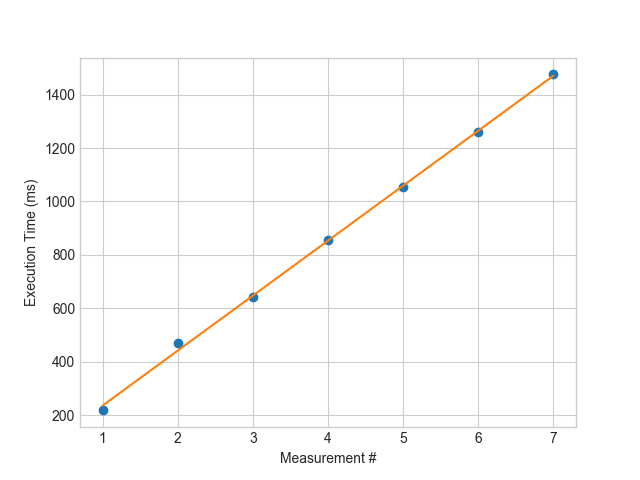
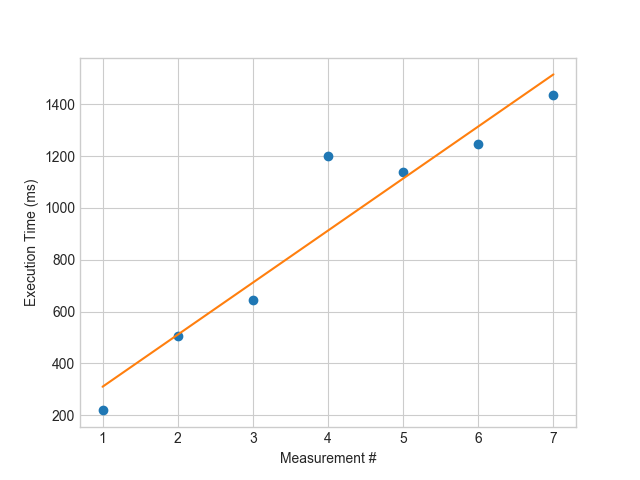

Measure Code Execution Time Accurately in Python - Bernhard Knasmueller on Software Development

##     [Bernhard Knasmueller](https://knasmueller.net/)   in [Python](https://knasmueller.net/category/python)     |   [January 18, 2020](https://knasmueller.net/measure-code-execution-time-accurately-in-python)

# Measure Code Execution Time Accurately in Python

**Measuring code execution times is hard. Learn how to eliminate systematic and random measurement errors and obtain more reliable results.

 **

We often need to measure how long a specific part of code takes to execute. Unfortunately, simply measuring the system time before and after a function call is not very robust and susceptible to systematic and random measurement errors. This is especially true for measuring very short intervals (< 100 milliseconds).

### Systematic and Random Errors

So what is wrong with the following way of measuring?
time_start = time.perf_counter()
my_function()
time_end = time.perf_counter()
execution_time = time_end - time_start

First, there is a **systematic error**: by invoking `time.perf_counter()`, an unknown amount of time is added to the execution time of `my_function()`. How much time? This depends on the OS, the particular implementation and other uncontrollable factors.

Second, there is a **random error**: the execution time of the call to `my_function()` will vary to a certain degree.

We can combat the random error by just performing multiple measurements and taking the average of those. However, it is much more challenging to remove the systematic error.

### Straight Line Fitting

Carlos Moreno and Sebastian Fischmeister presented a novel technique to combat this systematic error. The basic idea is to first measure the time of *one* function call, then the time of *two*, then the time of three, and so on. The resulting method may look like this:

time_1 = time.perf_counter()
my_function()
time_2 = time.perf_counter()
my_function()
my_function()
time_3 = time.perf_counter()
my_function()
my_function()
my_function()
time_4 = time.perf_counter()

# ...

You can then fit a straight line through the measurements:

The overall execution time can then be obtained by taking the slope `a` from the straight line `y = a x + b`.

In the above example, the straight line is `y = 205.91 x + 29.56`; therefore, the execution time equals 205.91 milliseconds.

The authors note that this type of measurement is very robust against occasional measurements with large errors. This can be visualized by artificially changing the 4th measurement and rerunning the line fitting process:

Even though one value is completely off, the resulting slope (201.15) is still very close to the previously measured value.

To learn more about the mathematical basics of this method, I invite you to read the original paper: https://uwaterloo.ca/embedded-software-group/sites/ca.embedded-software-group/files/uploads/files/ieee-esl-precise-measurements.pdf

### Python Implementation

You can find my implementation of the presented algorithm in my public GitLab repository:

https://gitlab.com/bernhard.knasmueller/accurate-time-measurements-python
All credit for the algorithm and the idea goes to Moreno and Fischmeister.
Edit January 18 2020: Corrected the usage of `perf_counter()`.

### Related Posts

- [How To Publish Your PHP Code as a Composer Package](https://knasmueller.net/how-to-publish-your-php-code-as-a-composer-package)

Easily share your code with the PHP community by contributing your library as a composer…

- [Trailing Commas in PHP 7.3](https://knasmueller.net/trailing-commas-in-php-7-3)

With the new minor version upgrade PHP 7.3, trailing commas are introduced for function calls.…

 

 [Bernhard Knasmueller](https://knasmueller.net/)

## Published

## [January 18, 2020](https://knasmueller.net/measure-code-execution-time-accurately-in-python)

### Webmentions

 [Measure Code Execution Time Accurately in Python - Lapcity](https://lapc4.com/measure-code-execution-time-accurately-in-python.html)

[…] Measuring code execution times is hard. Learn how to eliminate systematic and random measurement errors and obtain more reliable results. We often need to measure how long a specific part of code takes to execute. Unfortunately, simply measuring the system t… Read More […]

 [Measure Code Execution Time Accurately in Python – Bernhard Knasmueller on Software Development – GeekWay](http://geekway.tech/2020/01/19/measure-code-execution-time-accurately-in-python-bernhard-knasmueller-on-software-development/)

[…] Learn how to measure code execution time in Python reliably using a line fitting method that eliminates errors as suggested by Moreno and Fischmeister.Read More […]

 [Measure Code Execution Time Accurately in Python - Bernhard Knasmueller on Software Development | Zone Of Sales](https://zoneofsales.com/measure-code-execution-time-accurately-in-python-bernhard-knasmueller-on-software-development.html)

[…] Measuring code execution times is hard. Learn how to eliminate systematic and random measurement errors and obtain more reliable results. We often need to measure how long a specific part of code takes to execute. Unfortunately, simply measuring the system t… Read More […]

 [Measure Code Execution Time Accurately in Python - Dhruba's Blog & Online News](https://dhrubalamsal.com/measure-code-execution-time-accurately-in-python/)

[…] Source link […]