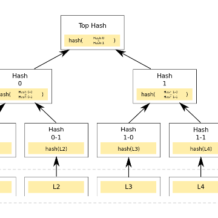

Merkle tree - Wikipedia

Merkle tree - Wikipedia

https://en.wikipedia.org/wiki/Merkle_tree

Merkle tree From Wikipedia, the free encyclopedia Jump to: navigation , search An example of a binary hash tree. Hashes 0-0 and 0-1 are the hash values of data blocks L1 and L2, respectively, and hash 0 is the hash of the concatenation of hashes 0-0 and 0-1. In cryptography and computer science , a hash tree or Merkle tree is a tree in which every leaf node is labelled with the hash of a data block and every non-leaf node is labelled with the cryptographic hash of the labels of its child nodes. Hash trees allow efficient and secure verification of the contents of large data structures. Hash trees are a generalization of