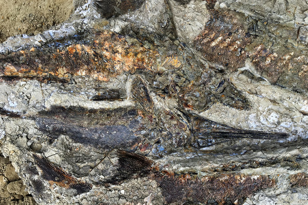
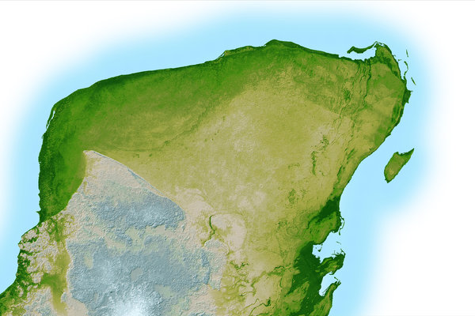
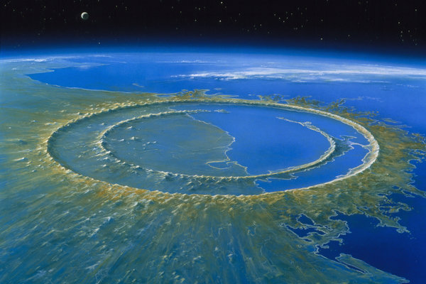
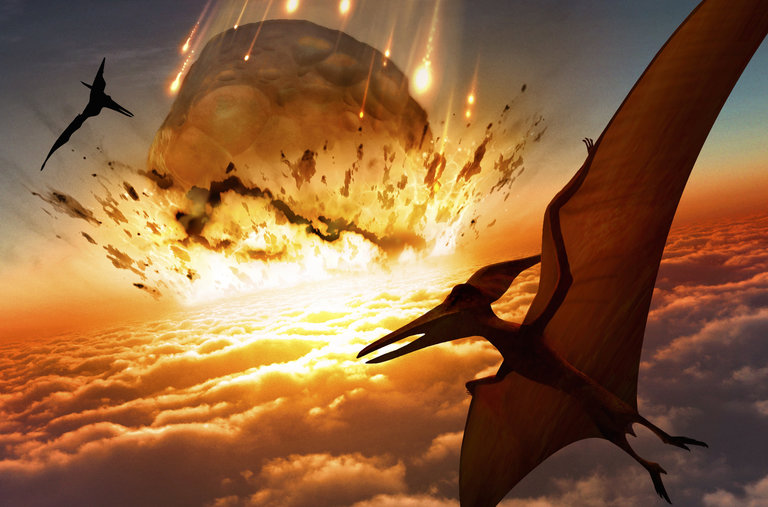
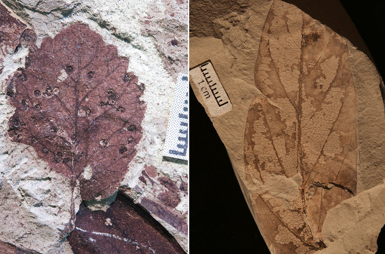
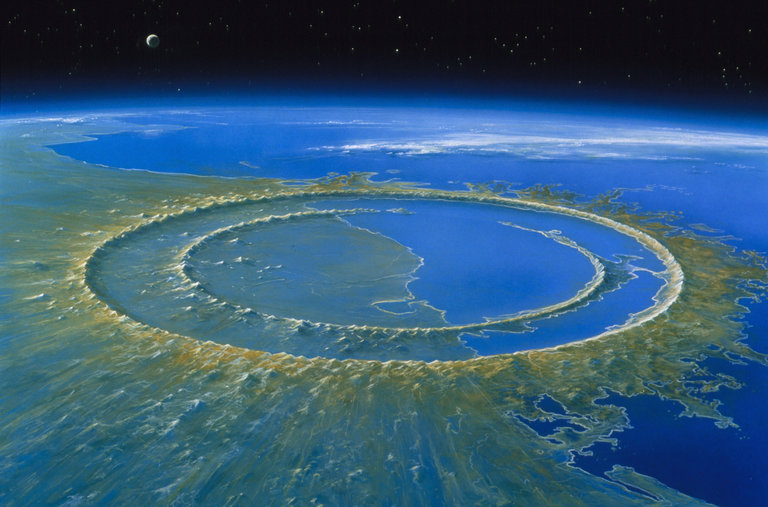
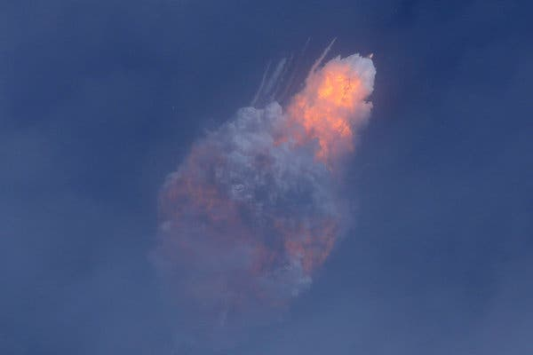
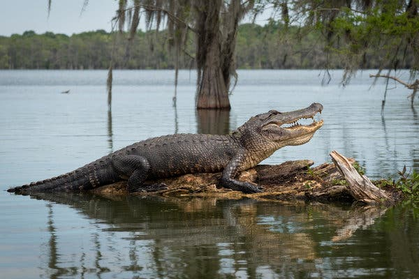
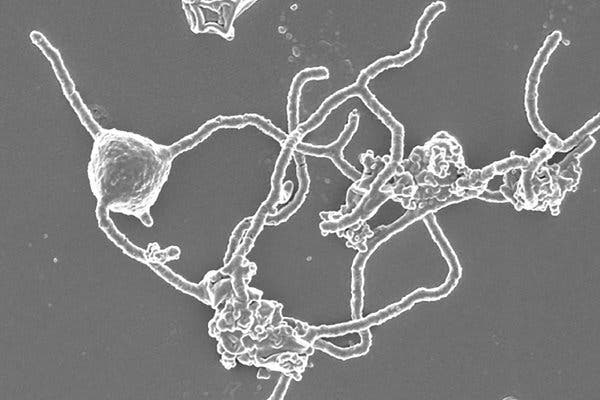
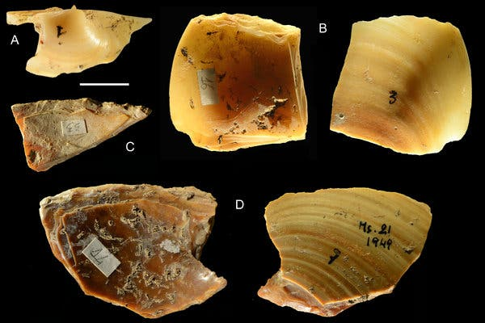

Meteorite or Volcano? New Clues to the Dinosaurs’ Demise - The New York Times

Advertisement

[Continue reading the main story](https://www.nytimes.com/2020/01/16/science/dinosaurs-extinction-meteorite-volcano.html?algo=identity&fellback=false&imp_id=622391447&imp_id=406098524&action=click&module=Science%20%20Technology&pgtype=Homepage#after-top)

# Meteorite or Volcano? New Clues to the Dinosaurs’ DemiseMeteorite or Volcano? New Clues to the Dinosaurs’ Demise

Twin calamities marked the end of the Cretaceous period, and scientists are presenting new evidence of which drove one of Earth’s great extinctions.

An illustration of a meteor hurtling toward Earth during the late Cretaceous period.Credit...Mark Garlick/Science Source

By Lucas Joel

- Jan. 16, 2020

-

    - 
    - 
    - [](https://www.nytimes.com/2020/01/16/science/dinosaurs-extinction-meteorite-volcano.html?algo=identity&fellback=false&imp_id=622391447&imp_id=406098524&action=click&module=Science%20%20Technology&pgtype=Homepagemailto:?subject=NYTimes.com%3A%20Meteorite%20or%20Volcano%3F%20New%20Clues%20to%20the%20Dinosaurs%E2%80%99%20Demise&body=From%20The%20New%20York%20Times%3A%0A%0AMeteorite%20or%20Volcano%3F%20New%20Clues%20to%20the%20Dinosaurs%E2%80%99%20Demise%0A%0ATwin%20calamities%20marked%20the%20end%20of%20the%20Cretaceous%20period%2C%20and%20scientists%20are%20presenting%20new%20evidence%20of%20which%20drove%20one%20of%20Earth%E2%80%99s%20great%20extinctions.%0A%0Ahttps%3A%2F%2Fwww.nytimes.com%2F2020%2F01%2F16%2Fscience%2Fdinosaurs-extinction-meteorite-volcano.html)

    -
    -

Some 66 million years ago, forests burned to the ground and the oceans acidified after the Chicxulub meteorite hit Earth in the Gulf of Mexico. Around the same time, on the other side of the planet, erupting volcanoes were busy covering much of the Indian subcontinent with lava, forming the Deccan Traps.

One of these forces drove all dinosaurs except for the birds extinct, and opened the evolutionary door for mammals until, eventually, humans arose. In the geologic equivalent of a murder mystery, which calamity actually did the deed is a debate that stretches back decades. Now, it seems, the case may finally be cracked.

The meteorite, according to a team of scientists, was the chief perpetrator, while the volcanism, driving climate change in the background, might have affected life’s recovery in the wake of the impact.

“A lot of people have wanted to argue that both the impact and the volcanism mattered in the extinction,” said Pincelli Hull, a paleontologist and geology professor at Yale University who led the research, which was [published Thursday in Science](https://science.sciencemag.org/cgi/doi/10.1126/science.aay5055). “And what we’re seeing is, it doesn’t look like it. It’s just the impact.”

Advertisement

[Continue reading the main story](https://www.nytimes.com/2020/01/16/science/dinosaurs-extinction-meteorite-volcano.html?algo=identity&fellback=false&imp_id=622391447&imp_id=406098524&action=click&module=Science%20%20Technology&pgtype=Homepage#after-story-ad-1)

“This is an elegant study that might finally untangle what happened at the end of the Cretaceous, when the dinosaurs died,” said Stephen Brusatte, a vertebrate paleontologist at the University of Edinburgh who was not involved in the research.

The untangling began in 2012 when Dr. Hull set sail aboard the Joides Resolution, a*  *research vessel, as part of the International Ocean Discovery Program. She and a team of scientists drilled into the seafloor below the North Atlantic and retrieved cores containing ancient ocean sediment. One of their cores came from sediment coincidentally close to the wreckage of the Titanic.

Sediment can deposit as layers, which, like the pages of a novel, can hold clues that tell the story of what the ancient world was like. In this case, it was like flipping to the last chapter of the dinosaurs’ story, and finding out whether it was the meteorite or the volcanism that triggered the Cretaceous extinction.

Dr. Hull and her team drilled for layers that deposited around the time of the extinction. They knew those layers can preserve things like fossil plankton, which record information about global temperatures in the chemical makeup of their shells.

## Editors’ Picks

[### The Sex Scene Evolves for the #MeToo Era](https://www.nytimes.com/2020/01/14/magazine/sex-scene-intimacy-coordinator.html?algo=bandit-story&fellback=false&imp_id=567907816&imp_id=655437466)

[### Olivia Palermo Got a Lot Out of That Internship](https://www.nytimes.com/2020/01/14/fashion/olivia-palermo-fashion.html?algo=bandit-story&fellback=false&imp_id=146367907&imp_id=324028464)

[### Why Do Trump Supporters Support Trump?](https://www.nytimes.com/2020/01/17/books/review/the-new-class-war-michael-lind.html?algo=bandit-story&fellback=false&imp_id=747158768&imp_id=665814205)

[Continue reading the main story](https://www.nytimes.com/2020/01/16/science/dinosaurs-extinction-meteorite-volcano.html?algo=identity&fellback=false&imp_id=622391447&imp_id=406098524&action=click&module=Science%20%20Technology&pgtype=Homepage&action=click&module=editorContent&pgtype=Article&region=CompanionColumn&contentCollection=Trending#after-pp_edpick)

 [ PAID POST: Genesis Motors America](https://adclick.g.doubleclick.net/pcs/click?xai=AKAOjsvVWSXHfNcxtVt0FksZY2-QSO0sCKTNgMwuwTJf-uhDvlcz9HisSzdqkgwYCuXuJBr6d_mbyJYcJmS5pUDILS9BXWMywbktfpRTJjziPQR7N2U1L5yuqiZ5ripskcYYYvO7aVT6_Gh-jP0lDOb7zJkG7FnODQiGyoyLVmvd9qPYrPyjKo-ugi8ry75YGhLVnl0ZmYMHGBT8VjOGJALeAQJmV_4DlIO3OEqer57rz4XOELC1Y-cWoZDWjFWW4tof&sig=Cg0ArKJSzBXrwCxEtrnaEAE&urlfix=1&adurl=https://www.nytimes.com/paidpost/genesis/trailblazers-an-artists-passion-reignited.html%3Fcpv_ap_id%3D50047773%26sr_source%3Dlift_ed%26tbs_nyt%3D2020-January-nytnative_ed)[ How This Athlete Reignited His Passion For Art](https://adclick.g.doubleclick.net/pcs/click?xai=AKAOjsvVWSXHfNcxtVt0FksZY2-QSO0sCKTNgMwuwTJf-uhDvlcz9HisSzdqkgwYCuXuJBr6d_mbyJYcJmS5pUDILS9BXWMywbktfpRTJjziPQR7N2U1L5yuqiZ5ripskcYYYvO7aVT6_Gh-jP0lDOb7zJkG7FnODQiGyoyLVmvd9qPYrPyjKo-ugi8ry75YGhLVnl0ZmYMHGBT8VjOGJALeAQJmV_4DlIO3OEqer57rz4XOELC1Y-cWoZDWjFWW4tof&sig=Cg0ArKJSzBXrwCxEtrnaEAE&urlfix=1&adurl=https://www.nytimes.com/paidpost/genesis/trailblazers-an-artists-passion-reignited.html%3Fcpv_ap_id%3D50047773%26sr_source%3Dlift_ed%26tbs_nyt%3D2020-January-nytnative_ed)

Advertisement

[Continue reading the main story](https://www.nytimes.com/2020/01/16/science/dinosaurs-extinction-meteorite-volcano.html?algo=identity&fellback=false&imp_id=622391447&imp_id=406098524&action=click&module=Science%20%20Technology&pgtype=Homepage#after-story-ad-2)

Some volcanic eruptions can emit great amounts of carbon dioxide into the atmosphere. This can drive global warming that can fuel a mass extinction.

Image

Lava rocks at the Deccan Traps in Western Ghats, India.Credit...Bert Willaert/ Nature Picture Library/Alamy

For years, such volcanic-driven warming seemed like a potential culprit because large amounts of lava erupted both before and after the extinction. With that idea in mind, Dr. Hull’s team says that ancient temperatures should have been relatively high around the time of the crisis.

“We put together a global compilation of temperature change,” Dr. Hull said.

The group found that global temperatures were much lower around the time of the extinction than they should have been if volcanoes were expelling large amounts of carbon dioxide. The volcanism, Dr. Hull explained, stopped seeping carbon dioxide into the atmosphere some 200,000 years before the Cretaceous ended and the age of mammals began. That means any harmful warming caused by carbon dioxide was already over by the time the meteorite hit.

Volcanoes can erupt lava without emitting large amounts of gases, “suggesting carbon dioxide and lava aren’t necessarily coupled,” said Michael Henehan, a geochemist at GFZ Helmholtz Center in Potsdam, Germany, a co-author of the study who led a team last year that discovered that [the oceans acidified right after the asteroid hit](https://www.nytimes.com/2019/10/21/science/chicxulub-asteroid-ocean-acid.html).

This volcanism-induced warming, far-removed from the extinction, casts blame squarely on the Chicxulub event. “I’m sure the debate will rage on, because there are entrenched voices on either side,” Dr. Brusatte said. “But it’s getting harder and harder to fathom that the asteroid was innocent.”

After the meteorite struck, volcanic eruptions in India continued. On land, [mammals proliferated relatively rapidly](https://www.nytimes.com/2019/10/24/science/fossils-mammals-dinosaurs-colorado.html?action=click&module=RelatedLinks&pgtype=Article) — on the scale of hundreds of thousands of years, according to recent research. In the oceans, it took about two million years for sea creatures like plankton to fully recover from the destruction.

Dr. Hull suspects the ways in which life recovered on land and in the sea may have something to do with climate change driven by the volcanism that occurred after the extinction. But the precise reason for this isn’t clear.

Advertisement

[Continue reading the main story](https://www.nytimes.com/2020/01/16/science/dinosaurs-extinction-meteorite-volcano.html?algo=identity&fellback=false&imp_id=622391447&imp_id=406098524&action=click&module=Science%20%20Technology&pgtype=Homepage#after-story-ad-3)

“I don’t know if it’s the volcanism, or if it’s the internal workings of the ecosystems themselves,” she said.

For now, it’s another mystery to solve about the aftermath of the Chicxulub impact.

What We’ve Learned About the Dinosaur Extinction

[ Fossil Site Reveals Day That Meteor Hit Earth and, Maybe, Wiped Out Dinosaurs March 29, 2019  ](https://www.nytimes.com/2019/03/29/science/dinosaurs-extinction-asteroid.html?action=click&module=RelatedLinks&pgtype=Article)

[ A New Timeline of the Day the Dinosaurs Began to Die Out Sept. 10, 2019  ](https://www.nytimes.com/2019/09/10/science/chicxulub-asteroid-impact-dinosaurs.html?action=click&module=RelatedLinks&pgtype=Article)

[ The Dinosaur-Killing Asteroid Acidified the Ocean in a Flash Oct. 21, 2019  ](https://www.nytimes.com/2019/10/21/science/chicxulub-asteroid-ocean-acid.html?action=click&module=RelatedLinks&pgtype=Article)

[ Dinosaurs Might Not Be Extinct Had the Asteroid Struck Elsewhere Nov. 9, 2017  ](https://www.nytimes.com/2017/11/09/science/dinosaurs-asteroid-chicxulub-extinction.html?action=click&module=RelatedLinks&pgtype=Article)

[ After Dinosaur Extinction, Some Insects Recovered More Quickly Nov. 7, 2016  ](https://www.nytimes.com/2016/11/08/science/fossilized-leaves-insect-bites-patagonia.html?action=click&module=RelatedLinks&pgtype=Article)

[ Drilling Into the Chicxulub Crater, Ground Zero of the Dinosaur Extinction Nov. 17, 2016  ](https://www.nytimes.com/2016/11/18/science/chicxulub-crater-dinosaur-extinction.html?action=click&module=RelatedLinks&pgtype=Article)

- 
- 
- [](https://www.nytimes.com/2020/01/16/science/dinosaurs-extinction-meteorite-volcano.html?algo=identity&fellback=false&imp_id=622391447&imp_id=406098524&action=click&module=Science%20%20Technology&pgtype=Homepagemailto:?subject=NYTimes.com%3A%20Meteorite%20or%20Volcano%3F%20New%20Clues%20to%20the%20Dinosaurs%E2%80%99%20Demise&body=From%20The%20New%20York%20Times%3A%0A%0AMeteorite%20or%20Volcano%3F%20New%20Clues%20to%20the%20Dinosaurs%E2%80%99%20Demise%0A%0ATwin%20calamities%20marked%20the%20end%20of%20the%20Cretaceous%20period%2C%20and%20scientists%20are%20presenting%20new%20evidence%20of%20which%20drove%20one%20of%20Earth%E2%80%99s%20great%20extinctions.%0A%0Ahttps%3A%2F%2Fwww.nytimes.com%2F2020%2F01%2F16%2Fscience%2Fdinosaurs-extinction-meteorite-volcano.html)

-

## [More in Science](https://www.nytimes.com/section/science?action=click&module=MoreInSection&pgtype=Article&region=Footer&contentCollection=Science)

[   Joe Rimkus Jr/Reuters](https://www.nytimes.com/2020/01/19/science/spacex-launch.html?action=click&module=MoreIn&pgtype=Article&region=Footer&action=click&module=MoreInSection&pgtype=Article&region=Footer&contentCollection=Science)

[### SpaceX’s Explosive Test May Launch Year of Renewed Human Spaceflight](https://www.nytimes.com/2020/01/19/science/spacex-launch.html?action=click&module=MoreIn&pgtype=Article&region=Footer&action=click&module=MoreInSection&pgtype=Article&region=Footer&contentCollection=Science)Jan. 19

[   Stephen Jessop/Alamy](https://www.nytimes.com/2020/01/17/science/alligators-carcasses-scavengers.html?action=click&module=MoreIn&pgtype=Article&region=Footer&action=click&module=MoreInSection&pgtype=Article&region=Footer&contentCollection=Science)

[### At the Bottom of the Sea, They Wait to Feast on Alligators](https://www.nytimes.com/2020/01/17/science/alligators-carcasses-scavengers.html?action=click&module=MoreIn&pgtype=Article&region=Footer&action=click&module=MoreInSection&pgtype=Article&region=Footer&contentCollection=Science)Jan. 17

[Continue reading the main story](https://www.nytimes.com/2020/01/16/science/dinosaurs-extinction-meteorite-volcano.html?algo=identity&fellback=false&imp_id=622391447&imp_id=406098524&action=click&module=Science%20%20Technology&pgtype=Homepage&action=click&module=MoreInSection&pgtype=Article&region=Footer&contentCollection=Science#after-pp_morein)

[   Hiroyuki Imachi, Masaru K. Nobu and JAMSTEC](https://www.nytimes.com/2020/01/15/science/cells-eukaryotes-archaea.html?action=click&module=MoreIn&pgtype=Article&region=Footer&action=click&module=MoreInSection&pgtype=Article&region=Footer&contentCollection=Science)

[### This Strange Microbe May Mark One of Life’s Great Leaps](https://www.nytimes.com/2020/01/15/science/cells-eukaryotes-archaea.html?action=click&module=MoreIn&pgtype=Article&region=Footer&action=click&module=MoreInSection&pgtype=Article&region=Footer&contentCollection=Science)Jan. 15

[   CU Boulder College of Engineering & Applied Science](https://www.nytimes.com/2020/01/15/science/construction-concrete-bacteria-photosynthesis.html?action=click&module=MoreIn&pgtype=Article&region=Footer&action=click&module=MoreInSection&pgtype=Article&region=Footer&contentCollection=Science)

[### Bricks Alive! Scientists Create Living Concrete](https://www.nytimes.com/2020/01/15/science/construction-concrete-bacteria-photosynthesis.html?action=click&module=MoreIn&pgtype=Article&region=Footer&action=click&module=MoreInSection&pgtype=Article&region=Footer&contentCollection=Science)Jan. 15

[   Villa et al., 2020](https://www.nytimes.com/2020/01/15/science/neanderthals-swimming-diving.html?action=click&module=MoreIn&pgtype=Article&region=Footer&action=click&module=MoreInSection&pgtype=Article&region=Footer&contentCollection=Science)

[### Neanderthals Could Swim. They Even Dived.](https://www.nytimes.com/2020/01/15/science/neanderthals-swimming-diving.html?action=click&module=MoreIn&pgtype=Article&region=Footer&action=click&module=MoreInSection&pgtype=Article&region=Footer&contentCollection=Science)Jan. 15

## Editors’ Picks

[   The Andy Warhol Foundation for the Visual Arts, Inc./Licensed by Artists Rights Society (ARS), New York](https://www.nytimes.com/2020/01/14/arts/andy-warhol-photographs.html?algo=bandit-story&fellback=false&imp_id=103872337&imp_id=709580815&action=click&module=editorsPicks&pgtype=Article&region=Footer)

[### Take a Look at These Rarely Seen Andy Warhol Photos](https://www.nytimes.com/2020/01/14/arts/andy-warhol-photographs.html?algo=bandit-story&fellback=false&imp_id=103872337&imp_id=709580815&action=click&module=editorsPicks&pgtype=Article&region=Footer)Jan. 14

[   Jen Hsieh](https://www.nytimes.com/2020/01/17/travel/unpack-vacation.html?algo=bandit-story&fellback=false&imp_id=920866246&imp_id=163095499&action=click&module=editorsPicks&pgtype=Article&region=Footer)

[### The Traveler’s Conundrum: Unpack or Not Unpack?](https://www.nytimes.com/2020/01/17/travel/unpack-vacation.html?algo=bandit-story&fellback=false&imp_id=920866246&imp_id=163095499&action=click&module=editorsPicks&pgtype=Article&region=Footer)Jan. 17

[   Margeaux Walter for The New York Times](https://www.nytimes.com/2020/01/15/business/best-way-to-greet-someone.html?algo=bandit-story&fellback=false&imp_id=249439671&imp_id=145256724&action=click&module=editorsPicks&pgtype=Article&region=Footer)

[### Must You Say Hello to Your Co-Workers?](https://www.nytimes.com/2020/01/15/business/best-way-to-greet-someone.html?algo=bandit-story&fellback=false&imp_id=249439671&imp_id=145256724&action=click&module=editorsPicks&pgtype=Article&region=Footer)Jan. 15

## Most Popular

### [The Olympics Want Tiger Woods. He Wants to Go. But There’s a Catch.](https://www.nytimes.com/2020/01/20/sports/golf/tiger-woods-Olympics.html?algo=top_conversion&fellback=false&imp_id=674124227&imp_id=117584356&action=click&module=trending&pgtype=Article&region=Footer)

### [How 17 Outsize Portraits Rattled a Small Southern Town](https://www.nytimes.com/2020/01/19/us/newnan-art-georgia-race.html?algo=top_conversion&fellback=false&imp_id=94793450&imp_id=276370703&action=click&module=trending&pgtype=Article&region=Footer)

### [Opinion: Amy Klobuchar and Elizabeth Warren Are Democrats’ Best Choices for President](https://www.nytimes.com/interactive/2020/01/19/opinion/amy-klobuchar-elizabeth-warren-nytimes-endorsement.html?algo=top_conversion&fellback=false&imp_id=678455825&imp_id=294841417&action=click&module=trending&pgtype=Article&region=Footer)

### [The New Generation of Self-Created Utopias](https://www.nytimes.com/2020/01/16/t-magazine/intentional-communities.html?algo=top_conversion&fellback=false&imp_id=78305877&imp_id=604279826&action=click&module=trending&pgtype=Article&region=Footer)

### [Caneel Bay: Why a Caribbean Paradise Remains in Ruins](https://www.nytimes.com/2020/01/20/travel/st-john-caneel-bay-resort.html?algo=top_conversion&fellback=false&imp_id=456702879&imp_id=786793362&action=click&module=trending&pgtype=Article&region=Footer)

### [Amid Tight Security, Virginia Gun Rally Draws Thousands of Supporters](https://www.nytimes.com/2020/01/20/us/virginia-gun-rally.html?algo=top_conversion&fellback=false&imp_id=219141015&imp_id=769904206&action=click&module=trending&pgtype=Article&region=Footer)

### [Opinion: Biden, Sanders, Social Security and Smears](https://www.nytimes.com/2020/01/20/opinion/biden-sanders-social-security.html?algo=top_conversion&fellback=false&imp_id=474657492&imp_id=110893018&action=click&module=trending&pgtype=Article&region=Footer)

### [What We Learned in the N.F.L.’s Conference Championships](https://www.nytimes.com/2020/01/20/sports/football/49ers-chiefs-super-bowl.html?algo=top_conversion&fellback=false&imp_id=94948346&imp_id=303366015&action=click&module=trending&pgtype=Article&region=Footer)

### [A Grieving Young Tennis Star Finds Solace on the Court](https://www.nytimes.com/2020/01/18/sports/tennis/amanda-anisimova-australian-open.html?algo=top_conversion&fellback=false&imp_id=5757371&imp_id=840441170&action=click&module=trending&pgtype=Article&region=Footer)

### [Life’s Best Dinners](https://www.nytimes.com/2020/01/17/dining/lifes-best-dinners.html?algo=top_conversion&fellback=false&imp_id=40533114&imp_id=629915980&action=click&module=trending&pgtype=Article&region=Footer)

Advertisement

[Continue reading the main story](https://www.nytimes.com/2020/01/16/science/dinosaurs-extinction-meteorite-volcano.html?algo=identity&fellback=false&imp_id=622391447&imp_id=406098524&action=click&module=Science%20%20Technology&pgtype=Homepage#after-bottom)