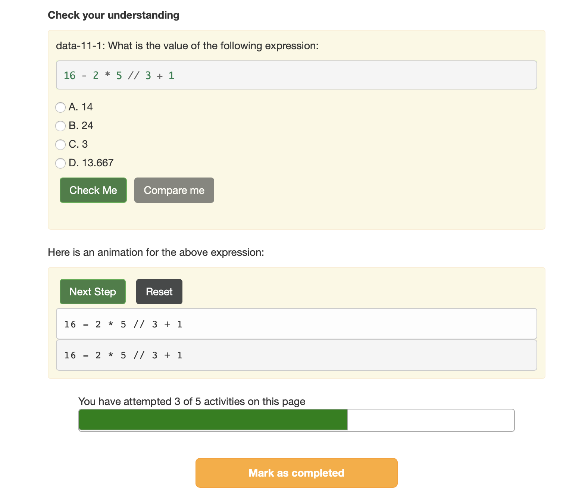
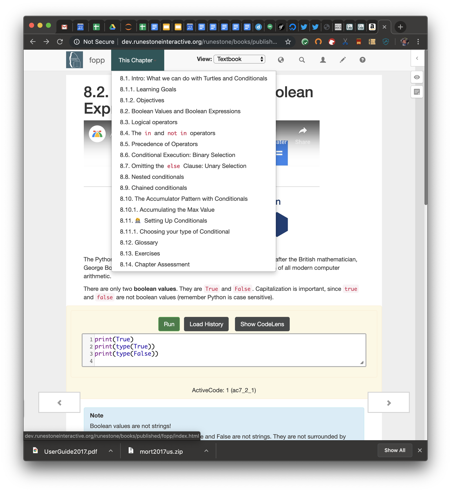
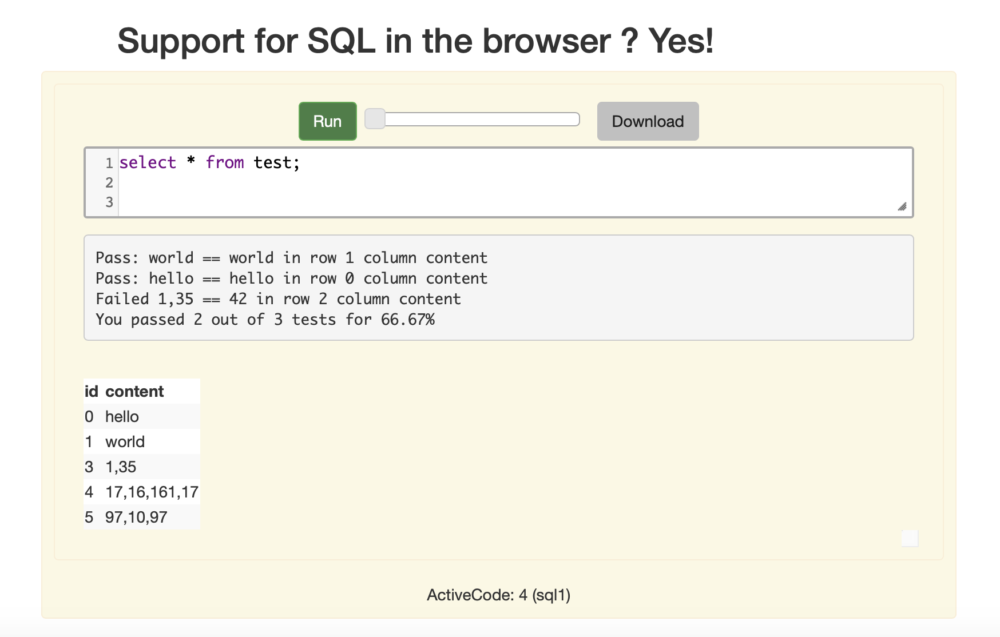
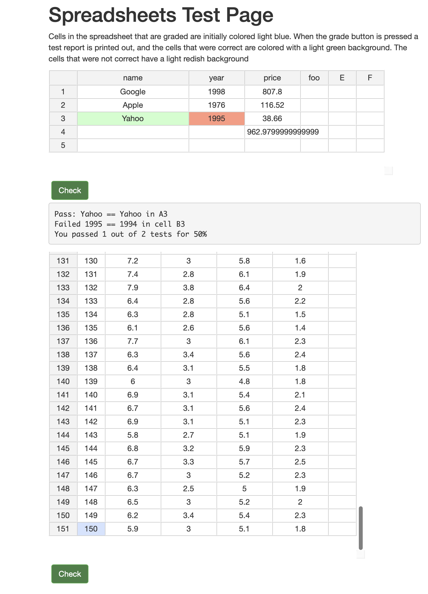
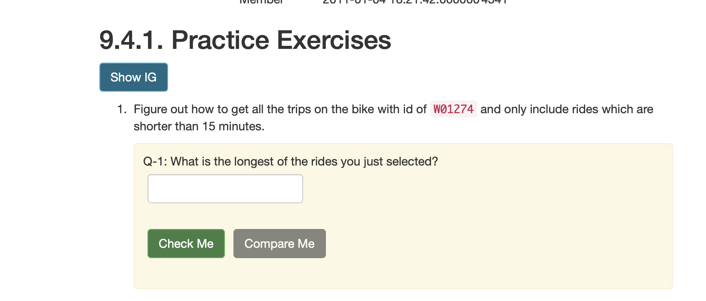
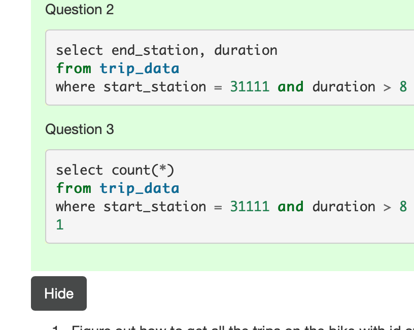

Mid-Summer Update — Runestone Interactive

# Mid-Summer Update

The July 4th holiday is just three days away, which for many of us in the academy marks the midpoint of the summer. To say that we have made some big strides in Runestone so far this summer is an understatement, and they are all coming to [https://runestone.academy](https://runestone.academy/) before the holiday. So, put on your seatbelts and get ready for the ride.

## New Stuff for Instructors and Students

There are several big changes to Runestone that should make life better for instructors this summer.

1. **Dynamic Pages** – wait, what? I thought Runestone pages were already far from static. You’re right, but you know that course building and rebuilding process you had to go through to create a course? Its gone! We now have a single copy of the most up-to-date version of each textbook that we can serve dynamically for you and your own bespoke course. You won’t really notice anything except that creating a course is now instantaneous, and the URL to your book is now going to be /runestone/books/published/yourbook instead of the old /runestone/static URL.

2. **In page progress indicators** Reading assignments are awesome, but they do have some potential pitfalls. Such as students doing work in the wrong course, or not understanding what they need to do on each page. So at the bottom of each page we have added a progress bar to show how many of the interactive activities on each page the student has tried.

1. **One scratch activecode per book** – One thing I learned last year in working more closely with instructors and having more time to listen to students is that most students were confused by the scratch activecode. In the past we had a different scratch activecode for each page for each student. This was confusing as students use these scratch activecode’s a lot, but were often confused about how to find something they were trying on a page somewhere that they could not recall. Now their entire history of all interactions will be available and scrollable through the history slider. Making history searchable is on the todo list somewhere…

2. **Navigation menu within the chapter** – another request that I’ve heard from many of you is to improve the navigation in the book. There are many different opinions on what is “best” in this area, but the one I like the best, and the one that keeps the book pages the most uncluttered, is to have a “This Chapter” menu in the navbar. This lets you quickly move to any page in your current chapter. If you want to change to a different chapter then you can click on the course name and that will bring you to the table of contents for the whole book. So, closer is one click away, and anything outside the current chapter is two clicks away. That makes sense to me. But I would love to hear feedback on this. Nothing is set in stone.

## New Stuff for Authors

1. **New activecode language** for writing about and working with SQL! Oh yeah, I love SQL! I love writing queries and I love teaching about how to “squeeze information out of a database,” a phrase my masters advisor John Carlis, repeated every day in our databases class. SQL queries are also “autogradeable” with a simle set of asserts. The database engine runs in-browser and is a fully operational version of SQLLite!

1. New **Spreadsheets** directive When trying to write a data science book last year, it was clear that both SQL and a Spreadsheet in the browser would really help. Now, thanks to the [jExcel Project](https://bossanova.uk/jexcel/v3/) We also have a very functional spreadshet running in the browser. Many many Excel/Sheets functions are supported, and it is also autogradeable through a series of assert statements. In addition, cells that students should be adding formulas to are colored in light blue to start with, and after grading are colored green or red to indicate whether they got it right. In addition there is text that also shows whether each test passed or not, and what the expected value was.

1. New **Instructor Only Reveals** So many people have asked for instructor materials for all of our books. One of the things the last year of working with Google has helped with is in actually getting some materials written. Its at least as much work as writing the book itself! So how to deliver these new materials? This is one of the first great features of the new dynamic pages model of serving. Buttons that are only included on the page if you are an instructor.

When you click on it the answer or any other helpful material is displayed.

Students will not even see the buttons. In some books these instructor materials will be “paid for” features. You will also need to do an extra level of proof that you are an instructor in order to gain access to these.

## Inside Baseball

1. Unit testing means better reliability and more agile development. We have invested a lot of time this summer in getting a good unit testing framework set up for the Runestone server. I’ve spent some portion of each day writing one or more unit tests. For the functionality required to serve books and collect data reliably we now have excellent test coverage. Not as good for some of the instructor supporting pages, but we are working on it, and they get a lot less traffic than the book pages. I’ve also done a lot of load testing on this new architecture and it seems that it should hold up quite well.

2. New dynamic architecture for more dynamic features in the future. In addition, the new dynamic architecture changes how we check that login/logout is handled. This should help with making sure that students are always in the course they should be in, rather than some random course they found with a Google search.

3. [http://interactivepython.org](http://interactivepython.org/) is gone. Well its not really gone, it has a permanent redirect to [https://runestone.academy](https://runestone.academy/). None of the old classes on interactivepython.org made the move. Registrations have been disabled for a year. This move has been coming for two years, so hopefully it doesn’t surprise anyone.

4. Both RunestoneComponents and RunestoneServer are running Python3. We had to keep Python2.7 a lot longer than I would have liked due to the web2py framework, but happily web2py now fully supports Python 3.7. I look forward to simplifying and dropping support for 2.7 once all this new stuff is live on academy.

## Caveats

That is a LOT of change! And, I plan to deploy all of these new features over the next week. Even with all of the testing we have done there is bound to be something we have missed that will break something. Please be patient, and please report it on our GitHub page!

1. If you have an existing course, in progress, on [Runestone Academy](https://runestone.academy/) that course should continue to work just fine. You will not be able to rebuild it as that functionality is gone.

2. Newly created courses will use the new dynamic pages feature. This means you don’t need to rebuild, you will automatically get updates that fix typos or squash bugs.

3. I’m introducing these changes during our summer “downtime” although I fully realize that our summer downtime is now busier than our peak traffic the first couple of years! This means that by the time classes start for people in the Northern Hemisphere in late august – the majority of our users – things should be in good shape.