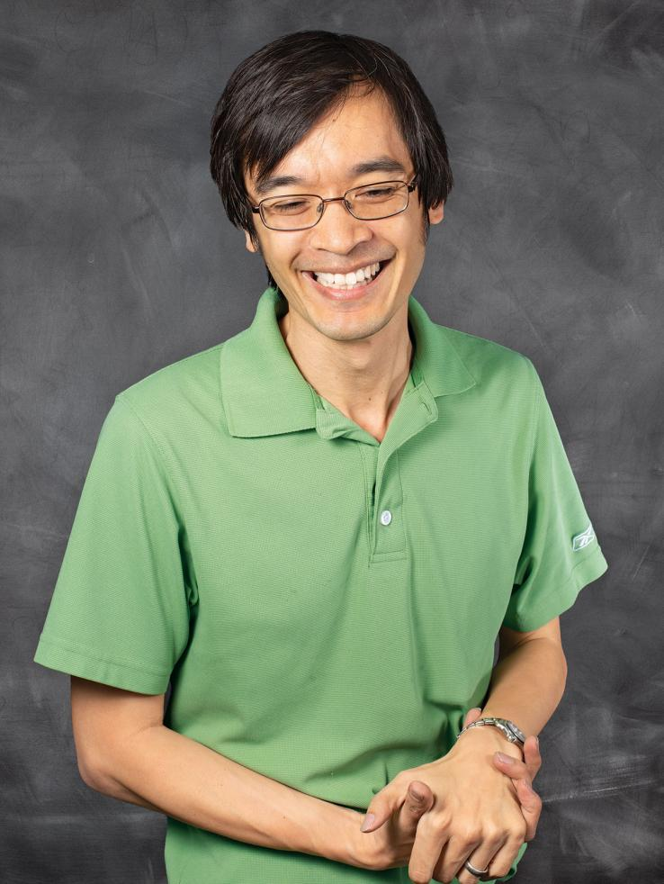
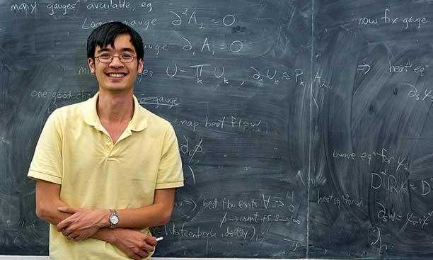
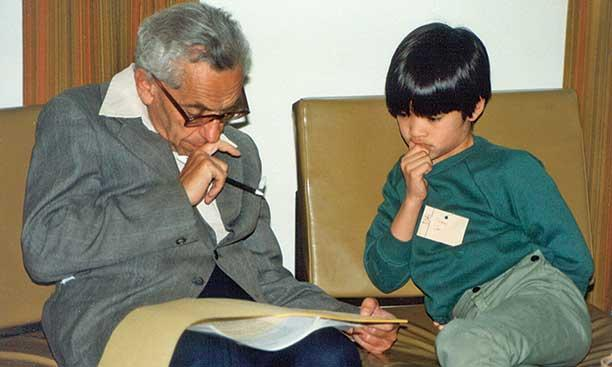
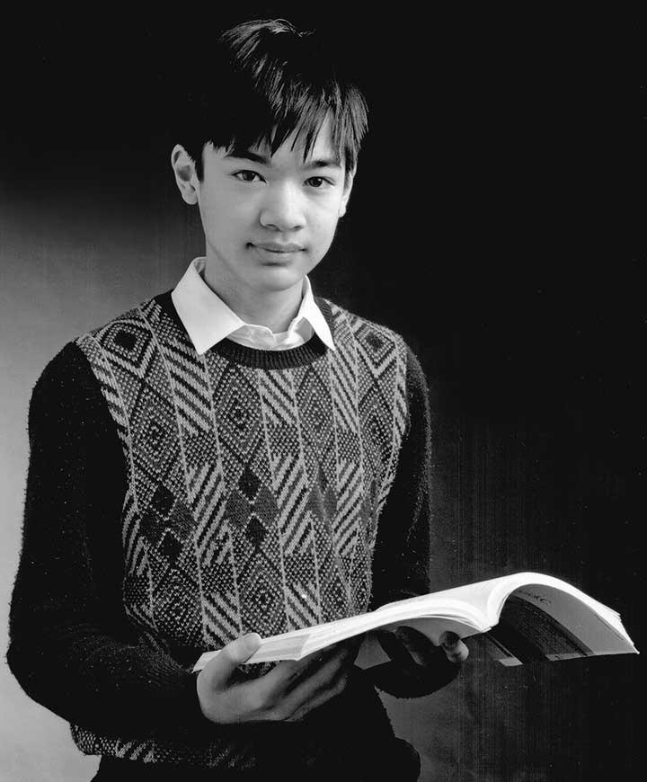
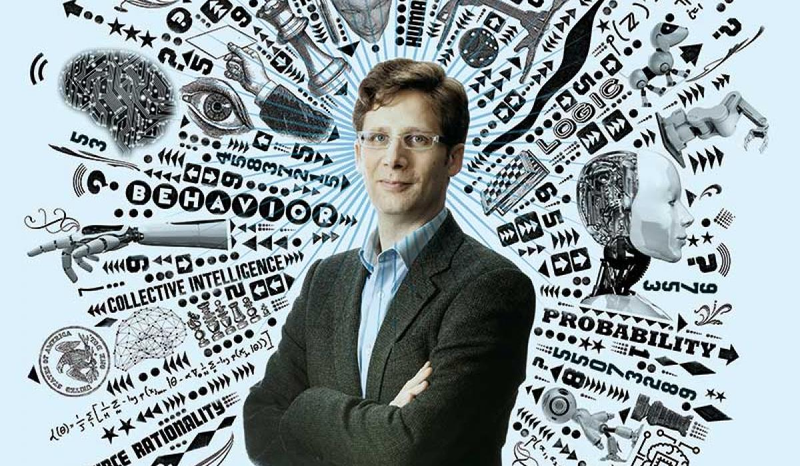
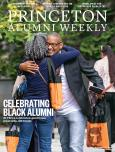

Mind of a Mathematician | Princeton Alumni Weekly

- [Inbox](https://paw.princeton.edu/inbox)
- [News + Features](https://paw.princeton.edu/news-and-features)
- [Princetonians](https://paw.princeton.edu/princetonians)
- [Memorials](https://paw.princeton.edu/memorials)
- [Books + Media](https://paw.princeton.edu/books-and-media)
- [Issue Archive](https://paw.princeton.edu/issues)
- Search

#### features

## Mind of a Mathematician

Terence Tao *96 was an extraordinary prodigy — and he’s still at it
Photo: Alyssa Bierce/UCLA

By [Mark F. Bernstein ’83](https://paw.princeton.edu/bio/mark-f-bernstein)

[Published in the November 13, 2019 Issue](https://paw.princeton.edu/issues/v120-n04-11132019)

1

[](http://www.facebook.com/share.php?u=https://paw.princeton.edu/node/218456&title=Mind%20of%20a%20Mathematician)

[](http://twitter.com/intent/tweet?status=Mind%20of%20a%20Mathematician+https://paw.princeton.edu/node/218456)

Terence Tao *96’s book, *Solving Mathematical Problems: A Personal Perspective,* is an engagingly slender volume, full of insights on how to approach problems in number theory, algebra, Euclidean geometry, and analytic geometry.

He was commissioned to write it by Deakin University, in Victoria, Australia, near his hometown of Adelaide, in the hope that it could be used to train secondary-school math teachers. Tao began by setting out some sensible strategies for problem-solving, including these: Understand the problem, understand the data, understand the objective, select good notation, and write down everything you know. He also hoped for something less rote. “A solution,” Tao proposed, “should be relatively short, understandable, and hopefully have a touch of elegance. It should be fun to discover.”

It’s worth noting that Tao wrote *Solving Mathematical Problems* in 1990, when he was 15 years old.

Now considered one of the world’s greatest mathematicians, Tao, a professor at UCLA, has been precocious his entire life. He scored 760 on the math portion of the SAT at the age of 9, earned his Ph.D. at 20, and was granted tenure at 24. He has been called “the Mozart of math.”

In 2006, when he was 31, Tao won the Fields Medal, which has been described as the mathematics equivalent of the Nobel Prize and is given out only every four years to mathematicians under 40 years of age. The International Mathematical Union, which awards the medal, praised Tao for his breakthroughs in partial differential equations, combinatorics, harmonic analysis, and additive number theory.

The awards and honors have only multiplied: the MacArthur fellowship (often informally called the “genius” grant), the National Science Foundation’s Alan T. Waterman Award, the Royal Society’s Royal Medal, the Royal Swedish Academy of Science’s Crafoord Prize, and the $3 million Breakthrough Prize in Mathematics. Now just 44, Tao has published 17 books and more than 300 research papers.

“Terry wrote 56 papers in two years and they’re all high-quality,” his UCLA colleague John Garnett marveled when Tao won the Fields Medal. “In a good year, I write three papers.”

Sitting in his office on a hot summer afternoon, clad in khakis and a royal blue Polo shirt, Tao is friendly and unassuming as he discusses his work. Many of the problems he has tackled involve the tension between order and randomness. It is a tension that appears all around him. Tao’s mind is orderly, but his cluttered office appears random. His career path has been orderly, but the appearance of mathematical genius in society seems random.

If reconciling this tension has been the work of a lifetime, Tao’s book may provide a useful framework for making the attempt. Understand the problem, understand the data, and write down everything you know.

**IMAGINE THAT YOU ARE TRAPPED **in a room with a hungry lion. Both you and the lion are represented as points in space. Suppose the lion can run faster than you. Suppose you can run faster than the lion. Suppose you and the lion can run at exactly the same speed. How do you avoid being eaten?

Professor Charles Fefferman *69, himself a Fields Medal recipient, remembers asking 9-year-old Terry Tao these hypotheticals, which are part of a field in mathematics and computer science known as pursuit games, in 1984. Tao’s father, Billy, had taken Terry around the world to meet some of the great mathematicians, to determine if his son had talent. In Princeton, Fefferman and Enrico Bombieri at the Institute for Advanced Study were the people Billy Tao wanted to meet.

The room fell silent with pondering for a while, Fefferman recalls, when Bombieri suddenly stood up, threw his arms in the air, roared like a lion, and playfully chased Tao around the room to break the tension. “For me,” Fefferman says, “that was the highlight of the interview.” Unfortunately for posterity, he can’t recall the details but says Tao answered his questions intelligently.

“I was impressed that a 9-year-old kid could come up with ideas to a math problem that wasn’t a conventional thing he had learned in any class,” Fefferman says.

Tao’s parents — his father was a pediatrician and his mother a high school math teacher — had not pushed him, but they had ample reason to suspect that their son, the oldest of three boys, might be special. He had taught himself how to read and do basic arithmetic when he was only 2. At 3, he remembers watching his grandmother wash the windows and wishing he could smear the detergent in the shape of numbers.

Photo: Reed Hutchinson/UCLA

.

No preschool could handle a child so advanced, so Tao remained at home until he was 5, his parents giving him a specially designed curriculum. By 6, he had taught himself the BASIC computer language and soon was taking high-school-level math classes. By 9, he was sitting in on lectures at Flinders University in Adelaide and working with private tutors. His parents held him out of full enrollment at Flinders until he was 14 because he was so much younger than anyone else on campus. Tao earned his bachelor’s degree there in two years and a master’s degree in one.

Fefferman and Bombieri were not the only world-renowned mathematicians Tao met at a young age. When he was 10, he met Paul Erdős, one of the most influential mathematicians of the 20th century, when Erdős was visiting Adelaide. Famously aloof with adults, Erdős loved talking to children, whom he called “epsilons” (in mathematical formulae, the Greek letter epsilon is used to represent a small quantity).

“To me he was just another nice old man. I didn’t know how famous he was,” Tao says. “One thing I do remember, he spoke to me like an adult, like an equal. He didn’t speak down to me.” Years later, Erdős wrote one of Tao’s letters of recommendation to Princeton, predicting, “I am sure he will develop into a first-rate mathematician and perhaps into a really great one.”

On his first day as a Princeton graduate student, in the fall of 1992, Tao stood in the lobby of Fine Hall and stared at the math department’s faculty directory. “I recognized half the names,” he recalls. “It was kind of intimidating.” He had chosen to work with Elias Stein, a giant in the field of harmonic analysis, the study of the properties and characteristics of sine waves. Tao still keeps Stein’s famous textbook, *Harmonic Analysis: Real-Variable Methods, Orthogonality, and Oscillatory Integrals,* on his desk at UCLA.

Graduate school was Tao’s first time away from home, and the transition proved difficult. His father stayed with him for the first week of classes to teach his son how to perform such basic tasks as doing laundry and opening a bank account. In his free time, Tao joined the Film Club and played foosball, online bridge, and computer games.

Tao admits that he coasted academically. Because everything had always come so easily, he had not developed good study skills. When it came time to prepare for his general exams, Tao spent only a few weeks thumbing through his sketchy notes, while others prepped for months. During the oral exam, with Stein and two other professors, Tao barely squeaked by. “I was very lucky. I was really close,” he says. Afterward, Stein diplomatically noted how disappointing Tao’s performance had been.

Though Tao resolved to work harder, the rarified levels of higher math proved challenging, even for him. While working on his dissertation, he would go to see Stein during office hours, queuing up with his other advisees. He gleefully imitates Stein sticking his head out the door and calling, “Neeext” in his nasal accent. Once inside, Tao would present his problem and perhaps outline the steps he had taken. Stein would nod, get up, rifle through his file cabinet, and pull an article from one of the mathematical journals.

“It was just striking,” Tao marvels, looking back. “I would spend hours and hours working on something, not very directed, and he would listen for five minutes and just from experience he would know a much more productive thing to do.”

Ten-year-old Terence Tao works with mathematician Paul Erdős in 1985.
Photo courtesy Tao family

.

**ALTHOUGH ERDŐS DIED IN 1996,** his work had a great influence on Tao’s career, particularly by sparking his interest in prime numbers, those numbers such as 2, 3, 5, 7, and 11 that are divisible only by themselves and 1. Although Euclid proved in 300 B.C. that there is an infinite number of prime numbers, they seem to occur haphazardly. Mathematicians have tried to divine whether there is some underlying structure.

One detectable pattern is the presence of twin primes — pairs of prime numbers, such as 5 and 7 or 11 and 13 or 29 and 31, that occur just two numbers apart from each other. Euclid believed there were an infinite number of these as well, but he could not prove it. In the 2,300 or so years since, neither has anyone else. Tao has spent much of his career trying.

In 2004, Tao and Ben Green at Oxford University decided to approach this by determining if there are an infinite number of primes equally separated by any number, not just 2. They analyzed a group of four proofs by Rutgers professor Endre Szemerédi. But those proofs don’t concern prime numbers, so they took Szemerédi’s theorem and “goosed it” (Tao’s words) until it did. “Every time Ben and I got stuck, there was always an idea from one of the four proofs that we could somehow shoehorn into our argument,” Tao remarked at the time.

Another feature of prime numbers is that, as numbers grow bigger, primes usually occur less frequently — but not always. For example, 360,287 and 360,289 are twin primes, but the primes on either side of them are much farther apart.

In 2013, Yitang Zhang, a mathematician at the University of New Hampshire, proved that there are an infinite number of primes that are separated by, at most, 70 million. This set off a worldwide effort to prove that there are also an infinite number of primes separated by smaller numbers. Pooling their efforts and intelligence, Tao and a dozen others threw themselves at the problem, at times narrowing the gap of primes every half hour. To date, they have managed to prove that there are an infinite number of primes separated by, at most, 246, but Tao still hopes someday to get it down to 2.

“I’ve proved a lot of other things related to prime numbers, but not that one,” he says. “That’s the one I would most love to have.”

In 2015, Tao proved a different number-theory conjecture known as the Erdős discrepancy, which began as a mathematical puzzle. Imagine that someone captures you and sticks you on a precipice. You can take only one step forward or one step backward without falling to your death. Can you construct an infinite set of steps that keeps you safe? Yes, if you alternate steps forward and backward, but suppose your captor gets to choose every third — or sixth — or some other numbered step for you. Now is there a sequence of steps that will keep you safe no matter what sequence your captor chooses?

Erdős thought that the answer was no, that eventually you would be forced to take either two steps forward or backward and fall. (He simplified this to imagine the steps as a string of numbers consisting only of 1’s and -1’s.) But he could never prove it. From 2010 to 2012, Tao and several other mathematicians batted around ideas to solve the problem, without success. Three years later, a German mathematician, Uwe Stroinski, suggested on Tao’s blog that the Erdős discrepancy might have similarities with something called the Elliott conjecture, in an unrelated field of math.

“At first, I thought the connection was only superficial,” Tao told *Nature* magazine, but within two weeks, thanks to Stroinski’s tip, he had solved the proof and confirmed what Erdős had believed: that no matter how many steps you are allowed to take, eventually you will fall off the precipice. Tao’s colleagues around the globe reacted with amazement. “Terry Tao just dropped a bomb,” Derrick Stolee, a mathematician at Iowa State University, tweeted on the day of the announcement.

**A NON-MATHEMATICIAN MIGHT ASK** if any of these problems have real-world applications, but is that fair? No one asks a poet what a new poem “does.” The poem’s simplicity, elegance, and beauty are sufficient reasons for its existence. Aren’t the same things true for a mathematical proof?

Tao ponders this question for a moment. “I do think we have a bit more of an obligation than poets because we receive more federal funding,” he says finally, with a slight smile. “So we can’t say we pursue something solely for its artistic value. What we do is basic research.” In fact, though, some of Tao’s work has had important real-world applications, none more so than compressed sensing, a process in which digital cameras can use complicated algorithms to create precise images using only a tiny amount of data.

In 2004, Emmanuel Candes, a mathematician at the California Institute of Technology, was trying to find a way to reconstruct images taken by an MRI machine with the smallest amount of data. By serendipity, Candes’ and Tao’s children attended the same preschool, and the two mathematicians would often talk at drop-off. Candes explained his problem to Tao, whose reaction, as *Smithsonian* magazine later put it, “was vintage Tao. First he told Candes the problem was unsolvable. Then a couple of minutes later, he allowed that Candes might be on to something. By the next day, Tao had solved the problem himself.”

Compressed sensing has since been adapted for a number of uses, from making quicker MRI scans that expose patients to less radiation to cellphone cameras that can produce vivid photographs from relatively few pixels, using the algorithms Tao and Candes devised to reconstruct the rest of the image. (Stanford mathematician David Donoho ’78, who had also been working on the problem, came up with a similar solution independently.)

This photo was used on the cover of the first edition of Tao’s book Solving Mathematical Problems, which he wrote when he was 15.

Photo courtesy Tao family

.

**PERHAPS TAO’S MOST FANCIFUL** work addresses something called Navier-Stokes equations, which govern the flow of fluids, including air currents. In this case, let us hope that it does not have a real-world application.

Scientists don’t know whether solutions to the Navier-Stokes equations must behave smoothly throughout the fluid (for example, an ocean) and exist for all time, a condition known as global regularity. The equations were written in the 19th century, but they are not well understood and some believe that they hold the key to understanding phenomena from ocean currents to the spread of air pollution. In 2000, the Clay Mathematics Institute, a nonprofit foundation based in Peterborough, N.H., offered a $1 million prize to anyone who could prove or disprove global regularity, calling it one of the seven most important open questions in mathematics.

Tao has approached the problem from an unusual angle. He imagines a universe governed by rules slightly different from ours in which water could, under extreme conditions, behave in impossible ways. He has speculated that water could even turn itself into what might be called a minicomputer, transferring energy into smaller and smaller spaces until it acquires such a large velocity that it blows up. So far, Tao has not solved the Navier-Stokes equations. His conjecture about an exploding water computer exists only in an alternative universe but, he says, there is no mathematical reason why it couldn’t work in the real world.

“If it works,” Fefferman says, “it will be mind-blowing.”

**THESE EXAMPLES ONLY SCRATCH THE SURFACE** of the range of work Tao has undertaken. From day to day or month to month, he moves among projects as his time, teaching schedule, and interests dictate.

For someone who is, in many respects, so unusual, it comes as a bit of a surprise that Tao lives a remarkably normal life. He and his wife, Laura, an engineer at NASA’s Jet Propulsion Lab, live near the UCLA campus with their two children. Tao rides his bicycle to work and likes to watch *Doctor Who.* He is the furthest thing from a prima donna. After he won the Breakthrough Prize in 2015, Tao told *Scientific American,* “I don’t feel like I’ve done enough yet.” He used the $3 million prize to endow fellowships for graduate students in developing countries and gifted American high school students.

Whatever his own gifts may be, Tao rejects the notion that mathematics is reserved for geniuses. Yes, he has heard people call him the Mozart of math. It’s a moniker he dislikes; he has seen the 1984 movie *Amadeus.* “Mozart is portrayed as a complete buffoon and really annoying, and I don’t want to be like that,” Tao explains. “Also, he dies very young.”

Sly humor aside, Tao’s reasons go deeper. Remarkably, the character who moves him is not Mozart but his rival, Antonio Salieri. “Someone described *[Amadeus]* as one of the best depictions of mediocrity, of what it’s like to have enough talent to recognize genius but not enough to be one,” Tao says. “All academics feel for the Salieri character.”

If music came to Mozart from some divine inspiration, Tao says that his insights arrive, when they do, after much hard work. He gets ideas from reading, from other mathematicians, from taking long walks. Sometimes, one idea reminds him of a similar problem he saw somewhere else that might prove useful now. Most paths lead nowhere, but he learns something even in the cul de sacs.

“Once you solve a problem,” he continues, “you tend to remember only the short path that got you from A to B. You forgot all the dead ends. It’s a bit of a shame. It gives the wrong impression that people who are good at mathematics only choose the right steps. But there is a lot of trial and error and really terribly embarrassing ideas. Sometimes there is a ‘eureka’ moment, but it’s more of a hitting-your-head moment: ‘Of course, why was I so dense?’ ”

The process of problem-solving, he emphasizes, is “non-linear.” In the end, though, is mathematics — is the universe — orderly or random? Tao warms to the question.

“It depends on where you look,” he says. “At the extremely microscopic level, the laws of nature are ordered. Particles and quantum waves obey very rigid waves of mechanics. But as you go to more complicated objects, molecules and living creatures, then it becomes more chaotic and unpredictable.

“There’s this weird mathematical phenomenon called universality. You get very complicated systems, of atoms or people, but if you look at it at a large-enough scale, order starts emerging. Einstein once said that the most incomprehensible thing about the universe is that it is comprehensible. It is very complicated, but at certain levels, patterns appear again.

“So there is order — sometimes — but there is also chaos.”
*Mark F. Bernstein ’83 is PAW’s senior writer.*

 **Tags: **
#[Graduate Alumni](https://paw.princeton.edu/tags/graduate-alumni)

[## What Readers Are Saying]()
Read letters and comments from PAW’s Inbox

### [Balancing Art and Usefulness](https://paw.princeton.edu/inbox/balancing-art-and-usefulness)

By Rebecca Orris *97

 [Keep reading](https://paw.princeton.edu/node/219441)

 

Featured Authors

### [Jenny Wiley Legath *08 Reveals Roots and Influence of Protestant Deaconesses](https://paw.princeton.edu/article/jenny-wiley-legath-08-reveals-roots-and-influence-protestant-deaconesses)

 

Features

### [Of Minds and Machines](https://paw.princeton.edu/article/minds-and-machines)

Tom Griffiths combines psychology and artificial intelligence

## Web Exclusives

 

Featured Authors

### [Jenny Wiley Legath *08 Reveals Roots and Influence of Protestant Deaconesses](https://paw.princeton.edu/article/jenny-wiley-legath-08-reveals-roots-and-influence-protestant-deaconesses)

 

Tiger of the Week

### [J Lind ’18 Turns His Experiences as a Hospice Volunteer into Music](https://paw.princeton.edu/article/j-lind-18-turns-his-experiences-hospice-volunteer-music)

 

On the Campus

### [U.S. Supreme Court Hears Arguments on DACA Protections](https://paw.princeton.edu/article/us-supreme-court-hears-arguments-daca-protections)

 

Sports

### [Football: Dartmouth Topples Princeton in Unbeaten Battle at Yankee Stadium](https://paw.princeton.edu/article/football-dartmouth-topples-princeton-unbeaten-battle-yankee-stadium)

 

Featured Authors

### [Dana R. Fisher ’93 Studies Grassroots Activism and the Blue Wave](https://paw.princeton.edu/article/dana-r-fisher-93-studies-grassroots-activism-and-blue-wave)

 

Alumni News

### [PAWcast: Jordan Bimm on the Legacy of Astronaut Pete Conrad ’53](https://paw.princeton.edu/podcast/pawcast-jordan-bimm-legacy-astronaut-pete-conrad-53)

#### **An editorially independent magazine by alumni for alumni since 1900**

## Newsletter Sign-Up

## Inside TheCurrent Issue

Celebrating black alumni; math star Terence Tao *96; a Nobel for Jim Peebles *62

[In This Issue](https://paw.princeton.edu/issues/v120-n04-11132019)
[From The Editor](https://paw.princeton.edu/)

[Download PDF](https://paw.princeton.edu/sites/default/files/pdf/11132019_issue.pdf)

## Subscribe Now

Parents and non-alumni can receive all 14 issues of PAW for $22 a year ($26 for international addresses).

[Let’s Get Started](https://paw.princeton.edu/subscribe)

- [About PAW](https://paw.princeton.edu/page/about-paw)
- [Reader Services](https://paw.princeton.edu/page/reader-services-z)
- [Web Exclusives](https://paw.princeton.edu/web-exclusives)
- [Classifieds](https://paw.princeton.edu/classifieds)
- [Advertising](https://paw.princeton.edu/page/advertising)
- [FAQ](https://paw.princeton.edu/faq)
- [](https://twitter.com/pawprinceton)
- [](https://www.facebook.com/pawprinceton)
- [](https://www.linkedin.com/company/princeton-alumni-weekly/)
- [](https://www.instagram.com/pawprinceton/)
- [Inbox](https://paw.princeton.edu/inbox)
- [News + Features](https://paw.princeton.edu/news-and-features)
- [Princetonians](https://paw.princeton.edu/princetonians)
- [Memorials](https://paw.princeton.edu/memorials)
- [Books + Media](https://paw.princeton.edu/books-and-media)
- [Issue Archive](https://paw.princeton.edu/issues)
- Search

- [Contact Us](https://paw.princeton.edu/node/22)
- [Alumni Association](http://alumni.princeton.edu/)
- [Princeton.edu](http://www.princeton.edu/main/)

© 2019 The Trustees of Princeton University