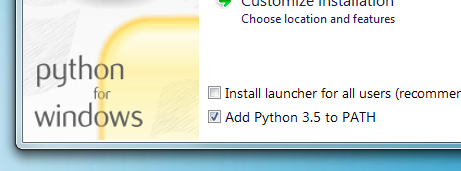
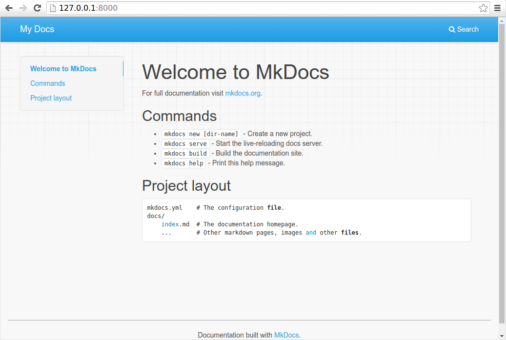
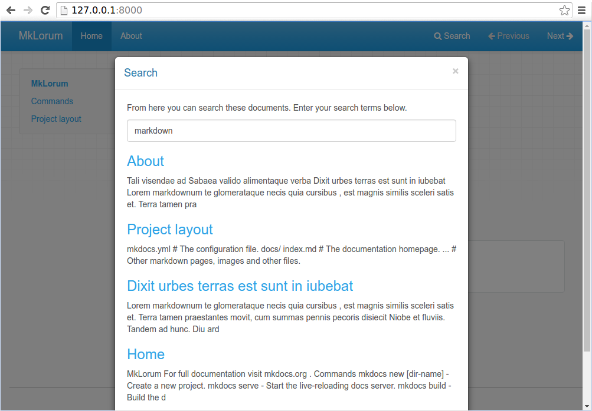
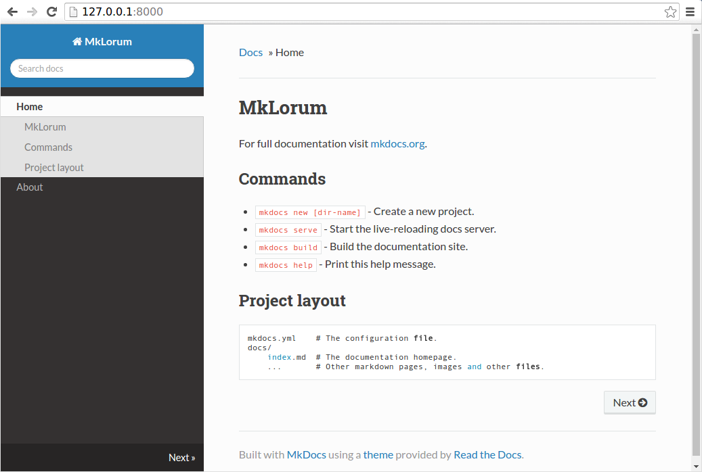

MkDocs

# MkDocs

Project documentation with Markdown.

* * *

## Overview[](https://www.mkdocs.org/#overview)

MkDocs is a **fast**, **simple** and **downright gorgeous** static site generator that's geared towards building project documentation. Documentation source files are written in Markdown, and configured with a single YAML configuration file. Start by reading the introduction below, then check the User Guide for more info.

### Host anywhere

MkDocs builds completely static HTML sites that you can host on GitHub pages, Amazon S3, or [anywhere](https://www.mkdocs.org/user-guide/deploying-your-docs/) else you choose.

### Great themes available

There's a stack of good looking [themes](https://www.mkdocs.org/user-guide/styling-your-docs/) available for MkDocs. Choose between the built in themes: [mkdocs](https://www.mkdocs.org/user-guide/styling-your-docs/#mkdocs) and [readthedocs](https://www.mkdocs.org/user-guide/styling-your-docs/#readthedocs), select one of the 3rd party themes listed on the [MkDocs Themes](https://github.com/mkdocs/mkdocs/wiki/MkDocs-Themes) wiki page, or [build your own](https://www.mkdocs.org/user-guide/custom-themes/).

### Preview your site as you work

The built-in dev-server allows you to preview your documentation as you're writing it. It will even auto-reload and refresh your browser whenever you save your changes.

### Easy to customize

Get your project documentation looking just the way you want it by customizing the [theme](https://www.mkdocs.org/user-guide/configuration/#theme) and/or installing some [plugins](https://www.mkdocs.org/user-guide/plugins/).

* * *

## Installation

### Install with a Package Manager

If you have and use a package manager (such as [apt-get](https://help.ubuntu.com/community/AptGet/Howto), [dnf](https://dnf.readthedocs.io/en/latest/index.html), [homebrew](https://brew.sh/),[yum](http://yum.baseurl.org/), [chocolatey](https://chocolatey.org/), etc.) to install packages on your system, then you may want to search for a "MkDocs" package and, if a recent version is available, install it with your package manager (check your system's documentation for details). That's it, you're done! Skip down to [Getting Started](https://www.mkdocs.org/#getting-started).

If your package manager does not have a recent "MkDocs" package, you can still use your package manager to install "Python" and "pip". Then you can use pip to[install MkDocs](https://www.mkdocs.org/#installing-mkdocs).

### Manual Installation

In order to manually install MkDocs you'll need [Python](https://www.python.org/) installed on your system, as well as the Python package manager, [pip](https://pip.readthedocs.io/en/stable/installing/). You can check if you have these already installed from the command line:

	$ python --version
	Python 2.7.14
	$ pip --version
	pip 18.1 from /usr/local/lib/python2.7/site-packages/pip (python 2.7)

MkDocs supports Python versions 2.7.9+, 3.4, 3.5, 3.6, 3.7, and pypy.

#### Installing Python

Install [Python](https://www.python.org/) by downloading an installer appropriate for your system from[python.org](https://www.python.org/downloads/) and running it.

Note

If you are installing Python on Windows, be sure to check the box to have Python added to your PATH if the installer offers such an option (it's normally off by default).

#### Installing pip

If you're using a recent version of Python, the Python package manager, [pip](https://pip.readthedocs.io/en/stable/installing/), is most likely installed by default. However, you may need to upgrade pip to the lasted version:

	pip install --upgrade pip

If you need to install [pip](https://pip.readthedocs.io/en/stable/installing/) for the first time, download [get-pip.py](https://bootstrap.pypa.io/get-pip.py). Then run the following command to install it:

	python get-pip.py

#### Installing MkDocs

Install the `mkdocs` package using pip:

	pip install mkdocs

You should now have the `mkdocs` command installed on your system. Run `mkdocs --version` to check that everything worked okay.

	$ mkdocs --version
	mkdocs, version 0.15.3

Note

If you would like manpages installed for MkDocs, the [click-man](https://github.com/click-contrib/click-man) tool can generate and install them for you. Simply run the following two commands:

	pip install click-man
	click-man *--target path/to/man/pages mkdocs*

See the [click-man documentation](https://github.com/click-contrib/click-man#automatic-man-page-installation-with-setuptools-and-pip) for an explanation of why manpages are not automatically generated and installed by pip.

Note

If you are using Windows, some of the above commands may not work out-of-the-box.

A quick solution may be to preface every Python command with `python -m`like this:

	python -m pip install mkdocs
	python -m mkdocs

For a more permanent solution, you may need to edit your `PATH` environment variable to include the `Scripts` directory of your Python installation. Recent versions of Python include a script to do this for you. Navigate to your Python installation directory (for example `C:\Python34\`), open the`Tools`, then `Scripts` folder, and run the `win_add2path.py` file by double clicking on it. Alternatively, you can [download](https://svn.python.org/projects/python/trunk/Tools/scripts/win_add2path.py) the script and run it (`python win_add2path.py`).

* * *

## Getting Started

Getting started is super easy.

	mkdocs new my-project
	cd my-project

Take a moment to review the initial project that has been created for you.

There's a single configuration file named `mkdocs.yml`, and a folder named`docs` that will contain your documentation source files. Right now the `docs`folder just contains a single documentation page, named `index.md`.

MkDocs comes with a built-in dev-server that lets you preview your documentation as you work on it. Make sure you're in the same directory as the `mkdocs.yml`configuration file, and then start the server by running the `mkdocs serve`command:

	$ mkdocs serve
	INFO    -  Building documentation...
	INFO    -  Cleaning site directory
	[I 160402 15:50:43 server:271] Serving on http://127.0.0.1:8000
	[I 160402 15:50:43 handlers:58] Start watching changes
	[I 160402 15:50:43 handlers:60] Start detecting changes

Open up `http://127.0.0.1:8000/` in your browser, and you'll see the default home page being displayed:

The dev-server also supports auto-reloading, and will rebuild your documentation whenever anything in the configuration file, documentation directory, or theme directory changes.

Open the `docs/index.md` document in your text editor of choice, change the initial heading to `MkLorum`, and save your changes. Your browser will auto-reload and you should see your updated documentation immediately.

Now try editing the configuration file: `mkdocs.yml`. Change the[`site_name`](https://www.mkdocs.org/user-guide/configuration/#site_name) setting to `MkLorum` and save the file.

	site_name: MkLorum

Your browser should immediately reload, and you'll see your new site name take effect.

## Adding pages

Now add a second page to your documentation:

	curl 'https://jaspervdj.be/lorem-markdownum/markdown.txt' > docs/about.md

As our documentation site will include some navigation headers, you may want to edit the configuration file and add some information about the order, title, and nesting of each page in the navigation header by adding a [`nav`](https://www.mkdocs.org/user-guide/configuration/#nav)setting:

	site_name: MkLorum
	nav:

	    - Home: index.md
	    - About: about.md

Save your changes and you'll now see a navigation bar with `Home` and `About`items on the left as well as `Search`, `Previous`, and `Next` items on the right.

Try the menu items and navigate back and forth between pages. Then click on`Search`. A search dialog will appear, allowing you to search for any text on any page. Notice that the search results include every occurrence of the search term on the site and links directly to the section of the page in which the search term appears. You get all of that with no effort or configuration on your part!

## Theming our documentation

Now change the configuration file to alter how the documentation is displayed by changing the theme. Edit the `mkdocs.yml` file and add a [`theme`](https://www.mkdocs.org/user-guide/configuration/#theme) setting:

	site_name: MkLorum
	nav:

	    - Home: index.md
	    - About: about.md

	theme: readthedocs

Save your changes, and you'll see the ReadTheDocs theme being used.

## Changing the Favicon Icon

By default, MkDocs uses the [MkDocs favicon](https://www.mkdocs.org/img/favicon.ico) icon. To use a different icon, create an `img` subdirectory in your `docs_dir` and copy your custom `favicon.ico` file to that directory. MkDocs will automatically detect and use that file as your favicon icon.

## Building the site

That's looking good. You're ready to deploy the first pass of your `MkLorum`documentation. First build the documentation:

	mkdocs build

This will create a new directory, named `site`. Take a look inside the directory:

	$ ls site
	about  fonts  index.html  license  search.html
	css    img    js          mkdocs   sitemap.xml

Notice that your source documentation has been output as two HTML files named`index.html` and `about/index.html`. You also have various other media that's been copied into the `site` directory as part of the documentation theme. You even have a `sitemap.xml` file and `mkdocs/search_index.json`.

If you're using source code control such as `git` you probably don't want to check your documentation builds into the repository. Add a line containing`site/` to your `.gitignore` file.

	echo "site/" >> .gitignore

If you're using another source code control tool you'll want to check its documentation on how to ignore specific directories.

After some time, files may be removed from the documentation but they will still reside in the `site` directory. To remove those stale files, just run `mkdocs`with the `--clean` switch.

	mkdocs build --clean

## Other Commands and Options

There are various other commands and options available. For a complete list of commands, use the `--help` flag:

	mkdocs --help

To view a list of options available on a given command, use the `--help` flag with that command. For example, to get a list of all options available for the`build` command run the following:

	mkdocs build --help

## Deploying

The documentation site that you just built only uses static files so you'll be able to host it from pretty much anywhere. [GitHub project pages](https://help.github.com/articles/creating-project-pages-manually/) and [Amazon S3](https://docs.aws.amazon.com/AmazonS3/latest/dev/WebsiteHosting.html) may be good hosting options, depending upon your needs. Upload the contents of the entire `site` directory to wherever you're hosting your website from and you're done. For specific instructions on a number of common hosts, see the[Deploying your Docs](https://www.mkdocs.org/user-guide/deploying-your-docs/) page.

## Getting help

To get help with MkDocs, please use the [discussion group](https://groups.google.com/forum/#!forum/mkdocs), [GitHub issues](https://github.com/mkdocs/mkdocs/issues) or the MkDocs IRC channel `#mkdocs` on freenode.