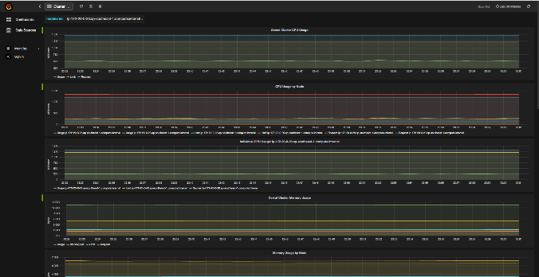
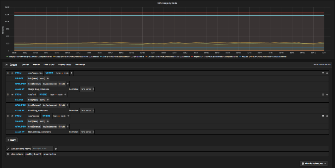
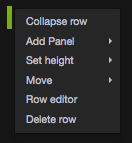
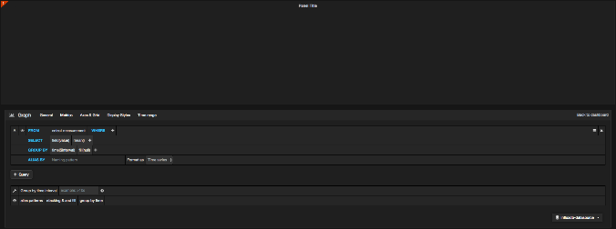
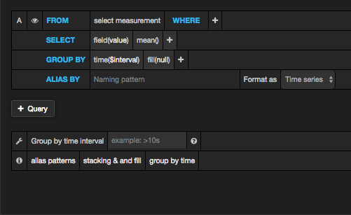
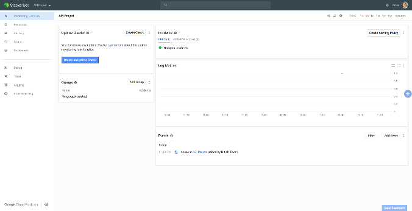

Monitoring Kubernetes with Heapster

# Monitoring Kubernetes with Heapster

16 Aug 2016

Share:

 [](https://twitter.com/intent/tweet?text=Monitoring%20Kubernetes%20with%20Heapster&via=opendeis&url=https://deis.com/blog/2016/monitoring-kubernetes-with-heapster/)  [](https://www.facebook.com/sharer.php?u=https://deis.com/blog/2016/monitoring-kubernetes-with-heapster/)    [** ](https://www.reddit.com/submit?url=https://deis.com/blog/2016/monitoring-kubernetes-with-heapster/)

 [(L)](https://www.reddit.com/submit?url=https%3A%2F%2Fdeis.com%2Fblog%2F2016%2Fmonitoring-kubernetes-with-heapster%2F&title=)10 points on [reddit](https://www.reddit.com/submit?url=https%3A%2F%2Fdeis.com%2Fblog%2F2016%2Fmonitoring-kubernetes-with-heapster%2F&title=)

 [

|     |     |
| --- | --- |
| ()** | 5   |

](http://news.ycombinator.com/item?id=12298204)

In my [last post](https://deis.com/blog/2016/mean-applications-on-deis-workflow/) we saw how to install Deis Workflow on AWS EC2 and then deploy an Express.js application using the `git push` trigger. With Deis Workflow taking control of the build process, it all looked very smooth.

But, understanding how an app behaves after deployment is crucial for scaling the application and providing a reliable service.

To do that, we need to measure and analyze the performance of our apps. And in this post, we're going to look at how we can start to do that with Heapster, InfluxDB, and Grafana. This technique will work with Kubernetes by itself, and with [Deis Workflow](https://deis.com/workflow/how-it-works).

## A Quick Intro

### Heapster

[Heapster](https://github.com/kubernetes/heapster) is a cluster-wide aggregator of monitoring and event data. It supports Kubernetes natively and works on all Kubernetes setups, including our Deis Workflow setup. Heapster runs as a pod in the cluster, similar to how any other Kubernetes application would run.

The Heapster pod discovers all nodes in the cluster and queries usage information from each node's [Kubelet](http://kubernetes.io/docs/admin/kubelet/)—the on-machine Kubernetes agent. The Kubelet itself fetches the data from [cAdvisor](https://github.com/google/cadvisor).

Heapster groups the information by pod along with the relevant labels. This data is then pushed to a configurable backend for storage and visualization.

### InfluxDB and Grafana

[InfluxDB](https://github.com/influxdata/influxdb) is an open source database written in Go specifically to handle time series data with high availability and high performance requirements. It exposes an easy to use API to write and fetch time series data. Heapster is set up to use InfluxDB as the storage backend by default on most Kubernetes clusters.

[Grafana](http://grafana.org/) is the data visualization component in our monitoring setup. It is available out of the box in a Kubernetes cluster. The default dashboard displays resource usage of the cluster and the pods inside of it. This dashboard can easily be customized and expanded.

InfluxDB and Grafana already run in pods exposing themselves as Kubernetes services, making it easy for Heapster to discover them. With all of this already in place, there is minimal setup required to get things up and running.

### Availability

It is important to mention here that Heapster, Grafana, and InfluxDB are Kubernetes [addons](http://kubernetes.io/docs/admin/cluster-components/). These tools may or may not be available on all Kubernetes clusters.

For example, if you're running your Kubernetes cluster on AWS and used the [kube-up](http://kubernetes.io/docs/getting-started-guides/aws/) script to boot it, you'll have Heapster, Grafana, and InfluxDB available. But, if you used CoreOS VMs to bootup Kubernetes, you'll have to manually install Heapster, Grafana, and InfluxDB.

In this tutorial, we used Kubernetes on AWS EC2, so we'll skip the steps to install the monitoring components. However, you can use [this guide](https://github.com/kubernetes/heapster/blob/master/docs/influxdb.md) to do that easily.

So, with intros out of the way, let's take a look at how these tools can help.

## Starting With Grafana

While setting up Deis Workflow, after the step where you set up the Kubernetes cluster, you get a message like this:

	Kubernetes master is running at https://52.77.178.198
	Elasticsearch is running at https://52.77.178.198/api/v1/proxy/namespaces/kube-system/services/elasticsearch-logging
	Heapster is running at https://52.77.178.198/api/v1/proxy/namespaces/kube-system/services/heapster
	Kibana is running at https://52.77.178.198/api/v1/proxy/namespaces/kube-system/services/kibana-logging
	KubeDNS is running at https://52.77.178.198/api/v1/proxy/namespaces/kube-system/services/kube-dns
	kubernetes-dashboard is running at https://52.77.178.198/api/v1/proxy/namespaces/kube-system/services/kubernetes-dashboard
	Grafana is running at https://52.77.178.198/api/v1/proxy/namespaces/kube-system/services/monitoring-grafana
	InfluxDB is running at https://52.77.178.198/api/v1/proxy/namespaces/kube-system/services/monitoring-influxdb

As you may have already noticed from this output, Kubernetes told us that Heapster, InfluxDB, and Grafana are running at various URLs

Alternatively, you can run `kubectl cluster-info` to query the cluster. You'll get the same response as above.

Open the provided Grafana URL in your browser. You may get an invalid certificate warning, but you can safely ignore it. You'll then be asked to enter the user ID and password.

These credentials are created by default during the Kubernetes installation and are available in the `~/.kube/config` file. Open the file in your text editor. You'll see the ID and password. Enter these credentials on the Grafana web page.

After logging in, you'll be able to see the Grafana start page. You can then check out the *Cluster* or the *Pods* dashboard.

Here is how the default *Cluster* dashboard looks:

This dashboard displays the cluster level details like CPU, memory, network, file system usage, and more. However if you're looking for specific data points or a custom dashboard, you can do that too. Let's take a look.

## Editing Graphs

To edit an existing graph, click on it's name. You'll see the options "View, Edit, Duplicate, Share". Select *Edit*.

You'll then be taken to a new page with only that graph and an editing interface.

From here, you can change the query, add a new one, or even customize the text, layout, and other aspects of the graph.

## Adding New Graphs

There are around 12 graphs available by default. These include variations of the memory, CPU, network, and file system usage for individual nodes as well as the whole cluster.

Only a few of these graphs are available on the default dashboard.

To add an existing graph to your dashboard, select the *New Row* button at the bottom of the dashboard page. You'll see a new row created, with a green icon on the left of the row. Select the icon to reveal the options.

Here you can add a panel containing a graph, a table, or a stat. Just select the relevant option. For example, if you add a graph, you'll be taken to the graph edit page, which looks the same as before, but with a clean slate.

Built-in graphs are generally enough for projects where developers want to get a feel of resource usage and overall performance. But if you have a special use case and need to dig a little deeper, Grafana supports that well with the *query editor*—a powerful tool that lets you create graphs from scratch.

Here's what the query editor looks like:

To learn more about the data you can query, check out [the docs](https://github.com/kubernetes/heapster/blob/master/docs/storage-schema.md).

## Other Options

You can use other tools with this data, like the *[Google Cloud Monitoring](https://app.google.stackdriver.com/account/login/?next=/)* (GCM) console.

Google Cloud Monitoring is a hosted monitoring service that allows you to visualize and get alerts for important metrics in your application.

Heapster can be set up to automatically push all collected metrics to GCM.
To do that, restart the Heapster service in your cluster by running:

	$ kubectl create -f deploy/kube-config/google/

This will set GCM as the target for Heapster metrics.
You can then access [the GCM dashboard](https://app.google.stackdriver.com/).

Create a new dashboard here and add the desired charts. Select *Custom Metric* as the resource type and you'll see all Heapster metrics under the `kubernetes.io` namespace. You can also narrow down the query by the metric labels provided.

It is also possible to query the Google Cloud Monitoring data directly using their [custom metric read API](https://cloud.google.com/monitoring/v2beta2/timeseries/list).

## Conclusion

In this post we learnt about Heapster, InfluxDB, and Grafana.

Since we used AWS EC2, we had Heapster, InfluxDB, and Grafana available out of the box in our Kubernetes cluster. We saw how to get the setup running and display performance metrics in a couple of minutes.

We also took a look at how to set up Google Cloud Monitoring to view the results collected via Heapster.

But it doesn't end here. There are many ways to work with Kubernetes, and thankfully, many ways to monitor Kubernetes. For example, check out the [satellite](https://github.com/gravitational/satellite) project from Gravitational, Datadog's Kubernetes [integration](https://www.datadoghq.com/blog/corral-your-docker-containers-with-kubernetes-monitoring/), and [Sysdig Cloud](https://sysdig.com/blog/monitoring-kubernetes-with-sysdig-cloud/).

Posted in monitoring, Deis, Kubernetes, Heapster

Share:

 [](https://twitter.com/intent/tweet?text=Monitoring%20Kubernetes%20with%20Heapster&via=opendeis&url=https://deis.com/blog/2016/monitoring-kubernetes-with-heapster/)  [](https://www.facebook.com/sharer.php?u=https://deis.com/blog/2016/monitoring-kubernetes-with-heapster/)    [** ](https://www.reddit.com/submit?url=https://deis.com/blog/2016/monitoring-kubernetes-with-heapster/)

 [(L)](https://www.reddit.com/submit?url=https%3A%2F%2Fdeis.com%2Fblog%2F2016%2Fmonitoring-kubernetes-with-heapster%2F&title=)10 points on [reddit](https://www.reddit.com/submit?url=https%3A%2F%2Fdeis.com%2Fblog%2F2016%2Fmonitoring-kubernetes-with-heapster%2F&title=)

 [

|     |     |
| --- | --- |
| ()** | 5   |

](http://news.ycombinator.com/item?id=12298204)

 

* * *

## Did you enjoy this post?

Subscribe for future updates:

 

Follow Deis:

 [](https://twitter.com/opendeis)  [](http://stackoverflow.com/questions/tagged/deis?sort=active)  [](https://github.com/deis)  [](https://slack.deis.io/)

       **

                 **

           **    **        **

                 **

       **    **  **

     **      **          **    **

   

[Community](https://deis.com/community)

[Docs](https://deis.com/docs/)

[Services](https://deis.com/services)

[Company](https://deis.com/about)

[Privacy Policy](https://deis.com/policies/privacy)