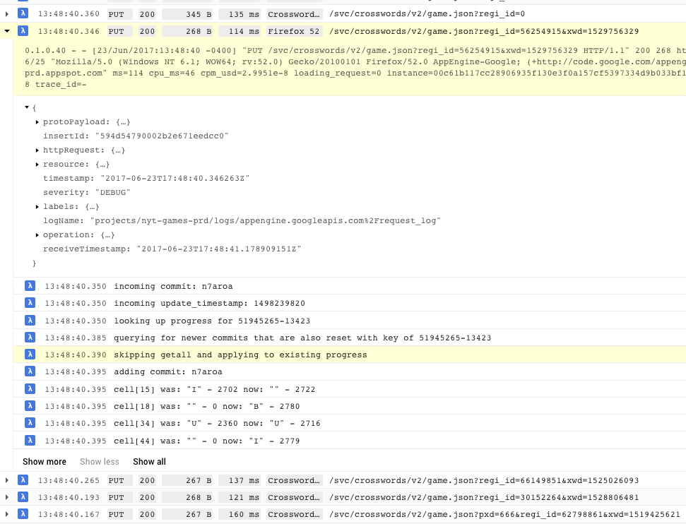
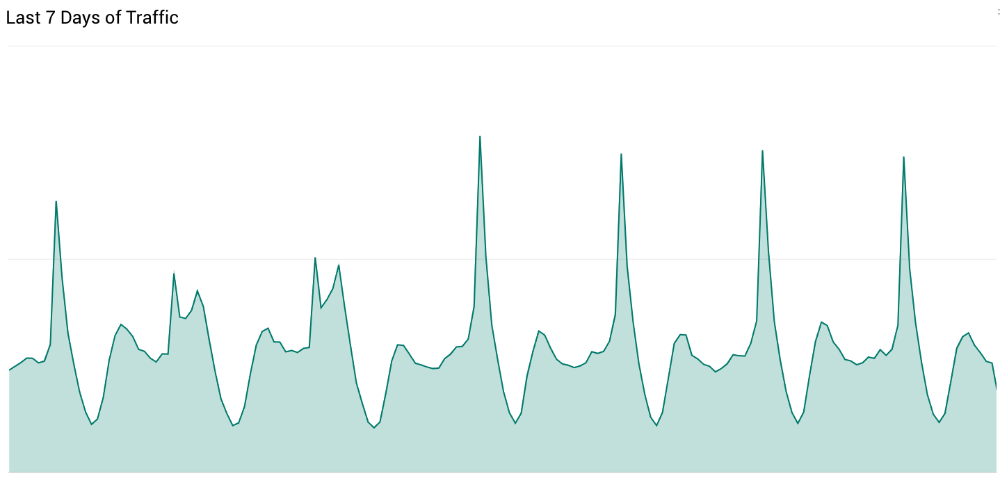

Moving The New York Times Games Platform to Google App Engine

# **Moving The New York Times Games Platform to Google App Engine**

Illustration by Kevin Zweerink for The New York Times

The New York Times crossword has been an integral part of daily life for many people since it started appearing in print in 1942. When The Times built its first website in 1996, a digital version of the crossword followed shortly after as a stand-alone digital product. Though it was first built as a web-based Java applet, the crossword has grown into a suite of mobile apps and a fully interactive website that has over 300,000 paid subscribers. To serve puzzle data to that many subscribers and to handle advanced features like syncing game progress across multiple devices, our backend systems were running on Amazon Web Services with a[LAMP-like architecture](https://en.wikipedia.org/wiki/LAMP_%28software_bundle%29). The introduction of the [free daily mini](https://www.nytimes.com/crosswords/game/mini) crossword in August 2014 brought a larger daily audience which put a lot of strain on our architecture.

As the crossword grew in popularity, our architecture started to hit its scaling limitations for handling game traffic. Due to the inelastic architecture of our AWS system, we needed to have the systems scaled up to handle our peak traffic at 10PM when the daily puzzle is published. The system is generally at that peak traffic for only a few minutes a day, so this setup was very costly for the New York Times Games team. Luckily, we at The Times recently decided to move all product development to the Google Cloud Platform where a variety of tools awaited to help us move faster and save money.

After shopping the Google product suite, we decided to rebuild our systems using [Go](https://golang.org/), [Google App Engine](https://cloud.google.com/appengine/), [Datastore](https://cloud.google.com/datastore/), [BigQuery](https://cloud.google.com/bigquery/), [PubSub](https://cloud.google.com/pubsub/) and [Container Engine](https://cloud.google.com/container-engine/). I’ll discuss the architecture in greater detail in future posts but for now, I’m going to concentrate on App Engine, which is the core of our system.

The platform, which has been available as a Platform as a Service (PaaS) since 2008, abstracts away most of the inner workings of a web server and allows developers to concentrate on writing code to solve their business problems. Here are a few features worth highlighting that the Games team has taken advantage of:

- •**Local Development**: Google provides an SDK that enables users to run a suite of services along with an admin interface, database and caching layer with a single command.
- •**Combined Access and App Logging**: Using the provided logging libraries, developers can write application logs that the platform ties to server access logs within Google’s cloud logging interface. This greatly simplifies debugging our systems as we can see exactly what happened within any given request.

Screenshot shows application logs generated by a crossword board update.

- •**Monitoring/Alerting**: To launch any system reliably, developers need insight into their system’s performance. Without any extra configuration, the platform tracks response latency, error rates, network usage, memory, CPU usage and much more. Everything is displayed through Stackdriver dashboards, which offer the option to set up alerts based on metric data.
- •**User Authentication**: By adding a single line to a service configuration, developers can force users to authenticate with their Google credentials. Google can also handle authorization so the service is exposed to only a select audience.
- •**HTTPS/DNS**: When a service is deployed to app engine, it is immediately available on the internet with HTTPS enabled at a domain that looks like “https://{service-name}-dot-{project-name}.appspot.com”. This allows developers to go from concept to sharable prototype within minutes.
- •**PubSub Push-Style Subscriptions**: Google’s PubSub service [can be configured to post to an HTTP endpoint](https://cloud.google.com/pubsub/docs/push) whenever a new message is delivered to a subscription. Traditionally this would require developers to add an additional layer of security, but App Engine manages that for you. Using this concept, we can easily fan out large workloads to a fleet of servers to do offline tasks like personal statistic calculations and [bulk data loads into BigQuery.](https://youtu.be/3NwWiSEr4NE)

While most of our replatforming to App Engine has seemed almost magical at times, some of the out-of-the-box features didn’t meet our needs. While none of the issues were blockers, our work-arounds may be useful for other teams considering the platform.

- •**Deployment Tools**: Google does provide some excellent tools for versioning and deploying code to App Engine, but we use [Drone CI](http://readme.drone.io/) at The Times and there was no existing plugin so we developed one that would work well with Drone and App Engine and recently [open sourced it](https://open.nytimes.com/continuous-deployment-to-google-cloud-platform-with-drone-7078fe0c2eaf).
- •**API Security**: While user authentication works great on App Engine, authenticating other services is a little more difficult. Google’s Cloud Endpoints product is not yet available for App Engine and Go so we added logic to our services for whitelisting IP addresses to restrict access to non-production environments. For internal requests from one App Engine service to another, we rely on [a non-spoofable HTTP header](https://cloud.google.com/appengine/docs/standard/go/appidentity/#asserting_identity_to_other_app_engine_apps). In the future we hope to rely on Google’s OAuth tooling within App Engine.
- •**Autoscaling**: Autoscaling is one of App Engine’s strengths, but it did have some initial problems with our 10pm traffic spike, which you can see in the chart below.

A chart displaying the Games API traffic over 7 days time. Notice the large/short spikes in the weekday evenings.

Since our traffic spike is predictable, we ended up resolving this by adding a [cron](https://cloud.google.com/appengine/docs/standard/go/config/cron) to hit a special endpoint on our service once shortly before the spike to scale the system up, and again just after to scale down to normal levels. This special endpoint uses App Engine’s admin API to quickly add or reduce additional idle instances to handle the brief increase in traffic.

Though we migrated to GCP about seven months ago, all games API traffic is flowing through App Engine and 90% of the traffic is served purely by App Engine services and GCP databases.

This accomplishment would not have been possible for our three-person team of engineers to achieve without the tools and abstractions provided by Google and App Engine. Beyond being able to quickly move to a more reliable platform, we’ve also managed to cut our infrastructure costs in *half* during this time period. As gaming at The New York Times continues to grow, I’m confident we made the right choices to enable us to experiment, iterate and scale at speed with ease.