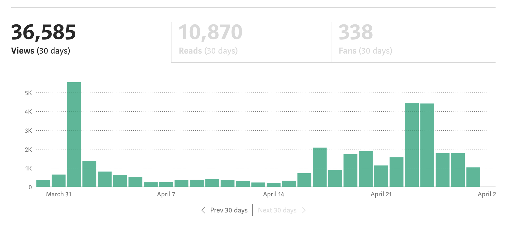
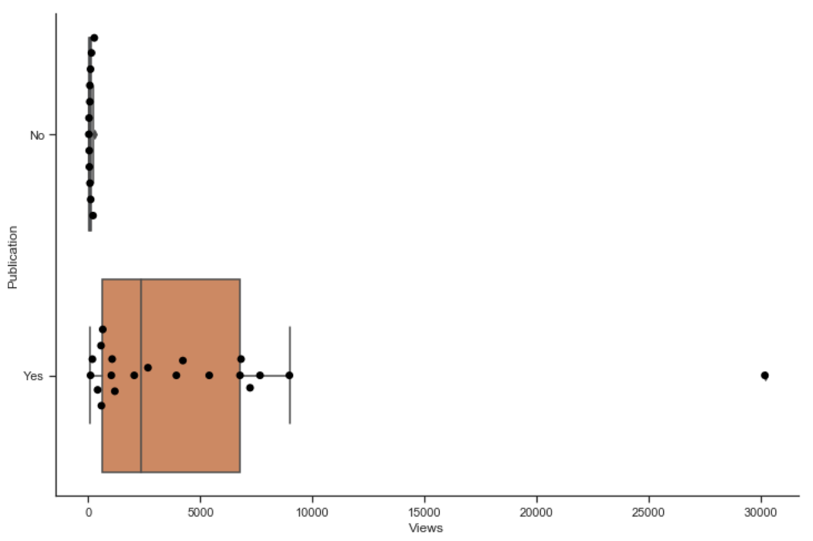
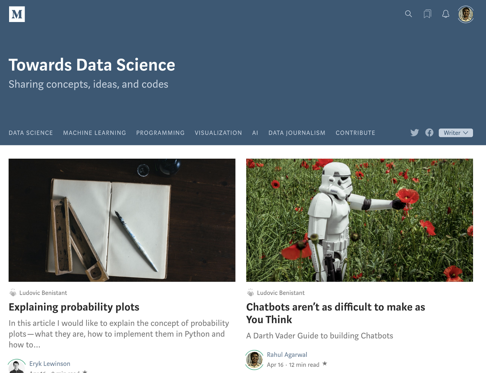
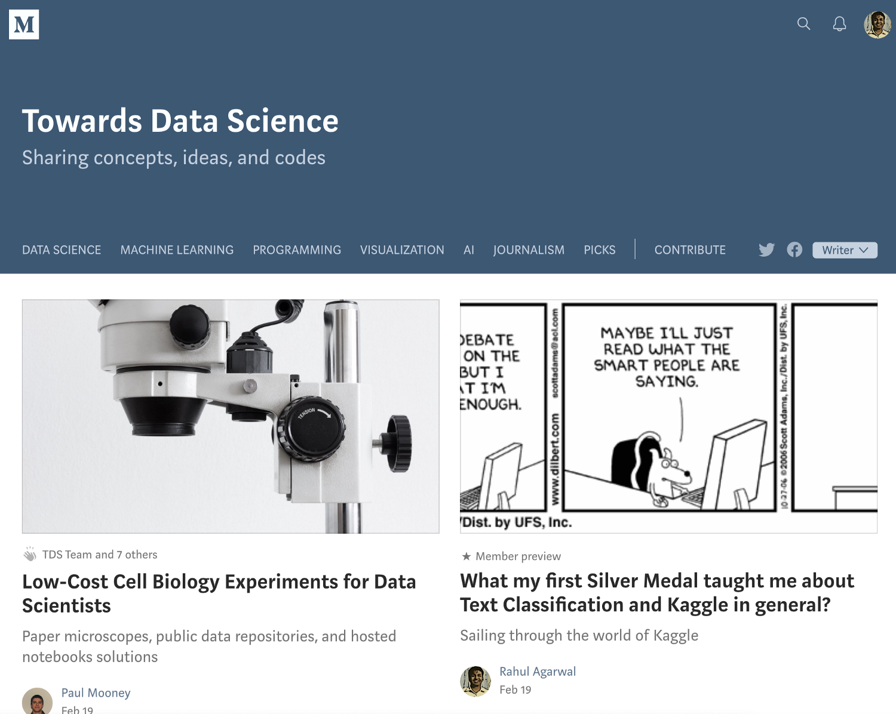
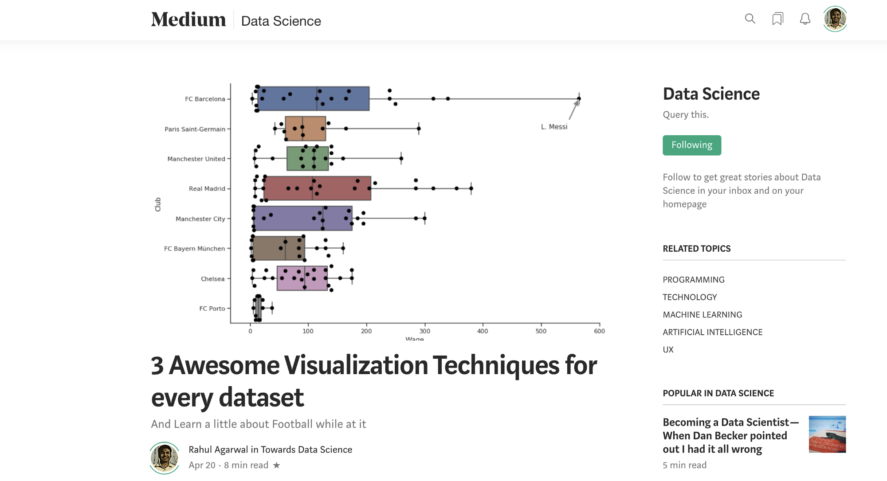
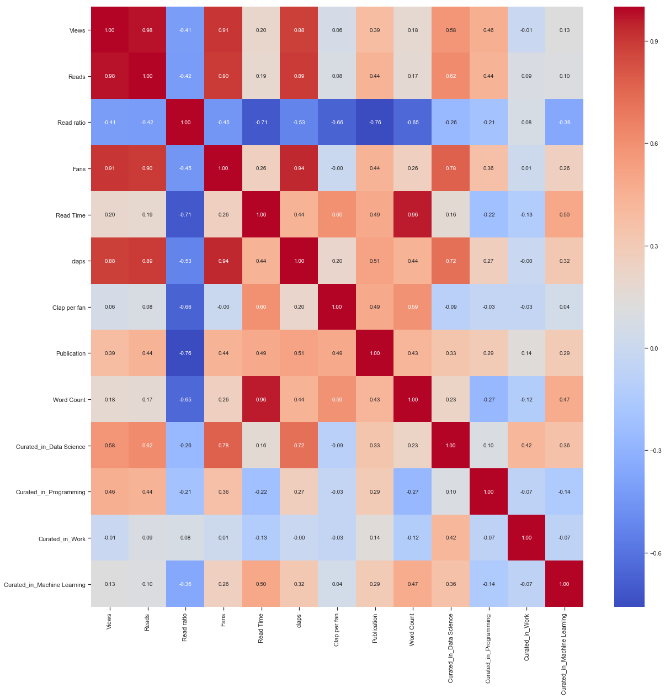
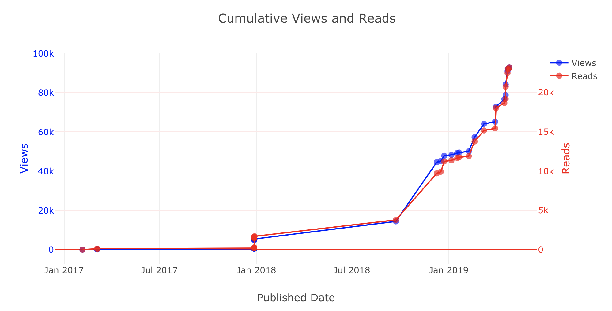
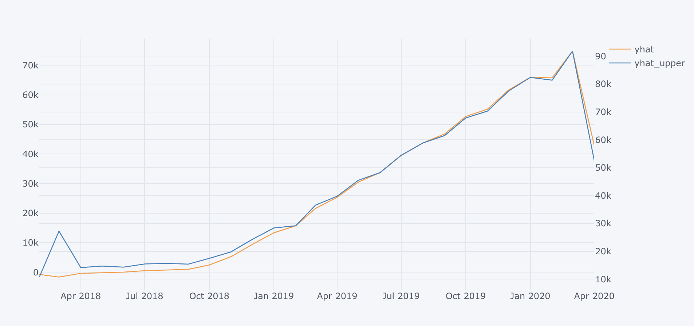
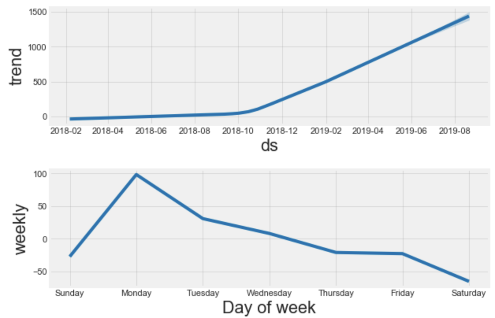
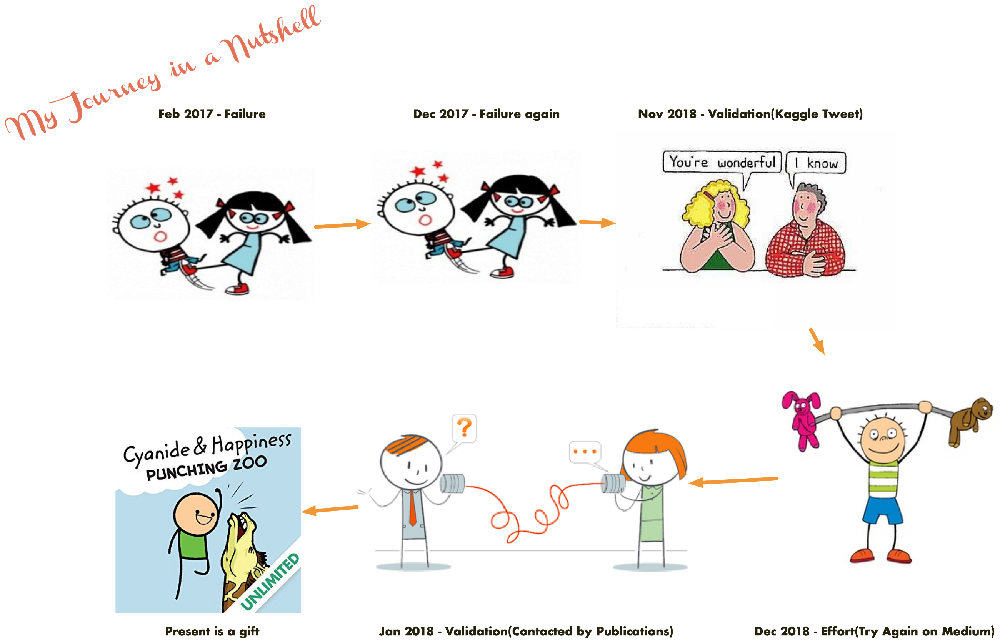

My Data Science Blogging Journey on Medium till now

# My Data Science Blogging Journey on Medium till now

## And how I gained a lot of views with my Technical Blog?

[Rahul Agarwal](https://towardsdatascience.com/@rahul_agarwal)

Apr 28·9 min read

Photo by [Chris Barbalis](https://unsplash.com/@cbarbalis?utm_source=medium&utm_medium=referral) on [Unsplash](https://unsplash.com/?utm_source=medium&utm_medium=referral)

Writing is refreshing.

Putting out your thoughts and ideas in front of the world. And getting ideas and inspiration along the way.

**But it doesn’t come easy.**

I first started blogging in 2014 on my blog. And I still remember my first Blog post. It was a disaster.

**But I remember that it helped some people. And that was probably a good start.**

My subsequent posts were not much better, and it took a lot of practice to reach the stage of writing I am now at.

There were a lot of ups and downs both in terms of stats as well in terms of motivation when it came to writing for me. ***My main lapse of motivation came from the notion that my writing is not reaching to people***.

I didn’t have many readers on my blog till 2018, and while many bloggers will ask you to not think about that, ***it was important to me to have my content read***. It is a personal thing in a way.

Medium provided me with a platform where I could put down my ideas and have people read about them.

Views and Stats in Last Month
I reached around 36k views this month alone. How?

This post is going to be about effective blogging practices, s̶o̶m̶e̶ a lot of self-promotion and some analytics/data science on my writing stats data since why not?.

### The start

My situation really.

I still remember the first time I came to medium. It was February of 2017. I repurposed some of my blogs on medium and thought of raking up some views and gain followers and put out my ideas to the world.

This platform seemed so great with people having following in excess of thousands. ***But guess what? How many views did I get?***

You guessed right. In the low 100s. And I had published/repurposed more than 10 Blog posts.

A Broken Start

**I had published posts in spurts between Feb and Dec 2017 with no tangible results.** The first time in Feb-Mar it didn’t take off. I tried again in December but to no avail. Only one of my post- [Good feature Building techniques for Kaggle](https://becominghuman.ai/good-feature-building-techniques-tricks-for-kaggle-my-kaggle-code-repository-c953b934f1e6) has some views as you can see and those views came in November 2018 after around a whole year. That was not enough for me to continue on medium, as I was getting more views on my blog. ***So I left medium for a year in Dec 2017.***

**But what was I doing wrong?**

In hindsight, I would say that back then **I didn’t understand how Medium worked.**

Medium is based on Publications. It is the publications that get views. And I didn’t know that at the start.

**But, what are Publications? **You can see that this particular post is published with Towards Data Science at the top. TDS has 206k users, and it is providing me with access to that user base whenever I publish my article with them. **That is a lot of reach for a starter like me.**

The Publication Effect

Medium has a lot of moving parts when it comes to writing and in particular technical writing.

So, here are some of my observations about Medium based on my experiences with the platform:

- •**Always write for Publications.** And I mean always.
- •Create a reputation with any publication you write. Sometimes **the editors will publish your posts on their front page.** Thank them for that. On that note, thank you [Ludovic Benistant](https://medium.com/@LudoBenistant) for featuring some of my posts. A feature in a publication alone can rake in a lot of views.

My posts are on Chatbots and Kaggle Learnings

- •**Tag your posts** with some high viewership tags. If you have problems understanding which tags to write for, check out some tags from highly prolific writers.
- •On that note **follow some writers who are successful on medium and try to understand why they are successful.** I follow [Will Koehrsen](https://medium.com/@williamkoehrsen) and [Cassie Kozyrkov](https://medium.com/@kozyrkov).**  **You will learn a lot about Medium if you do this. For example, I noticed how most of the good writers write in short sentences and not paragraphs. Or how they use humor. Or how they break things into smaller parts that are easily understandable. This point itself proves that I am not a good writer(Since it is so long). But I am trying to improve.
- •**Use Images well in your post and use High definition Images.** In my first few posts, I didn’t take advantage of this tool. Presently, I use the images by Unsplash in the medium editor itself. You can try Pixabay also for good quality images.
- •**Try to get your posts distributed by curators** in topics. There are some [guidelines](https://help.medium.com/hc/en-us/articles/360006362473). Follow them. Below is one of my posts that got distributed in Data Science at their top slot. It feels nice.

[The story](https://towardsdatascience.com/3-awesome-visualization-techniques-for-every-dataset-9737eecacbe8) as it got featured in Data Science Topic in Medium.

- •Medium is not a scientific journal. Explaining maths might work well for some but **for me writing about intuition works best**. I would say it would depend on your writing style and you should try to find your niche.
- •**Use Subtitles for your posts and feature the right image for your post.** It is crucial that your post looks presentable. Thanks to [Ludovic Benistant](https://medium.com/@LudoBenistant) for this tip.
- •**Try to be creative with your content**. For example in this post about[shell basics](https://towardsdatascience.com/shell-basics-every-data-scientist-should-know-3f012ef5c38c), I use GIFs to show how the shell works. Or how in [this post](https://towardsdatascience.com/why-sublime-text-for-data-science-is-hotter-than-jennifer-lawrence-651afc54d67) I tried to be cheeky with the title. Be unconventional.***  ****Do writing for what it is. It is fun.*

> Do writing for what it is. It is fun.

- •***Write about a variety of topics.*** Prevents Boredom, improves your writing and can I even say makes you a better person. Currently, I write on NLP, Programming, Visualization, Data science. This post itself is an attempt to increase my topic coverage.
- •**Write a lot.** Sometimes it won’t come naturally. The system I follow is to try writing x(500) words per day. Just start writing some jibberish, and you will notice that as you begin writing you won’t stop at x words. Ever. I am 900 words into this post now. And my mind is beaming with ideas, so it is hard to stop.**  **Remember, It is hard to stop only when you start writing.

> Remember, It is hard to stop only when you start writing.

- •**Re-read your post multiple times before publishing.** Maybe on the next day. A generic tip but essential.
- •And finally, **create something valuable** for your audience. You won’t reach anywhere without that. There are many outlets of information on the internet, what makes yours special is your own viewpoint. Put that out fearlessly before the world. Remember what may come naturally to you might not come so quickly to others. Make it easier for them.

> There are many outlets of information on the internet, what makes yours special is your own viewpoint.

### What Happened Next?

So back to the story. Till December 2017, I had failed again and again on medium. I got next to nothing views till November 2018.

I had all but forgotten about Medium, but it came again to my notice in December 2018 when I noticed that one of my articles was trending after Kaggle tweeted about it.

***I was ecstatic in a way. My Article got tweeted by Kaggle. Nice!***

Getting recognized by Kaggle was the sort of motivation I needed. And that motivated me to put some more effort into my writing.

I started writing more. Published some of my articles that were accumulating dust in my drafts folder for a long time.

I got contacted by a couple of publications. But*** the main turning point came with acceptance as a writer in TDS.***

I suddenly started getting views. My articles began getting curated in topics, and people were reading the content I was creating.

I am happy now, and so I wrote this post.

The stats after writing for publications

In the above section, I provided a list of qualitative experiences. Let us talk numbers now.

#### What makes an article successful?

The number of fans is a reasonable proxy for an article’s success.

Let’s try to see which factor matters for getting more fans for a particular article.

Not much information here. Views and reads as suspected are highly correlated with the number of fans.

**Data Science Topic> Machine Learning Topic: **From the correlation plot, we can see that if my article gets curated in Data Science, it has a high chance of having more number of fans/views/reads as compared to getting curated in Machine Learning.

Also if an article gets curated in Data Science, it has a very less chance of getting selected in Programming and vice versa. Based on the limited and may be a biased sample of my posts only, we have here.

How the Cumulative views increase

I am just below 100k lifetime views as of writing this article. Hope I pass it with this article.

### The future?

I already have day by day stats of my views.
Why not build a model to predict the future? We are data scientists of course.

I will use the `fbprophet` Package from Facebook to do this time series analysis. I like this package since it is so simple. No ARIMA, SARIMA, auto-correlation plots.

Just a pretty clean API to solve your problem. Five lines for a time series model.

import fbprophet
model = fbprophet.Prophet()
model.fit(df)
df_future = model.make_future_dataframe(periods=360)
df_predicted = model.predict(df_future)

Monthly predicted views from the model

The model predicts 65k Views by the end of 2019. Will update this post to check if my prediction matches the outcome.

We can also find out the effect of weekdays on daily views.

Daily predicted views from the model broken down in components

Here **we can see the trend dominates our daily views** and it is continuously increasing. Trend sort of defines our baseline views. And it is a good thing it is growing at such a high rate.

We can also see that Monday garners more views than any other weekday. Again to be expected since it is the start of the week. And people are motivated to read.

So write on Sunday and publish on Monday. Check!

### Conclusion

**This post was a detailed walk-through about my Journey on medium as a writer. **I tried to provide some tips and techniques to aspiring bloggers to increase their coverage as well as write better on Medium.

It was a series of failures before a small success for me on Medium. Hope I can help someone by letting them know about my mistakes.

**Also did a very brief analysis of my own medium stats data.** I might not have a lot of followers or views presently, but I am still trying and getting some decent following.

Apologies for such a long post but you knew what you were getting into when you started. As Tyrion Said when Bran told him that his story is a long one:

> If only we were trapped in a castle, in the middle of winter, with nowhere to go.

I am going to be writing more posts on writing in the future too. Follow me up at [**Medium**](https://medium.com/@rahul_agarwal) or Subscribe to my [**blog**](http://eepurl.com/dbQnuX) to be informed about them. As always, I welcome feedback and constructive criticism and can be reached on Twitter [@mlwhiz](https://twitter.com/MLWhiz)

Finally, while the title of this section may say conclusion, it is not one. It is just the start.