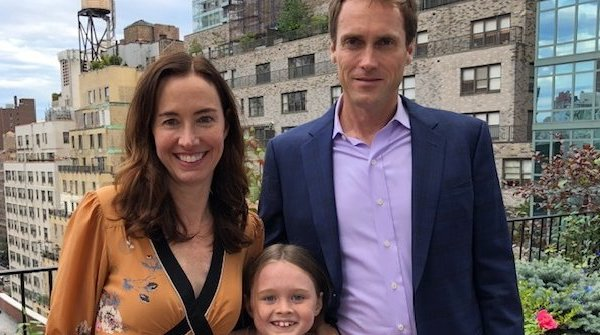
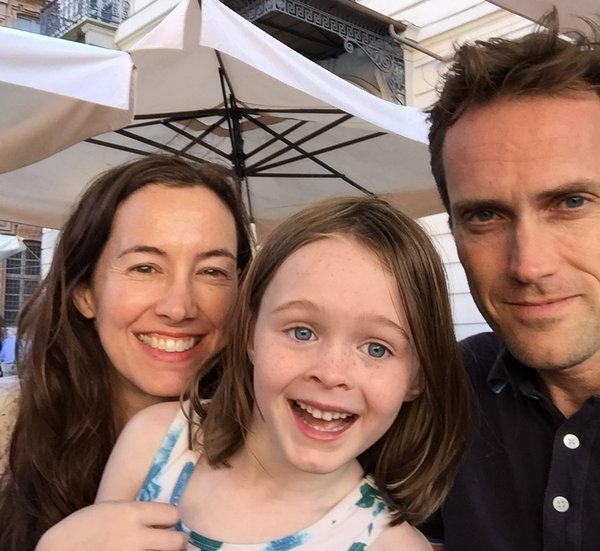

My Marriage Has a Third Wheel: Our Child

1. [Relationships](https://parenting.nytimes.com/relationships?region=topic-link&action=click)

# My Marriage Has a Third Wheel: Our Child

An only child can make the relationship between Mom and Dad uniquely complicated.

By Jancee Dunn

- May 30, 2019

-

    - [Share on Facebook](https://parenting.nytimes.com/relationships/only-child-marriage#)
    - [![](data:image/svg+xml,%3csvg xmlns='http://www.w3.org/2000/svg' width='13' height='11' viewBox='0 0 13 11' class='css-12s4pk1 js-evernote-checked' data-evernote-id='172'%3e%3cpath fill-rule='evenodd' clip-rule='evenodd' d='M7.15 7.556a2.88 2.88 0 0 1-2.003-.806l-.087-.084 1.245-1.203.086.084c.215.207.486.307.76.307.287-.001.56-.1.774-.307l2.04-1.972a1.023 1.023 0 0 0 0-1.482l-.087-.084a1.098 1.098 0 0 0-.766-.307 1.1 1.1 0 0 0-.767.307l-.839.81a.902.902 0 0 1-1.244 0 .83.83 0 0 1 0-1.202L7.1.806A2.893 2.893 0 0 1 9.112 0c.725 0 1.458.27 2.011.806l.087.084c.552.533.833 1.241.832 1.943.001.7-.278 1.41-.832 1.945L9.17 6.75a2.897 2.897 0 0 1-2.014.806H7.15zm-4.228 3.06A2.882 2.882 0 0 1 .92 9.81l-.086-.084A2.699 2.699 0 0 1 0 7.78c-.002-.7.28-1.408.833-1.941l2.04-1.972a2.893 2.893 0 0 1 2.011-.806 2.91 2.91 0 0 1 1.63.495c.08.04.156.092.224.158l.157.152.087.084-1.244 1.203-.088-.084a1.098 1.098 0 0 0-.766-.307c-.28.001-.553.1-.766.307L2.077 7.04a1.025 1.025 0 0 0 0 1.482l.087.084c.214.207.485.307.758.308.288-.002.561-.101.775-.308l.879-.85a.902.902 0 0 1 1.245 0 .83.83 0 0 1 0 1.204l-.88.85a2.9 2.9 0 0 1-2.014.805h-.005v.001z' data-evernote-id='173' class='js-evernote-checked'%3e%3c/path%3e%3c/svg%3e)Copy the link](https://parenting.nytimes.com/relationships/only-child-marriage#)
    - [Email this essay](https://parenting.nytimes.com/relationships/only-child-marriagemailto:?subject=My%20Marriage%20Has%20a%20Third%20Wheel%3A%20Our%20Child%20from%20NYT%20Parenting&body=From%20NYT%20Parenting%3A%0A%0AMy%20Marriage%20Has%20a%20Third%20Wheel%3A%20Our%20Child%0A%0AAn%20only%20child%20can%20make%20the%20relationship%20between%20Mom%20and%20Dad%20uniquely%20complicated.%0A%0ARead%20more%3A%0Ahttps%3A%2F%2Fparenting.nytimes.com%2Frelationships%2Fonly-child-marriage)

* * *

Image

Jancee Dunn, left, with her daughter Sylvie and husband Tom.Creditvia Jancee Dunn

*This piece is part of our new series “The Hardest Part,” where we share essays by parents about their unexpected challenges and how they got through them. Read the first in the series, about *[*being a parent with a controversial past, here*](https://parenting.nytimes.com/parent-life/how-does-one-navigate-being-a-parent-with-a-past)*.*

Here’s a typical weeknight scenario in our household: My husband, Tom, our 9-year-old daughter, Sylvie, and I feel like ordering in, and after a lengthy debate, we decide on pizza. Later, while the three of us are eating pepperoni slices and playing Bananagrams, Sylvie reminds Tom that our wedding anniversary is coming up and offhandedly mentions that my favorite flowers are peonies. After a few rounds of the game, we consider a movie. Sylvie proposes “Escape From New York*,*” a film that has piqued her curiosity after hearing her father repeatedly imitate Kurt Russell as Snake Plissken.

“I’ll look it up on Common Sense Media to see if it’s appropriate,” she volunteers, opening my computer. Unfortunately, she reports gravely, it’s for ages 16 and up. “‘Except for a severed head,’” Sylvie reads aloud, “‘there’s little explicit gore. An atmosphere of cynicism and darkness pervades, including a negative depiction of a U.S. President.’”

Tom points out that this sounds like his Twitter feed. But I balk at the severed head, which is a pretty big *except for*.

I would never have predicted that the hardest part of parenting would be that our only child would come to fully believe she is the third person in our marriage. This arrangement began roughly as soon as she learned to talk.

As family psychologists such as Dr. [Carl E. Pickhardt](https://www.psychologytoday.com/us/blog/surviving-your-childs-adolescence/200907/the-adolescent-only-child), Ph.D., point out, only children often feel like one of the adults. As with our tripartite system of government, they view the daily running of the household as a three-way power-sharing agreement. This is an issue more parents may have to deal with, now that one-child families are gaining ground. According to a Pew Research analysis of 2015 U.S. Census Bureau data, today 18 percent of mothers at the end of their childbearing years [have an only child](https://www.pewsocialtrends.org/2015/05/07/childlessness-falls-family-size-grows-among-highly-educated-women/) — up from 10 percent in 1976.

Tom and I have fully enabled Sylvie to feel like one of the gang, because we go almost everywhere*  *as a trio. We’re usually too cheap to hire babysitters, and tend to travel with Sylvie, too, as she slots fairly easily into our itineraries. As a result, Sylvie has gotten used to being included, consulted, part of our in-jokes. This is not uncommon, says social psychologist Dr. [Susan Newman](https://www.susannewmanphd.com/books/parenting-an-only-child/), Ph.D., who has spent decades studying only children — a term I loathe, as it calls to mind a kid alone in a shadowy room, whispering quietly to his sock puppet “friends.” (I think we should revive the much more sprightly “oneling,” used by 19th century author John Cole in his book “Herveiana.”)

But our efforts to “empower” our oneling and make her voice heard have begun to backfire. To paraphrase Princess Diana when asked about Camilla Parker-Bowles: There are three of us in this marriage, so it’s a bit crowded.

One reason for our fluid boundaries is physical. It’s almost impossible to maintain them in a Brooklyn apartment a realtor would euphemistically call “charming and cozy,” one with bizarrely porous doors that actually seem to amplify sound. But it’s also emotional: Tom and I, like many parents of our generation, make an effort to be open and communicative with Sylvie. (“You can tell us anything, sweetheart!”)

When I was growing up, I would never have dreamed of sharing anything remotely personal with my parents. I had two siblings, and our family dynamic was solidly Us vs. Them — my sisters and I were one unit, my folks another. I wanted a different kind of relationship with our daughter.

But one consequence of all this closeness is that our child feels insulted if Tom and I go out to dinner alone. If we’re on vacation, she balks at being “dumped,” as she puts it, in the Kids’ Club. She would be happy to Photoshop her picture into our wedding photos. If Tom and I give each other a hug, she has gotten in the habit of jumping in between us.

Image

Jancee Dunn and her family. Creditvia Jancee Dunn

At least she doesn’t referee when we fight, as she did when she was smaller. A couples’ counselor put a stop to that when he advised me to put a photo of Sylvie in a drawer by my bedside table. Whenever I was about to lose my temper with Tom, he told me, I was to run to the bedroom, pull out the photo, and say to it: *I know that what I’m about to do is going to cause you harm, but right now, my anger is more important to me than you are*. I only had to repeat that brutal phrase a couple of times.

But Tom and I still squabble about minor stuff, like whose turn it is to empty the dishwasher — and when we do, Sylvie jumps in and takes sides. (“Mom, you did it last time.”)

As a self-flagellating parent, I was recently drawn to a book with the dire title “The Seven Common Sins of Parenting an Only Child.*” *Ooh, sins — what am I doing wrong? Among other iniquities — overprotection, overcompensating — Sin No. 6 resonated with me: Treating Your Child Like an Adult.

“It can become so pleasurable for parents of an only child to have a miniature adult by their side that they may lose sight of the fact that their kid needs to be a kid,” writes author Carolyn White, former editor of Only Child magazine. I read this aloud to Tom as Sylvie, nearby, perused the latest issue of Consumer Reports*, *ready to counsel us on our next car purchase.

Sylvie may be comfortable around adults, but she is still a child, one who lacks the reasoning abilities and experience of a grown-up — so I must catch myself when I absently reply to her questions about money, or other parents, before realizing, *whoops, shouldn’t have told her that*.

As Newman advises, “Before you allow your child to weigh in, take a pause and ask yourself, ‘Is this really a topic or an issue that a 9-year-old should be involved in, or is this a decision for adults?’ ”

Sylvie needs time away from us to be a kid — time to act silly and make jokes about butts and drone on about the intricacies of Minecraft. She has a group of good friends, but I do see her picking up on her middle-aged parents’ habits, such as calculating how many hours of sleep she got every morning. Her posse at home is squarely in midlife, as evidenced by her choice of songs for her ninth birthday party — among them, Barbra Streisand’s LBJ-era “Don’t Rain on My Parade.” We are not the kind of posse a 9-year-old needs. Maybe she hasn’t yet subbed out her school backpack for a WNYC tote bag, but the danger is there.

And all of this coziness hurts our marriage, too. So I have to remind myself, sometimes daily, to cordon off our relationship. Our marriage has needs that deviate from my needs as an individual, as well as our needs as a family. I have to constantly ask, what would be good for the marriage? It’s important, as a couple, to have your own roster of in-jokes. It’s refreshing to drop F-bombs with impunity, and to gossip freely about other parents without having to hastily turn it into a teachable moment for your eavesdropping child about How Gossiping Is Really About Feeling Insecure About Your Own Life Choices. And it’s nice — no, essential — to go out to dinner, just the two of you, and speculate on which members of the waitstaff are sleeping with each other. You know, grown-up stuff.

* * *

Jancee Dunn is the author of “How Not To Hate Your Husband After Kids.”

* * *

Related topics:[Relationships,](https://parenting.nytimes.com/relationships?region=related-topics&action=click)[Love & Marriage](https://parenting.nytimes.com/relationships/love-and-marriage/archive?region=related-topics&action=click)

* * *

## Share this essay

- [Share on Facebook](https://parenting.nytimes.com/relationships/only-child-marriage#)
- [![](data:image/svg+xml,%3csvg xmlns='http://www.w3.org/2000/svg' width='13' height='11' viewBox='0 0 13 11' class='css-12s4pk1 js-evernote-checked' data-evernote-id='239'%3e%3cpath fill-rule='evenodd' clip-rule='evenodd' d='M7.15 7.556a2.88 2.88 0 0 1-2.003-.806l-.087-.084 1.245-1.203.086.084c.215.207.486.307.76.307.287-.001.56-.1.774-.307l2.04-1.972a1.023 1.023 0 0 0 0-1.482l-.087-.084a1.098 1.098 0 0 0-.766-.307 1.1 1.1 0 0 0-.767.307l-.839.81a.902.902 0 0 1-1.244 0 .83.83 0 0 1 0-1.202L7.1.806A2.893 2.893 0 0 1 9.112 0c.725 0 1.458.27 2.011.806l.087.084c.552.533.833 1.241.832 1.943.001.7-.278 1.41-.832 1.945L9.17 6.75a2.897 2.897 0 0 1-2.014.806H7.15zm-4.228 3.06A2.882 2.882 0 0 1 .92 9.81l-.086-.084A2.699 2.699 0 0 1 0 7.78c-.002-.7.28-1.408.833-1.941l2.04-1.972a2.893 2.893 0 0 1 2.011-.806 2.91 2.91 0 0 1 1.63.495c.08.04.156.092.224.158l.157.152.087.084-1.244 1.203-.088-.084a1.098 1.098 0 0 0-.766-.307c-.28.001-.553.1-.766.307L2.077 7.04a1.025 1.025 0 0 0 0 1.482l.087.084c.214.207.485.307.758.308.288-.002.561-.101.775-.308l.879-.85a.902.902 0 0 1 1.245 0 .83.83 0 0 1 0 1.204l-.88.85a2.9 2.9 0 0 1-2.014.805h-.005v.001z' data-evernote-id='240' class='js-evernote-checked'%3e%3c/path%3e%3c/svg%3e)Copy the link](https://parenting.nytimes.com/relationships/only-child-marriage#)
- [Email this essay](https://parenting.nytimes.com/relationships/only-child-marriagemailto:?subject=My%20Marriage%20Has%20a%20Third%20Wheel%3A%20Our%20Child%20from%20NYT%20Parenting&body=From%20NYT%20Parenting%3A%0A%0AMy%20Marriage%20Has%20a%20Third%20Wheel%3A%20Our%20Child%0A%0AAn%20only%20child%20can%20make%20the%20relationship%20between%20Mom%20and%20Dad%20uniquely%20complicated.%0A%0ARead%20more%3A%0Ahttps%3A%2F%2Fparenting.nytimes.com%2Frelationships%2Fonly-child-marriage)

* * *

## More in Relationships

[       ### Fighting Constantly After Baby? Read This.  Most research suggests that couples are less happy after they become parents, but there are ways to reorient your relationship after parenthood.](https://parenting.nytimes.com/relationships/fighting-after-baby?module=recirc&action=click&rank=1&position)

[       ### How to Get Your Partner to Take on More Emotional Labor  You can take concrete steps to more equitably divide emotional labor with your partner — starting with talking openly about the dynamic.](https://parenting.nytimes.com/relationships/emotional-labor?module=recirc&action=click&rank=2&position)

[       ### The Absolute Necessity of the New-Mom Friend  In the trenches with a baby, you need someone to text at 2 a.m.](https://parenting.nytimes.com/relationships/new-mom-friends-motherhood?module=recirc&action=click&rank=3&position)

[See all Relationships](https://parenting.nytimes.com/relationships)