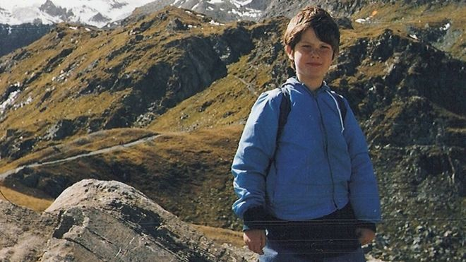
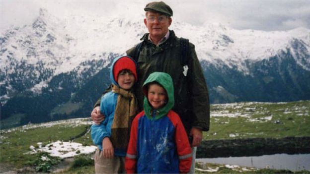
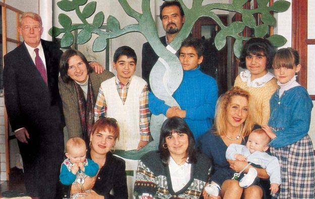
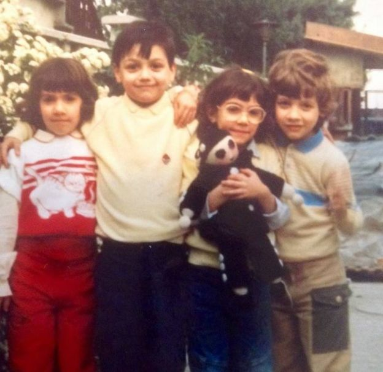
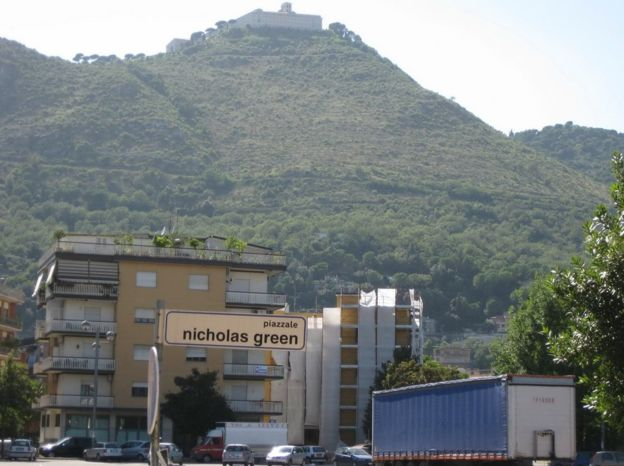
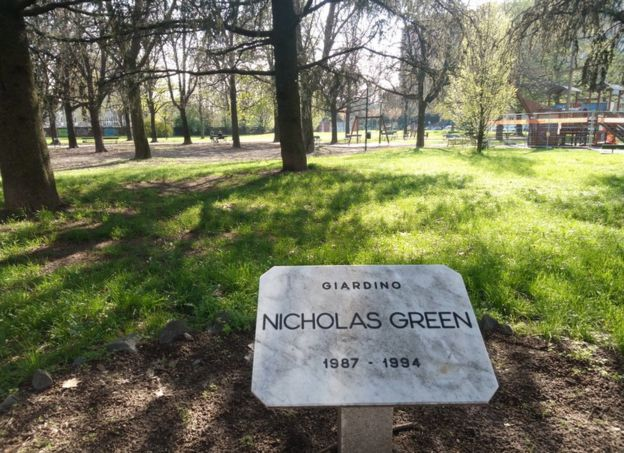
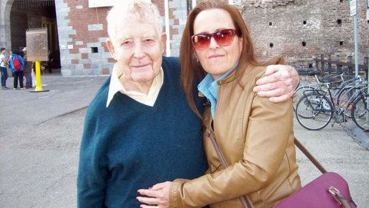
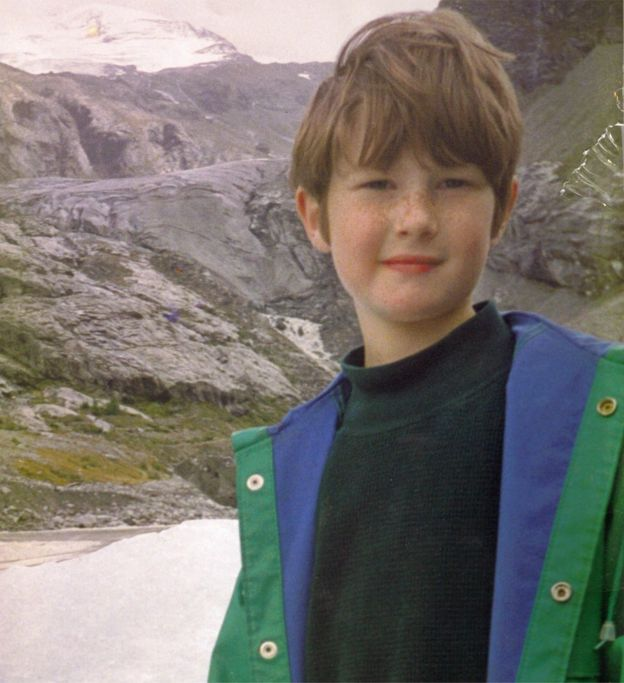

My son died in 1994 but his heart only stopped beating this year - BBC News

# My son died in 1994 but his heart only stopped beating this year

 By Harry Low  BBC News

- 5 May 2017

- From the section [Magazine](http://www.bbc.co.uk/news/magazine)

 These are external links and will open in a new window

- [Share](http://www.bbc.co.uk/news/magazine-39422660#share-tools)

     Image copyright  Reg Green

On the night of 29 September 1994, seven-year-old Nicholas Green was fatally shot during a family holiday in southern Italy. The death was a tragedy for his parents, Reg and Maggie, but their decision to donate his organs caused organ donation rates in Italy to triple in a decade - a result dubbed the "Nicholas effect".

"The first time I sensed danger was when a dark car came up close behind us and stayed there for a few moments," says Reg Green, who is remembering the night his son was inexplicably shot by strangers in southern Italy. "Shortly after, this car began to overtake. I relaxed, thinking there was nothing wrong after all."

But, instead of overtaking, the car drew alongside. Reg and Maggie heard loud angry cries. They assumed that the men inside wanted them to stop.

"I thought if we did stop we would be completely at their mercy. So instead I accelerated. They did too, so the two cars raced alongside each other through the night. A bullet shattered the back window. Maggie turned around and both the children appeared to be fast asleep."

     Image copyright  Reg Green

In fact, Nicholas had been shot in the head although his sister Eleanor was sleeping peacefully. Seconds later, the driver's window was blown in too and the other car drove off.

"I stopped the car and got out. The interior light came on but Nicholas didn't move. I looked closer and saw his tongue was sticking out slightly and there was a trace of vomit on his chin," says Green, 88, whose book about the experience, The Nicholas Effect, formed the basis for the 1998 film starring Jamie Lee Curtis and Alan Bates, Nicholas' Gift.

"For the first time we realised something terrible had happened. The shock of seeing him like that was the bleakest moment I've ever had."

An American family's holiday had turned into a nightmare. Nicholas died in hospital days later, after entering a coma. But before he did, his parents made a decision which would change the lives of seven families across Italy - they decided to donate his organs.

"At that point, these people were just abstractions. You had no idea what kind of people they were. It was like giving money to charity but you've no idea how it helps. Four months afterwards, we were invited to go back and meet them all in Sicily, where four of the recipients are from," says Green.

* * *

## Who received Nicholas's organs?

     Image copyright  Oggi

- Andrea Mongiardo: Heart, died in 2017
- Francesco Mondello: Cornea
- Tino Motta: Kidney
- Anna Maria Di Ceglie: Kidney
- Maria Pia Pedala: Liver
- Domenica Galleta: Cornea
- Silvia Ciampi: Pancreas, presumed to have died several years ago

* * *

Criminals in Italy rarely kill children, Green says, because it makes the police so determined to catch the killers. This is what happened in Nicholas's case. A no-holds-barred police investigation resulted in the arrest and conviction of two men, Francesco Mesiano and Michele Iannello.

It's still unclear whether the men were robbers, or hitmen who attacked the wrong car in a case of mistaken identity, but the fact that one of them employs one of Italy's top lawyers suggests to Green that they have mafia connections.

"The killing of a seven-year-old American boy in a country where violent death is commonplace has plunged Italy into national soul-searching," the Times reported. Green says that the idea of an innocent child being shot while on holiday in the country made many Italians feel ashamed - and led them to embrace the idea of organ donation as a way of making amends.

     Image copyright  Mongiardo family

"The work we have done to remind them of how much good could come out of this has had this quite astonishing effect which we couldn't possibly have foreseen. A country that was almost at the bottom for organ donation in Europe could immediately move almost to the top. No other country has tripled organ donation."

In 1993, the year before Nicholas was shot, 6.2 people per million donated an organ, while by 2006 the figure had reached 20 per million. During that period, in 1999, Italy moved to an opt-out system, where when someone dies it is presumed they are willing for their organs to be donated unless they have specified otherwise.

France, Greece, Portugal and Spain also use an opt-out system, while the US and UK (with the exception of Wales) continue to operate an opt-in system.

* * *

## How Nicholas's name lives on

     Image copyright  Reg Green

In Italy, there are more than 120 places named in Nicholas's honour:

- **50 **squares and streets
- **27 **parks and gardens
- **27** schools
- **16 **other monuments and installations, including a lemon tree, a bridge and an amphitheatre

     Image copyright  Reg Green

* * *

"Nicholas was a kindly boy who always looked for the best in things so, when you were with him, you always wanted to be your best," explains his father.

"I know that at seven years old he probably wouldn't have been able to comprehend but, I know, as he grew up this is just what he would have wanted us to do - there's no doubt about that.

"If the choice was between being angry at the people who did it and wanting to help somebody else as the first priority, he would have undoubtedly chosen helping somebody out."

Green, who worked as a journalist on Fleet Street for many years before moving to the US, says his son taught him a lot about tolerance. "I'm impatient and when things go wrong, I get het up about it," he says. "Nicholas had a calmness about it all and a forgivingness that made you want to be the same."

     Image copyright  Reg Green

Nothing could have prepared Green for the moment he came face-to-face with those people whose lives were saved by Nicholas's organs.

"When the doors opened and the six walked in, the effect was overwhelming," he says, noting that illness prevented one from being present. "Some were smiling, some were tearful, others were bashful but they were all alive. Most of these people had been on the point of death. That's when it hit you for the first time, just how big a thing this was.

"There was also a sense of how the parents and grandparents would have been devastated. You got the feeling there were many more people involved whose lives would have been much poorer if we hadn't saved them."

Green and his wife Maggie, who married in April 1986, were keen to ensure that Eleanor did not grow up alone. They have since had twins, Laura and Martin, who will turn 21 in May. What impact has the death of Green's son had on his life? "There's a sadness that was never there before. I'm never completely happy any more," Green says. "Even when I'm at my happiest, I think: 'Wouldn't it be better if Nicholas was here?'"

     Image copyright  Reg Green

But *l'effetto Nicholas* - the Nicholas Effect - is a silver lining. "I feel that every time there is a piece in the newspaper, TV or radio, there is going to be somebody in the audience who is going to have to make this decision. If they have never heard or thought about organ donation before, they are much more likely to say 'no'."

## You may also like to read:

- [BBC - Earth - There are diseases hidden in ice, and they are waking up](http://www.bbc.co.uk/earth/story/20170504-there-are-diseases-hidden-in-ice-and-they-are-waking-up?ocid=fbert)
- [Prince Philip's (in)famous gaffes](http://www.bbc.co.uk/news/uk-39806145)

* * *

Green returns to Italy twice a year to raise awareness about organ donation. On his most recent visit he met Maria Pia Pedala, who had been in a coma from liver failure on the day Nicholas died, but quickly bounced back to health after receiving his liver. She married two years later, and two years after that gave birth to a baby boy - named Nicholas - who was followed in two years by a girl, Alessia. The three of them travelled from Sicily, where organ donation was almost unknown in 1994 Green says, to take part with him in a television programme in Milan.

Green points out that even the recipient of Nicholas's heart, Andrea Mongiardo, who died earlier this year, had the organ three times longer than Nicholas himself did.

But he sees his son's legacy extending far beyond the seven people who received Nicholas's organs. Because donation rates soared after Nicholas's death, he says, thousands of people are now alive who would otherwise have died.

*Listen to *[Reg Green talking to Newsday](http://www.bbc.co.uk/programmes/p04sz6tk)* on the BBC World Service*

[Follow Harry Low on Twitter](https://twitter.com/HarryLow49)
   

*Join the conversation - find us on *[Facebook](https://www.facebook.com/BBCStories/)*, *[Instagram](https://www.instagram.com/bbcstories/)*, *[Snapchat](https://www.snapchat.com/add/bbcstories)*and *[Twitter](https://twitter.com/BBCstories)*.*