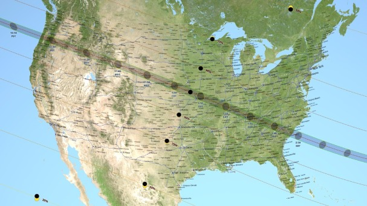
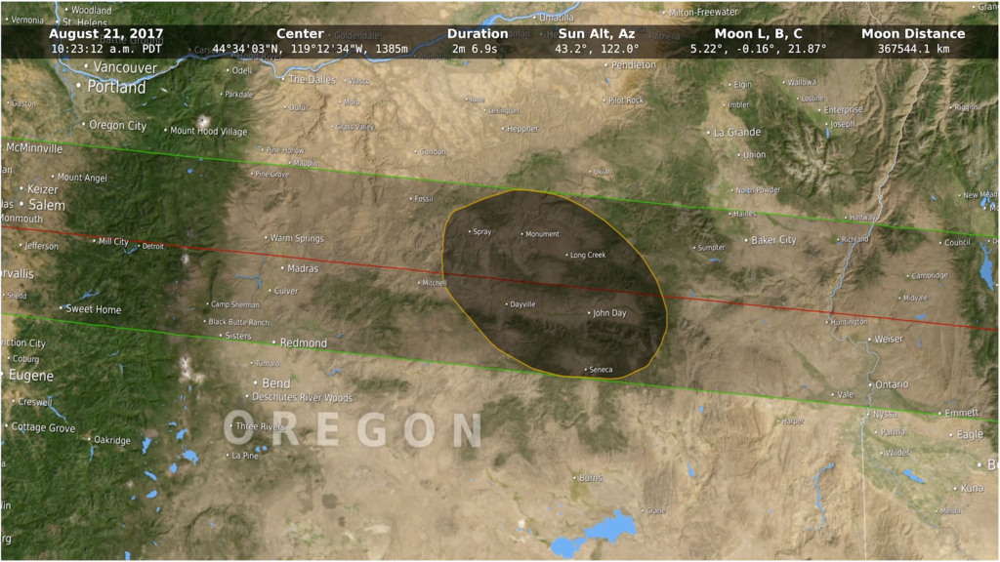
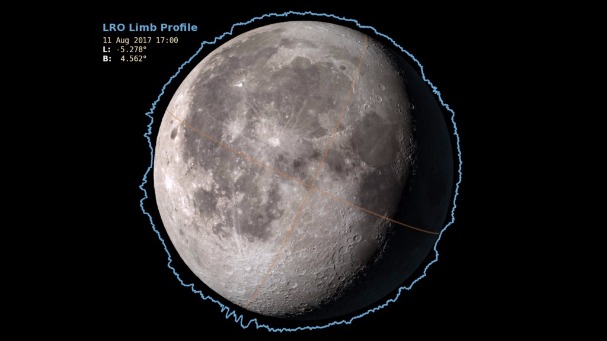

NASA Viz: Shadow of the Eclipse

 [Planets and Moons](https://nasaviz.gsfc.nasa.gov/cgi-bin/search.cgi?category=PlanetsAndMoons)  [Sun](https://nasaviz.gsfc.nasa.gov/cgi-bin/search.cgi?category=Sun) ID: 12458

# Shadow of the Eclipse

Story by [Ellen T. Gray](https://nasaviz.gsfc.nasa.gov/12458mailto:ellen.t.gray@nasa.gov?subject=Mail%20From%20SVS%20Web%20Site:%20Animation%20ID%2012458) | Visualizations by [Ernie Wright](https://nasaviz.gsfc.nasa.gov/12458mailto:ernest.t.wright@nasa.gov?subject=Mail%20From%20SVS%20Web%20Site:%20Animation%20ID%2012458) on June 12, 2017

 [Share on facebook](https://nasaviz.gsfc.nasa.gov/12458#)  [Share on twitter](https://nasaviz.gsfc.nasa.gov/12458#)  [More Sharing Services](https://nasaviz.gsfc.nasa.gov/12458#)[[43](https://nasaviz.gsfc.nasa.gov/12458#)](https://nasaviz.gsfc.nasa.gov/12458#)

* * *

 

 [Download](https://nasaviz.gsfc.nasa.gov/12458#)

See the most accurate map for Aug 21, 2017's total solar eclipse.

On August 21, 2017, the moon will pass between Earth and the sun in a total solar eclipse that will be visible on a path from Oregon to South Carolina across the continental United States. This path of totality will occur in a little over 90 minutes, while observers on the ground will see the eclipse for about two and a half minutes. Standing at the edge of the moon's shadow, or umbra, the difference between seeing a total eclipse and a partial eclipse comes down to elevation - mountains and valleys both on Earth and on the moon - which affect where the shadow lands. In this visualization, data from NASA's Lunar Reconnaissance Orbiter account for the moon's terrain that creates a jagged edge on its shadow. This data is then combined with elevation data on Earth as well as information on the sun angle to create the most accurate map of the eclipse path to date. Watch the video to learn more.

All State maps are available at: [NASA's official eclipse 2017 website](https://eclipse2017.nasa.gov/eclipse-maps)

 

 [Download](https://nasaviz.gsfc.nasa.gov/12458#)

Data visualizer Ernie Wright explains how he put together a more accurate eclipse path.

 

 [Download](https://nasaviz.gsfc.nasa.gov/12458#)

The path of totality across the United States.

 

 [Download](https://nasaviz.gsfc.nasa.gov/12458#)

The jagged profile of the moon as measured by NASA's Lunar Reconnaissance Orbiter.

 

 [Download](https://nasaviz.gsfc.nasa.gov/12458#)

An illustration of the Lunar Reconnaissance Orbiter at the moon.

[ ]()
* * *

#### Source Material

 

[Tracing the 2017 Solar Eclipse](https://nasaviz.gsfc.nasa.gov/12412)

 

[2017 Path of Totality](https://nasaviz.gsfc.nasa.gov/4515)

 

[2017 Eclipse State Maps](https://nasaviz.gsfc.nasa.gov/4552)

 

[2017 Total Solar Eclipse Map and Shapefiles](https://nasaviz.gsfc.nasa.gov/4518)

 

[LRO Spacecraft Animations](https://nasaviz.gsfc.nasa.gov/20140)

* * *

#### Story Credits

**Visualizer/Animator**:

[Ernie Wright](https://nasaviz.gsfc.nasa.gov/cgi-bin/search.cgi?person=1059) (USRA)

**Producer**:

[Genna Duberstein](https://nasaviz.gsfc.nasa.gov/cgi-bin/search.cgi?person=1064) (USRA)

**Scientist**:

[C. Alex Young](https://nasaviz.gsfc.nasa.gov/cgi-bin/search.cgi?person=1498) (NASA/GSFC)

**Writer**:

[Ellen T. Gray](https://nasaviz.gsfc.nasa.gov/cgi-bin/search.cgi?person=1146) (ADNET Systems, Inc.)

 **Please give credit for this item to:**
NASA/Goddard Space Flight Center Scientific Visualization Studio

 **Short URL to share this page:**
http://svs.gsfc.nasa.gov/12458

 **Keywords:**
SVS >> [HDTV](https://nasaviz.gsfc.nasa.gov/cgi-bin/search.cgi?value=HDTV)

NASA Science >> [Sun](https://nasaviz.gsfc.nasa.gov/cgi-bin/search.cgi?value=Sun)

NASA Science >> [Planets and Moons](https://nasaviz.gsfc.nasa.gov/cgi-bin/search.cgi?value=Planets%20and%20Moons)