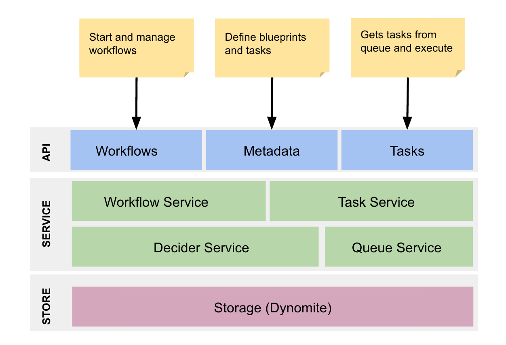
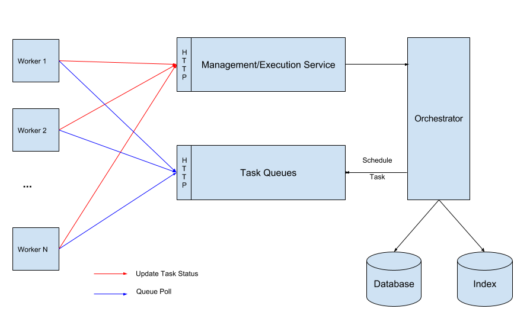
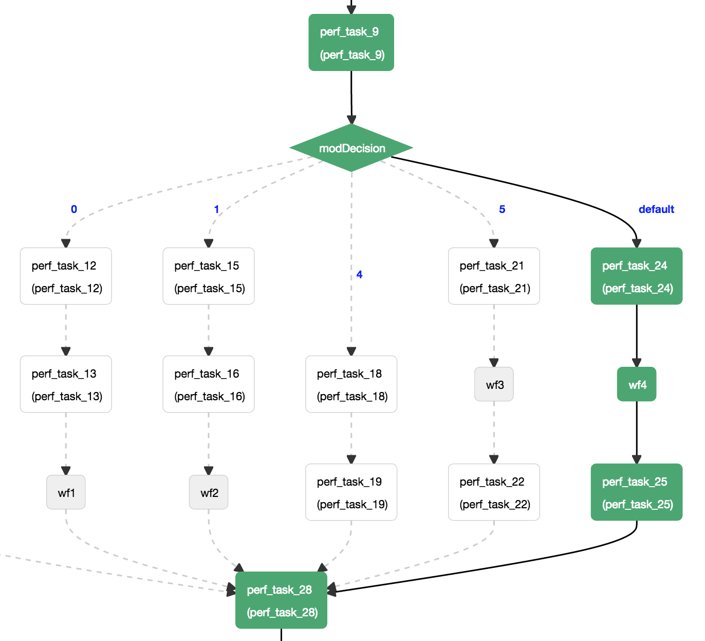

Netflix Conductor : A microservices orchestrator

### Netflix Conductor : A microservices orchestrator

The Netflix Content Platform Engineering team runs a number of business processes which are driven by asynchronous orchestration of tasks executing on microservices.  Some of these are long running processes spanning several days. These processes play a critical role in getting titles ready for streaming to our viewers across the globe.

A few examples of these processes are:

- Studio partner integration for content ingestion
- [IMF](http://techblog.netflix.com/2016/06/netflix-and-imf-community.html) based content ingestion from our partners
- Process of setting up new titles within Netflix
- Content ingestion, encoding, and deployment to CDN

Traditionally, some of these processes had been orchestrated in an ad-hoc manner using a combination of pub/sub, making direct REST calls, and using a database to manage the state.  However, as the number of microservices grow and the complexity of the processes increases, getting visibility into these distributed workflows becomes difficult without a central orchestrator.

We built Conductor “as an orchestration engine” to address the following requirements, take out the need for boilerplate in apps, and provide a reactive flow :

- Blueprint based. A JSON DSL based blueprint defines the execution flow.
- Tracking and management of workflows.
- Ability to pause, resume and restart processes.
- User interface to visualize process flows.
- Ability to synchronously process all the tasks when needed.
- Ability to scale to millions of concurrently running process flows.
- Backed by a queuing service abstracted from the clients.
- Be able to operate over HTTP or other transports e.g. gRPC.

Conductor was built to serve the above needs and has been in use at Netflix for almost a year now. To date, it has helped orchestrate more than 2.6 million process flows ranging from simple linear workflows to very complex dynamic workflows that run over multiple days.

Today, we are open sourcing [Conductor](https://github.com/Netflix/conductor) to the wider community hoping to learn from others with similar needs and enhance its capabilities.  You can find the developer documentation for Conductor [here](https://netflix.github.io/conductor/).

## Why not peer to peer choreography?

With peer to peer task choreography, we found it was harder to scale with growing business needs and complexities.  Pub/sub model worked for simplest of the flows, but quickly highlighted some of the issues associated with the approach:

- Process flows are “embedded” within the code of multiple applications
- Often, there is tight coupling and assumptions around input/output, SLAs etc, making it harder to adapt to changing needs
- Almost no way to systematically answer “What is remaining for a movie's setup to be complete”?

## Why Microservices?

In a microservices world, a lot of business process automations are driven by orchestrating across services. Conductor enables orchestration across services while providing control and visibility into their interactions. Having the ability to orchestrate across  microservices also helped us in leveraging existing services to build new flows or update existing flows to use Conductor very quickly, effectively providing an easier route to adoption.

## Architectural Overview

At the heart of the engine is a state machine service aka Decider service. As the workflow events occur (e.g. task completion, failure etc.), Decider combines the workflow blueprint with the current state of the workflow, identifies the next state, and schedules appropriate tasks and/or updates the status of the workflow.

Decider works with a distributed queue to manage scheduled tasks.  We have been using [dyno-queues](https://github.com/Netflix/dyno-queues) on top of [Dynomite](https://github.com/Netflix/dynomite) for managing distributed delayed queues. The queue recipe was open sourced earlier this year and [here](http://techblog.netflix.com/2016/08/distributed-delay-queues-based-on.html)  [is the blog post](http://techblog.netflix.com/2016/08/distributed-delay-queues-based-on.html).

### Task Worker Implementation

Tasks, implemented by worker applications, communicate via the API layer. Workers achieve this by either implementing a REST endpoint that can be called by the orchestration engine or by implementing a polling loop that periodically checks for pending tasks. Workers are intended to be idempotent stateless functions. The polling model allows us to handle backpressure on the workers and provide auto-scalability based on the queue depth when possible. Conductor provides APIs to inspect the workload size for each worker that can be used to autoscale worker instances.

Worker communication with the engine

### API Layer

The APIs are exposed over HTTP - using HTTP allows for ease of integration with different clients. However, adding another protocol (e.g. gRPC) should be possible and relatively straightforward.

### Storage

We use [Dynomite](https://github.com/Netflix/dynomite) “as a storage engine” along with Elasticsearch for indexing the execution flows. The storage APIs are pluggable and can be adapted for various storage systems including traditional RDBMSs or Apache Cassandra like no-sql stores.

## Key Concepts

### Workflow Definition

Workflows are defined using a JSON based DSL.  A workflow blueprint defines a series of tasks that needs be executed.  Each of the tasks are either a control task (e.g. fork, join, decision, sub workflow, etc.) or a worker task.  Workflow definitions are versioned providing flexibility in managing upgrades and migration.

An outline of a workflow definition:

|     |
| --- |
| {  "name": "workflow_name",  "description": "Description of workflow",  "version": 1,  "tasks": [    {      "name": "name_of_task",      "taskReferenceName": "ref_name_unique_within_blueprint",      "inputParameters": {        "movieId": "${workflow.input.movieId}",        "url": "${workflow.input.fileLocation}"      },      "type": "SIMPLE",      ... (any other task specific parameters)    },    {}    ...  ],  "outputParameters": {    "encoded_url": "${encode.output.location}"  } } |

### Task Definition

Each task’s behavior is controlled by its template known as task definition. A task definition provides control parameters for each task such as timeouts, retry policies etc. A task can be a worker task implemented by application or a system task that is executed by orchestration server.  Conductor provides out of the box system tasks such as Decision, Fork, Join, Sub Workflows, and an SPI that allows plugging in custom system tasks. We have added support for HTTP tasks that facilitates making calls to REST services.

JSON snippet of a task definition:

|     |
| --- |
| {  "name": "encode_task",  "retryCount": 3,  "timeoutSeconds": 1200,  "inputKeys": [    "sourceRequestId",    "qcElementType"  ],  "outputKeys": [    "state",    "skipped",    "result"  ],  "timeoutPolicy": "TIME_OUT_WF",  "retryLogic": "FIXED",  "retryDelaySeconds": 600,  "responseTimeoutSeconds": 3600 } |

### Inputs / Outputs

Input to a task is a map with inputs coming as part of the workflow instantiation or output of some other task. Such configuration allows for routing inputs/outputs from workflow or other tasks as inputs to tasks that can then act upon it. For example, the output of an encoding task can be provided to a publish task as input to deploy to CDN.

JSON snippet for defining task inputs:

|     |
| --- |
| {      "name": "name_of_task",      "taskReferenceName": "ref_name_unique_within_blueprint",      "inputParameters": {        "movieId": "${workflow.input.movieId}",        "url": "${workflow.input.fileLocation}"      },      "type": "SIMPLE"    } |

## An Example

Let’s look at a very simple encode and deploy workflow:

There are a total of 3 worker tasks and a control task (Errors) involved:

1. Content Inspection: Checks the file at input location for correctness/completeness

2. Encode: Generates a video encode
3. Publish: Publishes to CDN

These three tasks are implemented by different workers which are polling for pending tasks using the task APIs. These are ideally idempotent tasks that operate on the input given to the task, performs work, and updates the status back.

As each task is completed, the Decider evaluates the state of the workflow instance against the blueprint (for the version corresponding to the workflow instance) and identifies the next set of tasks to be scheduled, or completes the workflow if all tasks are done.

## UI

The UI is the primary mechanism of monitoring and troubleshooting workflow executions. The UI provides much needed visibility into the processes by allowing searches based on various parameters including input/output parameters, and provides a visual presentation of the blueprint, and paths it has taken, to better understand process flow execution. For each workflow instance, the UI provides details of each task execution with the following details:

- Timestamps for when the task was scheduled, picked up by the worker and completed.
- If the task has failed, the reason for failure.
- Number of retry attempts
- Host on which the task was executed.
- Inputs provided to the task and output from the task upon completion.

Here’s a UI snippet from a kitchen sink workflow used to generate performance numbers:

## Other solutions considered

### Amazon SWF

We started with an early version using a simple workflow from AWS. However, we chose to build Conductor given some of the limitations with SWF:

- Need for blueprint based orchestration, as opposed to programmatic deciders as required by SWF.
- UI for visualization of flows.
- Need for more synchronous nature of APIs when required (rather than purely message based)
- Need for indexing inputs and outputs for workflow and tasks and ability to search workflows based on that.
- Need to maintain a separate data store to hold workflow events to recover from failures, search etc.

Amazon Step Function

Recently announced AWS Step Functions added some of the features we were looking for in an orchestration engine. There is a potential for Conductor to adopt the [states language](https://states-language.net/spec.html) to define workflows.

## Some Stats

Below are some of the stats from the production instance we have been running for a little over a year now. Most of these workflows are used by content platform engineering in supporting various flows for content acquisition, ingestion and encoding.

|     |     |
| --- | --- |
| Total Instances created YTD | 2.6 Million |
| No. of distinct workflow definitions | 100 |
| No. of unique workers | 190 |
| Avg no. of tasks per workflow definition | 6   |
| Largest Workflow | 48 tasks |

## Future considerations

- Support for AWS Lambda (or similar) functions as tasks for serverless simple tasks.
- Tighter integration with container orchestration frameworks that will allow worker instance auto-scalability.
- Logging execution data for each task. We think this is a useful addition that helps in troubleshooting.
- Ability to create and manage the workflow blueprints from the UI.
- Support for [states language](https://states-language.net/spec.html).

If you like the challenges of building distributed systems and are interested in building the Netflix studio ecosystem and the content pipeline at scale, check out our[job openings](https://jobs.netflix.com/jobs?location=all&organization=Engineering&team=Content%20Platform%20Engineering).

By [Viren Baraiya](http://linkedin.com/in/virenb), Vikram Singh

Posted by[Viren Baraiya](https://plus.google.com/114150503371723173209)at[7:12 AM](http://techblog.netflix.com/2016/12/netflix-conductor-microservices.html)

[Email This](https://www.blogger.com/share-post.g?blogID=725338818844296080&postID=5292475601757593585&target=email)[BlogThis!](https://www.blogger.com/share-post.g?blogID=725338818844296080&postID=5292475601757593585&target=blog)[Share to Twitter](https://www.blogger.com/share-post.g?blogID=725338818844296080&postID=5292475601757593585&target=twitter)[Share to Facebook](https://www.blogger.com/share-post.g?blogID=725338818844296080&postID=5292475601757593585&target=facebook)[Share to Pinterest](https://www.blogger.com/share-post.g?blogID=725338818844296080&postID=5292475601757593585&target=pinterest)

|     |
| --- |
| +22   Recommend this on Google |

Labels:[content platform engineering](http://techblog.netflix.com/search/label/content%20platform%20engineering),[Dynomite](http://techblog.netflix.com/search/label/Dynomite),[microservice](http://techblog.netflix.com/search/label/microservice),[Redis](http://techblog.netflix.com/search/label/Redis),[workflow](http://techblog.netflix.com/search/label/workflow)