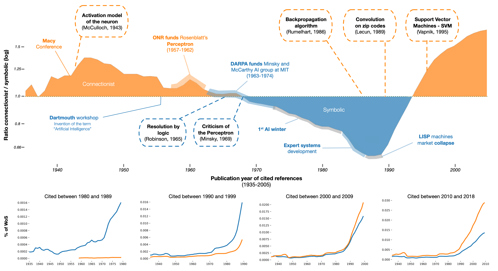
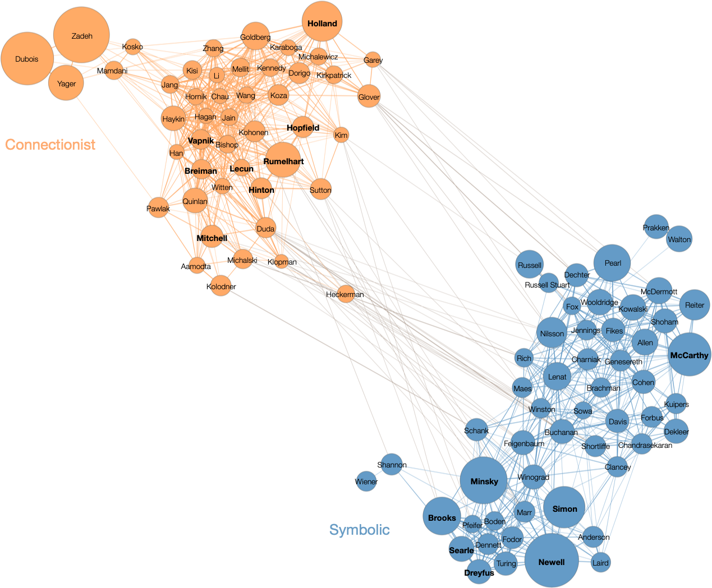

Neurons spike back

# Neurons spike back

By [Dominique Cardon](https://medialab.sciencespo.fr/people/dominique-cardon/), [Jean-Philippe Cointet](http://jph.cointet.free.fr/wp/) and [Antoine Mazières](https://antonomase.fr/).[1](https://neurovenge.antonomase.fr/#footnotes)

They talk about it !

 [MIT](https://twitter.com/MIT_CSAIL/status/1064209621424967687), [Yann LeCun](https://twitter.com/ylecun/status/1064075656647139328), [Oriol Vinyals](https://twitter.com/OriolVinyalsML/status/1064079002602807296), [*Le Monde*](https://www.lemonde.fr/series-d-ete-2018-long-format/article/2018/08/06/coup-de-froid-sur-les-reseaux-de-neurones_5339801_5325928.html), [...](https://twitter.com/search?src=typd&q=neurovenge.antonomase.fr&lang=en)

**[FULL PAPER PDF](https://neurovenge.antonomase.fr/NeuronsSpikeBack.pdf)** (also available [in French](https://neurovenge.antonomase.fr/RevancheNeurones_Reseaux.pdf)). *This web page only shows the two main figures of the paper.*

* * *

##### Abstract

Since 2010, machine learning based predictive techniques, and more specifically deep learning neural networks, have achieved spectacular performances in the fields of image recognition or automatic translation, under the umbrella term of “Artificial Intelligence”. But their filiation to this field of research is not straightforward. In the tumultuous history of AI, learning techniques using so-called "connectionist" neural networks have long been mocked and ostracized by the "symbolic" movement. This article retraces the history of artificial intelligence through the lens of the tension between symbolic and connectionist approaches. From a social history of science and technology perspective, it seeks to highlight how researchers, relying on the availability of massive data and the multiplication of computing power have undertaken to reformulate the symbolic AI project by reviving the spirit of adaptive and inductive machines dating back from the era of cybernetics.

**Keywords** : Neural networks, Artificial intelligence, Connectionnism, Expert systems, Deep learning

Published in *Réseaux* n°211/2018. **Cite**: [BibTeX](https://neurovenge.antonomase.fr/#bibtex) | [APA](https://neurovenge.antonomase.fr/#APA) | [Chicago](https://neurovenge.antonomase.fr/#chicago)

* * *

##### Timeline

**Evolution of the academic influence of connectionist and symbolic approaches to AI.**

*The main plot (top) represent the evolution of the ratio between the number of cited publications in the "connectionist" corpus[2](https://neurovenge.antonomase.fr/#footnotes) (orange) and the corresponding number in the "symbolic" corpus[3](https://neurovenge.antonomase.fr/#footnotes) (blue), both normalised by the total number of publication indexed by Web of Science. The plots at the bottom represent for each corpus, the number of cited publications cited during the given period.*

download highres: [en](https://neurovenge.antonomase.fr/img/timeline_highres_en.png) | [fr](https://neurovenge.antonomase.fr/img/timeline_highres_fr.png)  *(under [cc-by](http://creativecommons.org/licenses/by/4.0/) public license)*

##### Co-citation network

**Co-citation network of the 100 most cited authors within the academic publications mentionning "artificial intelligence".**

*This corpus includes 27,656 publications gathered in February 2018 on Web of Science with the query TS=("artificial intelligence"). Node size depends on the author's appearances frequency. Authors frequently quoted together are linked together in the network. A community detection algorithm reveals the bipartition of the network in two cohesive clusters.*

download highres: [en](https://neurovenge.antonomase.fr/img/network_highres_en.png) | [fr](https://neurovenge.antonomase.fr/img/network_highres_en.png)  *(under [cc-by](http://creativecommons.org/licenses/by/4.0/) public license)*

**[FULL PAPER PDF](https://neurovenge.antonomase.fr/NeuronsSpikeBack.pdf)** (also available [in French](https://neurovenge.antonomase.fr/RevancheNeurones_Reseaux.pdf)). *This web page only shows the two main figures of the paper.*

* * *

1. *Authors appear in alphabetic orders. This work is partly inspired by [Antoine](https://antonomase.fr/)'s PhD: *[A cartography of machine learning and its algorithms](https://hal.archives-ouvertes.fr/tel-01771655/document)* (in french). Check it out if you want more scientometrics and history on AI communities.*

2. *The "connectionist" corpus includes 106,278 publications gathered in February 2018 on Web of Science with the query: TS=(“artificial neural network*” OR “Deep learning” OR “perceptron*” OR “Backprop*” OR “Deep neural network*” OR "Convolutional neural network*" OR (“CNN” AND “neural network*”) OR ("LSTM" AND "neural network*") OR ("recurrent neural network*" OR ("RNN*" AND "neural network*")) OR "Boltzmann machine*" OR "hopfield network*" OR "Autoencoder*" OR "Deep belief network*" OR "recurrent neural network*")*

3. *The "symbolic" corpus includes 65,522 publications gathered in February 2018 on Web of Science with the query: TS=(“knowledge representation*” OR “expert system*” OR “knowledge based system*” OR "inference engine*" OR "search tree*" OR "minimax" OR "tree search" OR "Logic programming" OR "theorem prover*" OR ("planning" AND "logic") OR "logic programming" OR "lisp" OR "prolog" OR "deductive database*" OR "nonmonotonic reasoning*")*