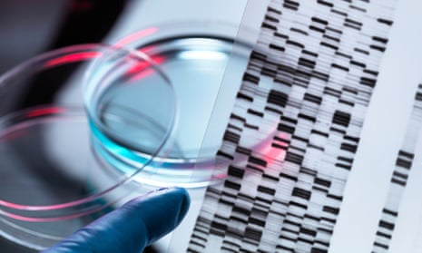
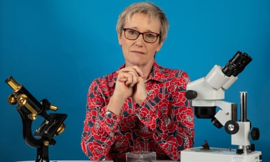

New gene editing tool could fix most harmful DNA mutations

[Gene editing](https://www.theguardian.com/science/gene-editing)

# New gene editing tool could fix most harmful DNA mutations

‘Prime editing’ more precise than Crispr-Cas9, but still needs time before use on humans

[Ian Sample](https://www.theguardian.com/profile/iansample) Science editor

[@iansample](https://twitter.com/iansample)

Mon 21 Oct 2019 16.27 BSTLast modified on Mon 21 Oct 2019 18.45 BST

- 
- 
- 

Shares

465

A DNA auto-radiogram with a sample in a petri dish: Prime editing can be thought of as being like the ‘find and replace’ function in word processors. Photograph: Getty Images/Science Photo Library RF

Scientists have raised fresh hopes for treating people with genetic disorders by inventing a powerful new molecular tool that, in principle, can correct the vast majority of mutations that cause human genetic diseases.

The procedure, named “prime editing”, can mend about 89% of the 75,000 or so harmful mutations known to mangle the human genome and lead to conditions such as cystic fibrosis, sickle cell anaemia, and a nerve-destroying illness called Tay-Sachs disease.

The landmark work opens the door to a new era of genome editing, but scientists caution that more research is needed before it can be safely used in humans. Beyond proving its safety, another major hurdle is how to deliver the molecular machinery to cells that need it in sufficient amounts to treat a disorder.

.

# Prime editing, a new DNA editing tool, can mend most mutations that cause human disease

1
2

The prime editor contains an engineered protein that guides it to its target. On arrival, the editor uses an enzyme called cas9 to nick one strand of the DNA

The prime editor then churns out fresh DNA to be inserted at the site
Original DNA
strand removed
Guide molecule
Cas9
Target DNA
Fresh DNA inserted
3
4

Another guide protein then directs the prime editor to nick the unedited DNA strand

The cell repairs the nick by copying the edited strand, completing the edit
Unedited DNA strand is nicked
Fully edited DNA
Guardian graphic. Source: Nature
.
Prime editing can ‘nick’ and replace sections of mutated DNA strands

“This first report of prime editing is the beginning rather than the end of a longstanding aspiration in the life sciences to be able to make any DNA change in any position of a living cell or organism, including potentially human patients with genetic diseases,” said David Liu at the Broad Institute of MIT and Harvard in Cambridge, Massachusetts.

Advertisement

The ability to [rewrite the genetic code](https://www.theguardian.com/science/2018/jan/15/gene-editing-and-what-it-really-means-to-rewrite-the-code-of-life) is one of the most striking scientific advances of recent years. The most common approach, known as Crispr-Cas9, has been likened to “molecular scissors” which home in on a particular DNA sequence and then cut it in two. The procedure allows scientists to disable specific genes and even correct harmful mutations by providing cells with fresh strands of DNA with which to repair the cut.

Crispr-Cas9 is not perfect, however. Often, it leads to cells with a haphazard mix of edits, including extra chunks of DNA called insertions, or missing chunks of genetic code called deletions. These are less of a problem when scientists are working on cells in a dish, because those that are affected can be thrown away. But when genome editing is used to rewrite faulty genes in people’s lungs, hearts and other tissues, far more precision is needed.

Play Video

4:22

   The biggest revolution in gene editing: Crispr-Cas9 explained – video

Andrew Anzalone, also at the Broad Institute, created prime editing with Liu by giving Crispr-Cas9 an overhaul. The new system homes in on its target as before, but instead of chopping the DNA in half, it nicks it, and then writes a new section of DNA into the specified position.

[Writing in the journal Nature](https://www.nature.com/articles/s41586-019-1711-4), the scientists describe how they made 175 different DNA edits to human cells with impressive precision. In one demonstration, they corrected mutations that cause the inherited blood disorder, sickle cell anaemia. In another, they removed the four extra DNA letters in a particular gene that cause Tay-Sachs disease, a rare condition that destroys children’s nerves and usually proves fatal by five years old.

Before prime editing, it was impossible to make such a range of DNA changes in so many different cell types without leaving behind insertions, deletions and other genetic detritus that can interfere with the workings of the edited cell.

 

##   [Nessa Carey: ‘The most worrying thing about gene editing is that it’s really easy’]()

   

Read more

 [(L)](https://www.theguardian.com/science/2019/mar/02/nessa-carey-interview-china-gene-editing-big-pharma-100000-genomes-project)

“You can think of prime editors as being like word processors capable of searching for target DNA sequences and precisely replacing them with edited DNA sequences,” Liu said. “Potential impacts include being able to directly correct a much larger fraction of the mutations that cause genetic diseases, and being able to introduce DNA changes into crops that result in healthier or more sustainable foods.”

Advertisement

Robin Lovell-Badge, a geneticist at the Francis Crick Institute in London, said prime editing looked “very exciting” and would be useful for exploring what genes do, making animal models of human genetic disorders, and improving animal and plant agriculture. Because the procedure can make changes that occur naturally in plants, at least some prime-edited crops should not be regulated as “genetically modified”, he added.

But much more work needs to be done before prime editing can be used in humans, Lovell-Badge stressed. “As the authors themselves point out, these are new methods and effort will be needed to develop them to show that they are sufficiently safe and efficient. So far the authors have conducted experiments on just a few human cell types, which is far from being enough.”

While the efficiency of the edits – about 50% in some cases – would be good enough for scientists conducting basic research, he questioned whether it would be useful for scientists working on live animals. “Nevertheless, I am excited about the methods which certainly hold promise and I expect we will see many applications that use these or next generation methods based on them.”

##  As the climate crisis escalates…

… the Guardian will not stay quiet. This is our pledge: we will continue to give global heating, wildlife extinction and pollution the urgent attention and prominence they demand. The Guardian recognises the climate emergency as the defining issue of our times.

Our independence means we are free to investigate and challenge inaction by those in power. We will inform our readers about threats to the environment based on scientific facts, not driven by commercial or political interests. And we have made several important changes to our style guide to ensure the language we use accurately reflects the environmental catastrophe.

The Guardian believes that the problems we face on the climate crisis are systemic and that fundamental societal change is needed. We will keep reporting on the efforts of individuals and communities around the world who are fearlessly taking a stand for future generations and the preservation of human life on earth. We want their stories to inspire hope. We will also report back on our own progress as an organisation, as we take important steps to address our impact on the environment.

The Guardian made a choice: to keep our journalism open to all. We do not have a paywall because we believe everyone deserves access to factual information, regardless of where they live or what they can afford.

We hope you will consider supporting the Guardian’s open, independent reporting today. Every contribution from our readers, however big or small, is so valuable. **Support The Guardian from as little as £1 – and it only takes a minute. Thank you.**

 [Support The Guardian](https://support.theguardian.com/uk/contribute?REFPVID=k23koga6bvia2uq3xng6&INTCMP=gdnwb_copts_memco_2019-10-14_moment_climate_pledge__multi_UK_nonenviron_round2_v1_crisis_escalates&acquisitionData=%7B%22source%22%3A%22GUARDIAN_WEB%22%2C%22componentId%22%3A%22gdnwb_copts_memco_2019-10-14_moment_climate_pledge__multi_UK_nonenviron_round2_v1_crisis_escalates%22%2C%22componentType%22%3A%22ACQUISITIONS_EPIC%22%2C%22campaignCode%22%3A%22gdnwb_copts_memco_2019-10-14_moment_climate_pledge__multi_UK_nonenviron_round2_v1_crisis_escalates%22%2C%22abTest%22%3A%7B%22name%22%3A%222019-10-14_moment_climate_pledge__multi_UK_nonenviron_round2%22%2C%22variant%22%3A%22v1_crisis_escalates%22%7D%2C%22referrerPageviewId%22%3A%22k23koga6bvia2uq3xng6%22%2C%22referrerUrl%22%3A%22https%3A%2F%2Fwww.theguardian.com%2Fscience%2F2019%2Foct%2F21%2Fnew-gene-editing-tool-could-fix-most-harmful-dna-mutations%22%7D)

 

Topics

- [Gene editing/](https://www.theguardian.com/science/gene-editing)
- [Genetics/](https://www.theguardian.com/science/genetics)
- [Biology/](https://www.theguardian.com/science/biology)
- [news/](https://www.theguardian.com/tone/news)
- 
- 
- 
- [Share on LinkedIn](http://www.linkedin.com/shareArticle?mini=true&title=New%20gene%20editing%20tool%20could%20fix%20most%20harmful%20DNA%20mutations&url=https%3A%2F%2Fwww.theguardian.com%2Fscience%2F2019%2Foct%2F21%2Fnew-gene-editing-tool-could-fix-most-harmful-dna-mutations)
- [Share on Pinterest](http://www.pinterest.com/pin/find/?url=https%3A%2F%2Fwww.theguardian.com%2Fscience%2F2019%2Foct%2F21%2Fnew-gene-editing-tool-could-fix-most-harmful-dna-mutations)
- [Reuse this content](https://syndication.theguardian.com/automation/?url=https%3A%2F%2Fwww.theguardian.com%2Fscience%2F2019%2Foct%2F21%2Fnew-gene-editing-tool-could-fix-most-harmful-dna-mutations&type=article&internalpagecode=6725193)