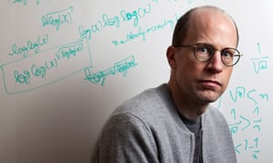
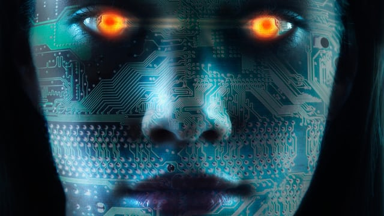
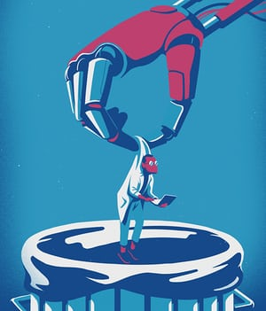
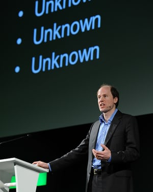

Nick Bostrom: ‘We are like small children playing with a bomb’

# Artificial intelligence: ‘We’re like children playing with a bomb’

Sentient machines are a greater threat to humanity than climate change, according to Oxford philosopher Nick Bostrom

Sun 12 Jun 2016 08.30 BSTLast modified on Fri 16 Mar 2018

‘I don’t buy the claim that the artificial composers currently can compete with the great composers’: Nick Bostrom. Photograph: The Washington Post

You’ll find the [Future of Humanity Institute](https://www.fhi.ox.ac.uk/) down a medieval backstreet in the centre of Oxford. It is beside St Ebbe’s church, which has stood on this site since 1005, and above a Pure Gym, which opened in April. The institute, a research faculty of Oxford University, was established a decade ago to ask the very biggest questions on our behalf. Notably: what exactly are the “existential risks” that threaten the future of our species; how do we measure them; and what can we do to prevent them? Or to put it another way: in a world of multiple fears, what precisely should we be most terrified of?

When I arrive to meet the director of the institute, Professor Nick Bostrom, a bed is being delivered to the second-floor office. Existential risk is a round-the-clock kind of operation; it sleeps fitfully, if at all.

Bostrom, a 43-year-old Swedish-born philosopher, has lately acquired something of the status of prophet of doom among those currently doing most to shape our civilisation: the tech billionaires of Silicon Valley. His reputation rests primarily on his book [*Superintelligence: Paths, Dangers, Strategies*](https://bookshop.theguardian.com/superintelligence.html), which was a surprise *New York Times* bestseller last year and now arrives in paperback, trailing must-read recommendations from Bill Gates and Tesla’s [Elon Musk](https://www.theguardian.com/technology/elon-musk). (In the best kind of literary review, Musk also gave Bostrom’s institute £1m to continue to pursue its inquiries.)

The book is a lively, speculative examination of the singular threat that Bostrom believes – after years of calculation and argument – to be the one most likely to wipe us out. This threat is not climate change, nor pandemic, nor nuclear winter; it is the possibly imminent creation of a general machine intelligence greater than our own.

The cover of Bostrom’s book is dominated by a mad-eyed, pen-and-ink picture of an owl. The owl is the subject of the book’s opening parable. A group of sparrows are building their nests. “We are all so small and weak,” tweets one, feebly. “Imagine how easy life would be if we had an owl who could help us build our nests!” There is general twittering agreement among sparrows everywhere; an owl could defend the sparrows! It could look after their old and their young! It could allow them to live a life of leisure and prosperity! With these fantasies in mind, the sparrows can hardly contain their excitement and fly off in search of the swivel-headed saviour who will transform their existence.

> Target-seeking mosquito-like robots might burgeon forth from every square metre of the globe

There is only one voice of dissent: “Scronkfinkle, a one-eyed sparrow with a fretful temperament, was unconvinced of the wisdom of the endeavour. Quoth he: ‘This will surely be our undoing. Should we not give some thought to the art of owl-domestication and owl-taming first, before we bring such a creature into our midst?’” His warnings, inevitably, fall on deaf sparrow ears. Owl-taming would be complicated; why not get the owl first and work out the fine details later? Bostrom’s book, which is a shrill alarm call about the darker implications of artificial intelligence, is dedicated to Scronkfinkle.

Bostrom articulates his own warnings in a suitably fretful manner. He has a reputation for obsessiveness and for workaholism; he is slim, pale and semi-nocturnal, often staying in the office into the early hours. Not surprisingly, perhaps, for a man whose days are dominated by whiteboards filled with formulae expressing the relative merits of 57 varieties of apocalypse, he appears to leave as little as possible to chance. In place of meals he favours a green-smoothie elixir involving vegetables, fruit, oat milk and whey powder. Other interviewers have remarked on his avoidance of handshakes to guard against infection. He does proffer a hand to me, but I have the sense he is subsequently isolating it to disinfect when I have gone. There is, perhaps as a result, a slight impatience about him, which he tries hard to resist.

In his book he talks about the “intelligence explosion” that will occur when machines much cleverer than us begin to design machines of their own. “Before the prospect of an intelligence explosion, we humans are like small children playing with a bomb,” he writes. “We have little idea when the detonation will occur, though if we hold the device to our ear we can hear a faint ticking sound.” Talking to Bostrom, you have a feeling that for him that faint ticking never completely goes away.

We speak first about the success of his book, the way it has squarely hit a nerve. It coincided with the [open letter](https://www.theguardian.com/technology/2015/jul/27/musk-wozniak-hawking-ban-ai-autonomous-weapons) signed by more than 1,000 eminent scientists – including Stephen Hawking, Apple co-founder Steve Wozniak and Musk – and presented at last year’s International Joint Conference on Artificial Intelligence, urging a ban on the use and development of fully autonomous weapons (the “killer robots” of science fiction that are very close to reality). Bostrom, who is both aware of his own capacities and modest about his influence, suggests it was a happy accident of timing.

“Machine learning and deep learning [the pioneering ‘neural’ computer algorithms that most closely mimic human brain function] have over the last few years moved much faster than people anticipated,” he says. “That is certainly one of the reasons why this has become such a big topic just now. People can see things moving forward in the technical field, and they become concerned about what next.”

[We should be more afraid of computers than we are](https://www.theguardian.com/commentisfree/video/2016/mar/16/artificial-intelligence-we-should-be-more-afraid-of-computers-than-we-are-video)

Bostrom sees those implications as potentially Darwinian. If we create a machine intelligence superior to our own, and then give it freedom to grow and learn through access to the internet, there is no reason to suggest that it will not evolve strategies to secure its dominance, just as in the biological world. He sometimes uses the example of humans and gorillas to describe the subsequent one-sided relationship and – as [last month’s events in Cincinnati zoo highlighted](https://www.theguardian.com/us-news/2016/may/30/gorilla-shot-cincinnati-zoo-child) – that is never going to end well. An inferior intelligence will always depend on a superior one for its survival.

There are times, as Bostrom unfolds various scenarios in *Superintelligence*, when it appears he has been reading too much of the science fiction he professes to dislike. One projection involves an AI system eventually building covert “nanofactories producing nerve gas or target-seeking mosquito-like robots [which] might then burgeon forth simultaneously from every square metre of the globe” in order to destroy meddling and irrelevant humanity. Another, perhaps more credible vision, sees the superintelligence “hijacking political processes, subtly manipulating financial markets, biasing information flows, or hacking human-made weapons systems” to bring about the extinction.

Does he think of himself as a prophet?

He smiles. “Not so much. It is not that I believe I know how it is going to happen and have to tell the world that information. It is more I feel quite ignorant and very confused about these things but by working for many years on probabilities you can get partial little insights here and there. And if you add those together with insights many other people might have, then maybe it will build up to some better understanding.”

Bostrom came to these questions by way of the [transhumanist movement](http://www.nickbostrom.com/ethics/values.html), which tends to view the digital age as one of unprecedented potential for optimising our physical and mental capacities and transcending the limits of our mortality. Bostrom still sees those possibilities as the best case scenario in the superintelligent future, in which we will harness technology to overcome disease and illness, feed the world, create a utopia of fulfilling creativity and perhaps eventually overcome death. He has been identified in the past as a member of [Alcor](http://www.alcor.org/), the cryogenic initiative that promises to freeze mortal remains in the hope that, one day, minds can be reinvigorated and uploaded in digital form to live in perpetuity. He is coy about this when I ask directly what he has planned.

“I have a policy of never commenting on my funeral arrangements,” he says.
But he thinks there is a value in cryogenic research?

“It seems a pretty rational thing for people to do if they can afford it,” he says. “When you think about what life in the quite near future could be like, trying to store the information in your brain seems like a conservative option as opposed to burning the brain down and throwing it away. Unless you are really confident that the information will never be useful…”

I wonder at what point his transhumanist optimism gave way to his more nightmarish visions of superintelligence. He suggests that he has not really shifted his position, but that he holds the two possibilities – the heaven and hell of our digital future – in uneasy opposition.

Illustration by Eric Chow.

“I wrote a lot about human enhancement ethics in the mid-90s, when it was largely rejected by academics,” he says. “They were always like, ‘Why on earth would anyone want to cure ageing?’ They would talk about overpopulation and the boredom of living longer. There was no recognition that this is why we do any medical research: to extend life. Similarly with cognitive enhancement – if you look at what I was writing then, it looks more on the optimistic side – but all along I was concerned with existential risks too.”

There seems an abiding unease that such enhancements – pills that might make you smarter, or slow down ageing – go against the natural order of things. Does he have a sense of that?

“I’m not sure that I would ever equate natural with good,” he says. “Cancer is natural, war is natural, parasites eating your insides are natural. What is natural is therefore never a very useful concept to figure out what we should do. Yes, there are ethical considerations but you have to judge them on a case-by-case basis. You must remember I am a transhumanist. I want my life extension pill now. And if there were a pill that could improve my cognition by 10%, I would be willing to pay a lot for that.”

Has he tried the ones that claim to enhance concentration?

“I have, but not very much. I drink coffee, I have nicotine chewing gum, but that is about it. But the only reason I don’t do more is that I am not yet convinced that anything else works.”

He is not afraid of trying. When working, he habitually sits in the corner of his office surrounded by a dozen lamps, apparently in thrall to the idea of illumination.

Bostrom grew up an only child in the coastal Swedish town of Helsingborg. Like many gifted children, he loathed school. His father worked for an investment bank, his mother for a Swedish corporation. He doesn’t remember any discussion of philosophy – or art or books – around the dinner table. Wondering how he found himself obsessed with these large questions, I ask if he was an anxious child: did he always have a powerful sense of mortality?

“I think I had it quite early on,” he says. “Not because I was on the brink of death or anything. But as a child I remember thinking a lot that my parents may be healthy now but they are not always going to be stronger or bigger than me.”

That thought kept him awake at nights?
“I don’t remember it as anxiety, more as a melancholy sense.”
And was that ongoing desire to live for ever rooted there too?

“Not necessarily. I don’t think that there is any particularly different desire that I have in that regard to anyone else. I don’t want to come down with colon cancer – who does? If I was alive for 500 years who knows how I would feel? It is not so much fixated on immortality, just that premature death seems prima facie bad.”

A good deal of his book asks questions of how we might make superintelligence – whether it comes in 50 years or 500 years – “nice”, congruent with our humanity. Bostrom sees this as a technical challenge more than a political or philosophical one. It seems to me, though, that a good deal of our own ethical framework, our sense of goodness, is based on an experience and understanding of suffering, of our bodies. How could a non-cellular intelligence ever “comprehend” that?

> ‘Most of the world is completely oblivious to the most major things that are going to happen in the 21st century’

“There are a lot of things that machines can’t understand currently because they are not that smart,” he says, “but once they become so, I don’t think there would be any special difficulty in understanding human suffering and death.” That understanding might be one way they could be taught to respect human value, he says. “But it depends what your ethical theory is. It might be more about respecting others’ autonomy, or striving to achieve beautiful things together.” Somehow, and he has no idea how really, he thinks those things will need to be hardwired from the outset to avoid catastrophe. It is no good getting your owl first then wondering how to train it. And with artificial systems already superior to the best human intelligence in many discrete fields, a conversation about how that might be done is already overdue.

The sense of intellectual urgency about these questions derives in part from what Bostrom calls an “epiphany experience”, which occurred when he was in his teens. He found himself in 1989 in a library and picked up at random an anthology of 19th-century German philosophy, containing works by Nietzsche and Schopenhauer. Intrigued, he read the book in a nearby forest, in a clearing that he used to visit to be alone and write poetry. Almost immediately he experienced a dramatic sense of the possibilities of learning. Was it like a conversion experience?

“More an awakening,” he says. “It felt like I had sleepwalked through my life to that point and now I was aware of some wider world that I hadn’t imagined.”

Following first the leads and notes in the philosophy book, Bostrom set about educating himself in fast forward. He read feverishly, and in spare moments he painted and wrote poetry, eventually taking degrees in philosophy and mathematical logic at Gothenburg university, before completing a PhD at the London School of Economics, and teaching at Yale.

Did he continue to paint and write?

“It seemed to me at some point that mathematical pursuit was more important,” he says. “I felt the world already contained a lot of paintings and I wasn’t convinced it needed a few more. Same could be said for poetry. But maybe it did need a few more ideas of how to navigate the future.”

One of the areas in which AI is making advances is in its ability to compose music and create art, and even to write. Does he imagine that sphere too will quickly be colonised by a superintelligence, or will it be a last redoubt of the human?

“I don’t buy the claim that the artificial composers currently can compete with the great composers. Maybe for short bursts but not over a whole symphony. And with art, though it can be replicated, the activity itself has value. You would still paint for the sake of painting.”

Authenticity, the man-made, becomes increasingly important?

# This is what happens when an AI-written screenplay is made into a film

Read more

“Yes and not just with art. If and when machines can do everything better than we can do, we would continue to do things because we enjoy doing them. If people play golf it is not because they need the ball to reside in successive holes efficiently, it is because they enjoy doing it. The more machines can do everything we can do the more attention we will give to these things that we value for their own sake.”

Early in his intellectual journey, Bostrom did a few stints as a philosophical standup comic in order to improve his communication skills. Talking to him, and reading his work, an edge of knowing absurdity at the sheer scale of the problems is never completely absent from his arguments. The axes of daunting-looking graphs in his papers will be calibrated on closer inspection in terms of “endurable”, “crushing” and “hellish”. In his introduction to *Superintelligence*,the observation “Many of the points made in this book are probably wrong” typically leads to a footnote that reads: “I don’t know which ones.” Does he sometimes feel he is morphing into Douglas Adams?

“Sometimes the work does seem strange,” he says. “Then from another point it seems strange that most of the world is completely oblivious to the most major things that are going to happen in the 21st century. Even people who talk about global warming never mention any threat posed by AI.”

Because it would dilute their message?

“Maybe. At any time in history it seems to me there can only be one official global concern. Now it is climate change, or sometimes terrorism. When I grew up it was nuclear Armageddon. Then it was overpopulation. Some are more sensible than others, but it is really quite random.”

Bostrom’s passion is to attempt to apply some maths to that randomness. Does he think that concerns about AI will take over from global warming as a more imminent threat any time soon?

“I doubt it,” he says. “It will come gradually and seamlessly without us really addressing it.”

If we are going to look anywhere for its emergence, Google, which is throwing a good deal of its unprecedented resources at deep learning technology (not least with its [purchase in 2014 of the British pioneer DeepMind](https://www.theguardian.com/technology/2014/jan/27/google-acquires-uk-artificial-intelligence-startup-deepmind)) would seem a reasonable place to start. Google apparently has an AI ethics board to confront these questions, but no one knows who sits on it. Does Bostrom have faith in its “Don’t be evil” mantra?

“There is certainly a culture among tech people that they want to feel they are doing something that is not just to make money but that it has some positive social purpose. There is this idealism.”

Can he help shape the direction of that idealism?

“It is not so much that one’s own influence is important,” he says. “Anyone who has a role in highlighting these arguments will be valuable. If the human condition really were to change fundamentally in our century, we find ourselves at a key juncture in history.” And if Bostrom’s more nihilistic predictions are correct, we will have only one go at getting the nature of the new intelligence right.

Nick Bostrom talking on[‘Superintelligence and the unknown future’](https://www.youtube.com/watch?v=zRWpPxhQ1o0) at London’s Futurefest in 2013. Photograph: Michael Bowles/Rex/Shutterstock

Last year Bostrom became a father. (Typically his marriage is conducted largely by Skype – his wife, a medical doctor, lives in Vancouver.) I wonder, before I go, if becoming a dad has changed his sense of the reality of these futuristic issues?

“Only in the sense that it emphasises this dual perspective, the positive and negative scenarios. This kind of intellectualising, that our world might be transformed completely in this way, always seems a lot harder to credit at a personal level. I guess I allow both of these perspectives as much room as I can in my mind.”

At the same time as he entertains those thought experiments, I suggest, half the world remains concerned where its next meal is coming from. Is the threat of superintelligence quite an elitist anxiety? Do most of us not think of the longest-term future because there is more than enough to worry about in the present?

“If it got to the point where the world was spending hundreds of billions of dollars on this stuff and nothing on more regular things then one might start to question it,” he says. “If you look at all the things the world is spending money on, what we are doing is less than a pittance. You go to some random city and you travel from the airport to your hotel. Along the highway you see all these huge buildings for companies you have never heard of. Maybe they are designing a new publicity campaign for a razor blade. You drive past hundreds of these buildings. Any one of those has more resources than the total that humanity is spending on this field. We have half a floor of one building in Oxford, and there are two or three other groups doing what we do. So I think it is OK.”

And how, I ask, might we as individuals and citizens think about and frame these risks to the existence of our species? Bostrom shrugs a little. “If we are thinking of this very long time frame, then it is clear that very small things we do now can make a significant difference in that future.”

A[recent paper of Bostrom’s](http://www.existential-risk.org/concept.html), which I read later at home, contains a little rule of thumb worth bearing in mind. Bostrom calls it “maxipok”. It is based on the idea that “the objective of reducing existential risks should be a dominant consideration whenever we act out of an impersonal concern for humankind as a whole.” What does maxipok involve? Trying to “maximise the probability of an ‘OK outcome’ where an OK outcome is any outcome that avoids existential catastrophe.”

It certainly sounds worth a go.

•* Superintelligence: Paths, Dangers, Strategies is published by Oxford University Press, £9.99. **[Click here to buy it for £7.99](https://bookshop.theguardian.com/catalog/product/view/id/386822/)*

• This article was amended on 13 June 2016. An earlier version said that an open letter signed by eminent scientists was a direct result of Bostrom’s book, rather than a coincidence.