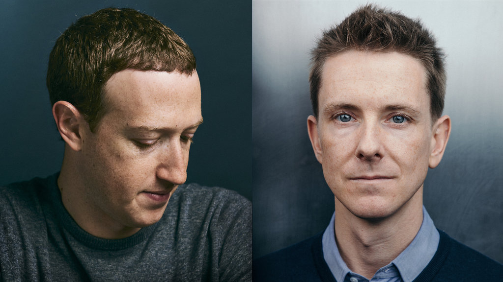
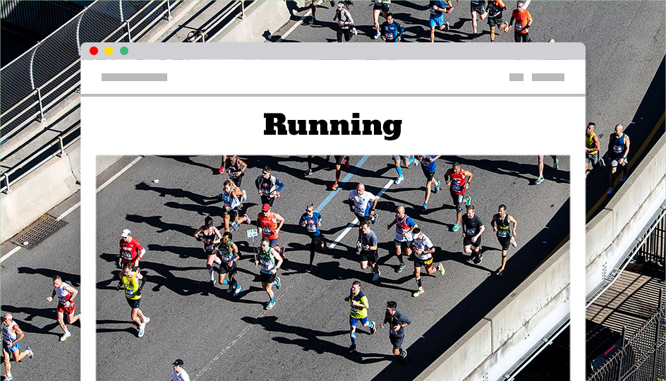
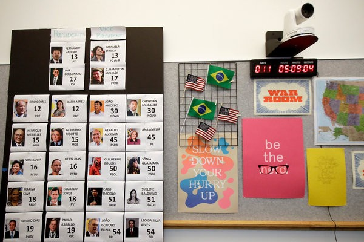
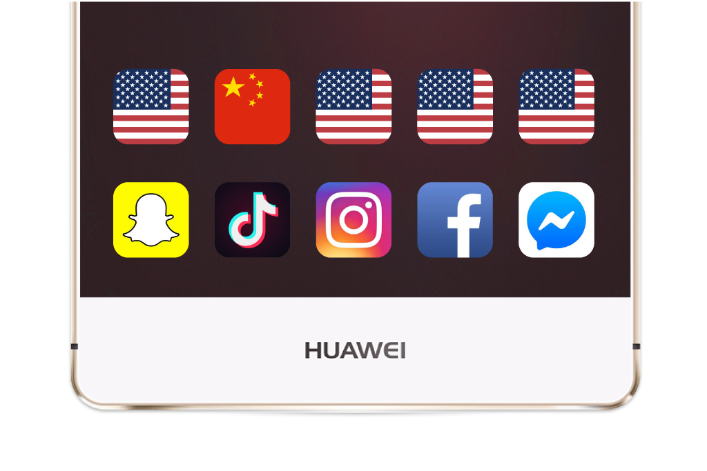
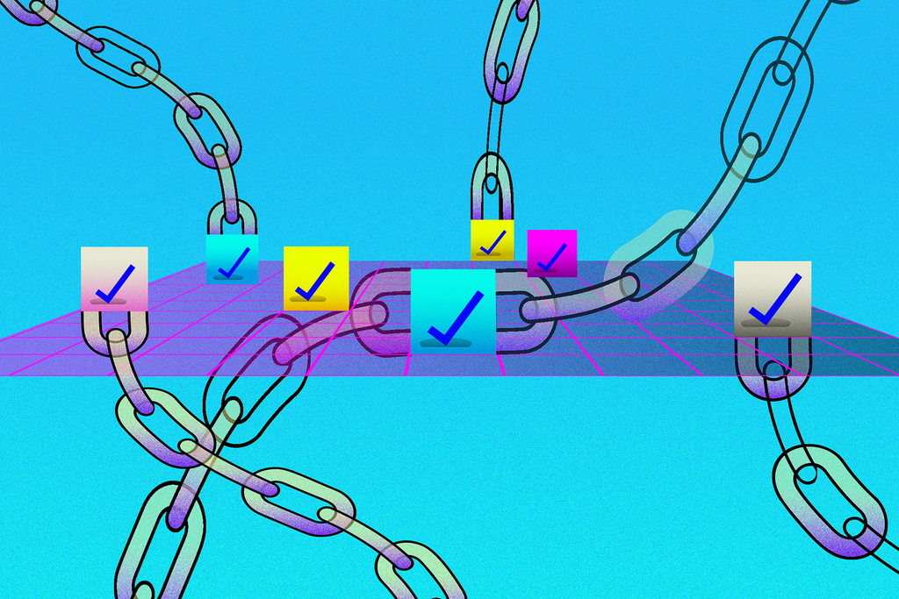
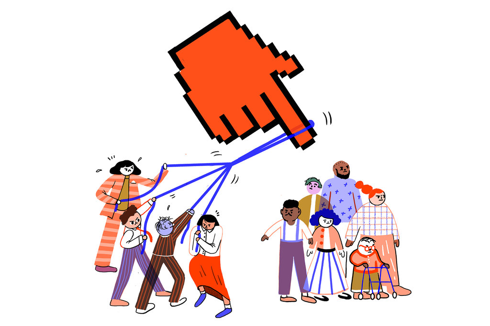
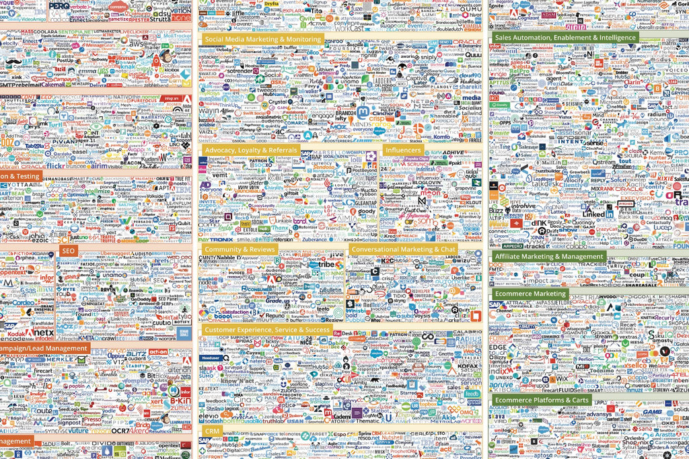
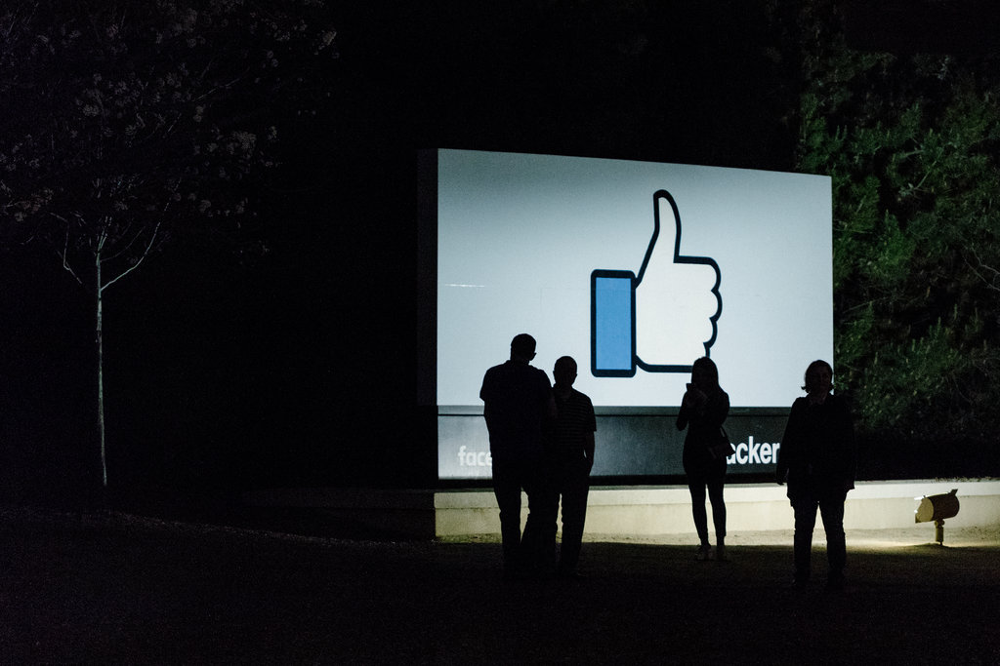

Opinion | It’s Time to Break Up Facebook

Image

CreditCreditJessica Chou for The New York Times (Zuckerberg); Damon Winter/The New York Times (Hughes)

[Opinion](https://www.nytimes.com/section/opinion)[The Privacy Project](https://www.nytimes.com/privacy-project)

# It’s Time to Break Up FacebookIt’s Time to Break Up Facebook

By Chris Hughes
May 9, 2019

CreditCreditJessica Chou for The New York Times (Zuckerberg); Damon Winter/The New York Times (Hughes)

-
-

    - 
    - 
    - [](https://www.nytimes.com/2019/05/09/opinion/sunday/chris-hughes-facebook-zuckerberg.htmlmailto:?subject=NYTimes.com%3A%20It%E2%80%99s%20Time%20to%20Break%20Up%20Facebook&body=From%20The%20New%20York%20Times%3A%0A%0AIt%E2%80%99s%20Time%20to%20Break%20Up%20Facebook%0A%0AMark%20Zuckerberg%20is%20a%20good%20guy.%20But%20the%20company%20I%20helped%20him%20build%20is%20a%20threat%20to%20our%20economy%20and%20democracy.%0A%0Ahttps%3A%2F%2Fwww.nytimes.com%2F2019%2F05%2F09%2Fopinion%2Fsunday%2Fchris-hughes-facebook-zuckerberg.html)

    -
    -
    -

**The last time I saw Mark Zuckerberg** was in the summer of 2017, several months before the [Cambridge Analytica scandal broke](https://www.nytimes.com/2018/03/17/us/politics/cambridge-analytica-trump-campaign.html?module=inline). We met at [Facebook’s](https://www.nytimes.com/2019/05/09/opinion/chris-hughes-facebook.html?module=inline) Menlo Park, Calif., office and drove to his house, in a quiet, leafy neighborhood. We spent an hour or two together while his toddler daughter cruised around. We talked politics mostly, a little about [Facebook](https://www.nytimes.com/2019/05/09/business/facebook-response-chris-hughes.html?module=inline), a bit about our families. When the shadows grew long, I had to head out. I hugged his wife, Priscilla, and said goodbye to Mark.

Since then, Mark’s personal reputation and the reputation of Facebook have taken a nose-dive. The company’s mistakes — the sloppy privacy practices that dropped tens of millions of users’ data into a political consulting firm’s lap;*  *the slow response to Russian agents, violent rhetoric and fake news; and the unbounded drive to capture ever more of our time and attention — dominate the headlines. It’s been 15 years since I co-founded Facebook at Harvard, and I haven’t worked at the company in a decade. But I feel a sense of anger and responsibility.

### Watch: A founder of Facebook says it should be broken up.

Video

0:43

       

5:22

 [](https://www.nytimes.com/video)

 [I Co-Founded Facebook. It’s Time to Break It Up.](https://www.nytimes.com/video/opinion/100000006480848/chris-hughes-facebook-zuckerberg.html?action=click&gtype=vhs&version=vhs-heading&module=vhs&region=title-area)

   By Chris Hughes

5:22I Co-Founded Facebook. It’s Time to Break It Up.

[(L)](https://www.nytimes.com/2019/05/09/opinion/sunday/chris-hughes-facebook-zuckerberg.htmlmailto:?Subject=Watch%20I%20Co-Founded%20Facebook.%20It%E2%80%99s%20Time%20to%20Break%20It%20Up.%20on%20The%20New%20York%20Times&body=Watch%20I%20Co-Founded%20Facebook.%20It%E2%80%99s%20Time%20to%20Break%20It%20Up.%20on%20The%20New%20York%20Times:%20https://www.nytimes.com/video/opinion/100000006480848/chris-hughes-facebook-zuckerberg.html%0D%0A%0D%0AExplore%20more%20videos%20from%20Times%20Video:%20https://nyti.ms/1ExDNKO%0D%0ASign%20up%20for%20the%20Times%20Video%20newsletter:%20https://nyti.ms/1FdVTab)

Chris Hughes, a co-founder of Facebook, says the company is so big and powerful that it threatens our democracy.CreditCreditGetty Images

Mark is still the same person I watched hug his parents as they left our dorm’s common room at the beginning of our sophomore year. He is the same person who procrastinated studying for tests, fell in love with his future wife while in line for the bathroom at a party and slept on a mattress on the floor in a small apartment years after he could have afforded much more. In other words, he’s human. But it’s his very humanity that makes his unchecked power so problematic.

Advertisement

 [(L)](https://adclick.g.doubleclick.net/pcs/click%253Fxai%253DAKAOjstmfnf4eGqJ3vVXnQpQF0ni5sj_s1pWxbLUchF3V3600cfOyarDKHJoZ3QaOS_KAI08Bv2IG9BqoTEcO-3WwVY4e2lMxzSm1Cd9ZEhyn4Qi1JEJVQS_vcJ20NeA5VX7qOxjKGV07ebSga3SZINudJalME2H0o7mN6yn7x47aoVA_oXtzhQbPdEW5EnH1aHr5y2yGPkMap8M-5nbywmatH1Ptl7iV3PErxeNmPvf-uspHbqX8PJ2nR4eNW145OWgAkr30AcO%2526sig%253DCg0ArKJSzBDTsRuiPGQjEAE%2526urlfix%253D1%2526adurl%253Dhttps://ad.doubleclick.net/ddm/trackclk/N296811.6440THENEWYORKTIMESCOMPA/B22283637.240761726%3Bdc_trk_aid%3D437792132%3Bdc_trk_cid%3D112659762%3Bdc_lat%3D%3Bdc_rdid%3D%3Btag_for_child_directed_treatment%3D%3Btfua%3D)

[                  Make your inbox environmentally conscious.           Sign up for the newsletter that brings understanding and insight about climate change right to your inbox.        sign up      ](https://adclick.g.doubleclick.net/pcs/click%253Fxai%253DAKAOjstmfnf4eGqJ3vVXnQpQF0ni5sj_s1pWxbLUchF3V3600cfOyarDKHJoZ3QaOS_KAI08Bv2IG9BqoTEcO-3WwVY4e2lMxzSm1Cd9ZEhyn4Qi1JEJVQS_vcJ20NeA5VX7qOxjKGV07ebSga3SZINudJalME2H0o7mN6yn7x47aoVA_oXtzhQbPdEW5EnH1aHr5y2yGPkMap8M-5nbywmatH1Ptl7iV3PErxeNmPvf-uspHbqX8PJ2nR4eNW145OWgAkr30AcO%2526sig%253DCg0ArKJSzBDTsRuiPGQjEAE%2526urlfix%253D1%2526adurl%253Dhttps://ad.doubleclick.net/ddm/trackclk/N296811.6440THENEWYORKTIMESCOMPA/B22283637.240761726%3Bdc_trk_aid%3D437792132%3Bdc_trk_cid%3D112659762%3Bdc_lat%3D%3Bdc_rdid%3D%3Btag_for_child_directed_treatment%3D%3Btfua%3D)

Mark’s influence is staggering, far beyond that of anyone else in the private sector or in government. He controls three core communications platforms — [Facebook](https://www.nytimes.com/2019/05/09/business/facebook-response-chris-hughes.html?module=inline), Instagram and WhatsApp — that billions of people use every day. Facebook’s board works more like an advisory committee than an overseer, because Mark [controls around 60 percent of voting shares](https://www.vox.com/technology/2018/11/19/18099011/mark-zuckerberg-facebook-stock-nyt-wsj). Mark alone can decide how to configure Facebook’s algorithms to determine what people see in their News Feeds, what privacy settings they can use and even which messages get delivered. He sets the rules for how to distinguish violent and incendiary speech from the merely offensive, and he can choose to shut down a competitor by acquiring, blocking or copying it.

> Mark’s influence is staggering, far beyond that of anyone else in the private sector or in government.

Mark is a good, kind person. But I’m angry that his focus on growth led him to sacrifice security and civility for clicks. I’m disappointed in myself and the early Facebook team for not thinking more about how the News Feed algorithm could change our culture, influence elections and empower nationalist leaders. And I’m worried that Mark has surrounded himself with a team that reinforces his beliefs instead of challenging them.

The government must hold Mark accountable. For too long, lawmakers have marveled at Facebook’s explosive growth and overlooked their responsibility to ensure that Americans are protected and markets are competitive. Any day now, the Federal Trade Commission is expected to impose a $5 billion fine on the company, but that is not enough; nor is Facebook’s offer to [appoint](https://www.nytimes.com/2019/05/01/technology/facebook-ftc-settlement.html?module=inline)[some kind of privacy czar](https://www.nytimes.com/2019/05/01/technology/facebook-ftc-settlement.html?module=inline). After*  *Mark’s congressional testimony last year, there should have been calls for him to truly reckon with his mistakes. Instead the legislators who questioned him were derided as too old and out of touch to understand how tech works. That’s the impression Mark wanted Americans to have, because it means little will change.

Mark Zuckerberg testifying on Capitol Hill in 2018. CreditTom Brenner/The New York Times

Image

Mark Zuckerberg testifying on Capitol Hill in 2018. CreditTom Brenner/The New York Times

We are a nation with a tradition of reining in monopolies, no matter how well intentioned the leaders of these companies may be. Mark’s power is unprecedented and un-American.

It is time to break up Facebook.

**We already have the tools** we need to check the domination of Facebook. We just seem to have forgotten about them.

Advertisement

 [(L)](https://adclick.g.doubleclick.net/pcs/click%253Fxai%253DAKAOjssXMP9wvLk12jh9YKa273JKXbCS0E3NHxP2TVvUZRT7bkbnn-5G6WdEEi_meBRDd7NYi6LdWOEkTIkb1cybXVnvTOwHyy0TohBhIgFcxXxEDuEuiW_0VModmAiBbH_czfu9FPpRI3dmLQNK23BFeCLV9oghsmsGJXL2ELnSmvlhQtvQLX4AvDf_j8GtM2U0ywrB_uHB8MMHDtHPtr6OF70-nG-wq-Kwo0MHN9JVN3slHX8y8K6yQrbUt_sCEDPxYLE3TyqU%2526sig%253DCg0ArKJSzPDAtZrDHWVIEAE%2526urlfix%253D1%2526adurl%253Dhttps://ad.doubleclick.net/ddm/trackclk/N296811.6440THENEWYORKTIMESCOMPA/B22283637.240762653%3Bdc_trk_aid%3D437739939%3Bdc_trk_cid%3D112714709%3Bdc_lat%3D%3Bdc_rdid%3D%3Btag_for_child_directed_treatment%3D%3Btfua%3D)

[                  On your mark. Get set. Run.           From a first mile to a marathon finish, our Running newsletter offers expert weekly advice and motivation to help you keep pace.        sign up      ](https://adclick.g.doubleclick.net/pcs/click%253Fxai%253DAKAOjssXMP9wvLk12jh9YKa273JKXbCS0E3NHxP2TVvUZRT7bkbnn-5G6WdEEi_meBRDd7NYi6LdWOEkTIkb1cybXVnvTOwHyy0TohBhIgFcxXxEDuEuiW_0VModmAiBbH_czfu9FPpRI3dmLQNK23BFeCLV9oghsmsGJXL2ELnSmvlhQtvQLX4AvDf_j8GtM2U0ywrB_uHB8MMHDtHPtr6OF70-nG-wq-Kwo0MHN9JVN3slHX8y8K6yQrbUt_sCEDPxYLE3TyqU%2526sig%253DCg0ArKJSzPDAtZrDHWVIEAE%2526urlfix%253D1%2526adurl%253Dhttps://ad.doubleclick.net/ddm/trackclk/N296811.6440THENEWYORKTIMESCOMPA/B22283637.240762653%3Bdc_trk_aid%3D437739939%3Bdc_trk_cid%3D112714709%3Bdc_lat%3D%3Bdc_rdid%3D%3Btag_for_child_directed_treatment%3D%3Btfua%3D)

America was built on the idea that power should not be concentrated in any one person, because we are all fallible. That’s why the founders created a system of checks and balances. They didn’t need to foresee the rise of Facebook to understand the threat that gargantuan companies would pose to democracy. Jefferson and Madison were voracious readers of Adam Smith, who believed that monopolies prevent the competition that spurs innovation and leads to economic growth.

A century later, in response to the rise of the oil, railroad and banking trusts of the Gilded Age, the Ohio Republican John Sherman said on the floor of Congress: “If we will not endure a king as a political power, we should not endure a king over the production, transportation and sale of any of the necessities of life.**  **If we would not submit to an emperor, we should not submit to an autocrat of trade with power to prevent competition and to fix the price of any commodity.” The Sherman Antitrust Act of 1890 outlawed monopolies. More legislation followed in the 20th century, creating legal and regulatory structures to promote competition and hold the biggest companies accountable. The Department of Justice broke up monopolies like Standard Oil and AT&T.

For many people today, it’s hard to imagine government doing much of anything right, let alone breaking up a company like Facebook. This isn’t by coincidence.

Starting in the 1970s, a small but dedicated group of economists, lawyers and policymakers sowed the seeds of our cynicism. Over the next 40 years, they financed a network of think tanks, journals, social clubs, academic centers and media outlets to teach an emerging generation that private interests should take precedence over public ones. Their gospel was simple: “Free” markets are dynamic and productive, while government is bureaucratic and ineffective. By the mid-1980s, they had largely managed to relegate energetic antitrust enforcement to the history books.

This shift, combined with business-friendly tax and regulatory policy, ushered in a period of mergers and acquisitions that created megacorporations. In the past 20 years, more than 75 percent of American industries, from airlines to pharmaceuticals, have experienced increased [concentration](https://papers.ssrn.com/sol3/papers.cfm?abstract_id=2612047), and the average size of public companies has tripled. The results are a [decline in entrepreneurship](https://www.nytimes.com/2017/09/20/business/economy/startup-business.html?module=inline), [stalled productivity growth](https://www.nytimes.com/2016/04/29/upshot/why-is-productivity-so-weak-three-theories.html?module=inline), and [higher prices and fewer choices](http://www.janeeckhout.com/wp-content/uploads/RMP.pdf) for consumers.

The same thing is happening in social media and digital communications. Because Facebook so dominates social networking, it faces no market-based accountability. This means that every time Facebook messes up, we repeat an exhausting pattern: first outrage, then disappointment and, finally, resignation.

**In 2005, I was in Facebook’s first office,** on Emerson Street in downtown Palo Alto, when I read the news that Rupert Murdoch’s News Corporation was acquiring the social networking site Myspace for $580 million. The overhead lights were off, and a group of us were pecking away on our keyboards, our 21-year-old faces half-illuminated by the glow of our screens. I heard a “whoa,” and the news then ricocheted silently through the room, delivered by AOL Instant Messenger. My eyes widened. Really, $580 million?

Advertisement

 

 

One gift. Endless insight.

Give The New York Times for up to 40% less.

see my options

[(L)](https://adclick.g.doubleclick.net/pcs/click%253Fxai%253DAKAOjsv_e-wtAVzZZy6FFVnf_DGYlhq3Ym8qq_Lu6X4fJNFDB0f44TdGWyC5EN3yVFHuNwqrt_K121UPIm8OyEgCafI9WKStt9wOY2G9eAMIeOgjU-2zjuYokDA_WFn2JCBnNMAxUcfvgir3DSsl4DGJWsqCyUrKCVX6EWEZ51xoBLubHzg65qkyGsqH6AvtbnXVNHj36UDlbAwKj3Wyyx2iIULfTSVURpVknoooxbg7oz0aPQzyBirfBdZ6N5aRHjnTbhOxOrmn%2526sig%253DCg0ArKJSzOKFRSbjtOdEEAE%2526urlfix%253D1%2526adurl%253Dhttps://ad.doubleclick.net/ddm/trackclk/N296811.6440THENEWYORKTIMESCOMPA/B22283637.240432619%3Bdc_trk_aid%3D437400224%3Bdc_trk_cid%3D112366959%3Bdc_lat%3D%3Bdc_rdid%3D%3Btag_for_child_directed_treatment%3D%3Btfua%3D)

Facebook was competing with Myspace, albeit obliquely. We were focused on college students at that point, but we had real identities while Myspace had fictions. Our users were more engaged, visiting daily, if not hourly. We believed Facebook surpassed Myspace in quality and would easily displace it given enough time and money. If Myspace was worth $580 million, Facebook could be worth at least double.

Journalists kept close watch as social media became big business.

Image

Journalists kept close watch as social media became big business.

From our earliest days, Mark used the word “domination” to describe our ambitions, with no hint of irony or humility. Back then, we competed with a whole host of social networks, not just Myspace, but also Friendster, Twitter, Tumblr, LiveJournal and others. The pressure to beat them spurred innovation and led to many of the features that distinguish Facebook: simple, beautiful interfaces, the News Feed, a tie to real-world identities and more.

> From our earliest days, Mark used the word “domination” to describe our ambitions.

It was this drive to compete that led Mark to acquire, over the years, dozens of other companies, including Instagram and WhatsApp in 2012 and 2014. There was nothing unethical or suspicious, in my view, in these moves.

One night during the summer of the Myspace sale, I remember driving home from work with Mark, back to the house we shared with several engineers and designers. I was in the passenger seat of the Infiniti S.U.V. that our investor Peter Thiel had bought for Mark to replace the unreliable used Jeep that he had been driving.

As we turned right off Valparaiso Avenue, Mark confessed the immense pressure he felt. “Now that we employ so many people …” he said, trailing off. “We just really can’t fail.”

Facebook had gone from a project developed in our dorm room and chaotic summer houses to a serious company with lawyers and a human resources department. We had around 50 employees, and their families relied on Facebook to put food on the table. I gazed out the window and thought to myself, *It’s never going to stop. The bigger we get, the harder we’ll have to work to keep growing.*

Chris Hughes, right, and Mark Zuckerberg, at Harvard in 2004.CreditRick Friedman

Image

Chris Hughes, right, and Mark Zuckerberg, at Harvard in 2004.CreditRick Friedman

Over a decade later, Facebook has earned the prize of domination. It is worth half a trillion dollars and commands, by my estimate, more than 80 percent of the world’s social networking revenue. It is a powerful monopoly, eclipsing all of its rivals and erasing competition from the social networking category. This explains why, even during the annus horribilis of 2018, Facebook’s earnings per share increased by an astounding 40 percent compared with the year before. (I liquidated my Facebook shares in 2012, and I don’t invest directly in any social media companies*.*)

Advertisement

[      The truth is worth it.         See the stories](https://adclick.g.doubleclick.net/pcs/click?xai=AKAOjsv0ewq2i0M_jqX-x4uGsKR1dK5xYDUnyWbJh6KaeJp5lSX8bs4khPOKsW9bJrXUKbV2NLcg94xJjU9txL2RyQK4ycak-4un_72DWPEYag25SsXAJl4TO5cb-LttlWdWbwrCE11LOJu7CNCO5aIBEXl-oFr8b_fDKR4vA3NGyPQ3_yKDsUhC5fAO6zbVRG7hY4Wy5yMgOq__Y9Vj57ADHka4sdsaGraV7CfxAjUC0OR4eOwuDlWPQNZpG4YMuEp7HgXudis4&sig=Cg0ArKJSzD4IhQ42J-GYEAE&urlfix=1&adurl=https://ad.doubleclick.net/ddm/trackclk/N296811.6440THENEWYORKTIMESCOMPA/B22187340.237970964%3Bdc_trk_aid%3D435228218%3Bdc_trk_cid%3D111025435%3Bdc_lat%3D%3Bdc_rdid%3D%3Btag_for_child_directed_treatment%3D%3Btfua%3D)

Facebook’s monopoly is also visible in its usage statistics.[(L)](http://www.pewinternet.org/fact-sheet/social-media/)[About 70 percent](https://www.pewinternet.org/fact-sheet/social-media/) of American adults use social media, and a vast majority are on Facebook products. Over two-thirds use the core site, a third use Instagram, and a fifth use WhatsApp. By contrast, fewer than a third report using Pinterest, LinkedIn or Snapchat. What started out as lighthearted entertainment has become the primary way that people of all ages communicate online.

## Dominating the Market

The total number of users across Facebook’s platforms far exceeds the number on any rival platform.

Platforms owned by Facebook
Platforms owned by others
Facebook
YouTube
TikTok
WeChat
1.1B
1.9B monthly
active users
500M
2.3B monthly
active users
WhatsApp
Messenger
Reddit
LinkedIn
1.6B
1.3B
330M
303M
Twitter
Snapchat
330M
287M
Instagram
1.0B

Note: These figures do not necessarily reflect unique users. They are based on monthly active users, active user accounts or unique monthly visitors, and are current as of April.•

Source: Hootsuite and We Are Social, via DataReportal.com•
By The New York Times

Even when people want to quit Facebook, they don’t have any meaningful alternative, as we saw in the aftermath of the Cambridge Analytica scandal. Worried about their privacy and lacking confidence in Facebook’s good faith, users across the world started a “Delete Facebook” movement. [According to the Pew Research Center](https://www.pewresearch.org/fact-tank/2018/09/05/americans-are-changing-their-relationship-with-facebook/), a quarter deleted their accounts from their phones, but many did so only temporarily. I heard more than one friend say, “I’m getting off Facebook altogether — thank God for Instagram,” not realizing that Instagram was a Facebook subsidiary. In the end people did not leave the company’s platforms en masse. After all, where would they go?

**Facebook’s dominance is not an accident of history.** The company’s strategy was to beat every competitor in plain view, and regulators and the government tacitly — and at times explicitly — approved. In one of the government’s few attempts to rein in the company, the F.T.C. in 2011 issued a consent decree that Facebook not share any private information beyond what users already agreed to. Facebook largely ignored the decree. Last month, the day after the company predicted in an earnings call that it [would need to pay](https://www.nytimes.com/2019/04/24/technology/facebook-ftc-fine-privacy.html?module=inline) up to $5 billion as a penalty for its negligence — a slap on the wrist — Facebook’s shares surged 7 percent, adding $30 billion to its value, six times the size of the fine.

The F.T.C.’s biggest mistake was to allow Facebook to acquire Instagram and WhatsApp. In 2012, the newer platforms were nipping at Facebook’s heels because they had been built for the smartphone, where Facebook was still struggling to gain traction. Mark responded by buying them, and the F.T.C. approved.

Neither Instagram nor WhatsApp had any meaningful revenue, but both were incredibly popular. The Instagram acquisition guaranteed Facebook would preserve its dominance in photo networking, and WhatsApp gave it a new entry into mobile real-time messaging. Now, the founders of Instagram and WhatsApp have left the company after [clashing](https://www.wired.com/story/facebook-mark-zuckerberg-15-months-of-fresh-hell/) with Mark over his management of their platforms. But their former properties remain Facebook’s, driving much of its recent growth.

Advertisement

[      The truth is worth it.         See the stories](https://adclick.g.doubleclick.net/pcs/click?xai=AKAOjst_b-go6mwqX0gF5yOCHWRYZ-bADCuW3wQBWk-IXWRvMNyFyTeW-Q5i_t6GvDHYC-zq9Acd70vikw9SmWd46iz4zDSv3M1uJC1rysA8t12hcn8VTOWIm6WPsJF2JLuvr63imNTOe1QPwFKG71-FySog-cSV9q9jrVK7TD7vqs3nRqgZs7rEnqFbmNPsMcjaPsFdFltkpCLNzceBgyGX9ZRRnvAmTEX_LglW0YDIgo6JHRfxcopM0WFjKXaHD-4Ls5PKUrEM&sig=Cg0ArKJSzJ8mFwv9biHPEAE&urlfix=1&adurl=https://ad.doubleclick.net/ddm/trackclk/N296811.6440THENEWYORKTIMESCOMPA/B22187340.237970964%3Bdc_trk_aid%3D435228218%3Bdc_trk_cid%3D111025435%3Bdc_lat%3D%3Bdc_rdid%3D%3Btag_for_child_directed_treatment%3D%3Btfua%3D)

Mark Zuckerberg introducing the company's 10-year roadmap at a Facebook conference in 2016.CreditEric Risberg/Associated Press

Image

Mark Zuckerberg introducing the company's 10-year roadmap at a Facebook conference in 2016.CreditEric Risberg/Associated Press

When it hasn’t acquired its way to dominance, Facebook has used its monopoly position to shut out competing companies or has copied their technology.

The News Feed algorithm reportedly [prioritized](https://www.forbes.com/sites/johnkoetsier/2017/03/13/facebook-native-video-gets-10x-more-shares-than-youtube/#421ef8c41c66) videos created through Facebook over videos from competitors, like YouTube and Vimeo. In 2012, Twitter introduced a video network called Vine that featured six-second videos. That same day, Facebook blocked Vine from hosting a tool that let its users search for their Facebook friends while on the new network.*  *The decision hobbled Vine, which shut down four years later*.*

Snapchat posed a different threat. Snapchat’s Stories and impermanent messaging options made it an attractive alternative to Facebook and Instagram. And unlike Vine, Snapchat wasn’t interfacing with the Facebook ecosystem; there was no obvious way to handicap the company or shut it out. So Facebook simply copied it.

Facebook’s version of Snapchat’s stories and disappearing messages proved wildly successful, at Snapchat’s expense. At an all-hands meeting in 2016, Mark told Facebook employees not to let their pride get in the way of giving users what they want. [According to Wired magazine](https://www.pewresearch.org/fact-tank/2018/09/05/americans-are-changing-their-relationship-with-facebook/), “Zuckerberg’s message became an informal slogan at Facebook: ‘Don’t be too proud to copy.’”

(There is little regulators can do about this tactic: Snapchat patented its “ephemeral message galleries,” but copyright law does not extend to the abstract concept itself.)

> Would-be competitors can’t raise the money to take on Facebook.

As a result of all this, would-be competitors can’t raise the money to take on Facebook. Investors realize that if a company gets traction, Facebook will copy its innovations, shut it down or acquire it for a relatively modest sum. So despite an extended economic expansion, increasing interest in high-tech start-ups, an explosion of venture capital and growing public distaste for Facebook, no major social networking company has been founded since the fall of 2011.

As markets become more concentrated, the number of new start-up businesses declines. This holds true in other high-tech areas dominated by single companies, like search (controlled by Google) and e-commerce (taken over by Amazon). Meanwhile, there has been plenty of innovation in areas where there is no monopolistic domination, such as in workplace productivity (Slack, Trello, Asana), urban transportation (Lyft, Uber, Lime, Bird) and cryptocurrency exchanges (Ripple, Coinbase, Circle).

Advertisement

[      The truth is worth it.        See the stories](https://adclick.g.doubleclick.net/pcs/click?xai=AKAOjsuveToUYZZWijAj_y8i8AXIx_kT1EthJOTan4EvZgXnzChTP_wLoZTdUETBdX27X8CzmhTJSxVO_lzwsmt3nyV-aCmztZrL_n-to2pNlPYZ7h40byM-6ndbCZTN_42Dw-4whoilbzlvH77IUhmY3EKZlAUyxMTYzt0wM1dETdGTpj1ifNcNQ5MIAuQwJFsMQ7x_tNpIPAntFn1SpVGWqEl6PPTShFBwUEPK2f-hSQGwIyiTfi4Kbpgy1CwgppQiqfOIHx80&sig=Cg0ArKJSzN0cCSCRWhvaEAE&urlfix=1&adurl=https://ad.doubleclick.net/ddm/trackclk/N296811.6440THENEWYORKTIMESCOMPA/B22187340.237970964%3Bdc_trk_aid%3D435228218%3Bdc_trk_cid%3D111025435%3Bdc_lat%3D%3Bdc_rdid%3D%3Btag_for_child_directed_treatment%3D%3Btfua%3D)

I don’t blame Mark for his quest for domination. He has demonstrated nothing more nefarious than the virtuous hustle of a talented entrepreneur. Yet he has created a leviathan that crowds out entrepreneurship and restricts consumer choice. It’s on our government to ensure that we never lose the magic of the invisible hand. How did we allow this to happen?

**Since the 1970s*****,***** courts have become increasingly hesitant** to break up companies or block mergers unless consumers are paying inflated prices that would be lower in a competitive market. But a narrow reliance on whether or not consumers have experienced price gouging fails to take into account the full cost of market domination. It doesn’t recognize that we also want markets to be competitive to encourage innovation and to hold power in check. And it is out of step with the history of antitrust law. Two of the last major antitrust suits, against AT&T and IBM in the 1980s, were grounded in the argument that they had used their size to stifle innovation and crush competition.

As the Columbia law professor Tim Wu [writes](https://globalreports.columbia.edu/books/the-curse-of-bigness/), “It is a disservice to the laws and their intent to retain such a laserlike focus on price effects as the measure of all that antitrust was meant to do.”

Facebook is the perfect case on which to reverse course, precisely because Facebook makes its money from targeted advertising, meaning users do not pay to use the service. But it is not actually free, and it certainly isn’t harmless.

> We pay for Facebook with our data and our attention, and by either measure it doesn’t come cheap.

Facebook’s business model is built on capturing as much of our attention as possible to encourage people to create and share more information about who they are and who they want to be. We pay for Facebook with our data and our attention, and by either measure it doesn’t come cheap.

I was on the original News Feed team (my name is on the patent), and that product now gets billions of hours of attention and pulls in unknowable amounts of data each year. The average Facebook user spends [an hour a day](https://www.vox.com/2018/6/25/17501224/instagram-facebook-snapchat-time-spent-growth-data) on the platform; Instagram users spend 53 minutes a day scrolling through pictures and videos. They create immense amounts of data — not just likes and dislikes, but how many seconds they watch a particular video — that Facebook uses to refine its targeted advertising. Facebook also [collects](https://www.wsj.com/articles/you-give-apps-sensitive-personal-information-then-they-tell-facebook-11550851636) data from partner companies and apps, without most users knowing about it, according to testing by The Wall Street Journal.

Some days, lying on the floor next to my 1-year-old son as he plays with his dinosaurs, I catch myself scrolling through Instagram, waiting to see if the next image will be more beautiful than the last. What am I doing? I know it’s not good for me, or for my son, and yet I do it anyway.

The choice is mine, but it doesn’t feel like a choice. Facebook seeps into every corner of our lives to capture as much of our attention and data as possible and, without any alternative, we make the trade.

Advertisement

The vibrant marketplace that once drove Facebook and other social media companies to compete to come up with better products has virtually disappeared. This means there’s less chance of start-ups developing healthier, less exploitative social media platforms. It also means less accountability on issues like privacy.

Just last month, Facebook seemingly [tried to bury news](https://www.forbes.com/sites/zakdoffman/2019/04/19/u-s-authorities-target-zuckerberg-as-instagram-security-breach-hits-millions/#64e13edf5062) that it had stored tens of millions of user passwords in plain text format, which thousands of Facebook employees could see. Competition alone wouldn’t necessarily spur privacy protection — regulation is required to ensure accountability — but Facebook’s lock on the market guarantees that users can’t protest by moving to alternative platforms.

Mark Zuckerberg introducing new features at a conference last month.CreditAmy Osborne/Agence France-Presse — Getty Images

Image

Mark Zuckerberg introducing new features at a conference last month.CreditAmy Osborne/Agence France-Presse — Getty Images

**The most problematic aspect of Facebook’s power** is Mark’s unilateral control over speech. There is no precedent for his ability to monitor, organize and even censor the conversations of two billion people.

Facebook engineers write algorithms that select which users’ comments or experiences end up displayed in the News Feeds of friends and family. These rules are proprietary and so complex that many Facebook employees themselves don’t understand them.

In 2014, the rules favored curiosity-inducing “clickbait” headlines. In 2016, they enabled the spread of fringe political views and fake news, which made it easier for Russian actors to manipulate the American electorate. In January 2018, Mark announced that the algorithms would favor non-news content shared by friends and news from “trustworthy” sources, which his engineers [interpreted](https://www.wired.com/story/facebook-mark-zuckerberg-15-months-of-fresh-hell/) — to the confusion of many — as a boost for anything in the category of “politics, crime, tragedy.”

Facebook has responded to many of the criticisms of how it manages speech by hiring thousands of contractors to enforce the rules that Mark and senior executives develop. After a few weeks of training, these contractors decide which videos count as hate speech or free speech, which images are erotic and which are simply artistic, and which live streams are too violent to be broadcast. (The Verge [reported](https://www.theverge.com/2019/2/25/18229714/cognizant-facebook-content-moderator-interviews-trauma-working-conditions-arizona) that some of these moderators, working through a vendor in Arizona, were paid $28,800 a year, got limited breaks and faced significant mental health risks.)

Advertisement

As if Facebook’s opaque algorithms weren’t enough, last year we learned that Facebook executives had permanently deleted their own messages from the platform, erasing them from the inboxes of recipients; the justification was corporate security concerns. When I look at my years of Facebook messages with Mark now, it’s just a long stream of my own light-blue comments, clearly written in response to words he had once sent me. (Facebook now offers this as a feature to all users.)

The most extreme example of Facebook manipulating speech happened in Myanmar in late 2017*. *Mark [said in a Vox interview](https://www.vox.com/2018/4/6/17204324/zuckerberg-facebook-myanmar-rohingya-hate-speech-open-letter) that he personally made the decision to delete the private messages of Facebook users who were encouraging genocide there. “I remember, one Saturday morning, I got a phone call,” he said, “and we detected that people were trying to spread sensational messages through — it was Facebook Messenger in this case — to each side of the conflict, basically telling the Muslims, ‘Hey, there’s about to be an uprising of the Buddhists, so make sure that you are armed and go to this place.’ And then the same thing on the other side.”

Image

At a Facebook deletion center in Berlin, contractors flag hate speech.CreditGordon Welters for The New York Times

Image

Photos of candidates in the Brazilian election in Facebook’s “war room,” where employees monitored election-related content.CreditJeff Chiu/Associated Press

Mark made a call: “We stop those messages from going through.” Most people would agree with his decision, but it’s deeply troubling that he made it with no accountability to any independent authority or government. Facebook could, in theory, delete en masse the messages of Americans, too, if its leadership decided it didn’t like them.

Mark used to insist that Facebook was just a “social utility,” a neutral platform for people to communicate what they wished. Now he recognizes that Facebook is both a platform and a publisher and that it is inevitably making decisions about values. The company’s own lawyers have argued in court that Facebook is [a publisher](https://www.theguardian.com/technology/2018/jul/02/facebook-mark-zuckerberg-platform-publisher-lawsuit) and thus entitled to First Amendment protection.

No one at Facebook headquarters is choosing what single news story everyone in America wakes up to, of course. But they do decide whether it will be an article from a reputable outlet or a clip from “The Daily Show,” a photo from a friend’s wedding or an incendiary call to kill others.

Mark knows that this is too much power and is pursuing a twofold strategy to mitigate it. He is pivoting Facebook’s focus toward encouraging more [private](https://www.theverge.com/2019/4/30/18524188/facebook-f8-keynote-mark-zuckerberg-privacy-future-2019), encrypted messaging that Facebook’s employees can’t see, let alone control. Second, he is hoping for friendly oversight from regulators and other industry executives.

Advertisement

[      The truth is worth it.        See the stories](https://adclick.g.doubleclick.net/pcs/click?xai=AKAOjsvyYwsxaYehKJmMgm-MghgFciqAK0hub3OJPgLLrHPZooFwV9WEqzHq8ZHUbL6O6UFmNjFSYQqK1t2mbZhquXHkhqB9O3ywf0rk-sPR5DvzuoxfGa-tMaIVLyxLQDydTixGQWgPZ0yZD-XsrNEyjQ2J3e6dcnb4wsoEWDo77LphXzHnAsC_1DAZzpFTeD1wD5YORnLJ5-Woe4hzx__wALp61ThAF2YHDP3EdowFEO1usxVe8XEjNeIb7gXSbYAuS1UqJeow&sig=Cg0ArKJSzCzjKBFQ1LKgEAE&urlfix=1&adurl=https://ad.doubleclick.net/ddm/trackclk/N296811.6440THENEWYORKTIMESCOMPA/B22187340.237970964%3Bdc_trk_aid%3D435228218%3Bdc_trk_cid%3D111025435%3Bdc_lat%3D%3Bdc_rdid%3D%3Btag_for_child_directed_treatment%3D%3Btfua%3D)

Late last year, he proposed an independent commission to handle difficult content moderation decisions by social media platforms. It would afford an independent check, Mark argued, on Facebook’s decisions, and users could appeal to it if they disagreed. But its decisions would not have the force of law, since companies would voluntarily participate.

In an [op-ed essay in The Washington Post](https://www.washingtonpost.com/opinions/mark-zuckerberg-the-internet-needs-new-rules-lets-start-in-these-four-areas/2019/03/29/9e6f0504-521a-11e9-a3f7-78b7525a8d5f_story.html?utm_term=.2fe1d8be682f) in March, he wrote, “Lawmakers often tell me we have too much power over speech, and I agree.” And he went even further than before, calling for more government regulation — not just on speech, but also on privacy and interoperability, the ability of consumers to seamlessly leave one network and transfer their profiles, friend connections, photos and other data to another.

> Facebook isn’t afraid of a few more rules. It’s afraid of an antitrust case.

I don’t think these proposals were made in bad faith. But I do think they’re an attempt to head off the argument that regulators need to go further and break up the company. Facebook isn’t afraid of a few more rules. It’s afraid of an antitrust case and of the kind of accountability that real government oversight would bring.

We don’t expect calcified rules or voluntary commissions to work to regulate drug companies, health care companies, car manufacturers or credit card providers. Agencies oversee these industries to ensure that the private market works for the public good. In these cases, we all understand that government isn’t an external force meddling in an organic market; it’s what makes a dynamic and fair market possible in the first place. This should be just as true for social networking as it is for air travel or pharmaceuticals.

**In the summer of 2006, Yahoo offered us $1 billion **for Facebook. I desperately wanted Mark to say yes. Even my small slice of the company would have made me a millionaire several times over. For a 22-year-old scholarship kid from small-town North Carolina, that kind of money was unimaginable. I wasn’t alone — just about every other person at the company wanted the same.

It was taboo to talk about it openly, but I finally asked Mark when we had a moment alone, “How are you feeling about Yahoo?” I got a shrug and a one-line answer: “I just don’t know if I want to work for Terry Semel,” Yahoo’s chief executive.

Outside of a couple of gigs in college, Mark had never had a real boss and seemed entirely uninterested in the prospect. I didn’t like the idea much myself, but I would have traded having a boss for several million dollars any day of the week. Mark’s drive was infinitely stronger. Domination meant domination, and the hustle was just too delicious.

Mark may never have a boss, but he needs to have some check on his power. The American government needs to do two things: break up Facebook’s monopoly and regulate the company to make it more accountable to the American people.

Advertisement

First, Facebook should be separated into multiple companies. The F.T.C., in conjunction with the Justice Department, should enforce antitrust laws by undoing the Instagram and WhatsApp acquisitions and banning future acquisitions for several years. The F.T.C. should have blocked these mergers, but it’s not too late to act. There is precedent for correcting bad decisions — as recently as 2009, [Whole Foods settled antitrust complaints](https://www.reuters.com/article/us-wholefoods-ftc/whole-foods-ftc-settle-on-wild-oats-merger-idUSTRE5253AL20090306) by selling off the Wild Oats brand and stores that it had bought a few years earlier.

There is some evidence that we may be headed in this direction. Senator Elizabeth Warren has [called](https://www.nytimes.com/2019/03/08/us/politics/elizabeth-warren-amazon.html?module=inline) for reversing the Facebook mergers, and in February, the F.T.C. [announced](https://www.theverge.com/2019/2/26/18241491/ftc-task-force-tech-monopolies-bureau-competition-online-platforms) the creation of a task force to monitor competition among tech companies and review previous mergers.

How would a breakup work? Facebook would have a brief period to spin off the Instagram and WhatsApp businesses, and the three would become distinct companies, most likely publicly traded. Facebook shareholders would initially hold stock in the new companies, although Mark and other executives would probably be required to divest their management shares.

Until recently, WhatsApp and Instagram were administered as independent platforms inside the parent company, so that should make the process easier. But time is of the essence: Facebook is working quickly to integrate the three, which would make it harder for the F.T.C. to split them up.

Mark Zuckerberg after ringing the opening bell for the Nasdaq stock market on the day his company went public.CreditSpencer Platt/Getty Images

Image

Mark Zuckerberg after ringing the opening bell for the Nasdaq stock market on the day his company went public.CreditSpencer Platt/Getty Images

**Some economists are ****[skeptical](https://qz.com/280197/meet-the-economics-nobelist-who-explains-net-neutrality-and-the-ios-app-store/)****  **that breaking up Facebook would spur that much competition, because Facebook, they say, is a “natural” monopoly. Natural monopolies have emerged in areas like water systems and the electrical grid, where the price of entering the business is very high — because you have to lay pipes or electrical lines — but it gets cheaper and cheaper to add each additional customer. In other words, the monopoly arises naturally from the circumstances of the business, rather than a company’s illegal maneuvering. In addition, defenders of natural monopolies often make the case that they benefit consumers because they are able to provide services more cheaply than anyone else.

Facebook is indeed more valuable when there are more people on it: There are more connections for a user to make and more content to be shared. But the cost of entering the social network business is not that high. And unlike with pipes and electricity, there is no good argument that the country benefits from having only one dominant social networking company.

Advertisement

[      The truth is worth it.        See the stories](https://adclick.g.doubleclick.net/pcs/click?xai=AKAOjsvkvumOoTwjHaXSD8OBsjFYGHyqUaNNyGRJGZlORLnIKSm1XRXEOCu5rbOOZ_3moxCqVN4Ya0Sh7c16OathWz6cULP-apSP74l8R1718zKiXUdkpW_ComJxaRYirZe0ajyTkgMEqq_nxxTX-Mym05ou3nqpviIc8N1yzsHHjCUGRebNAlifcPCze2-nCrr8ktAWnshF_gqpIIivTlPNdSwiWgC0EgMiyqZkf-AQkZeX7zYDbhd5SxhWijfJMS3VNPb9tQGF&sig=Cg0ArKJSzD17ryNt6ndqEAE&urlfix=1&adurl=https://ad.doubleclick.net/ddm/trackclk/N296811.6440THENEWYORKTIMESCOMPA/B22187340.237970964%3Bdc_trk_aid%3D435228218%3Bdc_trk_cid%3D111025435%3Bdc_lat%3D%3Bdc_rdid%3D%3Btag_for_child_directed_treatment%3D%3Btfua%3D)

Still others worry that the breakup of Facebook or other American tech companies could be a national security problem. Because advancements in artificial intelligence require immense amounts of data and computing power, only large companies like Facebook, Google and Amazon can afford these investments, they say. If American companies become smaller, the Chinese will outpace us.

While serious, these concerns do not justify inaction. Even after a breakup, Facebook would be a hugely profitable business with billions to invest in new technologies — and a more competitive market would only encourage those investments. If the Chinese did pull ahead, our government could invest in research and development and pursue tactical trade policy, just as it is doing today to hold China’s 5G technology at bay.

The cost of breaking up Facebook would be next to zero for the government, and lots of people stand to gain economically. A ban on short-term acquisitions would ensure that competitors, and the investors who take a bet on them, would have the space to flourish. Digital advertisers would suddenly have multiple companies vying for their dollars.

Facebook is more valuable when there are more people on  it.CreditJim Wilson/The New York Times

Image

Facebook is more valuable when there are more people on  it.CreditJim Wilson/The New York Times

Even Facebook shareholders would probably benefit, as shareholders often do in the years after a company’s split. The value of the companies that made up Standard Oil doubled within a year of its being dismantled and had increased by fivefold a few years later. Ten years after the 1984 breakup of AT&T, the [value](http://archive.fortune.com/magazines/fortune/fortune_archive/1992/07/27/76697/index.htm) of its successor companies had tripled.

But the biggest winners would be the American people. Imagine a competitive market in which they could choose among one network that offered higher privacy standards, another that cost a fee to join but had little advertising and another that would allow users to customize and tweak their feeds as they saw fit. No one knows exactly what Facebook’s competitors would offer to differentiate themselves. That’s exactly the point.

The Justice Department faced similar questions of social costs and benefits with AT&T in the 1950s. AT&T had a monopoly on phone services and telecommunications equipment. The government filed suit under antitrust laws, and the case ended with a consent decree that required AT&T to release its patents and refrain from expanding into the nascent computer industry. This resulted in an explosion of innovation, greatly [increasing](http://www.monika-schnitzer.com/uploads/4/9/4/1/49415675/watzinger_etal_0219.pdf) follow-on patents and leading to the development of the semiconductor and modern computing. We would most likely not have iPhones or laptops without the competitive markets that antitrust action ushered in.

Advertisement

Adam Smith was right: Competition spurs growth and innovation.

**Just breaking up Facebook is not enough.** We need a new agency, empowered by Congress to regulate tech companies. Its first mandate should be to protect privacy.

The Europeans have made headway on privacy with the General Data Protection Regulation, a law that guarantees users a minimal level of protection*. *A landmark privacy bill in the United States should specify exactly what control Americans have over their digital information, require clearer disclosure to users and provide enough flexibility to the agency to exercise effective oversight over time. The agency should also be charged with guaranteeing basic interoperability across platforms.

Finally, the agency should create guidelines for acceptable speech on social media. This idea may seem un-American — we would never stand for a government agency censoring speech. But we already have limits on yelling “fire” in a crowded theater, child pornography, speech intended to provoke violence and false statements to manipulate stock prices. We will have to create similar standards that tech companies can use. These standards should of course be subject to the review of the courts, just as any other limits on speech are. But there is no constitutional right to harass others or live-stream violence.

> If we don’t have public servants shaping these policies, corporations will.

These are difficult challenges. I worry that government regulators will not be able to keep up with the pace of digital innovation. I worry that more competition in social networking might lead to a conservative Facebook and a liberal one, or that newer social networks might be less secure if government regulation is weak. But sticking with the status quo would be worse: If we don’t have public servants shaping these policies, corporations will.

Over two days in April 2018, nearly 100 lawmakers questioned Mark Zuckerberg. CreditTom Brenner/The New York Times

Image

Over two days in April 2018, nearly 100 lawmakers questioned Mark Zuckerberg. CreditTom Brenner/The New York Times

Some people doubt that an effort to break up Facebook would win in the courts, given the hostility on the federal bench to antitrust action, or that this divided Congress would ever be able to muster enough consensus to create a regulatory agency for social media.

But even if breakup and regulation aren’t immediately successful, simply pushing for them will bring more oversight. The government’s case against Microsoft — that it illegally used its market power in operating systems to force its customers to use its web browser, Internet Explorer — ended in 2001 when George W. Bush’s administration abandoned its effort to break up the company. Yet that prosecution helped rein in Microsoft’s ambitions to dominate the early web.

Similarly, the Justice Department’s 1970s suit accusing IBM of illegally maintaining its monopoly on personal computer sales ended in a stalemate. But along the way, IBM changed many of its behaviors. It stopped bundling its hardware and software, chose an extremely open design for the operating system in its personal computers and did not exercise undue control over its suppliers. Professor Wu has written that this “policeman at the elbow” led IBM to steer clear “of anything close to anticompetitive conduct, for fear of adding to the case against it.”

Advertisement

[      The truth is worth it.         See the stories](https://adclick.g.doubleclick.net/pcs/click?xai=AKAOjssK4mgYPmML92dCnnUw4XMcGzqT1SQ2voRZq_CMVgoThQsNj1LtDM4lnqEjxEVcbm-AdLfL6l4UhylyqsOywKvYabdkYxoSdT05M5J1UyXmonfbqv1G2n-EJXf6kqysBcAoSqzipoHeQsZEB5UVnUyMKyzmLJxYSf4bSA_Tp7ZtSM9GdoZKDAxEZ8zBdUYBhpf7MmhwHZwY_Bk1MONqGelK8Me5ZKXZzycBJURq16HtHhFZyR6oJDAjm_Cq1tzmaiT97TZW&sig=Cg0ArKJSzOjCxeoUXAvjEAE&urlfix=1&adurl=https://ad.doubleclick.net/ddm/trackclk/N296811.6440THENEWYORKTIMESCOMPA/B22187340.237970964%3Bdc_trk_aid%3D435228218%3Bdc_trk_cid%3D111025435%3Bdc_lat%3D%3Bdc_rdid%3D%3Btag_for_child_directed_treatment%3D%3Btfua%3D)

We can expect the same from even an unsuccessful suit against Facebook.

Finally, an aggressive case against Facebook would persuade other behemoths like Google and Amazon to think twice about stifling competition in their own sectors, out of fear that they could be next. If the government were to use this moment to resurrect an effective competition standard that takes a broader view of the full cost of “free” products, it could affect a whole host of industries.

The alternative is bleak. If we do not take action, Facebook’s monopoly will become even more entrenched. With much of the world’s personal communications in hand, it can mine that data for patterns and trends, giving it an advantage over competitors for decades to come.

**I take responsibility for not sounding the alarm earlier.** Don Graham, a former Facebook board member, [has accused](http://time.com/5505433/donald-graham-facebook/) those who criticize the company now as having “all the courage of the last man leaping on the pile at a football game.” The financial rewards I reaped from working at Facebook radically changed the trajectory of my life, and even after I cashed out, I watched in awe as the company grew. It took the 2016 election fallout and Cambridge Analytica to awaken me to the dangers of Facebook’s monopoly. But anyone suggesting that Facebook is akin to a pinned football player misrepresents its resilience and power.

An era of accountability for Facebook and other monopolies may be beginning. Collective anger is growing, and a new cohort of leaders has begun to emerge. On Capitol Hill, Representative David Cicilline has taken a special interest in checking the power of monopolies, and Senators Amy Klobuchar and Ted Cruz have joined Senator Warren in calling for more oversight. Economists like Jason Furman, a former chairman of the Council of Economic Advisers, are speaking out about monopolies, and a host of legal scholars like Lina Khan, Barry Lynn and Ganesh Sitaraman are plotting a way forward.

This movement of public servants, scholars and activists deserves our support. Mark Zuckerberg cannot fix Facebook, but our government can.

Chris Hughes, a co-founder of Facebook, is a co-chairman of the Economic Security Project and a senior adviser at the Roosevelt Institute.

### The Privacy Project

The New York Times is launching an ongoing examination of privacy. We’ll dig into the ideas, history and future of how our information navigates the digital ecosystem and what’s at stake.[See all Privacy articles](https://www.nytimes.com/interactive/2019/opinion/internet-privacy-project.html)

- Nick Frisch

[# We Should Worry About How China Uses Apps Like TikTok](https://www.nytimes.com/interactive/2019/05/02/opinion/will-china-export-its-illiberal-innovation.html)

May 2, 2019

- The Editorial Board

[# Why Does Apple Control Its Competitors?](https://www.nytimes.com/2019/05/02/opinion/apple-app-store-iphone.html)

May 3, 2019

- Thorin Klosowski

[# 7 Simple Ways to Protect Your Digital Privacy](https://www.nytimes.com/2019/05/06/opinion/7-simple-ways-to-protect-your-digital-privacy.html)

May 6, 2019

- Margot E. Kaminski

[# The Legislation That Targets the Racist Impacts of Tech](https://www.nytimes.com/2019/05/07/opinion/tech-racism-algorithms.html)

May 7, 2019

- Charlie Warzel

[# We Are Drowning in Data](https://www.nytimes.com/2019/05/07/opinion/data-privacy.html)

May 7, 2019

- Sundar Pichai

[# Privacy Should Not Be a Luxury Good](https://www.nytimes.com/2019/05/07/opinion/google-sundar-pichai-privacy.html)

May 8, 2019

- The Editorial Board

[# 5 Takeaways](https://www.nytimes.com/2019/05/09/opinion/chris-hughes-facebook.html)

May 9, 2019

- From the Newsroom

[# Tracking Phones, Google Is a Dragnet for the Police](https://www.nytimes.com/interactive/2019/04/13/us/google-location-tracking-police.html)

April 13, 2019

[See all Privacy articles](https://www.nytimes.com/interactive/2019/opinion/internet-privacy-project.html)

*The Times is committed to publishing *[*a diversity of letters*](https://www.nytimes.com/2019/01/31/opinion/letters/letters-to-editor-new-york-times-women.html)* to the editor. We’d like to hear what you think about this or any of our articles. Here are some *[*tips*](https://help.nytimes.com/hc/en-us/articles/115014925288-How-to-submit-a-letter-to-the-editor)*. And here’s our email: *[*letters@nytimes.com*](https://www.nytimes.com/2019/05/09/opinion/sunday/chris-hughes-facebook-zuckerberg.htmlmailto:letters@nytimes.com)*.*

*Follow The New York Times Opinion section on *[*Facebook*](https://www.facebook.com/nytopinion)*, *[*Twitter (@NYTopinion)*](http://twitter.com/NYTOpinion)* and *[*Instagram*](https://www.instagram.com/nytopinion/)*.*

- 
- 
- [](https://www.nytimes.com/2019/05/09/opinion/sunday/chris-hughes-facebook-zuckerberg.htmlmailto:?subject=NYTimes.com%3A%20It%E2%80%99s%20Time%20to%20Break%20Up%20Facebook&body=From%20The%20New%20York%20Times%3A%0A%0AIt%E2%80%99s%20Time%20to%20Break%20Up%20Facebook%0A%0AMark%20Zuckerberg%20is%20a%20good%20guy.%20But%20the%20company%20I%20helped%20him%20build%20is%20a%20threat%20to%20our%20economy%20and%20democracy.%0A%0Ahttps%3A%2F%2Fwww.nytimes.com%2F2019%2F05%2F09%2Fopinion%2Fsunday%2Fchris-hughes-facebook-zuckerberg.html)

-

Advertisement