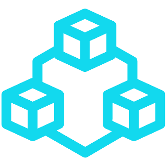
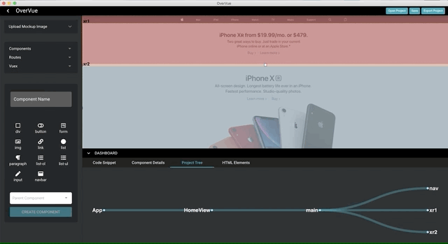

OverVue, a Vue Prototyping Tool.

# OverVue, a Vue Prototyping Tool.

[Dean Chung](https://medium.com/@deanchung_22636?source=post_page---------------------------)

[Jul 26](https://medium.com/@deanchung_22636/overvue-a-vue-prototyping-tool-f2b8a2f0c229?source=post_page---------------------------) · 4 min read

As of July 2019, Vue sits atop all JavaScript frameworks in GitHub stars and #3 overall, surpassing React by over ten thousand stars and leaving Angular in the dust.

As the youngest of the big three front-end JavaScript frameworks it has exploded in popularity and has quickly become beloved in the developer community. This is despite the fact that Angular and React are backed by Google and Facebook.

As the youngest framework of the three, the developer ecosystem for Vue lags behind those of its competitors. OverVue is here to deliver and to help developers to quickly begin building their web applications.

At its core, OverVue is a desktop application built with Vue and Electron that allows the user to create Vue components, establish parent-child hierarchy, and to set up routes with Vue Router, all from a beautiful user interface. Once satisfied, the user can generate the file and export the boilerplate code to a project. Here are some more of its hot features!

# Upload an Image

This first part is optional, but very useful if you have a well thought out design that you are ready to turn into code. Open the sidebar on the left and click ‘upload image’ to choose your mockup image from your file system. Clicking the arrow next to ‘Dashboard’ will toggle between showing and minimizing your dashboard.

Image Upload

# **Create a Component**

Creating a component in OverVue is very simple. Give your component a name, select any HTML elements to place in the Vue template, and select a parent from the dropdown menu in the sidebar if applicable. Once you create your component, you can drag and resize your component to fit your image mockup. If you forget to specify parent-child hierarchy in the dropdown menu, you can simply right-click your component to adjust the hierarchy.

# Component OverVue

Toggle between active components with a left click. Adjust your desired HTML elements from the component menu on the left and keep track of them in the dashboard. Visualize your parent child hierarchy with Team OverVue’s beautifully re-rendering tree.

Tree and HTML re-render

# Code Snippets

Click the code snippet tab in the dashboard panel to see your code. Feel free to copy the code onto your clipboard and paste it directly into your project.

Code

# Router Support

Enter a route name in the ‘routes’ dropdown and hit ‘enter’ to add routes to your application. Toggling between routes will only show on the canvas the components that exist in the active path. This is essentially what Vue Router does in practice in your application. Any changes to your route structure will seamlessly update the visualization tree.

Routes

# Save/Export

Once you are done you can save your project and open it later, or you can export your new boilerplate code to your workspace. A package.json is created and you can npm/yarn install your dependencies.

# Moving Forward

There are several features we have not yet completed. Since this tool is open source, help is welcome. Some features we did not yet implement are:

1. Vuex state management
2. TypeScript integration
3. Ability to nest HTML elements

4. Ability to drag only a specific parent along with its children with Vue Draggable Resizable.

5. A CLI version and npm package
6. Ability to upload multiple images for each route
Any suggestions are welcome!

The OverVue team is proud to launch our product in Beta. We welcome the first users and testers of our application. We are happy to help developers speed up their initial application architecture setup and to speed up development with this beautiful abstraction.

Check out our website [here](http://www.overvue.io/?source=post_page---------------------------).

Check out the GitHub [here](http://www.github.com/TeamOverVue/OverVue?source=post_page---------------------------).

We intended for this to be easy to use and pleasant to experience for anyone familiar with Vue or a similar framework. Huge thank you for all the hard work of my fellow software engineers Dean Ohashi, Drew Nguyen, and Joseph Eisele.