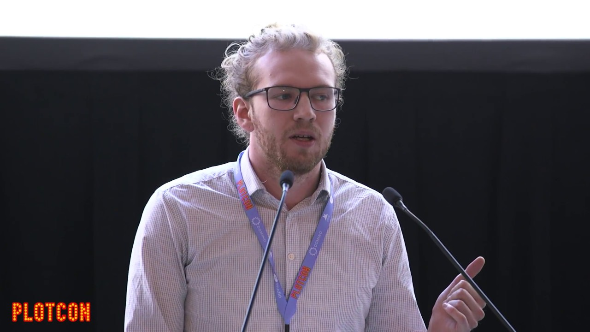

PLOTCON 2016: Chris Parmer, Dash: Shiny for Python

PLOTCON 2016: Chris Parmer, Dash: Shiny for Python
https://www.youtube.com/watch?v=5BAthiN0htc
[Plotly](https://www.youtube.com/channel/UCedQXrEEyH8M9aTuuUXJA3g)
3,487 views views
Published on Dec 1, 2016

|     |
| --- |
| [(L)](https://www.youtube.com/watch?v=5BAthiN0htc) |

Description

Update! Plotly has formally released Dash. Read the announcement letter: [https://medium.com/@plotlygraphs/intr...](https://medium.com/@plotlygraphs/introducing-dash-5ecf7191b503) or view the docs: https://plot.ly/dash.

If you are a data scientist today, it's actually pretty tough to build a data visualization web-application. If you're not a full-stack developer, you're practically out of luck.

But GUIs like sliders, dropdowns and text inputs are extremely helpful to the data scientist or engineer. If you're an R programmer, you're in luck with Shiny. If you're a MATLAB programmer, you can use GUIDE (but good luck sharing it!).

The dash project introduces a framework for building web-based technical computing apps. It's like a Shiny for Python. dash is built off of plotly.js and react.js to provide rich interactive graphing and user inputs and Python's flask to provide a simple but scalable web server.

This talk will launch and reveal the dash project. We'll go over motivations behind the project, the basic architecture of the framework, several interactive examples, and leave with a vision for the future of interactive and sharable technical computing.

Chris is co-founder and Chief Product Officer at Plotly graphs. Before Plotly, Chris worked on numerical methods for renewable and efficient power systems at GridCo and Sandia National Labs. His dual degree in EE and Mathematics from McGill is on hold because Plotly is more fun.