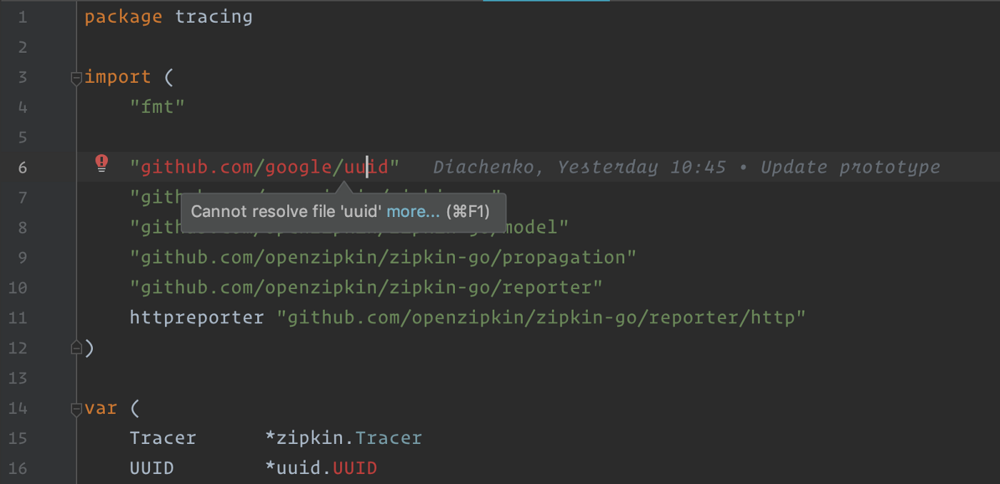
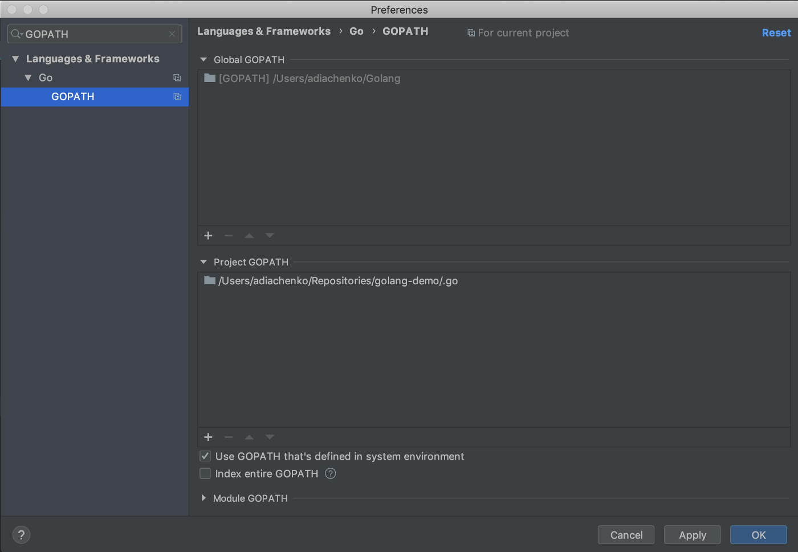
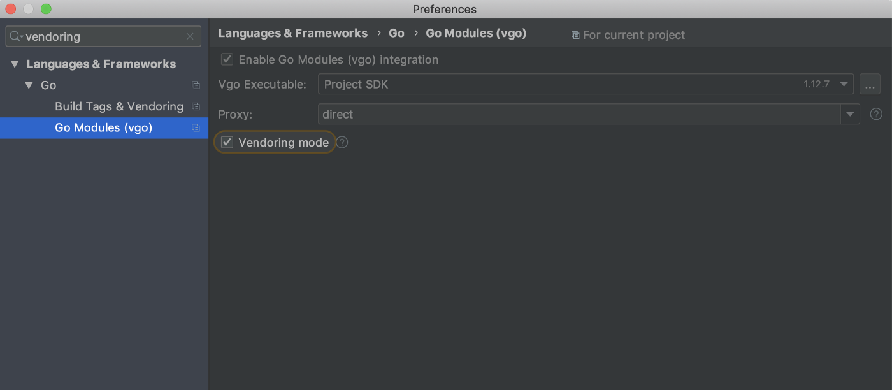

Package Management With Go Modules: The Pragmatic Guide

# Package Management With Go Modules: The Pragmatic Guide

[Alexander Diachenko](https://medium.com/@adiach3nko?source=post_page-----c831b4eaaf31----------------------)

[Aug 3](https://medium.com/@adiach3nko/package-management-with-go-modules-the-pragmatic-guide-c831b4eaaf31?source=post_page-----c831b4eaaf31----------------------) · 8 min read

Go Modules is a way of dealing with dependencies in Go. Initially an experiment, it is is supposed to enter the playing field in 1.13 as a new default for package management in Go.

I find it a bit unusual as a newcomer coming from other languages and so I wanted to collect some thoughts and tips to help others like me get some idea about Go package management. We’ll start with some trivia and then proceed to less obvious aspects including the use of vendor folder, using modules with Docker in development, tool dependencies etc.

If you’ve been using Go Modules for a while already and know the [Wiki](https://github.com/golang/go/wiki/Modules) like the back of your hand, this article probably won’t prove very useful to you. For some, however, it may save a few hours of trial and error.

So hope in and enjoy the ride.

# Quick Start

If your project is already in version control, you can simply run
go mod init

Or you can supply module path manually. It’s kinda like a name, URL and import path for your package:

go mod init github.com/you/hello

This command will create *go.mod* file which both defines projects requirements and locks dependencies to their correct versions (to give you some analogy, it’s like *package.json* and *package-lock.json *rolled into one):

module github.com/you/hello

go 1.12
Run `go get` to add a new dependency to your project:

> Note that although you can’t specify version range with *> go get*> , what you define here anyway is a minimum version and not an exact version. As we’ll see later, you can easily bump minor and patch versions of your dependencies.

# use Git tags

go get github.com/go-chi/chi@**v4.0.1**# or Git branch name
go get github.com/go-chi/chi@**master**# or Git commit hash
go get github.com/go-chi/chi@**08c92af**
Now our *go.mod* file looks like this:
module github.com/you/hello

go 1.12

**require github.com/go-chi/chi v4.0.2+incompatible // indirect**

`+incompatible`>  suffix is added for all packages that not opted in to Go Modules yet or violate some versioning guidelines (we’ll mention these later in this article).

Because we didn’t yet import the package anywhere in our project, it was marked as `// indirect`. We can tidy this up with the following command:

go mod tidy

Depending on the current state of your repo, this will either prune the unused module or remove `// indirect` comment.

> If a particular dependency does not itself have a *> go.mod*>  (for example it has not yet opted in to use modules), then it will have all of its dependencies recorded in a parent *> go.mod*>  file (e.g. your *> go.mod*> ) file along with `// indirect`>  comment to indicate it is not from a direct import within your module.

On a more general note, the purpose of `go mod tidy` is also add any dependencies needed for other combinations of OS, architecture, and build tags. **Make sure to run this before every release**.

See that *go.sum* file was also created upon adding a dependency. You may assume it’s a lock file. But in fact, *go.mod* already provides enough information for 100% reproducible builds. The other file is just for validation purposes: it contains the expected cryptographic checksums of the content of specific module versions.

> In part because *> go.sum*>  is not a lock file, it retains recorded checksums for a module version even after you stop using the module. This allows validation of the checksums if you later resume using it, which provides additional safety.

Commands like `go build` or `go test` will automatically download all the missing dependencies though you can do this explicitly with `go mod download` to pre-fill local caches which may prove useful in CI.

By default all our packages from all projects are downloaded into `$GOPATH/pkg/mod` directory. We’ll discuss this in detail later in the article.

# Updating Package Versions

You may use `go get -u` or `go get -u=patch` to update dependencies to the latest minor or patch upgrades respectively.

You can’t do this for major versions though. Code opting in to Go Modules must technically comply with these rules:

- Follow server (an example VCS tag is `v1.2.3`).
- If the module is version v2 or higher, the major version of the module must be included as a `/vN` at the end of the module paths used in *go.mod* files and in the package import path:

import "github.com/you/hello/v2"

Apparently, this is done so different package versions could be imported in a single build (see [diamond dependency problem](https://www.well-typed.com/blog/2008/04/the-dreaded-diamond-dependency-problem/)).

In short, Go expects you to be very deliberate when doing major version bumps.

# Substitute Imported Modules

You can point a required module to your own fork or even local file path using `replace` directive:

go mod edit -replace github.com/go-chi/chi=./packages/chi
Result:
module github.com/you/hello

go 1.12

require github.com/go-chi/chi v4.0.2+incompatible**replace github.com/go-chi/chi => ./packages/chi**

You can remove the line manually or run:
go mod edit -dropreplace github.com/go-chi/chi

# Managing Dependencies Per Project

Historically, all Go code was stored in one giant monorepo, because that’s how Google organizes their codebase internally and that took its toll on the design of the language.

Go Modules is somewhat of a departure from this approach thanks to community feedback. You’re no longer required to keep all your projects under `$GOPATH`. However, all your downloaded dependencies will still be placed under `$GOPATH/pkg/mod`.

If you use containers when developing stuff locally, this may become an issue because dependencies are stored outside of project path mounted on your host filesystem. And since right now there is no text editor that supports remote Go interpreter you will be stuck with broken code intel for your project. There is no way for IDE to inspect the packages your project depend upon if they tacked away somewhere inside a container:

This is not normally a problem for other languages but something I first encountered when working on Go codebase.

Thankfully, there are multiple ways to address the issue.

## Option 1: Set GOPATH inside your project directory

This might sound counterintuitive at first, but *if are running Go from a container*, you can override its GOPATH to point to the project directory so that the packages are easily accessible from the host:

|     |     |
| --- | --- |
| 1   | version: '3.7' |
| 2   |     |
| 3   | services: |
| 4   |  app: |
| 5   |  command: tail -f /dev/null |
| 6   |  image: golang:1.12.6-stretch |
| 7   |  environment: |
| 8   |  # All of your dependencies will be found right here under /code/.go/pkg/mod |
| 9   | - GOPATH=/code/.go |
| 10  |  ports: |
| 11  | - 8000:8000 |
| 12  |  volumes: |
| 13  | - ./:/code:cached |
| 14  |  working_dir: /code |

 [view raw](https://gist.github.com/adiachenko/38c1449896ecd92e393b6160458b274e/raw/372aec97d6d9ab07f51ea2dcdbac04f3552254f3/docker-compose.yml)  [docker-compose.yml](https://gist.github.com/adiachenko/38c1449896ecd92e393b6160458b274e#file-docker-compose-yml) hosted with ❤ by [GitHub](https://github.com/)

Popular IDEs should include the option to set GOPATH on a project (workspace) level:

The only downside to this approach is that there is no interoperability with Go runtime on the host machine when running stuff from command line. But it shouldn’t be a problem if your team is already committed to using containers.

## Option 2: Vendor Your Dependencies

Another way is to copy over your project dependencies to *vendor* folder:
go mod vendor

Note the vocabulary here: we are NOT **enabling** Go to directly download stuff into vendor folder: that’s not possible with modules. We’re just copying over already downloaded packages.

In fact, if you vendor you dependencies like in example above, then clear `$GOPATH/pkg/mod`, then try to add some new dependencies to your project, you will observe the following:

1. Go will rebuild the download cache for all packages at `$GOPATH/pkg/mod/cache`.

2. All downloaded modules will be copied over to `$GOPATH/pkg/mod`.

3. Finally, Go will copy over these modules to *vendor* folder while pruning examples, tests and some other miscellaneous files that you do not directly depend on.

In fact there is a lot of stuff omitted from this newly created vendor folder (not that it’s problem for me):

The typical Docker Compose file for development looks as follows (take note of volume bindings):

|     |     |
| --- | --- |
| 1   | version: '3.7' |
| 2   |     |
| 3   | services: |
| 4   |  app: |
| 5   |  command: tail -f /dev/null |
| 6   |  image: golang:1.12.6-stretch |
| 7   |  ports: |
| 8   | - 8000:8000 |
| 9   |  volumes: |
| 10  |  # This is go modules cache, without it you will have to |
| 11  |  # re-download all dependencies after restarting container |
| 12  | - modules:/go/pkg/mod/cache |
| 13  | - ./:/code:cached |
| 14  |  working_dir: /code |
| 15  |     |
| 16  |     |
| 17  | volumes: |
| 18  |  modules: |
| 19  |  driver: local |

 [view raw](https://gist.github.com/adiachenko/51ee331cce0d1acb07edbe52819d25ca/raw/04c4d2ac35bf9cb80b6eb8438b4e6c2ef8e4f3c2/docker-compose.yml)  [docker-compose.yml](https://gist.github.com/adiachenko/51ee331cce0d1acb07edbe52819d25ca#file-docker-compose-yml) hosted with ❤ by [GitHub](https://github.com/)

Note that I do NOT commit this vendor folder to version control or expect to use it in production. This is strictly for a daily development routine.

However, when reading [comments from some of the Go maintainers](https://github.com/golang/go/issues/30240#issuecomment-463833652) and some proposals related to partial vendoring (WUT?), I get the impression that this is not the intended use case for this feature.

One of the [commenters](https://www.reddit.com/r/golang/comments/clmmis/package_management_with_go_modules_the_pragmatic/evx7ki7/) from reddit helped me shed a light on this:

> Usually people vendor their dependencies for reasons like a desire to have hermetic builds without accessing the network, and having a copy of dependencies checked-in in case github goes down or a repo disappears, and being able to more easily audit changes to dependencies using standard VCS tools, etc.

Yeah, doesn’t look like anything I might be interested in.

Go teams suggests you can routinely opt-in to vendoring by setting `GOFLAGS=-mod=vendor` environment variable. I don’t recommend doing this. Using flags will simply break `go get` without providing any other benefits to your daily workflow:

I must give credit where the credit is due, Go authors are geniuses at annoying their fellow developers with mundane stuff.

Actually, the only place where you need to opt-in for vendoring is your IDE:

