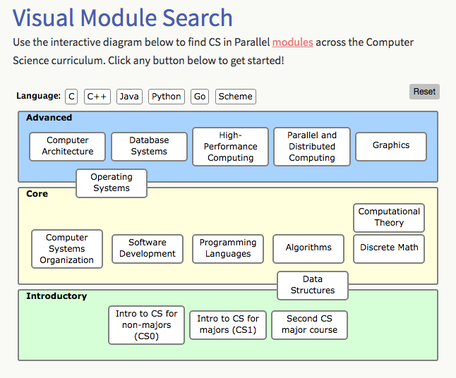

Parallel Computing in the Computer Science Curriculum

# Welcome to CSinParallel

## About CSinParallel

The shift to parallel computing---including multi-core computer architectures, cloud distributed computing, and general-purpose GPU programming---leads to fundamental changes in the design of software and systems. As a result, computer science (CS) students now need to learn parallel computing techniques that allow software to take advantage of the shift toward parallelism. To this end, CSinParallel (supported by a grant from NSF-TUES) provides a resource for CS educators to find, share, and discuss modular teaching materials that can be used at all levels of the CS curriculum.

CSinParallel modules provide conceptual principles of parallelism and hands-on practice with parallel computing, in self-contained 1- to 3-day units that can be inserted in various CS courses in multiple curricular contexts. These modules offer an incremental approach to getting CS undergraduates the exposure to parallelism they will need as they begin their careers.

## What We Provide

Here, one can find information and materials for integrating parallel computing in their computer science courses, including:

[Visual Module Search →](https://csinparallel.org/csinparallel/modules/index.html)

- **[Modules](https://csinparallel.org/csinparallel/modules/index.html)** : Teaching materials and exercises for educators to present concepts and applications of parallel computing to students. These modules are shared and discussed among a community of Computer Science educators. Browse through the module collection, or [contribute](https://csinparallel.org/csinparallel/modules/contribute.html) one of your own.
- **[Information about platform resources](https://csinparallel.org/csinparallel/platforms/resources.html)**: We provide brief information and links to additional resources for hardware and software needed for using our modules in courses.

We also conduct workshops at conferences and in regional locations in the US. See [Workshops section](https://csinparallel.org/csinparallel/workshops/index.html) for information from past and upcoming events.

## Acknowledgments

This material is based on work supported by the National Science Foundation under Grant Nos. DUE-1226172/1225739/1225796 (and formerly DUE-0941962 and 0942190). Any opinions, findings, and conclusions or recommendations expressed in this material are those of the authors and do not necessarily reflect the views of the National Science Foundation.