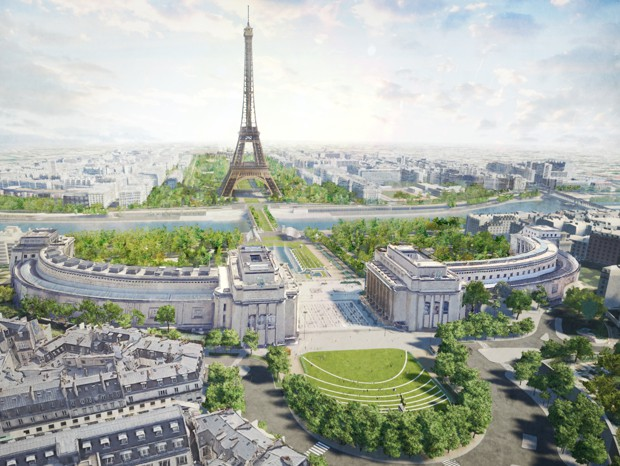
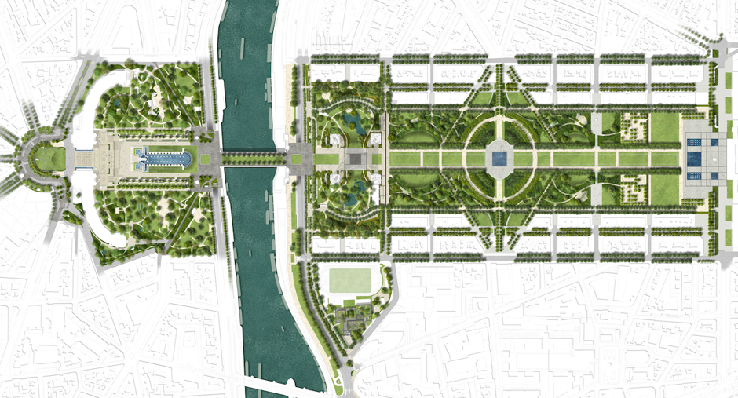
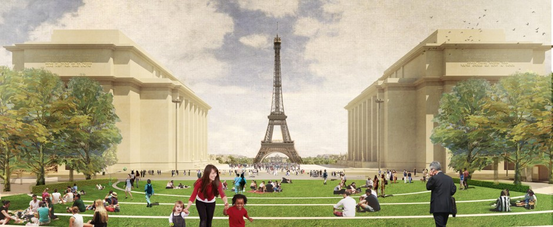
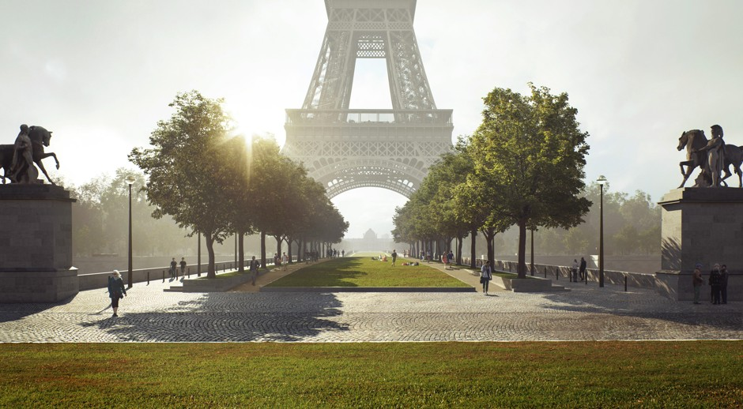
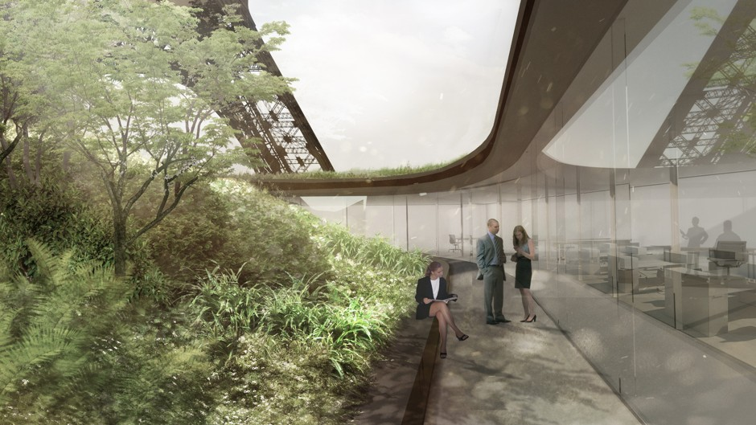
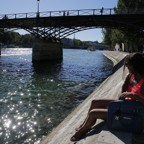
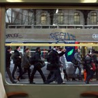

Paris Will Create the City's Largest Gardens Around the Eiffel Tower

     
 Gustavson, Portman and Bowman

# Paris Will Create the City's Largest Gardens Around the Eiffel Tower

1. [Feargus O'Sullivan](https://www.citylab.com/authors/feargus-osullivan/)

 May 22, 2019

## The most famous space in the city is set to get a pedestrian-friendly redesign that will create the city’s largest garden by 2024.

- [  Share](https://www.citylab.com/design/2019/05/eiffel-tower-garden-paris-metro-design-history-car-free/589993/#)
- [  Tweet](https://www.citylab.com/design/2019/05/eiffel-tower-garden-paris-metro-design-history-car-free/589993/#)

- 

One of the world’s most recognizable urban spaces is slated to get a dramatic makeover. On Tuesday, [Paris City Hall](http://www.leparisien.fr/paris-75/en-2024-un-grand-jardin-reliera-le-trocadero-a-la-tour-eiffel-21-05-2019-8076675.php) announced that the London-based landscape architects [Gustafson, Porter and Bowman](http://www.gp-b.com/) had been selected from 43 applicants to lead a major redesign of the space around the Eiffel Tower. According to the plan, the currently car-filled bridge connecting the Eiffel Tower with the Métro subway system will be turned into a pedestrianized garden, stringing together a set of two new public squares and restored parkland that will create an unbroken spine of greenery a mile long across the city.

The plan would slash car traffic in the immediate vicinity of the Eiffel Tower, making the area altogether more inviting to walkers without notably altering the appearance of what could be the most famous urban ensemble in the world.

An overview of the Eiffel Tower master plan//[GP+B](http://www.gp-b.com/)

That Paris needs this overhaul around the Eiffel Tower is not necessarily common knowledge. The tower itself remains as beautiful as ever—indeed, it is one of those monuments that rarely disappoints people when they see it for the first time in real life. Its immediate surroundings, however, are a little careworn and hectic. Many visitors must access the tower via a loud, traffic-filled, and rather unprepossessing riverside, and limited space for pedestrians creates bottlenecks on the sidewalks. The Champs de Mars gardens from which the tower rises are unquestionably grand, but they also betray their origins as a military parade ground: The site can feel austere, dusty, and under-shaded in high summer.

A new amphitheatre of lawn will cover existing car lanes in the Place de Trocadéro//[GP+B](http://www.gp-b.com/)

The new plan, due to be entirely funded by ticket sales to the tower and due for completion in 2024, should help burnish the area’s beauty and make it friendlier to pedestrians. Currently, most visitors emerge from the Métro at [Trocadéro](https://www.google.com/maps/@48.8625703,2.2878292,2a,75y,294.36h,84.07t/data=!3m7!1e1!3m5!1sFGD9RSfpRi3MsV_XRZl2Gw!2e0!6s%2F%2Fgeo2.ggpht.com%2Fcbk%3Fpanoid%3DFGD9RSfpRi3MsV_XRZl2Gw%26output%3Dthumbnail%26cb_client%3Dsearch.TACTILE.gps%26thumb%3D2%26w%3D96%26h%3D64%26yaw%3D352.62903%26pitch%3D0%26thumbfov%3D100!7i13312!8i6656) into a busy carousel of traffic, with an (admittedly pretty) garden marooned behind surging car lanes. The redesign removes these car lanes and replaces them with a stepped amphitheater of lawn, creating a large garden for lounging with stunning views of the tower. From there, visitors will step through the brackets created by the [Palais de Chaillot](https://en.wikipedia.org/wiki/Palais_de_Chaillot) and down the steps to a completely new pedestrian square, Place de Varsovie, created by routing traffic on the right bank quay into a tunnel.

This area won’t just be calmer, it will also be cooler, thanks to an increase in its current number of fountains.

The Pont D’Iena will be pedestrianized and planted with avenues of trees//[GP+B](http://www.gp-b.com/)

Visitors will then step onto the Pont D’Iena, the main bridge access to the tower, where traffic will be replaced by a double avenue of trees. Cobbled sidewalks will allow access for emergency vehicles. Tunneling for traffic on the right bank will create another pedestrian square, called Place Branly, while a riverside garden promenade will continue up river to the elevated Bir Hakeim Métro station, the other main access point for the tower.

Under the tower itself, visitors will get more ticket offices and kiosks and even somewhere they can leave bulky baggage before visiting. To prevent cluttering the area and ruining sight lines, however, many of these new facilities will be sunk into the ground, with the surrounding lawns at the sides raised to low humps to cover them. Garden restoration and new tree plantings will thicken out the surrounding space’s greenery and provide much-needed shade.

New office space for the tower’s operatives will be concealed with landscaping.//[GP+B](http://www.gp-b.com/)

This is, broadly speaking, a softly-softly approach, at least visually. But the plan’s many modest steps add up to something highly significant. When all the new green spaces are created and threaded together, they will become what co-designer Kathryn Gustavson described in a press release as “Paris’s largest garden,” a unified mile-long green corridor across the city. The new garden bridge also offers Paris an opportunity to succeed [where London failed](https://www.citylab.com/design/2017/05/the-death-of-londons-garden-bridge-marks-the-end-of-an-era/524886/) (with good reason) in creating a new cross-river park, realizing the dream of trees throwing shade over the waterway.

#### Recommended

- 

##### [The Cars That Ate Paris](https://www.citylab.com/transportation/2017/03/the-cars-that-ate-paris/520710/)

    1. [Feargus O'Sullivan](https://www.citylab.com/authors/feargus-osullivan/)

Mar 29, 2017

- 

##### [A City That Takes Climate Change Seriously: Paris](https://www.citylab.com/environment/2018/10/paris-preparing-warming-world/572506/)

    1. [Feargus O'Sullivan](https://www.citylab.com/authors/feargus-osullivan/)

Oct 10, 2018

- 

##### [The Automotive Liberation of Paris](https://www.citylab.com/transportation/2018/01/the-automotive-liberation-of-paris/550718/)

    1. [Laura Bliss](https://www.citylab.com/authors/laura-bliss/)

Jan 19, 2018

But perhaps the most striking element of the tower makeover is how it fits into a bigger story: the ongoing campaign to [reclaim Paris from private motor vehicles](https://www.citylab.com/transportation/2018/01/the-automotive-liberation-of-paris/550718/). That politically contentious process, which began decades ago but picked up real momentum after the city agreed to permanently [pedestrianize a key stretch of the Seine riverfront in 2016](https://www.citylab.com/solutions/2016/09/paris-seine-car-pedestrians-quay-ban/501788/), is now spreading out into the wider metropolis as Paris’s staggered [ban on more polluting cars](https://www.citylab.com/transportation/2016/05/paris-is-banning-cars-built-before-1997/484895/) is being picked up by [municipalities in the suburbs](https://www.citylab.com/transportation/2018/11/ile-de-france-metropole-paris-diesel-car-ban/575710/). Now, that car-removing transformation promises to extend to the borders of the city’s most iconic attraction. That the new plan appears to manage this in a way that won’t notably tinker with the appearance of the Eiffel Tower’s surroundings actually makes it more impressive.

#### About the Author

##### [Feargus O'Sullivan](https://www.citylab.com/authors/feargus-osullivan/)

-  @[FeargusOSull](https://twitter.com/FeargusOSull)

-   [Feed](https://www.citylab.com/feeds/author/feargus-osullivan/)

[Feargus O'Sullivan](https://www.citylab.com/authors/feargus-osullivan/)is a contributing writer to CityLab, covering Europe. His writing focuses on housing, gentrification and social change, infrastructure, urban policy, and national cultures. He has previously contributed to *The Guardian*, *The Times*, *The Financial Times,* and *Next City*, among other publications.