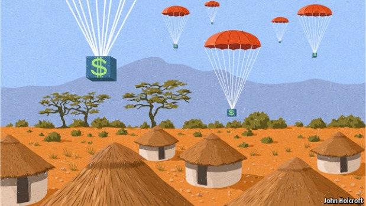
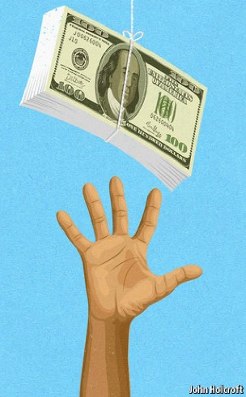
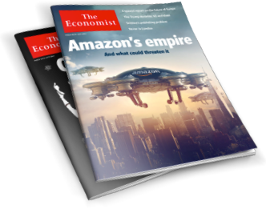

Pennies from heaven

# Cash to the poorPennies from heaven

Giving money directly to poor people works surprisingly well. But it cannot deal with the deeper causes of poverty

### [Print edition | International](https://www.economist.com/sections/international)

Dec 12th 2013 | KOGA, KENYA
[(L)](https://twitter.com/intent/tweet?url=)
[(L)](http://www.facebook.com/sharer/sharer.php?u=)
[(L)](https://www.linkedin.com/cws/share?url=)

[(L)](https://www.economist.com/news/international/21588385-giving-money-directly-poor-people-works-surprisingly-well-it-cannot-dealmailto:?body=)

[(L)](#)

SOME unlikely things combined to change Gabriel Otieno Anoche’s life. A satellite passing over east Africa took pictures of his roof. Some keen-eyed people in the Philippines, monitoring the satellite data remotely, spotted the roof’s lack of luminosity, showing that Mr Anoche lived under thatch (not tin). In western Kenya, that is an indicator of poverty. Then Google and other donors contributed money to Give Directly, a charity which hands out no-strings-attached cash to the poorest people it can find.

The 25-year-old carpenter knew nothing of this until he came home one day to find that strangers had given his wife a mobile phone linked to a bank account. Next came a $1,000 windfall, which they were free to spend on whatever they liked.

ADVERTISING

[inRead invented by Teads](http://inread-experience.teads.tv/)
**Get our daily newsletter**
Upgrade your inbox and get our Daily Dispatch and Editor's Picks.

## Latest stories

- [ ### The West’s bombing of Syria meets some approval from Muslims](https://www.economist.com/blogs/erasmus/2018/04/syria-islam-and-christianity)

[Erasmus](https://www.economist.com/blogs/erasmus)

- [ ### Donald Trump is more popular than ever with white evangelicals](https://www.economist.com/blogs/democracyinamerica/2018/04/stormy-daniels-lion-s-den)

[Democracy in America](https://www.economist.com/blogs/democracyinamerica)

- [ ### Most banks won’t touch America’s legal pot industry](https://www.economist.com/blogs/graphicdetail/2018/04/daily-chart-13)

[Graphic detail](https://www.economist.com/blogs/graphicdetail)
[See more](https://www.economist.com/latest-updates)

The idea sounds as extraordinary as throwing money out of helicopters. But this programme, and others like it, are part of a shift in thinking about how best to use aid to help the poorest. For decades, it was thought that the poor needed almost everything done for them and that experts knew best what this was. Few people would trust anyone to spend $1,000 responsibly. Instead, governments, charities and development banks built schools and hospitals, roads and ports, irrigation pipes and electric cables. And they set up big bureaucracies to run it all.

From around 2000, a different idea started to catch on: governments gave poor households small stipends to spend as they wished—on condition that their children went to school or visited a doctor regularly. These so-called “conditional cash transfers” (CCTs) appeared first in Latin America and then spread around the world. They did not replace traditional aid, but had distinctive priorities, such as supporting individual household budgets and helping women (most payments went to mothers). They were also cheap to run.

Projects such as Give Directly in Kenya are the latest elaboration of these ideas. Their designers saw that CCTs had boosted household incomes, and asked whether extra conditions, such as mandatory school attendance, were necessary. They also argued that, if CCTs were cheap to run, unconditional cash transfers (UCTs) would be cheaper still.

Now enough of these programmes are up and running to make a first assessment. Early results are encouraging: giving money away pulls people out of poverty, with or without conditions. Recipients of unconditional cash do not blow it on booze and brothels, as some feared. Households can absorb a surprising amount of cash and put it to good use. But conditional cash transfers still seem to work better when the poor face an array of problems beyond just a shortage of capital.

When Give Directly’s founder, Michael Faye, went to traditional aid donors with his free-money idea, he remembers, “They thought I was smoking crack.” Silicon Valley, though, liked the proposal—perhaps because Give Directly is a bit like a technology start-up challenging traditional ways of doing things (in this case, aid).

The charity relies heavily on technology. It crunches census data to identify Kenya’s poorest districts, including Mr Anoche’s home village of Koga, near Lake Victoria. It outsources the time-consuming job of distinguishing tin roofs from thatch to a web service called “Mechanical Turk”, which breaks big jobs into small parts and assigns them to jobbing freelances around the world. Field workers visit the villages with GPS devices to register beneficiaries and distribute the cash via M-Pesa, Kenya’s mobile money-transfer system.

Mr Anoche’s first move on getting his windfall was to buy a new roof. Not only is thatch leaky, but it also needs to be replaced twice a year, at $40 a time. He spent half the money on his home, and half on timber and chickens. Those two businesses now turn a monthly profit of nearly $90. “If you’ve got the money and the mindset,” he says, “you can change your life.”

Of course, not all the money has gone on things that make development economists happy. Sitting on a rough bench in his moonshine bar in a banana grove, a tipsy Bernard Okumo says his wife used her windfall to bail him out of jail, where he was facing a murder charge. But the first independent study of Give Directly’s methods, by the Massachusetts Institute of Technology’s Johannes Haushofer and Jeremy Shapiro (who is a former board member of Give Directly), suggests this sort of spending is unusual. In randomly selected poor households in 63 villages that have received the windfalls, they say, the number of children going without food for a day has fallen by over a third and livestock holdings have risen by half. A year after the scheme began, incomes have gone up by a quarter and recipients seem less stressed, according to tests of their cortisol levels.

The story is incomplete. In the nearby market town of Randago, which is now surrounded by communities flush with cash from Give Directly, the locals are bemused. Some think the money comes from Barack Obama: the American president’s father was a member of the same Luo tribe. The Kenyan scheme is unusual (donations are huge by local standards) and only three years old. Over a one-year period, income gains are hardly surprising.

Still, this is not the only cash giveaway. A trial in Vietnam in 2006 gave one-off handouts to 550 households; two years later, local poverty rates had fallen by 20 percentage points. The scheme was dubbed “cash for coffins” after elderly recipients spent the money on their funeral arrangements to save their children the expense.

A different scheme has been running in northern Uganda for four years. The government gives lump sums of around $10,000 to groups of 20 or so young people who club together to apply. Chris Blattman of Columbia University, New York, who has studied the programme, calls it “wildly successful”. Recipients spent a third of the money learning a trade (such as metalworking or tailoring) and much of the rest on tools and stock. They set up enterprises and work longer hours in their new trades. Average earnings rose by almost 50% in four years.

This scheme has a condition: applicants must submit a business plan. But it highlights the virtues of no-strings grants (UCTs). They work when lack of money is the main problem. The people who do best are those with the least to start with (in Uganda, that especially means poor women). In such conditions, the schemes provide better returns than job-training programmes that mainstream aid agencies favour. Remarkably, they even do better than secondary education, which pushes up wages in poor countries by 10-15% for each extra year of schooling. This may be because recipients know what they need better than donors do—a core advantage of no-strings schemes. They also outscore conditional transfers, because some families eligible for these fail to meet the conditions through no fault of their own (if they live too far from a school, for instance).

Does this mean that governments are wasting time and money by monitoring and enforcing conditions, when handing over cash would be just as good? Not so fast. Perhaps because cash is all-important to unconditional schemes, they tend to be more generous and expensive than CCTs. The grants of the Kenyan programmes, for example, are the equivalent of two years’ local income. In contrast, the stipend of the world’s biggest conditional scheme, Brazil’s Bolsa Família, is worth 3% of average Brazilian incomes. For $1,000, therefore, you could help one poor Kenyan a lot, or three poor Brazilians a bit—even though Brazil is a far more expensive country. Which is better? The answer depends more on the recipients than on the programmes: whom do you want to help and what problems do they face?

Moreover, CCTs can focus on something which UCTs leave to chance: helping the next generation. Healthier, better educated children earn more throughout their lifetimes, so the requirement to attend school or clinics should cut future poverty. UCTs aim to reduce poverty now. So conditional and unconditional schemes are not always comparable. That said, a lot of effort has gone into making comparisons, and the results are now emerging. CCTs have their drawbacks but—at least where governments are concerned, and if you take a broad definition of poverty reduction to include health and education—they usually do a better job.

The biggest conditional transfers, Bolsa Família and Mexico’s Oportunidades, are credited with cutting poverty and boosting literacy in Latin America’s largest countries. They have helped tens of millions, not tens of thousands: a vast weight of evidence supporting CCTs’ effectiveness.

A smaller programme in Ghana offers a contrast to the Ugandan scheme that boosted training and enterprise growth. The Ghanaian programme gave small sums ($120) to a random selection of business owners, some unconditionally, some requiring the owner to buy something for his or her firm. The conditional benefits proved more useful: profits at firms that got such payments were twice as high after three years as at firms that got cash with no strings attached. In contrast to the Ugandan experience, the women who started with the least (whose firms had the lowest profits) did worst. The big beneficiaries were women whose profits were high at first. In Ghana, just handing over money was not the best way to help firms.

Sarah Baird of the University of Otago and three of her colleagues tried to look beyond individual cases to see if there were broader lessons. They studied 26 CCTs, five UCTs and four programmes that ran conditional and unconditional benefits in parallel (as in Ghana). They concluded that CCTs do more to raise educational outcomes than UCTs, and the stricter the conditions the better. School enrolment among families that got conditional grants rose by 41% on average in the various programmes; the increase among those that got unconditional grants was only 23%. If conditions were implicit or soft (eg, if recipients were simply encouraged to take children to school), enrolment merely rose by 25%. The big difference came when conditions were tough (eg, if school attendance was mandatory): that boosted enrolment by 60%, a big bang for the relatively few bucks involved.

Imposing conditions does have a cost. A programme in Malawi ran conditional and unconditional grants in tandem. Girls who got unrestricted cash were less likely to get pregnant and more likely to marry later than girls who got money for staying in school. But in terms of education, the contest was not close: conditional grants were more cost-effective and their benefits persisted after the payments stopped.

The string attached can hoist you up

Berk Ozler, an economist who has looked at cash transfers for the World Bank, concludes that CCTs work better when the problems go beyond mere shortage of cash: if families do not appreciate the real value of education, for instance, or if part of the benefit of doing something comes when everyone does it (vaccination is a case in point). In these circumstances, people left to themselves may not spend enough on education or health. CCTs help to overcome that.

They also have two political advantages over UCTs. One is that by requiring parents to send children to school, they also create pressure to improve educational standards; conditionality changes the behaviour of donors as well as recipients. And CCTs are almost certainly more effective than UCTs at mobilising support among the people who provide the money: attaching strings reassures middle-class taxpayers that the poor are not getting something for nothing. This may not matter if the donor is Google; it does if the money comes from public coffers. For charities, though, the calculation may be different. The cost of monitoring conditions and administering aid programmes may outweigh the benefits that come from a sharper focus.

In short, UCTs work better than almost anyone would have expected. They dent the stereotype of poor people as inherently feckless and ignorant. But CCTs are usually better still, especially when dealing with the root causes of poverty and, rather than just alleviating it, helping families escape it altogether.

**Correction: **The original version of this story said that Facebook had contributed money to Give Directly. It did not, but money was given by Good Ventures, a foundation created by one of Facebook's co-founders, Dustin Moskovitz.

**Sources**
1. General reviews

a. "[Relative Effectiveness of Conditional and Unconditional Cash Transfers for Schooling Outcomes in Developing Countries](http://www.campbellcollaboration.org/lib/project/218/): A Systematic Review." By Sarah Baird, Francisco H. G. Ferreira, Berk Özler, Michael Woolcock

b. "[Educational Impacts and Cost Effectiveness of Conditional Cash Transfer Programe in Developing Countries](https://cesr.usc.edu/documents/WP_2013_007.pdf): a meta-analysis." By Juan Esteban Saavedra and Sandra Garcia

2. Articles and blogs:

a. "Conditions work (but are they a good thing?)" By Berk Ozler and Francisco Ferreira. [Part 1](http://blogs.worldbank.org/impactevaluations/conditions-work-but-are-they-a-good-thing-part-1) and [Part 2](http://blogs.worldbank.org/impactevaluations/conditions-work-but-are-they-a-good-thing-part-ii)

b. "[Cash Transfer: sorting though the hype.](http://blogs.worldbank.org/impactevaluations/cash-transfers-sorting-through-hype)" by Berk Ozler

3. Studies of individual countries

a. Kenya (Give Directly's programme): "[Impacts of Unconditional Cash Transfers - Evidence from a Randomized](http://web.mit.edu/joha/www/)[Controlled Trial in Kenya.](http://web.mit.edu/joha/www/)" By Johannes Haushofer and Jeremy Shapiro

b. Malawi: "[Girl Power: Cash Transfers and Adolescent Welfare. Evidence from a](http://www.nber.org/papers/w19479)[Cluster-Randomized Experiment in Malawi.](http://www.nber.org/papers/w19479)" By Sarah J. Baird, Ephraim Chirwa, Jacobus de Hoop, Berk Özler

"[Cash or Condition: Evidence from a cash transfer experiment.](http://ideas.repec.org/a/oup/qjecon/v126y2011i4p1709-1753.html)" By Sarah Baird, Craig McIntosh and Berk Ozler.

See also, http://qje.oxfordjournals.org/content/early/2011/10/12/qje.qjr032.full.pdf+html

c. Uganda: "[Generating Skilled Self-Employment in Developing Countries:](http://papers.ssrn.com/sol3/papers.cfm?abstract_id=2268552)[Experimental Evidence from Uganda.](http://papers.ssrn.com/sol3/papers.cfm?abstract_id=2268552)" By Christopher Blattman, Nathan Fiala and Sebastian Martinez

d. Morocco:"[Turning a Shove into a Nudge? A 'Labeled Cash Transfer' for](http://www.nber.org/papers/w19227)[Education.](http://www.nber.org/papers/w19227)" By Najy Benhassine, Florencia Devoto, Esther Duflo, Pascaline Dupas, Victor Pouliquen

 You’ve seen the news, now discover the story

 Get incisive analysis on the issues that matter. Whether you read each issue cover to cover, listen to the audio edition, or scan the headlines on your phone, time with *The Economist* is always well spent.

 [Enjoy 12 weeks’ access for £12](https://subscription.economist.com/DE/EngCore/Ecom/EndOfArticle)

 

### [Print edition | International](https://www.economist.com/sections/international)

Dec 12th 2013 | KOGA, KENYA
[(L)](https://twitter.com/intent/tweet?url=)
[(L)](http://www.facebook.com/sharer/sharer.php?u=)
[(L)](https://www.linkedin.com/cws/share?url=)

[(L)](https://www.economist.com/news/international/21588385-giving-money-directly-poor-people-works-surprisingly-well-it-cannot-dealmailto:?body=)

[(L)](#)

[Reuse this content](https://s100.copyright.com/AppDispatchServlet?publisherName=economist&publication=economist&title=Pennies%20from%20heaven&publicationDate=NaN0NaN0NaN&contentID=21588385&type=A&orderBeanReset=0)

[About *The Economist*](https://www.economist.com/about-the-economist)