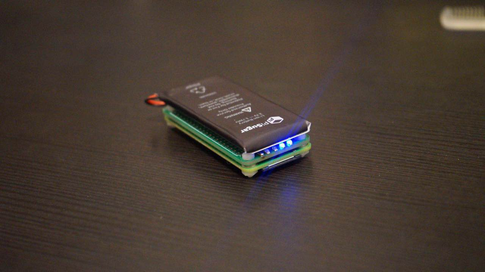
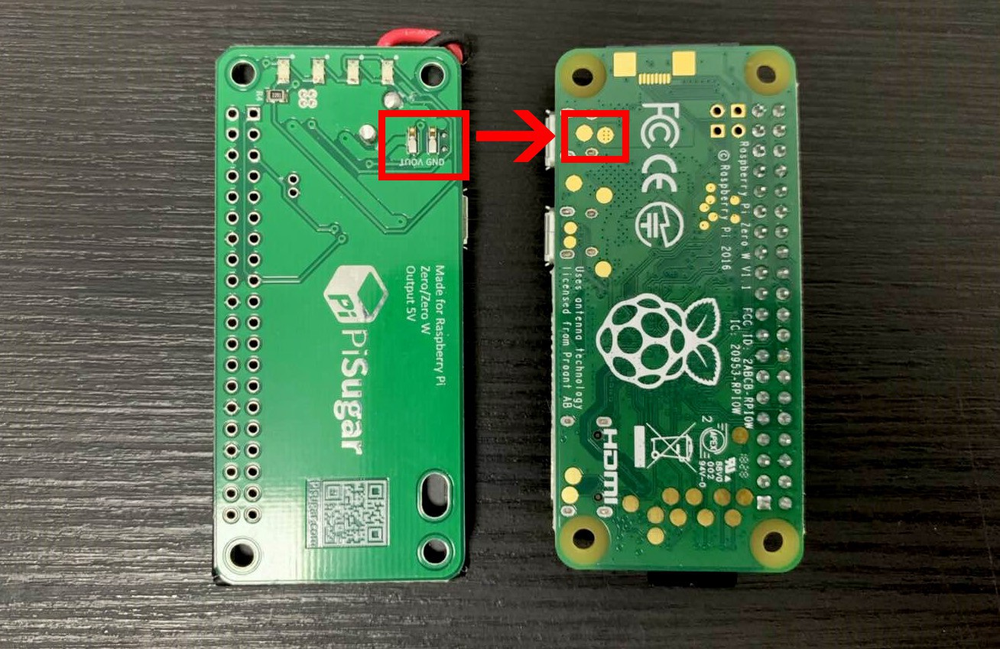

PiSugar Is a Compact Battery Solution Designed Specifically for the Raspberry Pi Zero

# PiSugar Is a Compact Battery Solution Designed Specifically for the Raspberry Pi Zero

[Cameron Coward](https://blog.hackster.io/@cameroncoward)
Apr 12·2 min read

The entire appeal of the Raspberry Pi Zero and Zero W is that it’s a complete, fully-functional computer in an extremely small package. That makes it easy to integrate into even the smallest projects. But if you want those projects to be portable, you run into the problem of providing power. Most battery and battery-charging circuit combinations will end up being far larger than the Raspberry Pi Zero itself. [That’s why the PiSugar battery solution](https://hackaday.io/project/164733-pisugar-battery-for-raspberry-pi-zero) was developed specifically to keep portable Raspberry Pi Zero projects as compact as possible.

PiSugar is a combination of a 3.7V, 900mAh lithium-ion battery and a PCB that provides voltage regulation and charging. Both the battery and PCB have the exact same footprint size as [the Raspberry Pi Zero](https://www.hackster.io/raspberry-pi) and Zero W. They’re designed to be stacked together in order to keep the overall package as small as is physically possible. The PiSugar PCB has contacts that push up against the Raspberry Pi Zero’s voltage input pads, so there aren’t any additional wires to manage. That also means you can use it without GPIO headers pins on the Raspberry Pi, which keeps things even more compact.

The PiSugar PCB has a built-in micro USB input for charging, a switch for turning power on and off, and status LEDs for showing the battery level. The charging circuit also allows you to charge the battery while the Raspberry Pi is running. There isn’t currently any soft shutdown functionality, but that may be integrated in the future. There isn’t any word on prices yet, but PiSugar should be available for sale on Amazon soon. But the project is open-source, so you can find all of the files on [GitHub](https://github.com/PiSugar), including [3D-printable](https://www.hackster.io/3d-printing) enclosures, in the meantime.

