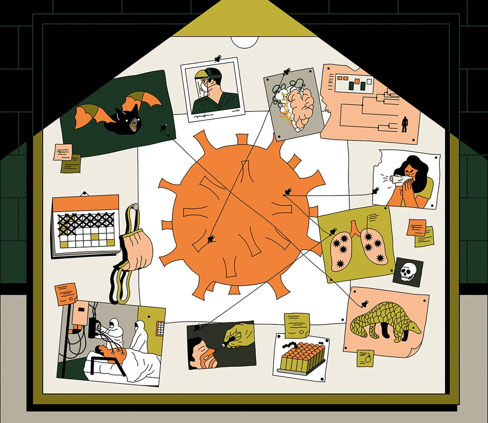
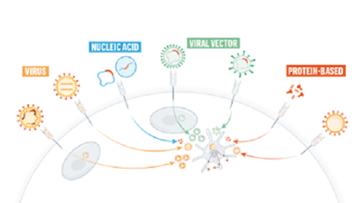
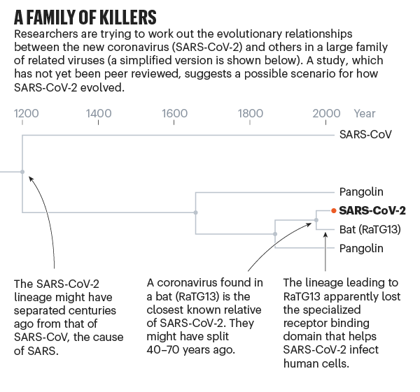
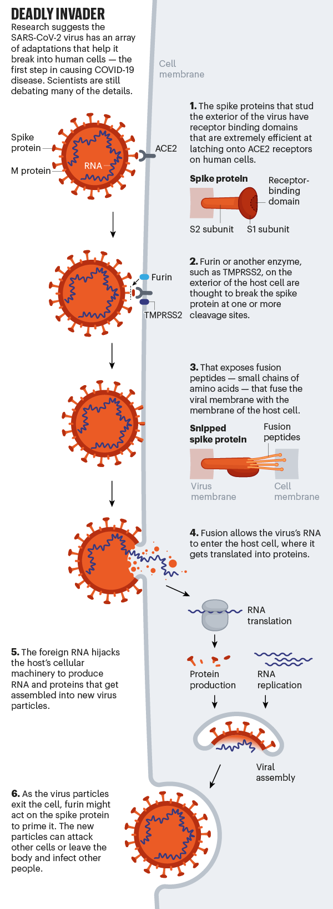
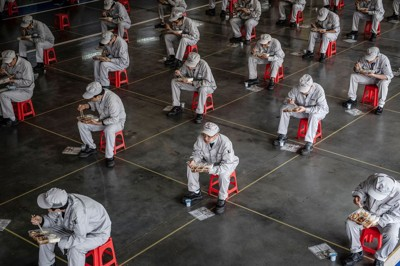

Profile of a killer: the complex biology powering the coronavirus pandemic

NEWS FEATURE
·  04 May 2020

# Profile of a killer: the complex biology powering the coronavirus pandemic

Scientists are piecing together how SARS-CoV-2 operates, where it came from and what it might do next — but pressing questions remain about the source of COVID-19.

### Show author information[David Cyranoski](#)

- [![](data:image/svg+xml,%3csvg viewBox='0 0 30 30' version='1.1' xmlns='http://www.w3.org/2000/svg' xmlns:xlink='http://www.w3.org/1999/xlink' data-evernote-id='274' class='js-evernote-checked'%3e %3ctitle%3eShare on Twitter%3c/title%3e %3cdesc%3eShare on Twitter%3c/desc%3e %3cdefs%3e%3c/defs%3e %3cg stroke='none' stroke-width='1' fill='none' fill-rule='evenodd'%3e %3cg%3e %3cpolygon points='0 0 30 0 30 30 0 30'%3e%3c/polygon%3e %3cpath d='M20.8125%2c11.4875 C21.42%2c11.10375 21.8875%2c10.49625 22.105%2c9.7725 C21.5375%2c10.1275 20.90875%2c10.385 20.23875%2c10.5225 C19.70625%2c9.9225 18.9425%2c9.545 18.0975%2c9.545 C16.475%2c9.545 15.16%2c10.9325 15.16%2c12.6425 C15.16%2c12.885 15.185%2c13.1225 15.235%2c13.3475 C12.7975%2c13.2175 10.63125%2c11.985 9.1825%2c10.11 C8.93%2c10.56875 8.785%2c11.10125 8.785%2c11.66875 C8.785%2c12.74375 9.30375%2c13.69125 10.09125%2c14.2475 C9.61125%2c14.23125 9.1575%2c14.09 8.76125%2c13.86 L8.76125%2c13.8975 C8.76125%2c15.3975 9.77375%2c16.65125 11.11875%2c16.935 C10.87125%2c17.0075 10.6125%2c17.04375 10.34375%2c17.04375 C10.15625%2c17.04375 9.96875%2c17.025 9.79125%2c16.98875 C10.16625%2c18.22125 11.24875%2c19.11875 12.535%2c19.1425 C11.52875%2c19.97375 10.2625%2c20.4675 8.885%2c20.4675 C8.6475%2c20.4675 8.415%2c20.455 8.185%2c20.42625 C9.485%2c21.30375 11.02875%2c21.81625 12.6875%2c21.81625 C18.09%2c21.81625 21.04375%2c17.095 21.04375%2c13.00125 L21.03625%2c12.60125 C21.61125%2c12.16375 22.11125%2c11.6175 22.50125%2c10.99625 C21.97375%2c11.2425 21.4075%2c11.40875 20.81375%2c11.48375 L20.8125%2c11.4875 Z' fill-rule='nonzero' data-evernote-id='918' class='js-evernote-checked'%3e%3c/path%3e %3c/g%3e %3c/g%3e %3c/svg%3e)](https://twitter.com/intent/tweet?text=Profile+of+a+killer%3A+the+complex+biology+powering+the+coronavirus+pandemic&url=https%3A%2F%2Fwww.nature.com%2Farticles%2Fd41586-020-01315-7)

- 

- [![](data:image/svg+xml,%3csvg viewBox='0 0 30 30' version='1.1' xmlns='http://www.w3.org/2000/svg' xmlns:xlink='http://www.w3.org/1999/xlink' data-evernote-id='276' class='js-evernote-checked'%3e %3ctitle%3eShare via E-Mail%3c/title%3e %3cdesc%3eShare via E-Mail%3c/desc%3e %3cdefs%3e%3c/defs%3e %3cg stroke='none' stroke-width='1' fill='none' fill-rule='evenodd'%3e %3cg%3e %3cg%3e %3cpolygon points='0 0 30 0 30 30 0 30'%3e%3c/polygon%3e %3cpath d='M15%2c15.3269887 L10.6248577%2c11.9177869 C10.4236021%2c11.7609644 10.1299323%2c11.7927468 9.96892789%2c11.988775 C9.80792343%2c12.1848031 9.84055341%2c12.4708451 10.041809%2c12.6276676 L14.7012493%2c16.2584003 C14.8680779%2c16.3940555 15.1152493%2c16.4013884 15.2915244%2c16.2640313 C15.2939898%2c16.2622325 15.2963784%2c16.2603294 15.2987507%2c16.2584003 L19.958191%2c12.6276676 C20.1594466%2c12.4708451 20.1920766%2c12.1848031 20.0310721%2c11.988775 C19.8700677%2c11.7927468 19.5763979%2c11.7609644 19.3751423%2c11.9177869 L15%2c15.3269887 Z M9%2c10 L21%2c10 C21.5522847%2c10 22%2c10.4477153 22%2c11 L22%2c19 C22%2c19.5522847 21.5522847%2c20 21%2c20 L9%2c20 C8.44771525%2c20 8%2c19.5522847 8%2c19 L8%2c11 C8%2c10.4477153 8.44771525%2c10 9%2c10 Z' data-evernote-id='920' class='js-evernote-checked'%3e%3c/path%3e %3c/g%3e %3c/g%3e %3c/g%3e %3c/svg%3e)](https://www.nature.com/articles/d41586-020-01315-7mailto:?subject=Profile%20of%20a%20killer:%20the%20complex%20biology%20powering%20the%20coronavirus%20pandemic&body=https%3A%2F%2Fwww.nature.com%2Farticles%2Fd41586-020-01315-7)

       

Illustration by Fabio Buonocore

 [PDF version](https://media.nature.com/original/magazine-assets/d41586-020-01315-7/d41586-020-01315-7.pdf)

In 1912, German veterinarians puzzled over the case of a feverish cat with an enormously swollen belly. That is now thought to be the first reported example of the debilitating power of a coronavirus. Veterinarians didn’t know it at the time, but coronaviruses were also giving chickens bronchitis, and pigs an intestinal disease that killed almost every piglet under two weeks old.

The link between these pathogens remained hidden until the 1960s, when researchers in the United Kingdom and the United States isolated two viruses with crown-like structures causing common colds in humans. Scientists soon noticed that the viruses identified in sick animals had the same bristly structure, studded with spiky protein protrusions. Under electron microscopes, these viruses resembled the solar corona, which led researchers in 1968 to coin the term coronaviruses for the entire group.

It was a family of dynamic killers: dog coronaviruses could harm cats, the cat coronavirus could ravage pig intestines. Researchers thought that coronaviruses caused only mild symptoms in humans, until the outbreak of severe acute respiratory syndrome (SARS) in 2003 revealed how easily these versatile viruses could kill people.

Now, as the death toll from the COVID-19 pandemic surges, researchers are scrambling to uncover as much as possible about the biology of the latest coronavirus, named SARS-CoV-2. A profile of the killer is already emerging. Scientists are learning that the virus has evolved an array of adaptations that make it much more lethal than the other coronaviruses humanity has met so far. Unlike close relatives, SARS-CoV-2 can readily attack human cells at multiple points, with the lungs and the throat being the main targets. Once inside the body, the virus makes use of a diverse arsenal of dangerous molecules. And genetic evidence suggests that it has been hiding out in nature possibly for decades.

But there are many crucial unknowns about this virus, including how exactly it kills, whether it will evolve into something more — or less — lethal and what it can reveal about the next outbreak from the coronavirus family.

“There will be more, either out there already or in the making,” says Andrew Rambaut, who studies viral evolution at the University of Edinburgh, UK.

## **Bad family**

Of the viruses that attack humans, coronaviruses are big. At 125 nanometres in diameter, they are also relatively large for the viruses that use RNA to replicate, the group that accounts for most newly emerging diseases. But coronaviruses really stand out for their genomes. With 30,000 genetic bases, coronaviruses have the largest genomes of all RNA viruses. Their genomes are more than three times as big as those of HIV and hepatitis C, and more than twice influenza’s.

Coronaviruses are also one of the few RNA viruses with a genomic proofreading mechanism — which keeps the virus from accumulating mutations that could weaken it. That ability might be why common antivirals such as ribavirin, which can thwart viruses such as hepatitis C, have failed to subdue SARS-CoV-2. The drugs weaken viruses by inducing mutations. But in the coronaviruses, the proofreader can weed out those changes.

Related  [ # The race for coronavirus vaccines: a graphical guide](https://www.nature.com/articles/d41586-020-01221-y)

Mutations can have their advantages for viruses. Influenza mutates up to three times more often than coronaviruses do, a pace that enables it to evolve quickly and sidestep vaccines. But coronaviruses have a special trick that gives them a deadly dynamism: they frequently recombine, swapping chunks of their RNA with other coronaviruses. Typically, this is a meaningless trading of like parts between like viruses. But when two distant coronavirus relatives end up in the same cell, recombination can lead to formidable versions that infect new cell types and jump to other species, says Rambaut.

Recombination happens often in bats, which carry 61 viruses known to infect humans; some species harbour as many as 12[1](https://www.nature.com/articles/d41586-020-01315-7#ref-CR1). In most cases, the viruses don’t harm the bats, and there are several theories about why bats’ immune systems can cope with these invaders. A paper published in February argues that bat cells infected by viruses rapidly release a signal that makes them able to host the virus without killing it[2](https://www.nature.com/articles/d41586-020-01315-7#ref-CR2).

Estimates for the birth of the first coronavirus vary widely, from 10,000 years ago to 300 million years ago. Scientists are now aware of dozens of strains[3](https://www.nature.com/articles/d41586-020-01315-7#ref-CR3), seven of which infect humans. Among the four that cause common colds, two (OC43 and HKU1) came from rodents, and the other two (229E and NL63) from bats. The three that cause severe disease — SARS-CoV (the cause of SARS), Middle East respiratory syndrome MERS-CoV and SARS-CoV-2 — all came from bats. But scientists think there is usually an intermediary — an animal infected by the bats that carries the virus into humans. With SARS, the intermediary is thought to be civet cats, which are sold in live-animal markets in China.

The origin of SARS-CoV-2 is still an open question (see ‘Family of killers’). The virus shares 96% of its genetic material with a virus found in a bat in a cave in Yunnan, China[4](https://www.nature.com/articles/d41586-020-01315-7#ref-CR4) — a convincing argument that it came from bats, say researchers. But there’s a crucial difference. The spike proteins of coronaviruses have a unit called a receptor-binding domain, which is central to their success in entering human cells. The SARS-CoV-2 binding domain is particularly efficient, and it differs in important ways from that of the Yunnan bat virus, which seems not to infect people[5](https://www.nature.com/articles/d41586-020-01315-7#ref-CR5).

 

Source: M. F. Boni *et al*. Preprint at bioRxiv https://doi.org/10.1101/2020.03.30.015008 (2020).

Complicating matters, a scaly anteater called the pangolin showed up with a coronavirus that had a receptor-binding domain almost identical to the human version. But the rest of the coronavirus was only 90% genetically similar, so some researchers suspect the pangolin was not the intermediary[5](https://www.nature.com/articles/d41586-020-01315-7#ref-CR5). The fact that both mutations and recombinations are at work complicates efforts to draw a family tree.

But studies released over the past few months, which have yet to be peer-reviewed, suggest that SARS-CoV-2 — or a very similar ancestor — has been hiding in some animal for decades. According to a paper posted online in March[6](https://www.nature.com/articles/d41586-020-01315-7#ref-CR6), the coronavirus lineage leading to SARS-CoV-2 split more than 140 years ago from the closely related one seen today in pangolins. Then, sometime in the past 40–70 years, the ancestors of SARS-CoV-2 separated from the bat version, which subsequently lost the effective receptor binding domain that was present in its ancestors (and remains in SARS-CoV-2). A study published on 21 April came up with very similar findings using a different dating method[7](https://www.nature.com/articles/d41586-020-01315-7#ref-CR7).

These results suggest a long family history, with many coronavirus branches in bats and possibly pangolins carrying the same deadly receptor binding domain as SARS-CoV-2, including some that might have similar abilities to cause a pandemic, says Rasmus Nielsen, an evolutionary biologist at the University of California, Berkeley, and co-author of the second study. “There is a need for continued surveillance and increased vigilance towards the emergence of new viral strains by zoonotic transfer,” he says.

## Two open doors

Although the known human coronaviruses can infect many cell types, they all mainly cause respiratory infections. The difference is that the four that cause common colds easily attack the upper respiratory tract, whereas MERS-CoV and SARS-CoV have more difficulty gaining a hold there, but are more successful at infecting cells in the lungs.

SARS-CoV-2, unfortunately, can do both very efficiently. That gives it two places to get a foothold, says Shu-Yuan Xiao, a pathologist at the University of Chicago, Illinois. A neighbour’s cough that sends ten viral particles your way might be enough to start an infection in your throat, but the hair-like cilia found there are likely to do their job and clear the invaders. If the neighbour is closer and coughs 100 particles towards you, the virus might be able get all the way down to the lungs, says Xiao.

Related  [ # Whose coronavirus strategy worked best? Scientists hunt most effective policies](https://www.nature.com/articles/d41586-020-01248-1)

These varying capacities might explain why people with COVID-19 have such different experiences. The virus can start in the throat or nose, producing a cough and disrupting taste and smell, and then end there. Or it might work its way down to the lungs and debilitate that organ. How it gets down there, whether it moves cell by cell or somehow gets washed down, is not known, says Stanley Perlman, an immunologist at the University of Iowa in Iowa City who studies coronaviruses.

Clemens-Martin Wendtner, an infectious-disease physician at the Munich Clinic Schwabing in Germany, says it could be a problem with the immune system that lets the virus sneak down into the lungs. Most infected people create neutralizing antibodies that are tailored by the immune system to bind with the virus and block it from entering a cell. But some people seem unable to make them, says Wendtner. That might be why some recover after a week of mild symptoms, whereas others get hit with late-onset lung disease. But the virus can also bypass the throat cells and go straight down into the lungs. Then patients might get pneumonia without the usual mild symptoms such as a cough or low-grade fever that would otherwise come first, says Wendtner. Having these two infection points means that SARS-CoV-2 can mix the transmissibility of the common cold coronaviruses with the lethality of MERS-CoV and SARS-CoV. “It is an unfortunate and dangerous combination of this coronavirus strain,” he says.

The virus’s ability to infect and actively reproduce in the upper respiratory tract was something of a surprise, given that its close genetic relative, SARS-CoV, lacks that ability. Last month, Wendtner published results[8](https://www.nature.com/articles/d41586-020-01315-7#ref-CR8) of experiments in which his team was able to culture virus from the throats of nine people with COVID-19, showing that the virus is actively reproducing and infectious there. That explains a crucial difference between the close relatives. SARS-CoV-2 can shed viral particles from the throat into saliva even before symptoms start, and these can then pass easily from person to person. SARS-CoV was much less effective at making that jump, passing only when symptoms were full-blown, making it easier to contain.

These differences have led to some confusion about the lethality of SARS-CoV-2. Some experts and media reports describe it as less deadly than SARS-CoV because it kills about 1% of the people it infects, whereas SARS-CoV killed at roughly ten times that rate. But Perlman says that’s the wrong way to look at it. SARS-CoV-2 is much better at infecting people, but many of the infections don’t progress to the lungs. “Once it gets down in the lungs, it’s probably just as deadly,” he says.

What it does when it gets down to the lungs is similar in some respects to what respiratory viruses do, although much remains unknown. Like SARS-CoV and influenza, it infects and destroys the alveoli, the tiny sacs in the lungs that shuttle oxygen into the bloodstream. As the cellular barrier dividing these sacs from blood vessels break down, liquid from the vessels leaks in, blocking oxygen from getting to the blood. Other cells, including white blood cells, plug up the airway further. A robust immune response will clear all this out in some patients, but overreaction of the immune system can make the tissue damage worse. If the inflammation and tissue damage are too severe, the lungs never recover and the person dies or is left with scarred lungs, says Xiao. “From a pathological point of view, we don’t see a lot of uniqueness here.”

And as with SARS-CoV, MERS-CoV and animal coronaviruses, the damage doesn’t stop with the lungs. A SARS-CoV-2 infection can trigger an excessive immune response known as a cytokine storm, which can lead to multiple organ failure and death. The virus can also infect the intestines, the heart, the blood, sperm (as can MERS-CoV), the eye and possibly the brain. Damage to the kidney, liver and spleen observed in people with COVID-19 suggests that the virus can be carried in the blood and infect various organs or tissues, says Guan Wei-jie, a pulmonologist at the Guangzhou Institute of Respiratory Health at Guangzhou Medical University, China, an institution lauded for its role in combating SARS and COVID-19. The virus might be able to infect various organs or tissues wherever the blood supply reaches, says Guan.

But although genetic material from the virus is showing up in these various tissues, it is not yet clear whether the damage there is being done by the virus or by a cytokine storm, says Wendtner. “Autopsies are under way in our centre. More data will come soon,” he says.

Whether it infects the throat or the lungs, SARS-Cov-2 breaches the protective membrane of host cells using its spike proteins (see ‘Deadly invader’). First, the protein’s receptor-binding domain latches on to a receptor called ACE2, which sits on the surface of the host cell. ACE2 is expressed throughout the body on the lining of the arteries and veins that course through all organs, but it is particularly dense on the cells lining the alveoli and small intestines.

 

Although the exact mechanisms remain unknown, evidence suggests that after the virus attaches itself, the host cell snips the spike protein at one of its dedicated ‘cleavage sites’, exposing fusion peptides — small chains of amino acids that help to pry open the host cell’s membrane so that the virus’s membrane can merge with it. Once the invader’s genetic material gets inside the cell, the virus commandeers the host’s molecular machinery to produce new viral particles. Then, those progeny exit the cell to go and infect others.

## Power spikes

SARS-CoV-2 is uniquely equipped for forcing entry into cells. Both SARS-CoV and SARS-CoV-2 bind with ACE2, but the receptor-binding domain of SARS-CoV-2 is a particularly snug fit. It is 10–20 times more likely to bind ACE2 than is SARS-CoV[9](https://www.nature.com/articles/d41586-020-01315-7#ref-CR9). Wendtner says that SARS-CoV-2 is so good at infecting the upper respiratory tract that there might even be a second receptor that the virus could use to launch its attack.

Even more troubling is the fact that SARS-COV-2 seems to make use of the enzyme furin from the host to cleave the viral spike protein. This is worrying, researchers say, because furin is abundant in the respiratory tract and found throughout the body. It is used by other formidable viruses, including HIV, influenza, dengue and Ebola to enter cells. By contrast, the cleavage molecules used by SARS-CoV are much less common and not as effective.

Related  [ # The simulations driving the world’s response to COVID-19](https://www.nature.com/articles/d41586-020-01003-6)

Scientists think that the involvement of furin could explain why SARS-CoV-2 is so good at jumping from cell to cell, person to person and possibly animal to human. Robert Garry, a virologist at Tulane University in New Orleans, Louisiana, estimates that it gives SARS-CoV-2 a 100–1,000 times greater chance than SARS-CoV of getting deep into the lungs. “When I saw SARS-CoV-2 had that cleavage site, I did not sleep very well that night,” he says.

The mystery is where the genetic instructions for this particular cleavage site came from. Although the virus probably gained them through recombination, this particular set-up has never been found in any other coronavirus in any species. Pinning down its origin might be the last piece in the puzzle that will determine which animal was the stepping stone that allowed the virus to reach humans.

## End game

Some researchers hope that the virus will weaken over time through a series of mutations that adapt it to persist in humans. By this logic, it would become less deadly and have more chances to spread. But researchers have not yet found any sign of such weakening, probably because of the virus’s efficient genetic repair mechanism. “The genome of COVID-19 virus is very stable, and I don’t see any change of pathogenicity that is caused by virus mutation,” says Guo Deyin, who researches coronaviruses at Sun Yat-sen University in Guangzhou.

Rambaut, too, doubts that the virus will become milder over time and spare its host. “It doesn’t work that way,” he says. As long as it can successfully infect new cells, reproduce and transmit to new ones, it doesn’t matter whether it harms the host, he says.

But others think there is a chance for a better outcome. It might give people antibodies that will offer at least partial protection, says Klaus Stöhr, who headed the World Health Organization’s SARS research and epidemiology division. Stöhr says that immunity will not be perfect — people who are reinfected will still develop minor symptoms, the way they do now from the common cold, and there will be rare examples of severe disease. But the virus’s proofreading mechanism means it will not mutate quickly, and people who were infected will retain robust protection, he says.

“By far the most likely scenario is that the virus will continue to spread and infect most of the world population in a relatively short period of time,” says Stöhr, meaning one to two years. “Afterwards, the virus will continue to spread in the human population, likely forever.” Like the four generally mild human coronaviruses, SARS-CoV-2 would then circulate constantly and cause mainly mild upper respiratory tract infections, says Stöhr. For that reason, he adds, vaccines won’t be necessary.

Some previous studies support this argument. One[10](https://www.nature.com/articles/d41586-020-01315-7#ref-CR10) showed that when people were inoculated with the common-cold coronavirus 229E, their antibody levels peaked two weeks later and were only slightly raised after a year. That did not prevent infections a year later, but subsequent infections led to few, if any, symptoms and a shorter period of viral shedding.

Related  [ # If a coronavirus vaccine arrives, can the world make enough?](https://www.nature.com/articles/d41586-020-01063-8)

The OC43 coronavirus offers a model for where this pandemic might go. That virus also gives humans common colds, but genetic research from the University of Leuven in Belgium suggests that OC43 might have been a killer in the past[11](https://www.nature.com/articles/d41586-020-01315-7#ref-CR11). That study indicates that OC43 spilled over to humans in around 1890 from cows, which got it from mice. The scientists suggest that OC43 was responsible for a pandemic that killed more than one million people worldwide in 1889–90 — an outbreak previously blamed on influenza. Today, OC43 continues to circulate widely and it might be that continual exposure to the virus keeps the great majority of people immune to it.

But even if that process made OC43 less deadly, it is not yet clear whether something similar would happen with SARS-CoV-2. A study in monkeys showed that they retained antibodies to SARS-CoV-2, but the researchers only reported on the first 28 days after infection, so it is unclear how long the immunity lasted[12](https://www.nature.com/articles/d41586-020-01315-7#ref-CR12). Concentrations of antibodies against SARS-CoV also dropped significantly over a two- to three-year period[13](https://www.nature.com/articles/d41586-020-01315-7#ref-CR13). Whether those lowered levels would be enough to prevent infection or reduce severity has not been tested. Cats, cows, dogs and chickens do not seem to become immune to the sometimes deadly coronaviruses that infect them, leaving veterinarians over the years to scramble for vaccines. Despite all the questions about whether people retain any immunity to SARS-CoV-2, some countries are promoting the idea of giving survivors ‘[immunity passports](https://www.nature.com/articles/d41586-020-01115-z)’ to allow them to venture out without fear of being infected or infecting others.

Many scientists are reserving judgement on whether the tamer coronaviruses were once as virulent as SARS-CoV-2. People like to think that “the other coronaviruses were terrible and became mild”, says Perlman. “That’s an optimistic way to think about what’s going on now, but we don’t have evidence.”

*Nature*  **581**, 22-26 (2020)

doi: 10.1038/d41586-020-01315-7

## References

1. 1.
Luis, A. D. *et al.*  *Proc. R. Soc. Lond. B*  **280**, 20122753 (2013).

    -

        - [Article](https://doi.org/10.1098%2Frspb.2012.2753)
        - [Google Scholar](http://scholar.google.com/scholar?q=10.1098%2Frspb.2012.2753)

2. 2.
Brook, C. E. *et al.*  *eLife*  **9**, e48401 (2020).

    -

        - [PubMed](http://www.ncbi.nlm.nih.gov/entrez/query.fcgi?cmd=Retrieve&db=PubMed&dopt=Abstract&list_uids=32011232)
        - [Article](https://doi.org/10.7554%2FeLife.48401)
        - [Google Scholar](http://scholar.google.com/scholar?q=10.7554%2FeLife.48401)

3. 3.

Graham, R. L., Donaldson, E. F. & Baric, R. S. *Nature Rev. Microbiol.*  **11**, 836–848 (2013).

    -

        - [PubMed](http://www.ncbi.nlm.nih.gov/entrez/query.fcgi?cmd=Retrieve&db=PubMed&dopt=Abstract&list_uids=24217413)
        - [Article](https://doi.org/10.1038%2Fnrmicro3143)
        - [Google Scholar](http://scholar.google.com/scholar?q=10.1038%2Fnrmicro3143)

4. 4.
Zhou, P. *et al.*  *Nature*  **579**, 270–273 (2020).

    -

        - [PubMed](http://www.ncbi.nlm.nih.gov/entrez/query.fcgi?cmd=Retrieve&db=PubMed&dopt=Abstract&list_uids=32015507)
        - [Article](https://doi.org/10.1038%2Fs41586-020-2012-7)
        - [Google Scholar](http://scholar.google.com/scholar?q=10.1038%2Fs41586-020-2012-7)

5. 5.
Zhang, T., Wu, Q. & Zhang, Z. *Curr. Biol.*  **30**, 1346–1351 (2020).

    -

        - [PubMed](http://www.ncbi.nlm.nih.gov/entrez/query.fcgi?cmd=Retrieve&db=PubMed&dopt=Abstract&list_uids=32197085)
        - [Article](https://doi.org/10.1016%2Fj.cub.2020.03.022)
        - [Google Scholar](http://scholar.google.com/scholar?q=10.1016%2Fj.cub.2020.03.022)

6. 6.

Boni, M. F. *et al.* Preprint at bioRxiv https://doi.org/10.1101/2020.03.30.015008 (2020).

    -

7. 7.

Wang, H., Pipes, L. & Nielsen, R. Preprint at bioRxiv https://doi.org/10.1101/2020.04.20.052019 (2020).

    -

8. 8.
Wölfel, R. *et al.*  *Nature* https://doi.org/10.1038/s41586-020-2196-x (2020).

    -

        - [Article](https://doi.org/10.1038%2Fs41586-020-2196-x)
        - [Google Scholar](http://scholar.google.com/scholar?q=10.1038%2Fs41586-020-2196-x)

9. 9.
Wrapp, D. *et al.*  *Science*  **367**, 1260–1263 (2020).

    -

        - [PubMed](http://www.ncbi.nlm.nih.gov/entrez/query.fcgi?cmd=Retrieve&db=PubMed&dopt=Abstract&list_uids=32075877)
        - [Article](https://doi.org/10.1126%2Fscience.abb2507)
        - [Google Scholar](http://scholar.google.com/scholar?q=10.1126%2Fscience.abb2507)

10. 10.

Callow, K. A., Parry, H. F., Sergeant, M. & Tyrrell, D. A. *J. Epidemiol. Infect.*  **105**, 435–446 (1990).

    -

        - [Article](https://doi.org/10.1017%2FS0950268800048019)
        - [Google Scholar](http://scholar.google.com/scholar?q=10.1017%2FS0950268800048019)

11. 11.
Vijgen, L. *et al.*  *J. Virol.*  **79**, 1595–1604 (2005).

    -

        - [PubMed](http://www.ncbi.nlm.nih.gov/entrez/query.fcgi?cmd=Retrieve&db=PubMed&dopt=Abstract&list_uids=15650185)
        - [Article](https://doi.org/10.1128%2FJVI.79.3.1595-1604.2005)
        - [Google Scholar](http://scholar.google.com/scholar?q=10.1128%2FJVI.79.3.1595-1604.2005)

12. 12.

Bao, L. *et al.* Preprint at bioRxiv https://doi.org/10.1101/2020.03.13.990226 (2020).

    -

13. 13.

Cao, W.-C., Liu, W., Zhang, P.-H. & Richardus. J. H. *N. Engl. J. Med.*  **357**, 1162–1163 (2007).

    -

        - [PubMed](http://www.ncbi.nlm.nih.gov/entrez/query.fcgi?cmd=Retrieve&db=PubMed&dopt=Abstract&list_uids=17855683)
        - [Article](https://doi.org/10.1056%2FNEJMc070348)
        - [Google Scholar](http://scholar.google.com/scholar?q=10.1056%2FNEJMc070348)

[Download references](https://www.nature.com/articles/d41586-020-01315-7-references.ris)

Latest on:

Diseases

Immunology

Medical research

 [   ### Coronavirus research updates: Promising vaccine shields monkeys from lung damage    News|  15 MAY 20](http://www.nature.com/articles/d41586-020-00502-w)

 [ ### Proteomics of SARS-CoV-2-infected host cells reveals therapy targets    Article|  14 MAY 20](http://www.nature.com/articles/s41586-020-2332-7)

 [   ### The therapeutic potential of exosomes    Outlook|  13 MAY 20](http://www.nature.com/articles/d41586-020-01375-9)

# Nature Briefing

An essential round-up of science news, opinion and analysis, delivered to your inbox every weekday.

Email address

Yes! Sign me up to receive the daily *Nature Briefing* email. I agree my information will be processed in accordance with the *Nature* and Springer Nature Limited [Privacy Policy](https://www.nature.com/info/privacy).

### Related Articles

-

###   [ The race for coronavirus vaccines: a graphical guide](https://www.nature.com/articles/d41586-020-01221-y)

-

###   [ Whose coronavirus strategy worked best? Scientists hunt most effective policies](https://www.nature.com/articles/d41586-020-01248-1)

-

###   [ The simulations driving the world’s response to COVID-19](https://www.nature.com/articles/d41586-020-01003-6)

-

###   [ If a coronavirus vaccine arrives, can the world make enough?](https://www.nature.com/articles/d41586-020-01063-8)

### Subjects

- [Diseases](https://www.nature.com/subjects/diseases)

- [Immunology](https://www.nature.com/subjects/immunology)

- [Medical research](https://www.nature.com/subjects/medical-research)

- [SARS-CoV-2](https://www.nature.com/subjects/sars-cov-2)