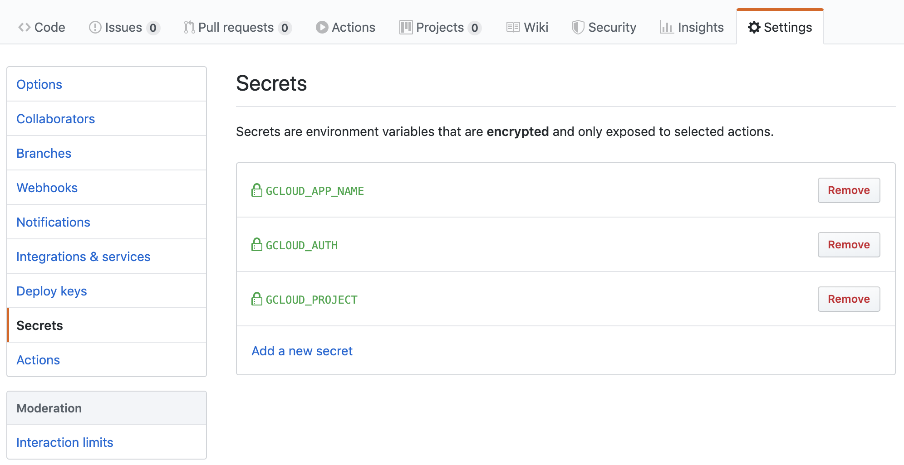

Publish your Cloud Run App with GitHub Actions

# Publish your Cloud Run App with GitHub Actions

## A very fast way to deploy your application with GitHub

[Bruno Sabot](https://medium.com/@brunosabot?source=post_page-----6c18ff5c5ee4----------------------)

[Sep 23](https://medium.com/better-programming/publish-your-cloud-run-app-with-github-actions-6c18ff5c5ee4?source=post_page-----6c18ff5c5ee4----------------------) · 5 min read

Photo by [Allan Nygren](https://unsplash.com/@coloradohiker?utm_source=unsplash&utm_medium=referral&utm_content=creditCopyText) on [Unsplash](https://unsplash.com/s/photos/cloud?utm_source=unsplash&utm_medium=referral&utm_content=creditCopyText)

Google recently announced [Cloud Run](https://cloud.google.com/run/), a new [Google Cloud Platform](https://cloud.google.com/gcp/?utm_source=google&utm_medium=cpc&utm_campaign=na-US-all-en-dr-bkws-all-all-trial-p-dr-1007179&utm_content=text-ad-lpsitelinkCCexp2-any-DEV_c-CRE_113120493247-ADGP_Hybrid+%7C+AW+SEM+%7C+BKWS+%7C+US+%7C+en+%7C+Multi+~+Cloud+Platform-KWID_43700011014879364-kwd-10876442192&utm_term=KW_cloud%20platform-ST_cloud+platform&gclid=CjwKCAjw2qHsBRAGEiwAMbPoDG8AYhrx-uAWd-_A5PQbzTIHw7LCFPa1E54xXPqJj3nMh1K3Wt55ChoCNG4QAvD_BwE) (GCP) feature, to deploy your [Docker](https://www.docker.com/) applications fast and easily. This guide will explain how to build and deploy a simple static application using the new continuous integration/continuous delivery system provided by GitHub: [Actions](https://github.com/features/actions).

To make this project live, we’ll use the following tools:

- Google Cloud Run, to execute our Docker containers
- [Google Cloud Container Registry](https://cloud.google.com/container-registry/) to store our Docker images
- GitHub Actions to manage the continuous deployment
- GitHub to store the source code of our project.

* * *

*...*

# Configure the GCP Project

## Service account creation

The first step is to create a *service account* which will allow us to connect from GitHub actions. To do so, you can click the “Create Service Account” button in the “IAM & Admin/Service Accounts” menu in the GCP interface. Now fill in the “Service Account Name” field with the value “GitHub-actions” and the “Service Account Description” field with the value “Account used by GitHub Actions to connect with GCP.”

Clicking on the “Create” button brings up the roles configuration stage. We need two roles:

- **Cloud Run Admin**, the role which will allow us to create a new Cloud Run deployment;
- **Storage Admin**, the role which allow us to upload our Docker images to the GCP’s Container Registry.
- **Service Account User**, the role that allows the service account to act as a user.

The “Continue” button takes us to the third and final step: JSON key creation. To do that, just click the “Create Key” button, choose “JSON” > “Create.” A file will be downloaded, referred to as `key-partition-000000–0123456789ab.json`. Keep it, we’ll use it later.

## API activation

Now that we have a user with the proper permissions, we need to activate the two services we need.

To enable the container registry, choose the “Container Registry” (obvious, right?) menu of the GCP interface, and click the “Enable Container Registry API” button… and we’re done.

To enable Cloud Run, choose the “Cloud Run” (obvious again, right?) menu from the GCP interface and click “Start Using Cloud Run.”**  **Again, we’re done.

* * *

*...*

# Project Creation

To initiate the project, let’s create a GitHub repository and add several files:

- A simple welcome `<h1>Hello World!</h1>` HTML page;
- A simple error `<h1>Server error</h1>` HTML page;
- A `nginx/default.conf `file that will serve as the welcome file
- A `Dockerfile` to build Docker images;
- A `.github/workflows/googlecloudrun.yml` file to configure the continuous deployment.

## `nginx` configuration

|     |     |
| --- | --- |
| 1   | server { |
| 2   | listen 8080; |
| 3   | server_name localhost; |
| 4   | location / { |
| 5   | root /usr/share/nginx/html; |
| 6   | index index.html index.htm; |
| 7   | }   |
| 8   |     |
| 9   | # redirect server error pages to the static page /50x.html |
| 10  | error_page 500 502 503 504 /50x.html; |
| 11  | location = /50x.html { |
| 12  | root /usr/share/nginx/html; |
| 13  | }   |
| 14  | }   |

 [view raw](https://gist.github.com/brunosabot/ed052ea7a9a97dca82294438ed913490/raw/c8c52a52e00d9b5106faf06d666663ae80a51243/default.conf)  [default.conf](https://gist.github.com/brunosabot/ed052ea7a9a97dca82294438ed913490#file-default-conf) hosted with ❤ by [GitHub](https://github.com/)

Cloud Run listens on `localhost:8080`. So, the first step is to set these values with `server_name` and `listen`.

Then, we configure the file location that `nginx` should serve; the `root` key is where all the static files to serve are located. In this example, that’s in `usr/share/nginx/html`. The `index` key declares to `nginx` what `root` files to resolve; here, `index.html` or `index.htm` will be resolved.

Finally, we forward the 50X errors to a special file with the command `error_page` and handle the mapping in `nginx`with `location` to our error HTML file.

## Dockerfile

|     |     |
| --- | --- |
| 1   | FROM nginx:alpine |
| 2   |     |
| 3   | COPY nginx/default.conf /etc/nginx/conf.d/default.conf |
| 4   | COPY html /usr/share/nginx/html |

 [view raw](https://gist.github.com/brunosabot/e0fef5aa5865b457bd26f22051c287c8/raw/c89b998643414c355e74a0fb34f19544046c9d45/Dockerfile)  [Dockerfile](https://gist.github.com/brunosabot/e0fef5aa5865b457bd26f22051c287c8#file-dockerfile) hosted with ❤ by [GitHub](https://github.com/)

Since our application is really simple, we only have three steps in our Docker file:

- We choose the `alpine nginx` image to ensure we have the lightest bundle possible;
- We copy the `nginx conf` in its target folder;
- Finally, we copy our HTML files in the `public` folder of our newly-created container.

## GitHub actions YAML

|     |     |
| --- | --- |
| 1   | name: Deploy the application to Google Cloud Run |
| 2   | on: |
| 3   |  push: |
| 4   |  branches: |
| 5   | - 'master' |
| 6   |     |
| 7   | jobs: |
| 8   |  deploy: |
| 9   |  name: Deploy job |
| 10  |  runs-on: ubuntu-latest |
| 11  |  steps: |
| 12  | - name: Checkout the repository |
| 13  |  uses: actions/checkout@v1 |
| 14  |     |
| 15  | - name: Build Docker image |
| 16  |  uses: actions/docker/cli@master |
| 17  |  with: |
| 18  |  args: "build . --tag eu.gcr.io/${{ secrets.GCLOUD_PROJECT }}/${{ secrets.GCLOUD_APP_NAME }}" |
| 19  |     |
| 20  | - name: Authenticate into Google Cloud Platform |
| 21  |  uses: actions/gcloud/auth@master |
| 22  |  env: |
| 23  |  GCLOUD_AUTH: ${{ secrets.GCLOUD_AUTH }} |
| 24  |     |
| 25  | - name: Configure Docker to use Google Cloud Platform |
| 26  |  uses: actions/gcloud/cli@master |
| 27  |  with: |
| 28  |  args: "auth configure-docker --quiet" |
| 29  |     |
| 30  | - name: Push image to Google Cloud Container Registry |
| 31  |  uses: actions/gcloud/cli@master |
| 32  |  with: |
| 33  |  entrypoint: sh |
| 34  |  args: -c "docker push eu.gcr.io/${{ secrets.GCLOUD_PROJECT }}/${{ secrets.GCLOUD_APP_NAME }}" |
| 35  |     |
| 36  | - name: Install beta commands and deploy on cloud run |
| 37  |  uses: actions/gcloud/cli@master |
| 38  |  with: |
| 39  |  args: "components install beta --quiet && gcloud beta run deploy ${{ secrets.GCLOUD_APP_NAME }} --quiet --image eu.gcr.io/${{ secrets.GCLOUD_PROJECT }}/${{ secrets.GCLOUD_APP_NAME }} --project ${{ secrets.GCLOUD_PROJECT }} --region europe-west1 --platform managed" |

 [view raw](https://gist.github.com/brunosabot/a28b8dd9c7090b66a98427fe56d26047/raw/d1133ed4bae2bb42ae379613fa4aa63e94322839/googlecloudrun.yml)  [googlecloudrun.yml](https://gist.github.com/brunosabot/a28b8dd9c7090b66a98427fe56d26047#file-googlecloudrun-yml) hosted with ❤ by [GitHub](https://github.com/)

This is probably the most complicated part of the project, although you’ll see that it’s still pretty simple.

Our project will make the deploy on every commit made on the master branch. We will, however, ignore everything made on the other branches since it’s a deployment script. If you need to go further, you may want to make a deploy on a different endpoint for every other branch, but that’s not today’s topic.

Our CD also has only one job, since we have a pretty simple application -simple `nginx` server with static files. But in real life, you may want other steps to build your application, or to run the tests, for example. We choose to run the build on `ubuntu-latest`, but [other possibilities are available](https://help.github.com/en/articles/workflow-syntax-for-github-actions#jobsjob_idruns-on).

The job will be composed of several steps. But before digging into them, let’s see what actions are required:

- `actions/checkout@v1` to pull the GitHub project sources we are going to deploy;
- `actions/docker/cli@master` to build the Docker image;
- `actions/gcloud/cli@master` to perform every step related to GCP.

Now let’s dive into the steps. There are six of them:

The first one is to ensure you get the application sources from GitHub. Because Actions might be triggered on issue creation, for example, in which we probably don’t need to get the sources. GitHub gives only the mandatory data by default.

The second one uses the Docker action to build our image. Moreover, since we are uploading the image to Google Cloud Container Registry, we have to tag it with the name of the target image URI. The URI is built using:

- A host: `eu.gcr.io`;
- A project: `secrets.GCLOUD_PROJECT`, a *secret* we will talk about in a moment;
- An app name: `secrets.GCLOUD_APP_NAME`; also a *secret.*

The third step is the beginning of GCP-related commands. We first need to authenticate ourselves with the secret key `GCLOUD_AUTH` via the `auth` action.

The fourth step links GCP and Docker together so it knows where to push images.

The fifth step consists of uploading our image on the container registry. This one has a specificity: we need to use both Docker and GCloud in that command, so choose the GCloud action, and use the `sh` entrypoint in order to have both the`gcloud` and `docker` commands available, to push the image. Thanks to the fourth step, Docker will push images in the right place.

The final step is actually two commands. Here, the result of the first is not available in the second if we split them into two different steps. The two commands are responsible for:

- Installing the beta components, since Google Cloud Run is still in beta;
- Deploying the app into Cloud Run. You will need to set the [region](https://cloud.google.com/sdk/gcloud/reference/beta/run/deploy#--region) you prefer and the [platform](https://cloud.google.com/sdk/gcloud/reference/beta/run/deploy#--platform) (managed or [GKE](https://cloud.google.com/kubernetes-engine/)).

## Declaring GitHub secrets

Secrets interface for GitHub Actions
In our YAML file, we reference three secret keys:

- `GCLOUD_APP_NAME`: the name of the application on Cloud Run. In this example, it will be `cloud-run-github-actions`.
- `GCLOUD_PROJECT`: the project ID on Google Cloud Platform. You can find it on the “Project Selection” popup.
- `GCLOUD_AUTH`: the base 64-encoded content of the JSON file we downloaded at the beginning of the story, `key-partition-000000–0123456789ab.json`.

And we’re ready to execute our deployment from GitHub Actions!

* * *

*...*

# Conclusion

We can now deploy our project continuously and easily on Google Cloud Run. Our example is pretty simple, but since we’re using a Docker image, we’re free to have any kind of application we want. Just note that the application must listen to the `PORT` environment variable: Cloud Run will only listen to an app on that port!

You can find the sources on [Github](https://github.com/brunosabot/cloud-run-github-actions).