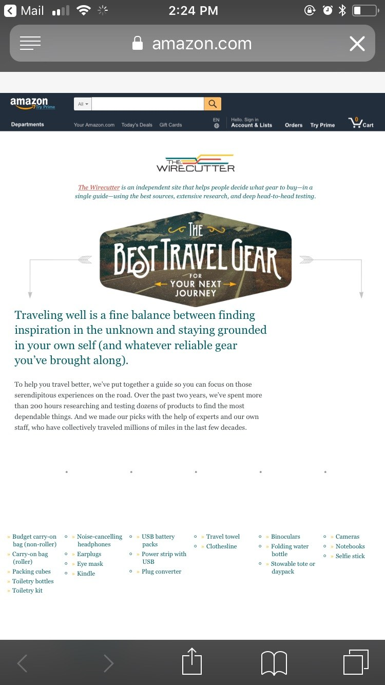

Publishers warily embrace Amazon program to run their content on Amazon.com - Digiday

# Publishers warily embrace Amazon program to run their content on Amazon.com

After [months of asking](https://digiday.com/media/amazons-media-ambitions-grow-publishers-wary-dedicating-resources/) to get their content into Amazon, publishers finally got their wish. For the past several months, Amazon has been running a test with a small group of publishers where versions of publishers’ commerce-focused articles are accessible directly inside Amazon’s website.

The articles can be found through Google search or through searches for specific keywords inside Amazon and are shoppable just like they’d be on a publisher’s own site. For some commerce-focused publishers, particularly smaller or less-established ones, these tests represent an opportunity to get in front of an enormous number of shoppers. “They were helping us to reach their massive audience,” said an executive at one publisher that has worked on a number of different content initiatives with Amazon before.

But that scale and exposure comes at a price. Amazon is not offering publishers licensing fees to run their content. Instead it is tying publishers’ content fees to performance in driving purchases. If a reader decides to buy a backpack recommended in Wirecutter’s guide to travel, for example, a click on that backpack directs them to the product page inside Amazon, where they can complete a purchase. Wirecutter earns a commission on the purchase.

The commission rates, according to people familiar with the arrangement, are identical to the ones Amazon would pay out if the transaction originated on a publisher’s own website. Amazon is not paying a licensing fee for the content, according to one publisher. Amazon confirmed the tests were underway but would not answer questions about how publishers are compensated.

For some publishers, the tests signal something much scarier. If Amazon, which already claims more than [40 cents of every dollar spent](http://www.emarketer.com/newsroom/index.php/amazons-share-us-ecommerce-surpass-40-2017/) on e-commerce in the United States, trains its customers to look for third-party recommendations inside its platform, it will be able to exert even more control over the affiliate commerce world, potentially dropping affiliate commission rates to a fraction of their current levels. The program also comes at a time when the sheen is decidedly off distributed media strategies that give control over to platforms.

“When will publishers learn?” said an executive at a commerce-focused publisher that’s not taking part in the tests. “The goal is to build a direct, habitual relationship with consumers. The more you train them that they don’t need to come to you, the worse off you are.”

**A mobile screenshot of Wirecutter’s travel gear guide on Amazon’s website.**

Amazon has experimented with publisher content before. In 2015, it created holiday gift guides with lifestyle-focused publishers including PureWow, Allure and Oprah Winfrey’s O, The Oprah Magazine. This past year, O also worked with Amazon on a shoppable page that compiled beauty products that Oprah called best in class. Representatives from O did not respond to questions about its work with Amazon.

The current test is more modest. [Amazon’s Wirecutter guide](https://www.amazon.com/gp/feature.html?ie=UTF8&docId=1003003551) to travel, for example, is an abridged version of a pre-existing article, without any of the added bells and whistles of the Oprah collaboration. Wirecutter declined to answer questions about its Amazon collaboration.

Amazon sees the addition of content to its site as making it easier to discover products on its sites, publishers say. “We’ve had so many conversations with them about helping them with [product] discovery,” said one executive at a commerce-focused publisher. “They’re looking for a way to add to their recommendation engines.”

But while Amazon dangles detailed information [in front of agencies](https://digiday.com/marketing/amazon-will-soon-2000-people-advertising-new-york-city/) and marketers to entice them to spend advertising dollars, it offers only high-level information to publishers, according to multiple publishers. “I’d rather them give us some form of guidance,” another commerce-focused publishing executive said, such as Amazon’s underlying rationale for the kind of content it wants or what works with its users.

That dynamic could start to change, however. One publisher that has worked with Amazon said the company recently created a brand strategy team to work with publishers on collaborations. That strategy, one publisher said, will allow publishers to better coordinate tests run with Amazon across multiple fronts. A separate publisher, who also isn’t involved in the tests, said he’d noticed “momentum” around creating better communication between departments but hadn’t met anyone in brand strategy.

Until recently, many of the content tests Amazon has conducted with publishers have been run independently by executives from different corners of the company. The decision to pay publishers to [make content for Spark](https://www.wsj.com/articles/amazon-lures-publishers-to-new-social-network-by-paying-them-to-post-1500482959), an Instagram-esque photo-sharing product, was made by executives in Amazon Associates, while the decision to pay other publishers to make videos about products came from another corner of the company, according to publishers that have been involved in these respective tests.

Should opportunities arise to work with Amazon more closely, publishers will have to figure out if that’s worth it, not just for the additional expenditure of time and energy but the prospect of becoming overly dependent on them. “That concern, writ large, is the problem we face with every single platform on the distributed web,” one publisher said.