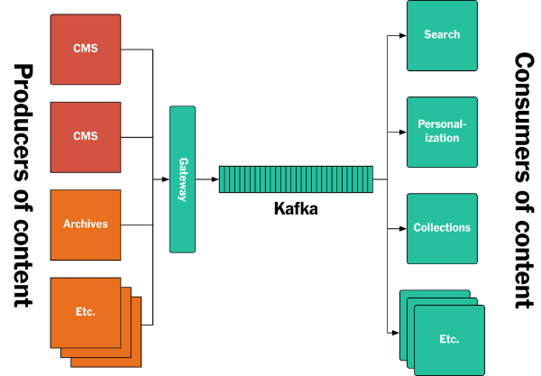
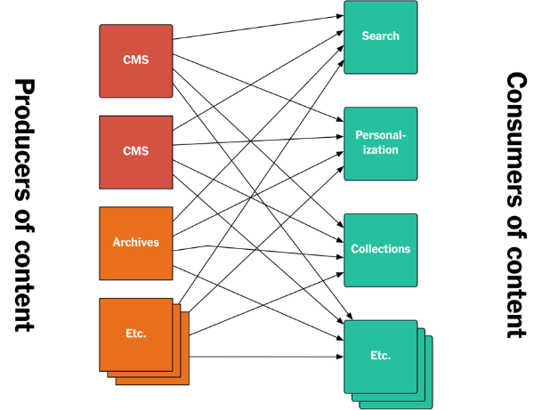
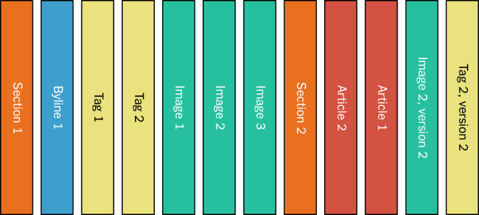
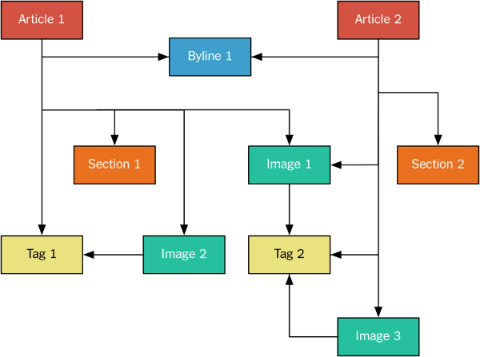
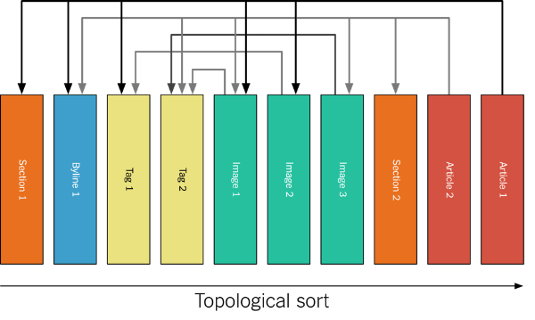
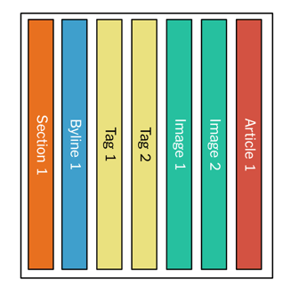
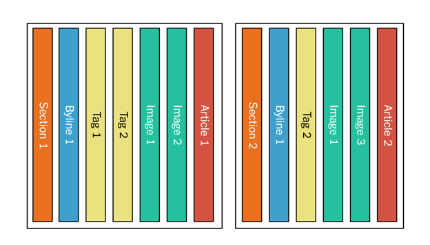
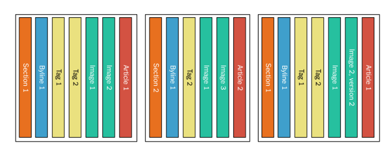
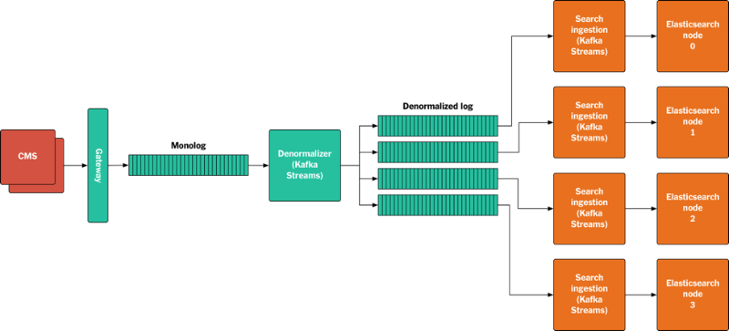
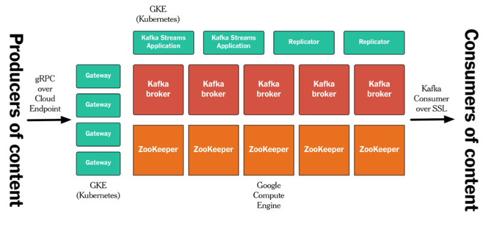

Publishing with Apache Kafka at The New York Times | Confluent

 Stream Processing

# Publishing with Apache Kafka at The New York Times

[Boerge Svingen](https://www.confluent.io/blog/author/guest/)  September 6, 2017

At The New York Times we have a number of different systems that are used for producing content. We have several Content Management Systems, and we use third-party data and wire stories. Furthermore, given 161 years of journalism and 21 years of publishing content online, we have huge archives of content that still need to be available online, that need to be searchable, and that generally need to be available to different services and applications.

These are all sources of what we call *published content*. This is content that has been written, edited, and that is considered ready for public consumption.

On the other side we have a wide range of services and applications that need access to this published content — there are search engines, personalization services, feed generators, as well as all the different front-end applications, like the website and the native apps. Whenever an asset is published, it should be made available to all these systems with very low latency — this is news, after all — and without data loss.

This article describes a new approach we developed to solving this problem, based on a log-based architecture powered by Apache Kafka®. We call it the *Publishing Pipeline*. The focus of the article will be on back-end systems. Specifically, we will cover how Kafka is used for storing all the articles ever published by The New York Times, and how Kafka and the Streams API is used to feed published content in real-time to the various applications and systems that make it available to our readers.  The new architecture is summarized in the diagram below, and we will deep-dive into the architecture in the remainder of this article.

******
*Figure 1: The new New York Times log/Kafka-based publishing architecture.*

### The problem with API-based approaches

The different back-end systems that need access to published content have very different requirements:

- We have a service that provides live content for the web site and the native applications. This service needs to make assets available immediately after they are published, but it only ever needs the latest version of each asset.
- We have different services that provide lists of content. Some of these lists are manually curated, some are query-based. For the query-based lists, whenever an asset is published that matches the query, requests for that list need to include the new asset. Similarly, if an update is published causing the asset no longer to match the query, it should be removed from the list. We also have to support changes to the query itself, and the creation of new lists, which requires accessing previously published content to (re)generate the lists.
- We have an Elasticsearch cluster powering site search. Here the latency requirements are less severe — if it takes a minute or two after an asset is published before it can be found by a search it is usually not a big deal. However, the search engine needs easy access to previously published content, since we need to reindex everything whenever the Elasticsearch schema definition changes, or when we alter the search ingestion pipeline.
- We have personalization systems that only care about recent content, but that need to reprocess this content whenever the personalization algorithms change.

Our previous approach to giving all those different consumers access to published content involved building APIs. The producers of content would provide APIs for accessing that content, and also feeds you could subscribe to for notifications for new assets being published. Other back-end systems, the consumers of content, would then call those APIs to get the content they needed.

*Figure 2: A sketch of our previous API-based architecture that has since been replaced by the new log/Kafka-based architecture described in this article.*

This approach, a fairly typical API-based architecture, had a number of issues.

Since the different APIs had been developed at different times by different teams, they typically worked in drastically different ways. The actual endpoints made available were different, they had different semantics, and they took different parameters. That could be fixed, of course, but it would require coordination between a number of teams.

More importantly, they all had their own, implicitly defined schemas. The names of fields in one CMS were different than the same fields in another CMS, and the same field name could mean different things in different systems.

This meant that every system that needed access to content had to know all these different APIs and their idiosyncrasies, and they would then need to handle normalization between the different schemas.

An additional problem was that it was difficult to get access to previously published content. Most systems did not provide a way to efficiently stream content archives, and the databases they were using for storage wouldn’t have supported it (more about this in the next section). Even if you have a list of all published assets, making an individual API call to retrieve each individual asset would take a very long time and put a lot of unpredictable load on the APIs.

### Log-based architectures

The solution described in this article uses a log-based architecture. This is an idea that was first covered by Martin Kleppmann in *Turning the database inside-out with Apache Samza*[[1]](https://www.confluent.io/blog/publishing-apache-kafka-new-york-times/#_ftn1), and is described in more detail in *Designing Data-Intensive Applications*[[2]](https://www.confluent.io/blog/publishing-apache-kafka-new-york-times/#_ftn2). The log as a generic data structure is covered in *The Log: What every software engineer should know about real-time data’s unifying abstraction[[3]](https://www.confluent.io/blog/publishing-apache-kafka-new-york-times/#_ftn3)*. In our case the log is Kafka, and all published content is appended to a Kafka topic in chronological order. Other services access it by consuming the log.

Traditionally, databases have been used as the source of truth for many systems. Despite having a lot of obvious benefits, databases can be difficult to manage in the long run. First, it’s often tricky to change the schema of a database. Adding and removing fields is not too hard, but more fundamental schema changes can be difficult to organize without downtime. A deeper problem is that databases become hard to replace. Most database systems don’t have good APIs for streaming changes; you can take snapshots, but they will immediately become outdated. This means that it’s also hard to create derived stores, like the search indexes we use to power site search on nytimes.com and in the native apps — these indexes need to contain every article ever published, while also being up to date with new content as it is being published. The workaround often ends up being clients writing to multiple stores at the same time, leading to consistency issues when one of these writes succeeds and the other fails.

Because of this, databases, as long-term maintainers as state, tend to end up being complex monoliths that try to be everything to everyone.

Log-based architectures solve this problem by making the log the source of truth. Whereas a database typically stores the result of some event, the log stores the event itself — the log therefore becomes an ordered representation of all events that happened in the system. Using this log, you can then create any number of custom data stores. These stores becomes *materialized views* of the log — they contain derived, not original, content. If you want to change the schema in such a data store, you can just create a new one, have it consume the log from the beginning until it catches up, and then just throw away the old one.

With the log as the source of truth, there is no longer any need for a single database that all systems have to use. Instead, every system can create its own data store (database) – its own materialized view – representing only the data it needs, in the form that is the most useful for that system. This massively simplifies the role of databases in an architecture, and makes them more suited to the need of each application.

Furthermore, a log-based architecture simplifies accessing streams of content. In a traditional data store, accessing a full dump (i.e., as a snapshot) and accessing “live” data (i.e., as a feed) are distinct ways of operating. An important facet of consuming a log is that this distinction goes away. You start consuming the log at some specific offset – this can be the beginning, the end, or any point in-between — and then just keep going. This means that if you want to recreate a data store, you simply start consuming the log at the beginning of time. At some point you will catch up with live traffic, but this is transparent to the consumer of the log.

A log consumer is therefore “always replaying”.

Log-based architectures also provide a lot of benefits when it comes to deploying systems. Immutable deployments of stateless services have long been a common practice when deploying to VMs. By always redeploying a new instance from scratch instead of modifying a running one, a whole category of problems go away. With the log as the source of truth, we can now do immutable deployments of stateful systems. Since any data store can be recreated from the log, we can create them from scratch every time we deploy changes, instead of changing things in-place — a practical example of this is given later in the article.

### Why Google PubSub or AWS SNS/SQS/Kinesis don’t work for this problem

Apache Kafka is typically used to solve two very distinct use cases.

The most common one by far is where Apache Kafka is used as a message broker. This can cover both analytics and data integration cases. Kafka arguably has a lot of advantages in this area, but services like [Google Pub/Sub](https://cloud.google.com/pubsub/docs/overview), [AWS SNS](https://aws.amazon.com/sns/)/[AWS SQS](https://aws.amazon.com/sqs/), and [AWS Kinesis](https://aws.amazon.com/kinesis/) have other approaches to solving the same problem. These services all let multiple consumers subscribe to messages published by multiple producers, keep of track of which messages they have and haven’t seen, and gracefully handle consumer downtime without data loss. For these use cases, the fact that Kafka is a log is an implementation detail.

Log-based architectures, like the one described in this article, are different. In these cases, the log is not an implementation detail, it is the central feature. The requirements are very different from what the other services offer:

1. We need the log to retain all events forever, otherwise it is not possible to recreate a data store from scratch.

2. We need log consumption to be ordered. If events with causal relationships are processed out of order, the result will be wrong.

Only Kafka supports both of these requirements.

### The Monolog

The Monolog is our new source of truth for published content. Every system that creates content, when it’s ready to be published, will write it to the Monolog, where it is appended to the end. The actual write happens through a gateway service, which validates that the published asset is compliant with our schema.

*Figure 3: The Monolog, containing all assets ever published by The New York Times.*

The Monolog contains every asset published since 1851. They are totally ordered according to publication time. This means that a consumer can pick the point in time when it wants to start consuming. Consumers that need all of the content can start at the beginning of time (i.e., in 1851), other consumers may want only future updates, or at some time in-between.

As an example, we have a service that provides lists of content — all assets published by specific authors, everything that should go on the science section, etc. This service starts consuming the Monolog at the beginning of time, and builds up its internal representation of these lists, ready to serve on request. We have another service that just provides a list of the latest published assets. This service does not need its own permanent store: instead it just goes a few hours back in time on the log when it starts up, and begins consuming there, while maintaining a list in memory.

Assets are published to the Monolog in normalized form, that is, each independent piece of content is written to Kafka as a separate message. For example, an image is independent from an article, because several articles may include the same image.

The figure gives an example:

*Figure 4: Normalized assets.*

This is very similar to a normalized model in a relational database, with many-to-many relationships between the assets.

In the example we have two articles that reference other assets. For instance, the byline is published separately, and then referenced by the two articles. All assets are identified using URIs of the form *nyt://article/577d0341-9a0a-46df-b454-ea0718026d30*. We have a native asset browser that (using an OS-level scheme handler) lets us click on these URIs, see the asset in a JSON form, and follow references. The assets themselves are published to the Monolog as [protobuf](https://github.com/google/protobuf) binaries.

In Apache Kafka, the Monolog is implemented as a single-partition topic. It’s single-partition because we want to maintain the total ordering — specifically, we want to ensure that when you are consuming the log, you always see a referenced asset before the asset doing the referencing. This ensures internal consistency for a top-level asset — if we add an image to an article while adding text referencing the image, we do not want the change to the article to be visible before the image is.

The above means that the assets are actually published to the log topologically sorted. For the example above, it looks like this:

*Figure 5: Normalized assets in publishing order.*

As a log consumer you can then easily build your materialized view of log, since you know that the version of an asset referenced is always the last version of that asset that you saw on the log.

Because the topic is single-partition, it needs to be stored on a single disk, due to the way Kafka stores partitions. This is not a problem for us in practice, since all our content is text produced by humans — our total corpus right now is less than 100GB, and disks are growing bigger faster than our journalists can write.

### The denormalized log and Kafka’s Streams API

The Monolog is great for consumers that want a normalized view of the data. For some consumers that is not the case. For instance, in order to index data in [Elasticsearch](https://www.elastic.co/products/elasticsearch) you need a denormalized view of the data, since Elasticsearch does not support many-to-many relationships between objects. If you want to be able to search for articles by matching image captions, those image captions will have to be represented inside the article object.

In order to support this kind of view of the data, we also have a denormalized log. In the denormalized log, all the components making up a top-level asset are published together. For the example above, when Article 1 is published, we write a message to the denormalized log, containing the article and all its dependencies along with it in a single message:

  *    Figure 6: The denormalized log after publishing **Article 1**.****

***

The Kafka consumer that feeds Elasticsearch can just pick this message off the log, reorganize the assets into the desired shape, and push to the index. When Article 2 is published, again all the dependencies are bundled, including the ones that were already published for Article 1:

*Figure 7: The denormalized log after publishing **Article 2*.

If a dependency is updated, the whole asset is republished. For instance, if Image 2 is updated, all of Article 1 goes on the log again:

*Figure 8: The denormalized log after updating **Image 2**, used by **Article 1*.

A component called the *Denormalizer* actually creates the denormalized log.

The Denormalizer is a Java application that uses [Kafka’s Streams API](http://kafka.apache.org/documentation/streams/). It consumes the Monolog, and maintains a local store of the latest version of every asset, along with the references to that asset. This store is continuously updated when assets are published. When a top-level asset is published, the Denormalizer collects all the dependencies for this asset from local storage, and writes it as a bundle to the denormalized log. If an asset referenced by a top-level asset is published, the Denormalizer republishes all the top-level assets that reference it as a dependency.

Since this log is denormalized, it no longer needs total ordering. We now only need to make sure that the different versions of the same top-level asset come in the correct order. This means that we can use a partitioned log, and have multiple clients consume the log in parallel. We do this using Kafka Streams, and the ability to scale up the number of application instances reading from the denormalized log allows us to do a very fast replay of our entire publication history — the next section will show an example of this.

### Elasticsearch example

The following sketch shows an example of how this setup works end-to-end for a backend search service. As mentioned above, we use Elasticsearch to power the site search on [NYTimes.com](https://www.nytimes.com/):

*Figure 9: A sketch showing how published assets flow through the system from the CMS to Elasticsearch.*

The data flow is as follows:

- An asset is published or updated by the CMS.
- The asset is written to the Gateway as a protobuf binary.
- The Gateway validates the asset, and writes it to the Monolog.
- The Denormalizer consumes the asset from the Monolog. If this is a top-level asset, it collects all its dependencies from its local store and writes them together to the denormalized log. If this asset is a dependency of other top-level assets, all of those top-level assets are written to the denormalized log.
- The Kafka partitioner assigns assets to partitions based on the URI of the top-level asset.
- The search ingestion nodes all run an application that uses Kafka Streams to access the denormalized log. Each node reads a partition, creates the JSON objects we want to index in Elasticsearch, and writes them to specific Elasticsearch nodes. During replay we do this with Elasticsearch replication turned off, to make indexing faster. We turn replication back on when we catch up with live traffic before the new index goes live.

### Implementation

This Publishing Pipeline runs on [Google Cloud Platform/GCP](https://cloud.google.com/). The details of our setup are beyond the scope of this article, but the high-level architecture looks like the sketch below. We run Kafka and ZooKeeper on [GCP Compute](https://cloud.google.com/compute/docs/) instances. All other processes  the Gateway, all Kafka replicators, the Denormalizer application built with Kafka’s Streams API, etc. — run in containers on [GKE](https://cloud.google.com/container-engine/)/[Kubernetes](https://kubernetes.io/). We use [gRPC](https://grpc.io/)/[Cloud Endpoint](https://cloud.google.com/endpoints/) for our APIs, and mutual SSL authentication/authorization for keeping Kafka itself secure.

*Figure 10: Implementation on Google Cloud Platform.*

### Conclusion

We have been working on this new publishing architecture for a little over a year. We are now in production, but it’s still early days, and we have a good number of systems we still have to move over to the Publishing Pipeline.

We are already seeing a lot of advantages. The fact that all content is coming through the same pipeline is simplifying our software development processes, both for front-end applications and back-end systems. Deployments have also become simpler – for instance, we are now starting to do full replays into new Elasticsearch indexes when we make changes to analyzers or the schema, instead of trying to make in-place changes to the live index, which we have found to be error-prone. Furthermore, we are also in the process of building out a better system for monitoring how published assets progress through the stack. All assets published through the Gateway are assigned a unique message ID, and this ID is provided back to the publisher as well as passed along through Kafka and to the consuming applications, allowing us to track and monitor when each individual update is processed in each system, all the way out to the end-user applications. This is useful both for tracking performance and for pinpointing problems when something goes wrong.

Finally, this is a new way of building applications, and it requires a mental shift for developers who are used to working with databases and traditional pub/sub-models. In order to take full advantage of this setup, we need to build applications in such a way that it is easy to deploy new instances that use replay to recreate their materialized view of the log, and we are putting a lot of effort into providing tools and infrastructure that makes this easy.

*I want to thank Martin Kleppmann, Michael Noll and Mike Kaminski for reviewing this article.*

### About Apache Kafka’s Streams API

If you have enjoyed this article, you might want to continue with the following resources to learn more about Apache Kafka’s Streams API:

- [Get started with the Kafka Streams API](https://kafka.apache.org/documentation/streams/) to build your own real-time applications and microservices.
- Walk through our [Confluent tutorial for the Kafka Streams API with Docker](https://docs.confluent.io/current/streams/kafka-streams-examples/docs/index.html) and play with our [Confluent demo applications](https://github.com/confluentinc/kafka-streams-examples).

————————————————————————————————————————————–

[[1]](https://www.confluent.io/blog/publishing-apache-kafka-new-york-times/#_ftnref1) “[Turning the database inside-out with Apache Samza – Martin Kleppmann](https://martin.kleppmann.com/2015/03/04/turning-the-database-inside-out.html).” 4 Mar. 2015. Accessed 14 Jul. 2017.

[[2]](https://www.confluent.io/blog/publishing-apache-kafka-new-york-times/#_ftnref2) “[Designing Data-Intensive Applications](http://dataintensive.net/).” Accessed 14 Jul. 2017.

[[3]](https://www.confluent.io/blog/publishing-apache-kafka-new-york-times/#_ftnref3) “[The Log: What every software engineer should know about real-time](https://engineering.linkedin.com/distributed-systems/log-what-every-software-engineer-should-know-about-real-time-datas-unifying) …” 16 Dec. 2013. Accessed 14 Jul. 2017.

## Did you like this blog post? Share it now

[**  1.1k](https://www.confluent.io/blog/publishing-apache-kafka-new-york-times/#)

[**  534](https://www.confluent.io/blog/publishing-apache-kafka-new-york-times/#)

[**  1.1k](https://www.confluent.io/blog/publishing-apache-kafka-new-york-times/#)