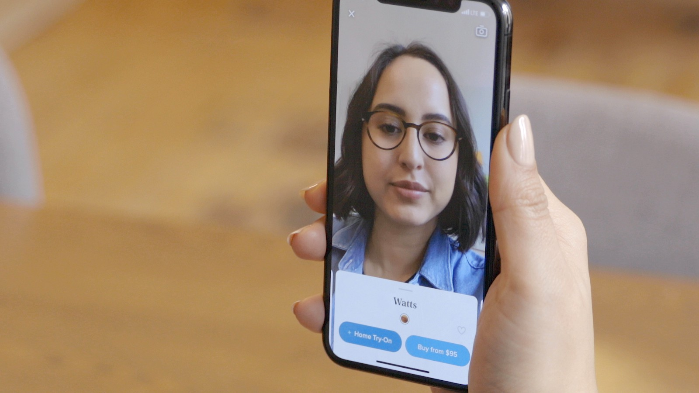
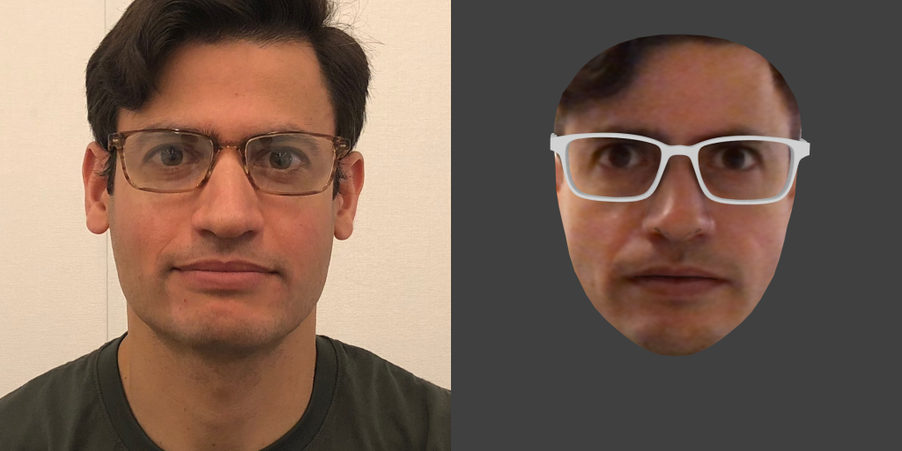
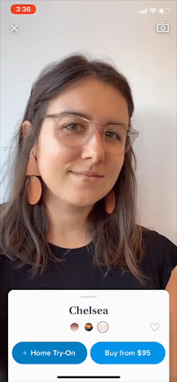

Putting virtual glasses on a real face: Warby Parker’s Virtual Try-On placement algorithm

# Putting virtual glasses on a real face: Warby Parker’s Virtual Try-On placement algorithm

[David Goldberg](https://medium.com/@davidhgoldberg)
Apr 2·6 min read

### Introduction

Warby Parker just released a [new version of its iOS app](https://itunes.apple.com/us/app/glasses-by-warby-parker/id1107693363?mt=8), the first to include an innovative Virtual Try-On tool. The new tool uses the iPhone X’s state-of-the-art augmented reality technology and TrueDepth camera to create a “magic mirror” that shows the user how glasses will look on their face with exceptionally realistic size, placement, color, and texture. Unlike earlier VTO tools that rely on two-dimensional photos, ours uses the iPhone’s TrueDepth camera to map the full three-dimensional structure of the user’s face. This enables the app to accurately represent the size of the glasses relative to the size of the user’s face and with the correct placement. By simulating the real-life process of placing a pair of frames on the face — and taking into account how unique facial features interact with glasses — the tool can figure out just where they will sit. In this post, I’ll give you a glimpse into how we, the Warby Parker team, made this happen.

### Leveraging the iPhone’s TrueDepth camera

In November 2017, Apple released the iPhone X. Among the host of new features offered was the TrueDepth camera — a 3D camera based on [structured-light technology](https://en.wikipedia.org/wiki/Structured-light_3D_scanner). Amazingly, Apple has managed to shrink this tech, first popularized by the Microsoft Kinect, into the iPhone X’s distinctive notch. The TrueDepth camera consists of an infrared dot projector, which shines an array of invisible dots into the world, and an infrared sensor, which captures the interaction between the projected dots and the surroundings and converts it into a 3D representation. ARKit, Apple’s augmented reality platform, provides methods for mapping this 3D data onto a face model, which allows [the head’s size, position, and orientation to be tracked in real-time](https://developer.apple.com/documentation/arkit/creating_face-based_ar_experiences).

Upon iPhone X’s release, we immediately recognized that the TrueDepth camera and ARKit could dramatically improve our customer’s shopping experience. Truth be told, we had been waiting for technology like this to hit the market for years. Soon after the release of the iPhone X, we introduced our first iteration of a virtual fitting room experience — [Find Your Fit](https://twitter.com/warbyparker/status/928645365758349313) — a feature developed fully in-house that leverages the TrueDepth camera to scan the user’s face and recommend the best-fitting glasses from Warby Parker’s assortment. While our customers recognized Find Your Fit as an informative tool in the frame selection process, seeing is believing. Our team felt there is no substitute for seeing what the glasses will look like on your face.

Warby Parker’s Virtual Try-On tool shows customers in real-time how glasses will look on their face using only their iPhone X — no physical glasses needed. Importantly, all information about the user’s facial features is processed in real-time, meaning we do not store this data on the phone nor do we transfer it off the phone. Perhaps the most salient aspect of how glasses fit is whether the width of the frame matches an individual’s face. Typical virtual reality shopping experiences are based on conventional 2D photographs that lack scale information, resulting in inaccurate sizing of the virtual product. In contrast, the TrueDepth 3D camera reports the exact size of the user’s face, making it possible to display virtual glasses at the correct size every time. Getting the size right is a huge advance in and of itself, but to create the best user experience, we had to confront the challenge of how, precisely, to place the glasses.

### The placement challenge

As mentioned above, matching the width of a pair of glasses to an individual’s face is crucial when it comes to fit and comfort. A more subtle, but just as important, detail is whether the glasses sit in the right place when worn. At Warby Parker, we refer to how high and deep the glasses sit on the customer’s face as the placement.

#### Placement testing framework

Over the course of the development of Warby Parker’s Virtual Try-On tool, we considered several candidate placement algorithms. In order to directly compare the algorithms, we developed a framework that allowed us to efficiently evaluate different combinations of test subjects, frame shapes, and placement algorithms without having to integrate all of the candidate algorithms into the app.

Assembling a large, diverse pool of test subjects was the first step. Faces come in all shapes and sizes, so testing whether the proposed placement algorithms would work for everyone was important. For each test subject, we used the TrueDepth camera to obtain 3D scans of their face, plus a traditional camera to take 2D photographs of the subject wearing a selection of Warby Parker frames. The photographs served as a ground truth against which to evaluate placement algorithms.

We then wrote software that combines the scanned facial data of our test subjects, 3D models of our frames, and the placement algorithms into an output that can be easily compared with the ground truth photographs. One component reads in the frame models and face data, runs the candidate placement algorithms, and reports the placements. A second component reads in the photographs of the subjects in glasses and uses the [dlib](http://dlib.net/) library to determine the locations of key facial landmarks, and in turn, the head position and orientation. The final component combines the placement information, the head pose information, the frame model, and the head scans and processes them with the rendering software [Blender](https://www.blender.org/). The result is a rendering of the scanned head and virtual glasses that can be compared to a ground truth photograph. This procedure was automated and carried out over hundreds of combinations of subjects, frame shapes, and algorithms.

Illustration of placement algorithm evaluation framework. Left, ground truth photograph of test subject wearing glasses. Right, rendering of 3D scan of subject with 3D glasses model placed according to the output of a placement algorithm.

#### Physical placement algorithms

Frame fit is key for comfort and function. Our Product Strategy and Design teams are often testing frames and surveying customers to determine what it means for a frame to fit well. The insight from our in-house experts was invaluable as we developed our Virtual Try-On tool. Of the many placement algorithms tested, the ones that performed best were those that simulate the process of placing glasses on a face in order to determine how they would sit in real life, an approach we call physical placement. The simplest placement algorithm we considered involved picking a single reference point on the face model and offsetting the glasses model some fixed amount from that point. While this approach can yield good results, there are combinations of glasses and people for whom it doesn’t (usually when the glasses are a poor fit.) Because physical placement takes into account the complex interplay between the shape of the glasses and the shape of the wearer’s face, it ensures that every glasses/individual combination, no matter how unlikely, gets a realistic placement.

At the core of the physical placement algorithm is a [collision detection](https://en.wikipedia.org/wiki/Collision_detection) operation — the mathematical operation that tells us whether two 3D objects are intersecting. A collision detection routine is provided by the [physics simulation](https://developer.apple.com/documentation/scenekit/physics_simulation) capabilities of Apple’s SceneKit Framework. For example, in the case of acetate glasses, we know wearers push the frames up until they rest against the bridge of their nose, which determines the placement depth. Then we use collision detection to find a physically realistic vertical placement. (It’s not unlike the descending sunglasses from that “[Deal with it](https://knowyourmeme.com/photos/52812-deal-with-it)” meme.) In the case of metal and mixed-material glasses, it’s often collisions between the wearer’s nose and the glasses’ nose pads that determine the placement.

Warby Parker’s Virtual Try-On tool matches the real-life position of glasses, as demonstrated by wearers.

### Conclusion

Customers can explore Warby Parker’s frame and style options through several channels. Via the [Home Try-On program](https://www.warbyparker.com/home-try-on), customers can pick five frames to try for free at their home for five days. At the 85+ retail locations, Warby Parker’s full collection of eyeglasses and sunglasses are available to try on. Now there is Virtual Try-On, which represents the “best of both worlds” — instant access to the entire optical assortment directly from the Warby Parker app on an iPhone X. The value of Virtual Try-On hinges on customers’ confidence in its realism, and thanks to Warby Parker’s realistic placement approach, customers now have a more accessible, easy, and fun glasses shopping experience.