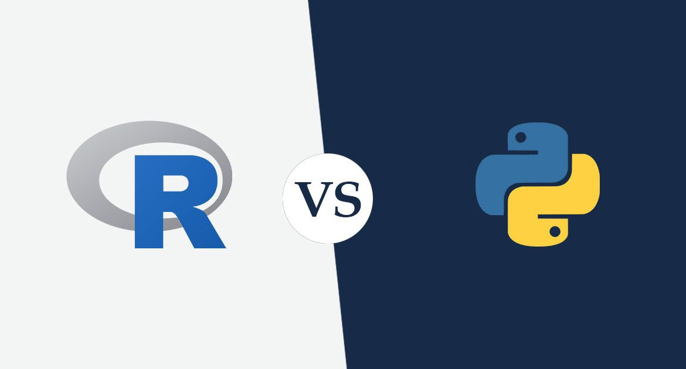
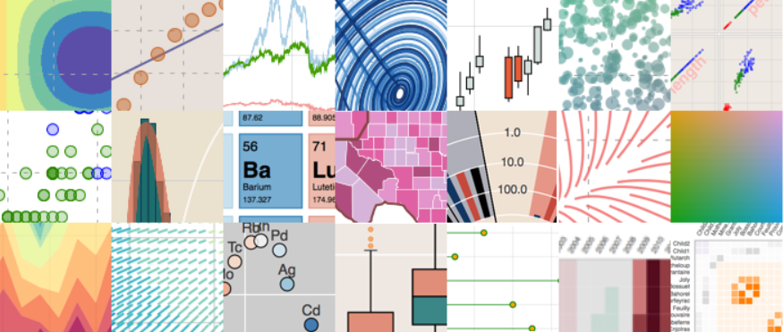
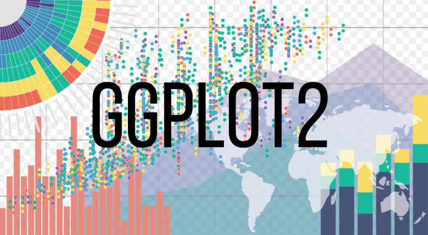
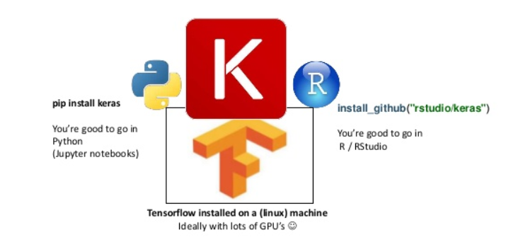
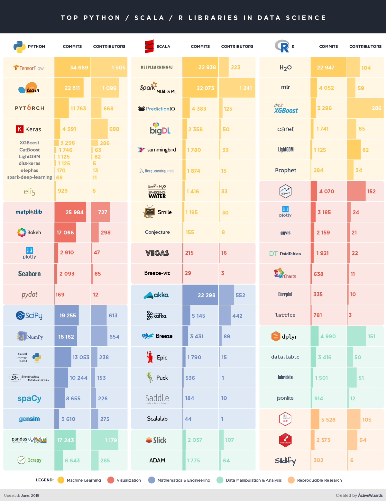
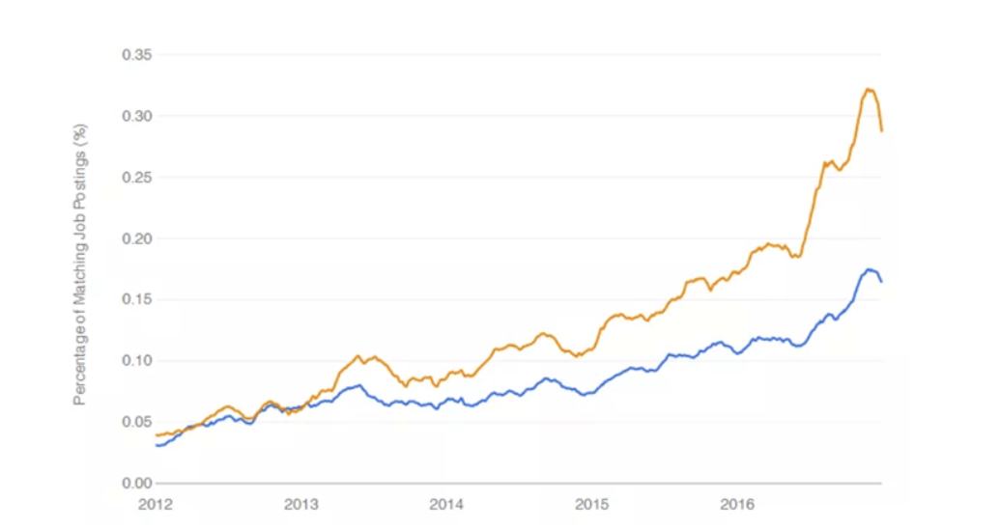
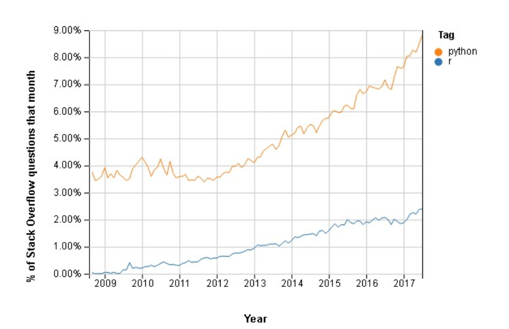

R vs Python: What’s The Difference? – Hacker Noon

# R vs Python: What’s The Difference?

## The challenge under ten categories

[Muammer Hüseyinoğlu](https://hackernoon.com/@moimaere)
Mar 16·6 min read

With the massive growth in the importance of Big Data, machine learning, and data science in the software industry or software service companies, two languages have emerged as the most favourable ones for the developers. R and Python have become the two most popular and favourite languages for the data scientists and data analysts. Both of these are similar, yet, different in their ways which makes it difficult for the developers to pick one out of the two.

R is considered to be the best programming language for any statistician as it possesses an extensive catalogue of statistical and graphical methods. On the other hand, Python does pretty much the same work as R, but data scientists or data analysts prefer it because of its simplicity and high performance. Now both the programming languages are free and open source and were developed in the early 90s.

R is a powerful scripting language, and highly flexible with a vibrant community and resource back whereas Python is a widely used object-oriented language which is easy to learn and debug.

> So let’s have a look at the comparison parameters for the two under these categories:

**> 1- Ease of Learning
> 2- Speed
> 3- Data Handling Capabilities
> 4- Graphics and Visualization
> 5- Deep Learning Support
> 6- Flexibility
> 7- Code Repository and Libraries
> 8- Popularity Index
> 9- Job Scenario
> 10- Community and Customer Support**

### **1- Ease of Learning**

If they look at the ease of learning, [Learning R](https://amzn.to/2HxMVfL) has a steep curve, and people with less or no experience in programming finds it difficult in the beginning. However, once you get a grip of the language, it is not that hard to understand. [Learning Python](https://amzn.to/2Cx2Kiu), on the other hand, emphasises productivity and code readability, which makes it one of the simplest programming languages. It is a preferable language for the beginners as well as the experienced developers due to its ease of learning and understandability.

### **2- Speed**

#### R

start_time <- Sys.time()
df <- read.csv("~/desktop/medium/library-collection-inventory.csv")
end_time <- Sys.time()
end_time - start_time
#Time difference of 3.317888 mins

#### Python

import time
import pandas as pd
start = time.time()
y1 = pd.read_csv('~/desktop/medium/library-collection-inventory.csv')
end = time.time()
print("Time difference of " + str(end - start) + " seconds")
#Time difference of 92.6236419678 seconds

If we compare the speed, R took almost twice as long to load the 4.5 gigabyte .csv file than Python pandas. On the other hand, Python is high-level programming language, and it has been the choice for building critical yet fast applications.

### **3- Data Handling Capabilities**

In the case of data handling capabilities, R is convenient for analysis due to the vast number of packages, readily practical tests, and the advantage of using formulas. However, it can also be used for fundamental data analysis without the installation of any package. Moreover, only the big data sets required packages like plyr, data.table. Now in the initial stages, the Python packages for data analysis were an issue. However, this has improved with the recent versions numpy and pandas are used for data analysis in Python, and both these languages are suitable for parallel computation.

### **4- Graphics and Visualization**

[**Python — bokeh**](http://bokeh.pydata.org/)

[**R — ggplot2**](https://skyose.com/full-ggplot2-review/)

Now, if we consider graphics and visualisation, a picture is what a thousand words. Visualised data is understood efficiently and more effectively than raw values. R consists of numerous packages that provide advanced graphical capabilities like the ggplot2 is used for customised graphs. Now visualisations are essential while choosing data analysis software and Python has some amazing visualisation libraries such as seaborn and bokeh. It has many libraries when compared to R, but they are more complex and also gives a tidy output.

### **5- Deep Learning Support**

[Image source](https://www.google.com/url?sa=i&source=images&cd=&ved=2ahUKEwjTx8mys4HhAhWSyqQKHaGFBQMQjxx6BAgBEAI&url=https%3A%2F%2Fwww.slideshare.net%2FLonghowLam%2Fkeras-on-tensorflow-in-r-python&psig=AOvVaw2TBqAdV4SACfP1iQe3VtXI&ust=1552644937855436)

With a rise in popularity in deep learning two new packages have been added to the R community, KerasR and RStudio’s Keras. Now both the packages provide an R interface to the Python deep learning package. It’s a high-level neural networks API which is written in Python and capable of running on top of either Tensorflow or Microsoft cognitive toolkit. Now getting started with Keras is one of the easiest ways to get familiar with deep learning in Python, and that also explains why the KerasR and Keras packages provide an interface for this fantastic package for the R users.

### **6- Flexibility**

Now, if we compare the flexibility of both the languages, it is easy to use complicated formulas in R and also the statistical tests, and models are readily available and easily used. On the other hand, Python is a flexible language when it comes to working on something new or building from scratch. It is also used for scripting a website or other applications.

### **7- Code Repository and Libraries**

“[Comparison of top data science libraries for Python, R and Scala [Infographic]](https://medium.com/activewizards-machine-learning-company/comparison-of-top-data-science-libraries-for-python-r-and-scala-infographic-574069949267)” — Igor Bobriakov

Now if we look at the code repository and libraries, Comprehensive R Archive Network (CRAN) is a vast repository of the R packages to which users can easily contribute. The packages consist of R functions, data, and compiled code which can be installed using just one line. It also has a long list of popular packages such as the plyr, dplyr, data.table and many more. On the other hand, Python consists of pip package index which is a repository of Python software and libraries. Although users can contribute to pip, it is a complicated process. The dependencies and installation of Python libraries can be tiring tasks at times. Some popular libraries of Python are pandas, numpy and matplotlib.

### **8- Popularity Index**

Now if we look at the popularity of both the languages, they started from the same level a decade ago. However, Python witnessed a massive growth in popularity and was ranked first in 2016 as compared to R that ranked sixth in the list. Also, the Python users are more loyal to their language when compared to the users of the other. As the percentage of people switching from R to Python is twice as large as Python to R.

### **9- Job Scenario**

[Python (Yellow) — R (Blue)](https://www.r-bloggers.com/data-science-job-report-2017-r-passes-sas-but-python-leaves-them-both-behind/)

Now, when we consider the job scenario, the software companies have been more inclined towards technologies such as machine learning, artificial intelligence and Big Data which explains the growth in the demand for Python developers. Although both languages can be used for statistics and analysis. Python has a slight edge over the other due to its simplicity and ranks higher on job trends.

### **10- Community and Customer Support**

In the case of community and customer support, usually, commercial software’s offered paid customer service. However, R and Python do not have customer service support which means you are on your own if you face any trouble. However, both the languages have online communities for help, And Python has greater community support when compared to R.

So now, we are done with all the parameters of comparison. We can say that it was a tough fight between the two. However, Python emerges to be the winner due to its immense popularity and simplicity when compared to R.

So what do you think? Let me know about your opinion in the comment section below, till then thank you and happy learning.