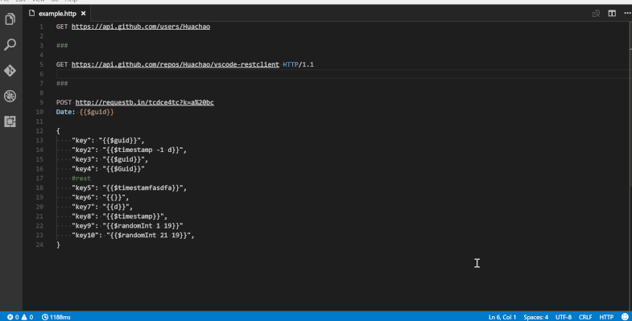
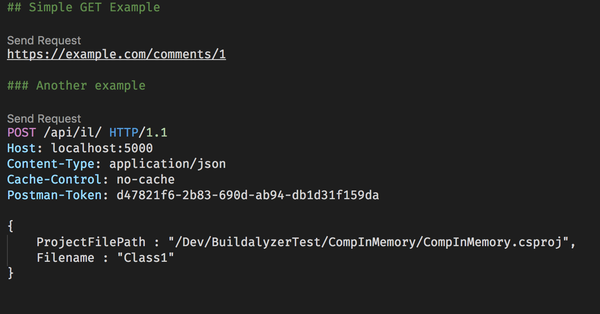

REST Client for VS Code, an elegant alternative to Postman | Joseph Woodward, Software Developer

# REST Client for VS Code, an elegant alternative to Postman

Posted on Wednesday, 18 Oct 2017

For sometime now I've been a huge proponent of Postman, working in an environment that has a large number of remote services meant Postman's ease of generating requests, the ability to manage collections, view historic requests and so forth made it my goto tool for hand crafted HTTP requests. However there have always been features I felt were missing, one such feature was the ability to copy and paste a raw [RFC 2616 compliant](http://www.w3.org/Protocols/rfc2616/rfc2616-sec5.html) HTTP request including request method, headers and body directly into Postman and fire it off without the need to manually tweak the request. This lead me to a [discussion on Twitter](https://twitter.com/joe_mighty/status/917716705488654336) where Darrel Miller recommended I check out the [REST Client extension for Visual Studio Code](https://marketplace.visualstudio.com/items?itemName=humao.rest-client).

## REST Client for Visual Studio Code

After installing REST Client the first thing I noticed was how elegant it is. Simply create a new tab, paste in your raw HTTP request (ensuring the tab's Language Mode is set to either HTTP or Plaintext, more on this later) and in no time at all you'll see a "Send Request" button appear above your HTTP request allowing you to execute the request as is, no further modifications are required to tell REST Client how to parse or format.

## Features

To give you a firm grasp of why you should consider adding REST Client to your tool chain, here are a few of the features that particularly stood out to me, organised in an easily consumable list format, because we all like lists:

### No BS request building

The easiest form of an HTTP request you can send is to paste in a normal HTTP GET URL like so:

	https://example.com/comments/1

**Note**: You can either paste your requests into a Plaintext window where you'll need to highlight the request and press the Send Request keyboard shortcut (`Ctrl+Alt+R` for Windows, or `Cmd+Alt+R` for macOS) or set the tab's Language Mode to HTTP where a "Send Request" will appear above the HTTP request.

If you want more control over your request then a raw HTTP request will do:

	POST https://example.com/comments HTTP/1.1
	content-type: application/json

	{
	    "name": "sample",
	    "time": "Wed, 21 Oct 2015 18:27:50 GMT"
	}

Once loaded you'll see the response appear in a separate pane. A nice detail that I really liked is the ability to hover my cursor over the request timer and get a breakdown of duration details, including times surrounding *Socket, DNS, TCP, First Byte* and *Download*.

### Saving requests as collections for later use is a simple plain text .http file

Following the theme of low friction elegance, it's nice that saving requests for later use (or if you want to check them into your component's source control) are saved as simple plain text documents with an `.http` file extension.

### Break down of requests

One of the gripes I had with Postman was requests separated by tabs. If you had a number of requests you were working with they'd quickly get lost amongst the number of tabs I tend to have open.

REST Client doesn't suffer the same fate as requests can be grouped in your documents and separated by comments, where three or more hash characters (`#`) are treated as delimiters between requests by REST Client.

### Environments and Variables

REST Client has a concept of Environments and Variables, meaning if you work with different environments (ie QA, Staging and Production), you can easily switch between environments configured in the REST Client settings (see below), changing the set of variables configured without having to modify the requests.

#### Environments

	"rest-client.environmentVariables": {
	    "local": {
	        "host": "localhost",
	        "token": "test token"
	    },
	    "production": {
	        "host": "example.com",
	        "token": "product token"
	    }
	}

#### Variables

Variables on the other hand allow you to simply define variables in your document and reference them throughout.

	@host = localhost:5000
	@token = Bearer e975b15aa477ee440417ea069e8ef728a22933f0

	GET https://{{host}}/api/comments/1 HTTP/1.1
	Authorization: {{token}}

### It's not Electron

I have nothing against Electron, but it's known to be a big of a resource hog, so much so that I rarely leave Postman open between sessions, where as I've always got VS Code (one Electron process is enough) open meaning it's far easier to dip into to test a few requests.

### Conclusion

This post is just a brief overview of some of the features in REST Client, if you're open to trying an alternative to your current HTTP Request generation tool then I'd highly recommend you check it out, you can read more about it on the [REST Client GitHub page](https://github.com/Huachao/vscode-restclient/blob/master/README.md).