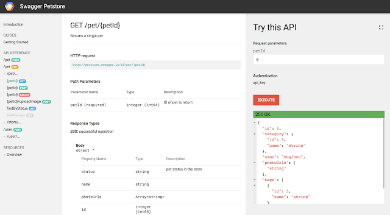

REST and gRPC Side by Side In New Google Endpoints Documentation

 

- [](https://twitter.com/apievangelist)

- [](https://github.com/api-evangelist)

- [](https://www.linkedin.com/organization/1500316/)

- [](http://apievangelist.com/atom.xml)

## REST and gRPC Side by Side In New Google Endpoints Documentation

18 Apr 2018

Google has been really moving forward with their development, and storytelling around gRPC. Their high speed to approach to doing APIs that uses HTTP/2 as a transport, and protocol buffers (ProtoBuf) as its serialized message format. Even with all this motion forward they aren’t leaving everyone doing basic web APIs behind, and are actively supporting both approaches across all new Google APIs, as well as in their services and tooling for deploying APIs in the Google Cloud–supporting two-speed APIs side by side, across their platform.

When you are using Google Cloud Endpoints to deploy and manage your APIs, you can choose to offer a more RESTful edition, as well as a more advanced gRPC edition. They’ve continued to support this approach across their service features, and tooling, by now also documenting your APIs. [As part of their rollout of a supporting API portal and documentation for your Google Cloud Endpoints, you can automatically document both flavors of your APIs](https://cloudplatform.googleblog.com/2018/03/now-you-can-automatically-document-your-API-with-Cloud-Endpoints.html). Making a strong case for considering to offer both types of APIs, depending on the types of use cases you are looking to solve, and the types of developers you are catering to.

In my experience, simpler web APIs are ideal for people just getting going on their API journey, and will accommodate the evolution of 60-75% of the API deployment needs out there. Where some organizations further along in their API journey, and those providing B2B solutions, will potentially need higher performance, higher volume, gRPC APIs. Making what Google is offering with their cloud API infrastructure a pretty compelling option for helping mature API providers shift gears, or even helping folks understand that they’ll be able to shift gears down the road. You get an API deployment and management solution that simultaneously supports both speeds, but also the other supporting features, services, and tooling like documentation delivers at both speeds.

Normally I am pretty skeptical of single provider / community approaches to delivering alternative approaches to APIs. It is one of the reasons I still hold reservations around GraphQL. However with Google and gRPC they have put HTTP/2 to work, and the messaging format is open source. While the approach is definitely all Google, they have embraced the web, which I don’t see out of the Facebook led GraphQL community. I still questions Google’s motives, not because they are up to anything shady, but I’m just skeptical of EVERY company’s motivations when it comes to APIs. After eight years of doing this I don’t trust anyone to not be completely self serving. However, I’ve been tuned into gRPC for some time now and I haven’t seen any signs that make me nervous, and they keep delivering beneficial features like they did with this documentation, keeping me writing stories and showcasing what they are doing.

* * *

|     |     |     |     |
| --- | --- | --- | --- |
|  |  |  |  |

- [<< Prev](https://apievangelist.com/2018/04/18/openapi-makes-me-feel-like-i-have-a-handle-on-what-an-api-does/)

-

- [Next >>](https://apievangelist.com/2018/04/19/machine-readable-api-regions-for-use-at-discovery-and-runtime/)

 

all of my work: [apievangelist.com](http://apievangelist.com/) | [kinlane.com](http://kinlane.com/) | [adopta.agency](http://adopta.agency/) | [dronerecovery.org](http://dronerecovery.org/) | [algorithmic.rotoscope.work](http://algorithmic.rotoscope.work/)