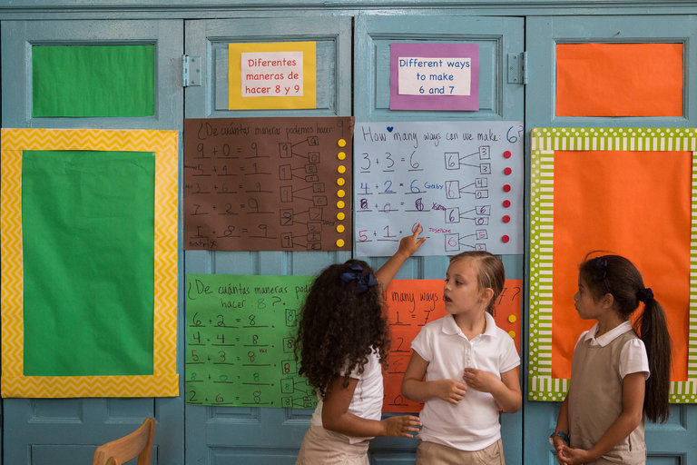

Raising a Truly Bilingual Child

###   [Well](https://www.nytimes.com/section/well)  |  [Family](https://www.nytimes.com/section/well/family)

# Raising a Truly Bilingual Child

 [The Checkup](https://www.nytimes.com/column/the-checkup)

By   [PERRI KLASS, M.D.](https://well.blogs.nytimes.com/author/perri-klass-m-d/%20%20%20or%20https://topics.nytimes.com/top/news/health/columns/18_and_under/index.html?scp=1&sq=%22Perri%20Klass%22&st=cse)    JULY 10, 2017

[Continue reading the main story](https://www.nytimes.com/2017/07/10/well/family/raising-a-truly-bilingual-child.html?emc=edit_ne_20170710&nl=evening-briefing&nlid=72982178&te=1&_r=0#story-continues-1)Share This Page

- [**Share](#)
- [**Tweet](#)
- [**Pin](#)
- [**Email](#)
- [**More](#)
- [**Save](#)

 Photo
 
**

 First graders in a dual-language program at Dos Puentes Elementary School in Upper Manhattan.    Credit Hiroko Masuike/The New York Times

True bilingualism is a relatively rare and a beautiful thing, and by “true,” I mean speaking two languages with the proficiency of a native — something most of us will only dream of as we struggle with learning languages in school and beyond.

Highly competent bilingualism is probably more common in other countries, since many children growing up in the United States aren’t exposed to other languages. But the steps along the road toward bilingualism can help a child’s overall facility with language. And early exposure to more than one language can confer certain advantages, especially in terms of [facility with forming the sounds](https://www.nytimes.com/2017/02/21/well/family/language-lessons-start-in-the-womb.html?mcubz=1&_r=0)in that language.

But parents should not assume that young children’s natural language abilities will lead to true grown-up language skills without a good deal of effort. [Erika Hoff](http://psy2.fau.edu/~hoff/LangDevLab/index.htm), a developmental psychologist who is a professor at Florida Atlantic University and the lead author of a [2015 review article](https://www.thieme-connect.de/products/ejournals/html/10.1055/s-0035-1549104) on bilingual development, said: “For everybody trying to raise a bilingual child, whatever your background and reason, it’s very important to realize that acquiring a language requires massive exposure to that language.”

Pediatricians routinely advise parents to talk as much as possible to their young children, to read to them and sing to them. Part of the point is to increase their language exposure, a major concern even for children growing up with only one language. And in order to foster language development, the exposure has to be person-to-person; [screen time doesn’t count](https://opinionator.blogs.nytimes.com/2013/04/10/the-power-of-talking-to-your-baby/) for learning language in young children — even one language — though kids can learn content and vocabulary from educational screen time later on. “For bilingual development, the child will need exposure to both languages,” Dr. Hoff said, “and that’s really difficult in a monolingual environment, which is what the U.S. is.”

 [Continue reading the main story](https://www.nytimes.com/2017/07/10/well/family/raising-a-truly-bilingual-child.html?emc=edit_ne_20170710&nl=evening-briefing&nlid=72982178&te=1&_r=0#story-continues-1)

## Related Coverage

- [              ### Opinion Gray Matter      ##   The Benefits of Bilingualism  MARCH 17, 2012](https://www.nytimes.com/2012/03/18/opinion/sunday/the-benefits-of-bilingualism.html)

- [              ### Opinion Gray Matter      ##   The Superior Social Skills of Bilinguals  MARCH 11, 2016](https://www.nytimes.com/2016/03/13/opinion/sunday/the-superior-social-skills-of-bilinguals.html)

- [              ##   Dual-Language Programs Are on the Rise, Even for Native English Speakers  OCT. 8, 2015](https://www.nytimes.com/2015/10/09/nyregion/dual-language-programs-are-on-the-rise-even-for-native-english-speakers.html)

- [              ### Opinion Contributing Op-Ed Writer      ##   The Spanish Lesson I Never Got at School  NOV. 15, 2016](https://www.nytimes.com/2016/11/15/opinion/the-spanish-lesson-i-never-got-at-school.html)

## [The Checkup](https://www.nytimes.com/column/the-checkup)

###

- [ ##    With a Tick Boom, It’s Not Just Lyme Disease You Have to Fear   JUL 3](https://www.nytimes.com/2017/07/03/well/family/with-a-tick-boom-its-not-just-lyme-disease-you-have-to-fear.html?rref=collection%2Fcolumn%2FThe%20Checkup)

- [ ##    Why a Baby’s Connection With a Parent Matters   JUN 26](https://www.nytimes.com/2017/06/26/well/family/why-a-babys-connection-with-a-parent-matters.html?rref=collection%2Fcolumn%2FThe%20Checkup)

- [ ##    Cranky Baby? Feeding May Not Be the Right Answer   JUN 19](https://www.nytimes.com/2017/06/19/well/family/cranky-baby-feeding-isnt-the-only-answer.html?rref=collection%2Fcolumn%2FThe%20Checkup)

- [ ##    Practicing What I Preached About Breast-Feeding   JUN 12](https://www.nytimes.com/2017/06/12/well/family/practicing-what-i-preached-about-breast-feeding.html?rref=collection%2Fcolumn%2FThe%20Checkup)

- [ ##    The Other Talk Parents Avoid: Pornography   JUN 5](https://www.nytimes.com/2017/06/05/well/family/the-other-talk-parents-avoid-pornography.html?rref=collection%2Fcolumn%2FThe%20Checkup)

[See More »](https://www.nytimes.com/column/the-checkup)

ADVERTISEMENT

 [Continue reading the main story](https://www.nytimes.com/2017/07/10/well/family/raising-a-truly-bilingual-child.html?emc=edit_ne_20170710&nl=evening-briefing&nlid=72982178&te=1&_r=0#story-continues-2)

Pediatricians advise non-English-speaking parents to read aloud and sing and tell stories and speak with their children in their native languages, so the children get that rich and complex language exposure, along with sophisticated content and information, rather than the more limited exposure you get from someone speaking a language in which the speaker is not entirely comfortable.

Parents come up with all kinds of strategies to try to promote this kind of exposure. Some families decide that each parent will speak a different language to the child. But the child will be able to sort out the two languages even if both parents speak them both, Dr. Hoff said. “There is certainly no research to suggest that children need to have languages lined up with speakers or they get confused.” On the other hand, that rule could be a way of making sure that the non-English language is used.

If a child grows up with caretakers who speak a foreign language — perhaps a Chinese au pair or a French nanny — the child may see some benefits down the road in studying that language. But if a child grows up speaking that second language — Korean, say — with cousins and grandparents, attending a “Saturday School” that emphasizes the language and the culture, listening to music and even reading books in that language, and visits Korea along the way, that child will end up with a much stronger sense of the language.

It does take longer to acquire two languages than one, Dr. Hoff said, and that, again, comes back to the exposure.

“A child who is learning two languages will have a smaller vocabulary in each than a child who is only learning one; there are only so many hours in the day, and you’re either hearing English or Spanish,” Dr. Hoff said. The children will be fine, though, she said. They may mix the languages, but that doesn’t indicate confusion. “Adult bilinguals mix their languages all the time; it’s a sign of language ability,” she said.

## Newsletter Sign Up

 [Continue reading the main story](https://www.nytimes.com/2017/07/10/well/family/raising-a-truly-bilingual-child.html?emc=edit_ne_20170710&nl=evening-briefing&nlid=72982178&te=1&_r=0#continues-post-newsletter)

### The Well Newsletter

Get the best of Well, with the latest on health, fitness and nutrition, delivered to your inbox every week.

 You agree to receive occasional updates and special offers for The New York Times's products and services.

Recaptcha requires verification

I'm not a robot

reCAPTCHA

[Privacy](https://www.google.com/intl/en/policies/privacy/) - [Terms](https://www.google.com/intl/en/policies/terms/)

- [See Sample](http://www.nytimes.com/newsletters/sample/well?pgtype=subscriptionspage&version=lifestyle&contentId=HH&eventName=sample&module=newsletter-sign-up)

- [Manage Email Preferences](https://www.nytimes.com/mem/email.html)

- [Privacy Policy](https://www.nytimes.com/privacy)

- Opt out or [contact us](https://www.nytimes.com/help/index.html) anytime

Dr. Hoff works in South Florida, where there is a very educated and affluent population raising children in Spanish and English. “The children start out as baby bilinguals, but the older they get, the more English overtakes Spanish,” she said. “The ones who are successful bilinguals as adults are still much better in English than they are in Spanish — they didn’t go to school in Spanish, they don’t read books in Spanish, and when you actually measure the size of their vocabularies, or the grammar they understand, or the coherence of the narrative they produce, they are not as proficient as they are in English.”

[Gigliana Melzi](http://steinhardt.nyu.edu/faculty/Gigliana_Melzi), a developmental psychologist and associate professor of applied psychology at New York University who studies language in Spanish- and English-speaking Latino families, agreed. “Parents will need to be mindful about introducing the child to literacy in that language,” she said. “They will need to be thoughtful about ways they will encourage the child to maintain the language.”

It’s also important, she said, to watch the individual child and make sure the child is not overloaded with demands because of parental expectations and ambitions; maybe three languages on top of a musical instrument and a serious sport is just too much.

The languages you learn as a child are important, but so are the languages you learn later in life. “We all know people who make great contributions and do great science in English and are not native speakers,” Dr. Hoff said. “The human brain is amazing, and the human capacity to acquire language is amazing.”

So what should parents do if they want to give their children a bilingual boost? “Find a native speaker and have that native speaker have fun, interesting conversations with your child, and your child will learn something,” Dr. Hoff said. “Don’t expect it will turn your child into a perfect balanced bilingual, but that’s O.K.” Whatever you do is an advantage.

Dr. Melzi said that often, a child who has been fluent in two languages in the preschool years goes to school where English is spoken, and starts using English to describe what happens there.

“There is a push worldwide where English becomes like the lingua franca, so it’s important that the child be exposed to the other language early, and the younger you are, the more nativelike you’re going to sound,” she said. On the other hand, older children may learn more easily: “The younger you are, the more head start you have,” she said. “The older you are, the more efficient learner you are, you have a first language you can use as a bootstrap.”

So true bilingualism may be rare, but parents shouldn’t be discouraged on that account, since all the skills that children acquire along the way are very valuable, Dr. Melzi said. “It’s worth it, but it’s a lot of work.”

 [Continue reading the main story](https://www.nytimes.com/2017/07/10/well/family/raising-a-truly-bilingual-child.html?emc=edit_ne_20170710&nl=evening-briefing&nlid=72982178&te=1&_r=0#whats-next)

## **Recent Comments

## Ed

56 minutes ago

If you want a child who’s bilingual, then parents have to be trilingual, because they need to have a language in which they can speak to say...

## Roland S. Wilson

57 minutes ago

Both of my children are "true bilingual" speaking English and Japanese. We created a bubble where we spoke exclusively to them in Japanese...

## Franco-German Americans

57 minutes ago

We're raising our children trilingually (my husband is French, I'm German, the kids are born and raised in the U.S.). We've had a friendly...

- See All Comments
- Write a comment

### ELSEWHERE ON NYTIMES.COM

 

## [Justin Trudeau’s sock diplomacy](https://adclick.g.doubleclick.net/pcs/click%253Fxai%253DAKAOjsvNl33WgZNpnA-1lsvdpk3ryYoUiS_hsBAG1GA-x26zds_7wp7ILvwUHDayI35_IDYXVQVQB6eKux5-xexRYCQquYm_p6hpV3lN26rK5quUvLC3-jnHpbDj7STioen9opTbHHwLPyYvN5zrU1774MEawfFJ340Rq_blnrDNQBQGiZDZtHRzldMaKqXxR-aOPOa5SbTBzmeVgWT_ed2RQA-XsJLDIZ2mFIfB-ckvbCE2dgM%2526sig%253DCg0ArKJSzB-sV8rr30h4EAE%2526urlfix%253D1%2526adurl%253Dhttps://www.nytimes.com/2017/06/27/fashion/socks-justin-trudeau-canada.html)

- [Canada’s secret to resisting the west’s populist wave](https://adclick.g.doubleclick.net/pcs/click%253Fxai%253DAKAOjsvNl33WgZNpnA-1lsvdpk3ryYoUiS_hsBAG1GA-x26zds_7wp7ILvwUHDayI35_IDYXVQVQB6eKux5-xexRYCQquYm_p6hpV3lN26rK5quUvLC3-jnHpbDj7STioen9opTbHHwLPyYvN5zrU1774MEawfFJ340Rq_blnrDNQBQGiZDZtHRzldMaKqXxR-aOPOa5SbTBzmeVgWT_ed2RQA-XsJLDIZ2mFIfB-ckvbCE2dgM%2526sig%253DCg0ArKJSzB-sV8rr30h4EAE%2526urlfix%253D1%2526adurl%253Dhttps://www.nytimes.com/2017/06/27/world/canada/canadas-secret-to-resisting-the-wests-populist-wave.html)

- [Canada doesn’t know how to party](https://adclick.g.doubleclick.net/pcs/click%253Fxai%253DAKAOjsvNl33WgZNpnA-1lsvdpk3ryYoUiS_hsBAG1GA-x26zds_7wp7ILvwUHDayI35_IDYXVQVQB6eKux5-xexRYCQquYm_p6hpV3lN26rK5quUvLC3-jnHpbDj7STioen9opTbHHwLPyYvN5zrU1774MEawfFJ340Rq_blnrDNQBQGiZDZtHRzldMaKqXxR-aOPOa5SbTBzmeVgWT_ed2RQA-XsJLDIZ2mFIfB-ckvbCE2dgM%2526sig%253DCg0ArKJSzB-sV8rr30h4EAE%2526urlfix%253D1%2526adurl%253Dhttps://www.nytimes.com/2017/06/23/opinion/sunday/canada-doesnt-know-how-to-party.html)