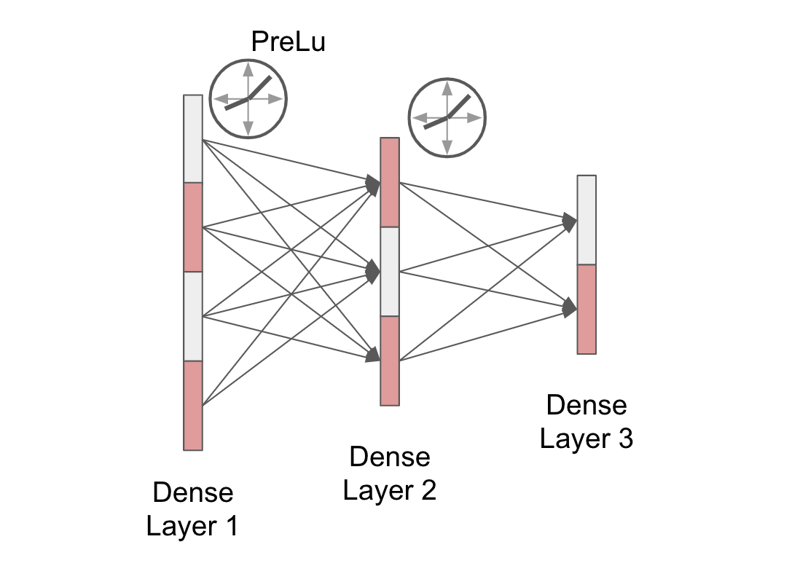
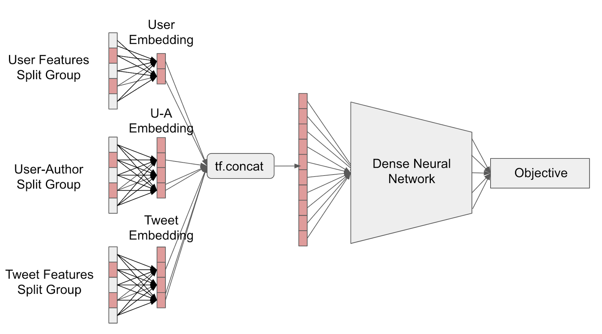
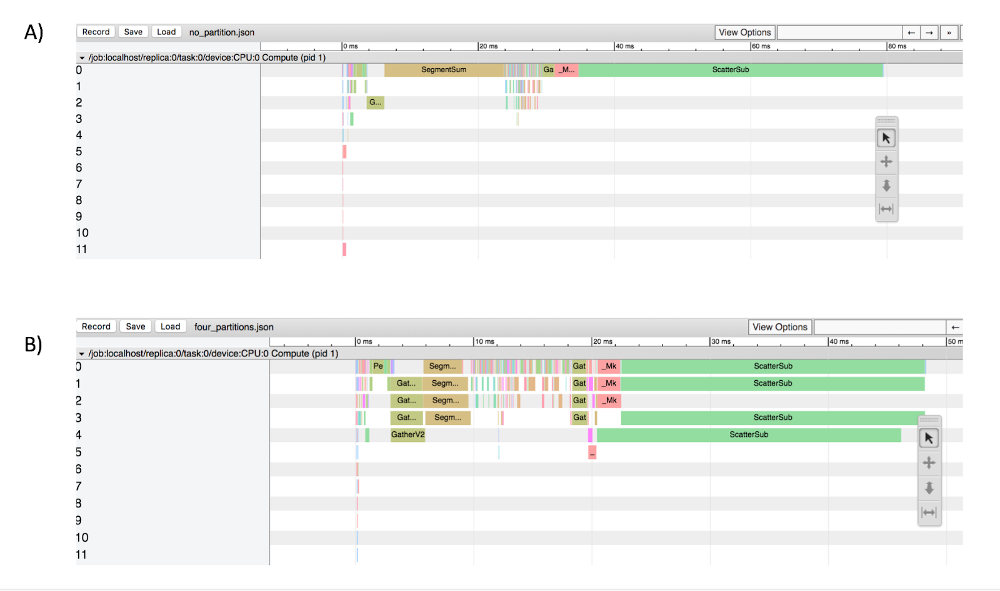

Ranking Tweets with TensorFlow – TensorFlow – Medium

# Ranking Tweets with TensorFlow

[TensorFlow](https://medium.com/@tensorflow)
Mar 6·14 min read

*Guest Post by Yi Zhuang, Arvind Thiagarajan, and Tim Sweeney from Twitter Cortex and Home Timeline Teams*

As a global, public communications platform, Twitter strives to keep users informed with relevant, healthy content. Originally, Twitter presented Tweets in reverse-chronological order. As the community became more connected, the amount of content in users’ home timelines increased significantly. Users would follow hundreds of people on Twitter — maybe thousands — and when opening Twitter, they would miss some of their most important Tweets.

To address this issue, [we launched a “Ranked Timeline”](https://blog.twitter.com/official/en_us/a/2016/never-miss-important-tweets-from-people-you-follow.html) which shows the most relevant Tweets at the top of the timeline — ensuring users never miss their best Tweets. A year later we shared how [machine learning powers the ranked timeline at scale](https://blog.twitter.com/engineering/en_us/topics/insights/2017/using-deep-learning-at-scale-in-twitters-timelines.html). Since then, we have re-tooled our machine learning platform to use TensorFlow. This yielded significant productivity gains while positioning ourselves to take advantage of the latest industry research. In this post, we will describe why we chose TensorFlow, discuss the unique complexities of the timeline ranking use case, and finally conclude with a survey of how TensorFlow has changed the way machine learning models are developed at Twitter.

### Moving From Torch to TensorFlow

Our previous machine learning platform, built on top of Lua Torch, allowed users to define models and optimization processes using YAML configuration files. However, as the machine learning industry continued to advance and the talent market produced more modeling experts, we decided to re-evaluate our Lua Torch-based platform.

Using YAML as the main modeling API imposed limitations on the modeling power. For example, if an ML practitioner wanted to build a very deep neural net (such as ResNets-152), they would need to define 152 layers in the yaml file, as opposed to writing a parameterized for-loop. Technically, ML practitioners who needed flexibility and expressiveness could write Lua code directly using Torch. However, Lua is an unfamiliar language for most Twitter engineers and is not an officially recommended language at Twitter. Beyond modelling limitations, we also experienced large amounts of code duplication, difficulties in unit testing, and debugging challenges.

Moreover, Torch’s large-scale production support did not meet our needs. Leveraging Lua created complex production systems involving Lua VMs running inside JVMs via JNI bridges written in-house. To debug production performance issues, we needed engineers who were adept across JVM/JNI, Lua, and C performance tuning. Due to the complex setup, we also lacked good end-to-end profiling tools. This led to performance and quality issues becoming difficult to diagnose and fix.

After surveying the options, TensorFlow and PyTorch stood out as leading candidates for adoption. We made a decision in late 2017, when TensorFlow was on a 1.0 production release with API stability guarantees, while PyTorch was still in beta. It was a difficult decision because TensorFlow had better stability, but on the other hand, our in-house Torch execution engine expertise would transfer better to PyTorch (e.g. both Torch and PyTorch use THNN). TensorFlow was battle-tested on large scale use cases, and available in a familiar language: Python. It also had great Java APIs, which was immensely helpful since Twitter production systems are mostly JVM-based. Finally, the expressiveness and flexibility of TensorFlow promised to support both immediate use cases, research endeavours, and yet-to-be-invented architectures. The production stability guarantees, better Java APIs, and great support from Google eventually resulted in Twitter’s decision to replace Lua Torch with TensorFlow.

### Case Study: Ranking Tweets On The Home Timeline With TensorFlow

This section provides a more in-depth look at our Torch to Tensorflow migration using a concrete example: the machine learning system we use to rank Twitter’s home timeline. This system is one of the largest scale machine learning applications running in production at Twitter, serving hundreds of millions of active users and scoring thousands of Tweets per user.

Twitter’s home timeline is the default starting point for most Twitter users and also where they spend the majority of their time. The core function of the timeline is to serve the public conversation by helping users see the most relevant Tweets for them, and keep users informed about real-time conversations happening on Twitter. Our metrics and user surveys both show users are more satisfied with their twitter timeline when we show the best Tweets first. In addition, when we rank the timeline to show the most relevant Tweets, people have more conversations and are more likely to come back to Twitter because they find Twitter more useful, informative, and fun.

When ranking, each candidate Tweet is scored by a relevance model in order to predict how relevant it is to each user. “Relevance” is defined by multiple factors including how likely a user is to engage with the Tweet, and how likely it is to encourage healthy public conversation. This model uses thousands of features from three entities: the Tweet, Author, and viewing User. Some example features include:

- •*Tweet*: its recency, presence of media (image or video), total interactions (e.g. number of Retweets or likes), real-time interactions on the Tweet.
- •*Author*: viewing user’s past interactions with this author, the strength of user’s connection to them, the origin of the relationship.
- •*User*: Tweets the user found relevant in the past, how often and how heavily they use Twitter.

Interestingly, Tweet ranking differs from traditional deep learning research (e.g. image classification). This is because the data is inherently sparse, and many of the most important features are only present for a small subset of the examples used for training or at inference time. This also means that modeling feature interactions between sparse features is critical to achieving good prediction quality.

Our very first ML models for the Tweet relevance prediction task relied on logistic regression, hand-crafted feature crossings, and shallow decision trees. Over time, as we added hundreds to thousands of new features to the timelines prediction model, we learned that the manual feature crossing and decision tree approaches we were using did not scale to find all the important feature interactions. In 2017, [we moved the timelines models to use an architecture based on deep learning](https://blog.twitter.com/engineering/en_us/topics/insights/2017/using-deep-learning-at-scale-in-twitters-timelines.html), which works better at finding complex feature interactions. This original first generation deep learning system was built on Lua Torch. The layers of the timelines ML model were hand-coded using YAML template files that looked like this snippet:

- modules.FullDenseLayer:

dropout : 0
inputFeatures : 100
outputFeatures : 200
activations : PReLU

- modules.FullDenseLayer:

dropout : 0
inputFeatures : 200
outputFeatures : 400
activations : PReLU

Our hand-coded YAML + Lua setup was able to outperform our logistic regression / decision tree based solution and deliver significant short-term user value in production. The Lua based setup was also relatively flexible in terms of the ability to add new features to the model and unblocked our ML engineers to continue to work on high value feature engineering to improve the quality of the home timeline. However, it offered poor flexibility in terms of being able to explore new and innovative model architectures.

For example, when training models to predict different engagements (with varying degrees of sparsity), we needed to test a range of architectures and hyperparameters. Concretely, back and forth conversations are sparser than Tweet likes and we have reason to believe that the optimal model complexity and architecture for each objective is significantly different based on the objective’s sparsity. However, even this simple task of tuning layer configurations and hyperparameters for different engagement objectives on the home timeline was very hard with our inflexible YAML based templating system. The layers of our model could not be defined or optimized programmatically, since YAML is not a full-featured programming language.

In collaboration with Cortex, Twitter’s central machine learning and AI team, we determined that migrating the timeline’s machine learning models to a training and serving stack based on TensorFlow would help us directly address the challenges associated with our in-house Lua Torch based platform. With TensorFlow, the entire model graph for the home timeline relevance models can be expressed programmatically as a sequence of Python functions. Figure 1 shows a section of our model with a sequence of dense layers activated by a [“PreLu”](https://www.tensorflow.org/api_docs/python/tf/keras/layers/PReLU) activation function:

Figure 1: Dense Network Section Of Timelines Model

The following Python snippet shows an example of how this network can be constructed using a vanilla for loop in Tensorflow (in contrast to the hard-coded YAML presented above):

for i, dense_size in enumerate(dense_layer_sizes):
dense_layers.add(layers.FullDense(dense_size,
dtype=tf.float32,
name='full_dense_' + str(i),

activation=tf.keras.layers.PReLU() if (i < len(dense_layer_sizes) - 1) else None)

)

Next, we will discuss two important innovations for the timelines quality models that are enabled by TensorFlow: *split network architectures *and *warm starting.*

**Split Networks: **The first deep learning models we ran in production for the Twitter timeline were simple fully connected networks. A benefit of deep learning is that this kind of simple architecture is capable of learning complex feature interactions given enough training data and time. Nevertheless, prior knowledge about a problem domain can help arrive at a more optimized model architecture that is faster or easier to train.

We were keen to exploit our knowledge of the Twitter timeline to devise better architectures suited to our problem space. Recall that the features we use to score a Tweet fall into a few groups: features of the Tweet itself, features related to the Tweet’s author and the user’s relationship to them, and features only related to the user viewing their timeline. While each of our raw feature groups may have thousands of constituent features, we hypothesized that we could learn a compact low dimensional representation for each of the constituent *logical* entities (e.g. User, Author, Tweet) that could capture most of the key signal from the raw features. This led us to explore a “split-network” architecture in TensorFlow, where each of these feature groups is separately fed as input to its own “split network” that learns a compact representation of the logical entity in question:

Figure 2: Split Network Architecture For Timelines Model

The “split” network shown in Figure 2 is much faster to train than a fully connected network with corresponding input layer sizes, because it has to learn a smaller number of hyperparameters (model weights) and requires fewer gradient updates, consuming significantly less processing power. The new architecture is easy to implement programmatically in TensorFlow. The following Python snippet illustrates how the split network logic is implemented for the timelines model:

tensors_to_concat = []
for split in input_split_config:
input_tensor = input_tensors[split.name]
output_size_bits = split.output_size_bits
full_sparse_layer = construct_full_sparse(input_tensor, mode,
output_size_bits, params)
tensors_to_concat.append(full_sparse_layer)

We used TensorFlow to quickly validate our product specific hypothesis that Timelines could use a split network without sacrificing quality. The following table provides a head to head comparison of a fully connected network against the “user, user-author, Tweet” split net architecture in terms of model quality and training time (compared on the same number of training examples for a fair comparison):

The table shows that the split network architecture achieves better model quality than the fully connected network, while reducing training times by approximately 22%. Faster training times are a critical win for our ML engineering team because they lead to shorter iteration feedback loops, and allow the team to improve models to deliver more relevant timelines to our end users faster. An additional benefit of the split net architecture in the context of timelines is that it is possible to use TensorFlow to export just the *embedding*  *subgraph *for the user and user-author splits, and use the subgraphs to *precompute *approximate, compact user and user-author embeddings via a periodic scheduled job. As Figure 2 illustrates, the embeddings can be much more compact than the raw features that go into generating them. This optimization allows us to heavily reduce the network traffic consumed by feature hydration at inference time, and significantly lower the complexity and cost of our serving infrastructure.

We have now shipped the split network architecture in TensorFlow to serve all our production traffic for the Twitter timeline, and we hope to use the expressive power of the TensorFlow programmable platform to further explore more sophisticated graphs and architectures in future.

**Warm Starting: **Our first deep learning models trained with the legacy Lua platform were trained from scratch, using random initial weights for all the parameters of the network. A key technical innovation unlocked by the TensorFlow platform is the ability to “warm start” our models, by using weights from previously trained versions of the model as a better starting point than random weights. This feature is available out of the box from TensorFlow. Any TensorFlow estimator can have its parameters be warm started from a provided “model checkpoint”:

https://www.tensorflow.org/api_docs/python/tf/estimator/WarmStartSettings

We can use this feature in TensorFlow to periodically refresh the timelines prediction models (e.g. on a weekly, daily or hourly cadence), with each refresh iteration continuing training where the previous version of the model left off. The benefit of warm starting in the Timelines context is two-fold:

(a) By remembering parameters from previous trainings of the model, the model is effectively able to learn from a much larger volume of training data than a “cold started” model, providing a quality win.

(b) Updating the model at a frequent cadence becomes easier. This is useful to adapt the model to variations in user behaviour, product launches on the home timeline, and real-time breaking events. The latter in particular is *key to our business* because Twitter is fundamentally a real-time platform and our product goal is to connect users to the best conversations for them in real time.

When implementing warm starting for the timelines models, a key technical challenge we ran into was the problem of how to make the system flexible enough to be able to add new features over time. Our original cold started models on Lua would process real-valued features through a discretizer that would generate a set of bins for each such feature, and map each feature to a set of unique identifiers for the generated output bins. This discretizer implementation does not work out of the box for warm starting, because the “remembered” weights from a previous training of the model are specific to the exact bin identifiers generated on the previous model training. Our older discretizer could not guarantee that the same feature value would be mapped to the same bin index on repeated runs. Fortunately, the *modular *nature of TensorFlow, being a programmatic Python based platform, made it easy to swap out the discretizer implementation used with a tweaked version of the implementation that does guarantee preserving bin identifiers across multiple runs of the discretizer. We were able to achieve the swap with a 4 line Python snippet that looks like this:

if enable_warm_starting:

return PreserveBinsDiscretizerCalibrator(n_bin=num_bins, out_bits=num_output_bits)

else:
return DiscretizerCalibrator(n_bin=num_bins, out_bits=num_output_bits)

We used TensorFlow to evaluate the quality benefits from warm starting on the Timelines ML models. The key findings from our evaluation were:

1. 1.Warm starting from pre-trained model weights can achieve the same or better model quality on new data, with just 20% of the training examples compared to a “cold start” model.

2. 2.By tuning the parameters of the warm started model, we were able to also see a significant quality gain (0.4% reduction in relative log loss) compared to cold start.

3. 3.When warm starting the models continuously over multiple time periods, we saw continued improvements in quality compared to cold start.

In summary, adopting the TensorFlow platform for our ML models has unlocked significant wins for the Twitter Timelines team on multiple fronts. We have seen improved model quality and timelines quality for Twitter users, reduced training and model iteration time, and our ML engineering team benefits from the improved extensibility and maintainability of the platform itself. We look forward to further innovations in our next generation of models built on the capabilities of this powerful platform.

### TensorFlow Ecosystem

Adopting TensorFlow brought many direct benefits to Twitter, ranging from more stable production systems, to more expressive modeling power. In addition to these immediate benefits, we were able to realize indirect benefits by unlocking access to a large ecosystem of tools backed by a large thriving community. For example, we are now able to leverage tools in the ecosystem associated with TensorFlow such as TensorBoard, TensorFlow Hub, TensorFlow Model Analysis, TensorFlow Data Validation, etc. In this section, we showcase benefits of being a part of this thriving community.

**| TensorBoard |** With Lua Torch, we relied on text logs to monitor training behavior, which was not ideal for showing patterns from time series. TensorBoard may seem like a small convenience tool at first glance. In practice, we have found it to be immensely helpful at revealing model training behaviors. This translates into better performing models, because we are able to better detect convergence issues, better tune learning & decay rates, and better decide when to early stop.

**| TensorFlow Hub |** The modularity of TensorFlow allows us to use common layers and modules provided by Google as well as publish our own to the rest of Twitter. Before TensorFlow Hub, we maintained our internal format for sharing modules (subgraphs and their associated weights). Since the release of TensorFlow Hub, we have retired our own in house format, and adopted a more standard format backed by the TensorFlow ecosystem. We now use TensorFlow Hub to share modules at Twitter (e.g. for publishing pre-trained word embeddings.) This migrated our module serialization format to an open source standard, while also unlocking access to existing modules in the [TensorFlow Hub repository](https://tfhub.dev/). Beside sharing modules, we also employ TensorFlow Hub to perform other tasks such as multi-phase training, fine-tuning (e.g. fine-tuning pre-trained embeddings), and stacking together multiple trained models.

**| TensorFlow Model Analysis |** With our previous Lua Torch solution, we implemented a functionality we called “feature rollup”. It allowed us to analyze the performance of a trained ML model on different segments of a given dataset. The segments were defined by specifying a binary or discrete feature in the input dataset. Having this same functionality was a blocking feature request before our ranked timeline team would adopt TensorFlow. Upon the release of TensorFlow Model Analysis, we realized that it provided functionality that was a superset of what we wanted. Besides “feature roll up”, TensorFlow Model Analysis also brought the ability to define segments (slices) based on more complex logic and the ability to perform distributed processing for speeding up model evaluation.

**| TensorFlow Profiler and Chrome Tracing |** Our previous Lua Torch based solution was highly optimized. When we first moved our ranked timeline model training to TensorFlow, we observed a slow down of more than 10x compared to Lua. The profiler that came with TensorFlow helped us resolve the issue. The profiler produced outputs in a standard format that can be visualized in Chrome. These pretty charts (example screenshot shown in Figure 3) allowed us to quickly locate bottlenecks and focus our optimization efforts on the “best-bang-for-the-buck” locations. We were able to achieve on-par training speed with our previous solution with the help of the TensorFlow profiler directing us to inefficiencies.

Figure 3: screenshot showing an example of TensorFlow profiler’s output helping us compare different model optimization.

**| Hiring |** Finally, a side effect of being a part of the TensorFlow ecosystem is that hiring ML experts has become easier. Compared to Lua Torch, there is a much bigger pool of talent who already know TensorFlow or would love to learn about TensorFlow on the job. Our team size has grown significantly in 2018 and we are continuing to hire for both Cortex and the ranked timeline (applied ML) team.

### **Conclusions**

TensorFlow (and TensorFlow Extended) has proven to be a reliable, powerful ecosystem of tools and has enabled our teams to deliver value faster to our users. Generally, our engineers prefer the TensorFlow modeling API to the legacy YAML API. We look forward to adopting the Keras based modeling API with the upcoming TensorFlow 2.0 release. This level of flexibility allows advanced modelers to be creative while also being approachable by engineers looking to gain experience in ML. The suite of tools surrounding TensorFlow is tightly integrated into our core ML platform and provides unmatched value out-of-the-box. TensorFlow is stable in production and performance issues are straightforward to profile and fix.

After the success of the TensorFlow adoption by the Timelines team (and more than 50% of other applied ML teams at Twitter), every machine learning team at Twitter is on track to adopt TensorFlow in 2019 to replace their previous models. We are actively investing in supporting distributed training and integrating the remaining TFX offerings. As mentioned above, teams are eager to adopt TensorFlow 2.0 to gain access to keras-style modeling and eager mode. Overall, TensorFlow has made significant improvements to developer productivity and satisfaction.

**Acknowledgments**

We would like to thank Google for their continued partnership in helping to advance ML at Twitter. We would also like to recognize Twitter’s Home Timeline team and Cortex for a successful collaboration in productionizing TensorFlow for timeline ranking.