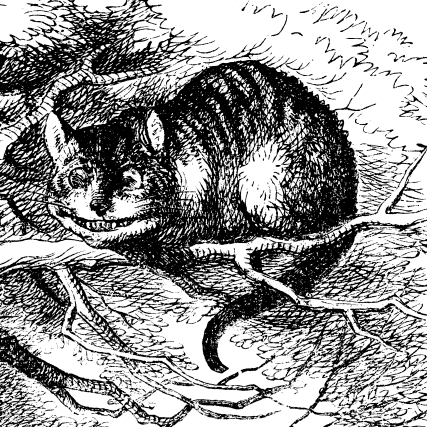

Reasoning HSSP

## Reasoning Through Games of Chance

MIT HSSP, Summer 2017

Teachers: Joseph Elsherbini, Max Shen, Joy Yang

This is roughly intended to be a teaser for probability and statistics. It is not meant to be comprehensive (in fact, we won’t be discussing t-tests, likelihood ratios, or anything you might learn in an introductory statistics class); it is simply meant to give students a flavor of how data and chance are related, and why they should care about either.

Students will have access to chromebooks, and will work together in groups each week. While there will be a small amount of programming, most of the code will be provided, and no previous programming experience is needed.

**Session 1 (July 9): Introduction - **Why do we care about chance, data, probability, and statistics? Where do these concepts show up in our daily lives? Students will brainstorm efficient ways for summarizing data and will discover visualization techniques as they complete the activities.

Material: [Agenda](http://web.mit.edu/reasoningchance/class1/) | [Activities 1 and 2](https://goo.gl/ddgEDS) | [Sheep](http://goo.gl/smPHVa) | [Survey](https://goo.gl/GaUErT) | [Code Demo](http://www.r-fiddle.org/#/fiddle?id=rG0vdrgO) | [Just for Fun](http://www.r-fiddle.org/#/fiddle?id=UaprN6Vc)

**Session 2 (July 16): Distributions and Hypothesis Testing - **How do we interpret diagrams of distributions? And how can we use distributions to help us test our opinions? Students will build upon intuitions they started to form last week and continue to think about applications of probability and statistics, with a focus on distributions (specifically, mixtures of distributions/fitting distributions/finding outliers).

Material: [Agenda](http://web.mit.edu/reasoningchance/class2/) | [Activity 1](https://goo.gl/Xjddw2) | [Activity 2](https://goo.gl/rwJmZg) ([Markdown](https://goo.gl/hL6ikK)) | [A2 Code Demo](http://www.r-fiddle.org/#/fiddle?id=1AAirtql&version=1) | [Taste Testing](https://goo.gl/TZH2Vr) | [Taste Code Demo](http://www.r-fiddle.org/#/fiddle?id=tZApUSvH)

**Session 3 (July 23): Conditional Probabilities and Bayes Rule - **What is a prior distribution and how do we update our beliefs? Students will conduct physical simulations and work through examples that can at first be slightly counterintuitive.

Material: [Agenda](http://web.mit.edu/reasoningchance/class3/) | [Activity 2](https://goo.gl/iZbXDx) ([latex](https://goo.gl/3W39oz)) | [A2 Spreadsheet](https://goo.gl/dra2Bq) | [A2 Code Demo](http://www.r-fiddle.org/#/fiddle?id=Qf3U7931) | [Monty Hall](https://goo.gl/f8ojh9) | [MH Code Demo](http://www.r-fiddle.org/#/fiddle?id=ABTxlSht) | [Just for Fun](http://www.r-fiddle.org/#/fiddle?id=gUVbkwa1)

Clarification: [With Notation](http://web.mit.edu/reasoningchance/class3/clarification/) | [Without Notation](http://web.mit.edu/reasoningchance/class3/clarification/nonotation.html)

**Session 4 (July 30): Game Theory - **We will examine two two-player games: rock-paper-scissors and the prisoners' dilemma. How should we play when there's only one round? How about when we play multiple rounds against the same opponent? How about when there's an element of randomness to the players' communication?

Material: [Agenda](http://web.mit.edu/reasoningchance/class4/) | [Rock Paper Scissors](https://goo.gl/FyY2YZ) | [Prisoners' Dilemma](https://goo.gl/eYCghm)

**Session 5 (August 6): Classification and Dimensionality - **How do we classify data? And what are dimensions of data? Students will play with labelled and unlabelled data to form their own classifications rules and we will provide examples of classification techniques. We'll also briefly touch on the meaning of "rotating" data.

Material: [Agenda](http://web.mit.edu/reasoningchance/class5/) | [Supervised Intro](https://goo.gl/NfmRqp) | [Unsupervised](https://goo.gl/sQgMCU) | [Viz 1](https://goo.gl/TL5tBt) | [Viz 2](https://goo.gl/zFFZSW)

**Session 6 (August 13): Correlations - **Correlation does not imply causation! After spending 5 weeks trying to convince students about the importance of probability and statistics, in our main activity this week, we take a look at how to critically evaluate correlations. We ask students to start off the class identifying trends, and end with another look at rotations and how we can decorrelate data to pick out signals.

Material: [Agenda](http://web.mit.edu/reasoningchance/class6/) | [Function Estimation](https://tinyurl.com/afhssp) | [Correlation Critic](https://goo.gl/fpD8RL) | [Decorrelating Data](http://www.r-fiddle.org/#/fiddle?id=Hfy0Zruy)